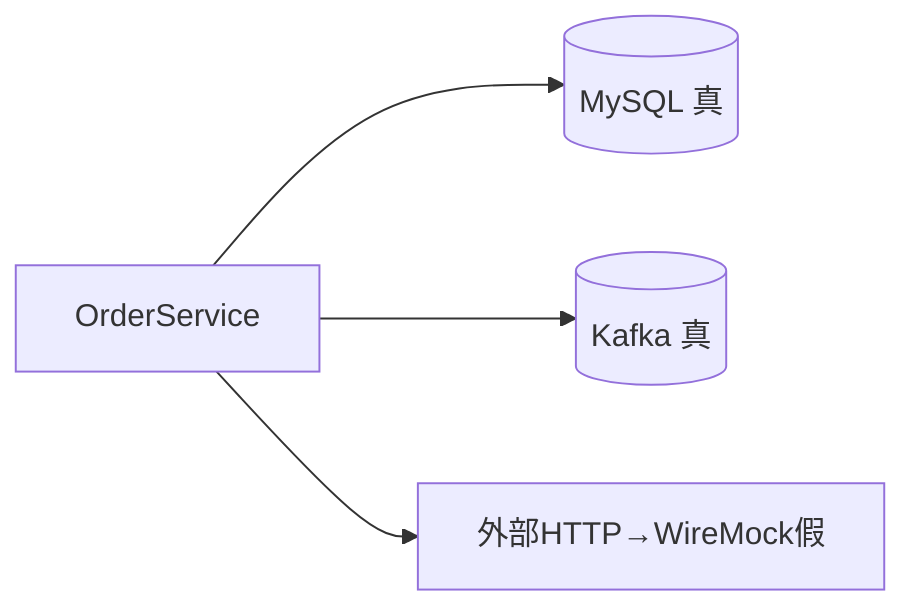
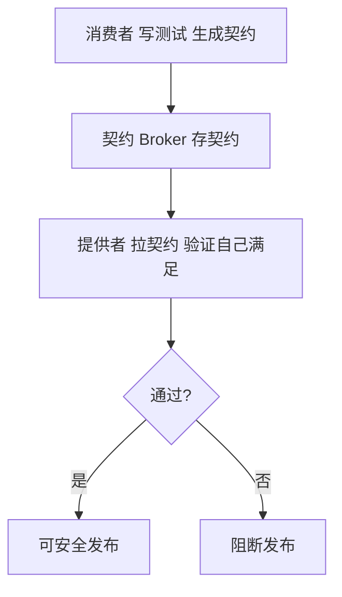
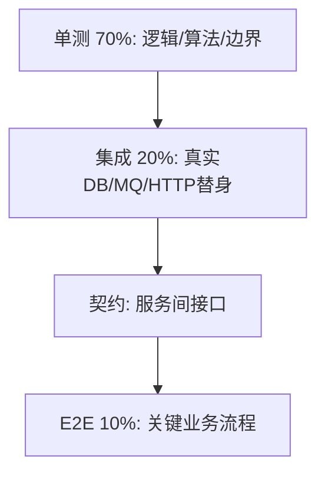

# 03 · 集成测试与契约测试

> 单元测试验证了"逻辑对"，但没验证"我的代码和真实依赖（DB、MQ、第三方 API）接得对"。这一层就是干这个的。微服务时代还衍生出**契约测试**，解决"服务间接口悄悄 breaking"的痛点。

---

## 一、集成测试：引入真实依赖

### 1.1 为什么不能只靠单测

- 单测用 Mock 的 DB，SQL 写错、索引缺失、事务边界、JSON 序列化、时区——全测不到；
- ORM 映射（JPA/MyBatis）字段名拼错，单测永远绿，上线即崩。

集成测试的原则：**依赖要真，范围要窄**。不是"把所有微服务拉起来"，而是"把被测服务 + 它直接依赖的几个中间件"跑起来。



### 1.2 Spring Boot Test 的档位

| 注解 | 加载内容 | 速度 | 用途 |
|------|----------|------|------|
| `@SpringBootTest` | 全容器（所有 Bean） | 慢（秒级） | 需要完整上下文 |
| `@WebMvcTest` | 仅 Web 层 + MockMvc | 较快 | 控制器测试 |
| `@DataJpaTest` | 仅 JPA + 内存/H2 | 快 | Repository |
| `@TestConfiguration` | 自定义替身 Bean | — | 替换某依赖 |

```java
@DataJpaTest
class OrderRepoTest {
    @Autowired OrderRepo repo;
    @Test void saveAndFind() {
        repo.save(new Order(100));
        assertThat(repo.findByAmount(100)).isNotEmpty();
    }
}
```

### 1.3 Testcontainers：把"真实中间件"拉进测试

用 Docker 起真实 MySQL/Redis/Kafka，测试完自动销毁——**既真又隔离**。

```java
@Testcontainers
@SpringBootTest
class OrderIntegrationTest {
    @Container
    static MySQLContainer<?> mysql = new MySQLContainer<>("mysql:8.0")
        .withDatabaseName("test");

    @DynamicPropertySource
    static void props(DynamicPropertyRegistry r) {
        r.add("spring.datasource.url", mysql::getJdbcUrl);
        r.add("spring.datasource.username", mysql::getUsername);
        r.add("spring.datasource.password", mysql::getPassword);
    }

    @Test void fullFlow() {
        // 真实 MySQL 上跑业务，验证 SQL/事务/映射全对
    }
}
```

> **价值**：再也不用 H2 和 MySQL 的方言差异坑——测的就是生产同款。CI 里需 Docker 可用（或用 Testcontainers Cloud）。

### 1.4 外部 HTTP 依赖：用 WireMock 而不是真调

第三方 API（支付、短信）不能真调，但也不能纯 Mock（要验证 URL/Header/Body 契约）。**WireMock 起一个假 HTTP 服务，既验证我"发出去的请求对"，又返回可控响应**：

```java
@Rule WireMockRule payApi = new WireMockRule(8089);

@Test void shouldCallPayWithCorrectBody() {
    payApi.stubFor(post("/charge").willReturn(okJson("{\"id\":\"TXN1\"}")));
    svc.charge(100);
    payApi.verify(postRequestedFor(urlEqualTo("/charge"))
        .withHeader("Content-Type", equalTo("application/json"))
        .withRequestBody(containing("\"amount\":100")));
}
```

---

## 二、微服务下的致命问题：接口悄悄 Breaking

```mermaid
graph LR
    A[订单服务 调用方] -->|HTTP: GET /user/{id}| B[用户服务 提供方]
    B -.改了返回字段.-> A
    A -.编译通过、运行崩.-> X[线上故障]
```

提供方改了字段/路径，调用方编译不报错（JSON 动态解析），直到运行时才爆。**契约测试**就是把这个风险在 CI 提前拦住。

---

## 三、契约测试（Consumer-Driven Contracts, CDC）

### 3.1 核心思想

**由消费者定义"我需要什么"（契约），提供者在 CI 验证"我满足契约"**。契约文件是双方之间的"接口契约"，独立于部署。



### 3.2 Pact 实战

**消费者端（生成契约）：**

```java
@Pact(consumer = "order-service", provider = "user-service")
public RequestResponsePact getUser(PactDslWithProvider b) {
    return b.given("user 1 exists")
        .uponReceiving("a request for user 1")
        .path("/user/1").method("GET")
        .willRespondWith().status(200)
        .body("{\"id\":1,\"name\":\"Tom\",\"vip\":true}").toPact();
}

@Test
void testGetUser() {
    User u = userService.get(1);   // 用 Pact 起的 mock provider 跑真实调用
    assertThat(u.name).isEqualTo("Tom");
}
// 跑完把 pact 文件发布到 Broker
```

**提供者端（验证契约）：**

```java
@PactVerifyProvider("a request for user 1 for user 1")
public String verifyGetUser() {
    return userService.findById(1);  // 真实提供者逻辑，验证满足契约
}
```

### 3.3 契约测试 vs E2E：各管一段

| 维度 | 契约测试 | E2E |
|------|----------|-----|
| 范围 | 服务两两接口 | 全链路 |
| 速度 | 快（本地 mock） | 慢（拉全环境） |
| 解决 | 接口 breaking | 业务流程正确性 |
| 脆弱性 | 低 | 高（Flaky 多） |

> 契约测试让你**敢独立发布每个微服务**——不用每次全链路回归。

### 3.4 契约元数据要带版本与兼容性规则

- `pact-spec` 版本、消费者/提供者名；
- 兼容性：提供者"向后兼容"旧契约（加字段 OK，删/改字段 breaking）；
- Broker 支持 `can-i-deploy` 检查——发布前确认依赖契约全绿。

---

## 四、分层测试策略落地建议



- 单测管"逻辑对"；
- 集成管"和真实依赖接对"；
- 契约管"服务间契约不破"；
- E2E 管"关键业务走通"。

---

## 五、Cheat Sheet

| 主题 | 要点 |
|------|------|
| 集成测试 | 依赖要真（Testcontainers）、范围要窄（被测服务+直接依赖） |
| Spring 档位 | `@DataJpaTest`/`@WebMvcTest` 比全 `@SpringBootTest` 快 |
| 外部 HTTP | WireMock 验证"请求对 + 响应可控"，别真调 |
| 契约 CDC | 消费者定义、提供者验证、Broker 存契约 |
| 价值 | 敢独立发布微服务，省全链路回归 |
| 与 E2E 分工 | 契约管接口 breaking，E2E 管业务流程 |

> 下一篇：[04 端到端与 UI 自动化](04-端到端与UI自动化.md) —— 从用户视角验证全链路，Playwright/Selenium/Cypress 选型与 Flaky 治理。
