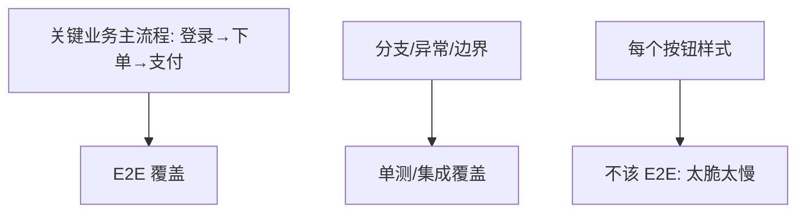
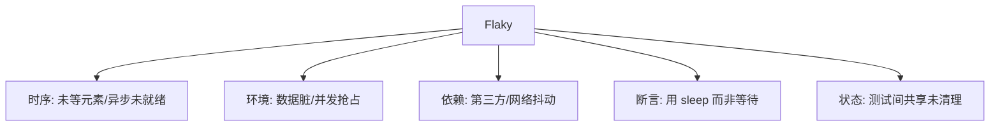
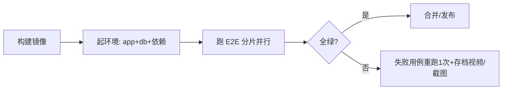

# 04 · 端到端与 UI 自动化

> E2E 是金字塔的塔尖：从真实用户视角验证"全链路能走通"。它最贵、最慢、最脆弱——所以**数量要少、挑关键流程、治理好 Flaky**。这一篇讲清选型、Page Object 模式与稳定性工程。

---

## 一、E2E 该测什么、不该测什么



**该 E2E**：登录、下单、支付、注册等"营收命脉"主流程（占比 <10%）。
**不该 E2E**：每个输入框校验、每个异常分支（留给单测，更快更准）。

### 1.1 E2E 的"三不"原则

| 不 | 原因 |
|----|------|
| 不测所有分支 | 慢且 Flaky，单测更合适 |
| 不测纯样式/像素 | 视觉验证成本高、收益低 |
| 不每次 PR 全量跑 | 耗时长，放到合并后/定时 |

---

## 二、三大框架选型对比

| 维度 | Selenium | Cypress | Playwright |
|------|----------|---------|------------|
| 架构 | 驱动真实浏览器（WebDriver 协议） | 在浏览器内运行（Proxy 注入） | 多浏览器原生协议（Chromium/WebKit/Firefox） |
| 语言 | 多语言（Java/Python/JS） | 仅 JS/TS | 多语言（JS/TS/Python/Java/.NET） |
| 速度 | 中 | 快（同进程） | 快（并行、跨浏览器） |
| 跨域/多标签 | 支持 | 受限（同域） | 支持 |
| 稳定性 | 依赖显式等待调优 | 自动等待 | 自动等待 + 强定位 |
| 录制 | 有（IDE） | 有（Studio） | 有（Codegen） |
| 适用 | 老系统/多语言团队 | 纯前端 SPA | 新项目首选、跨浏览器 |

> **结论（2026 共识）**：新项目首选 **Playwright**（跨浏览器、稳定、API 友好）；纯前端 SPA 且团队是 JS 可考虑 **Cypress**；遗留多语言系统保留 **Selenium**。

### 2.1 Playwright 完整示例

```typescript
import { test, expect } from '@playwright/test';

test.describe('下单主流程', () => {
  test('登录→加购→支付成功', async ({ page }) => {
    await page.goto('/login');
    await page.fill('#username', 'testuser');
    await page.fill('#password', 'pass');
    await page.click('button[type=submit]');
    await expect(page).toHaveURL(/\/home/);        // 自动等待 URL 变化

    await page.click('text=加购');
    await page.click('text=去结算');
    await page.click('text=立即支付');
    await expect(page.locator('.pay-success')).toBeVisible();  // 自动等待元素
  });
});
```

> Playwright 的 `expect` 内置自动重试轮询（默认 5s），**天然抗 Flaky**，无需手写 `sleep`。

---

## 三、Page Object 模式：让 E2E 可维护

把"页面元素与操作"封装成对象，测试脚本只写业务意图，元素变更只改一处。

```typescript
// LoginPage.ts
export class LoginPage {
  constructor(private page: Page) {}
  async open() { await this.page.goto('/login'); }
  async login(user: string, pwd: string) {
    await this.page.fill('#username', user);
    await this.page.fill('#password', pwd);
    await this.page.click('button[type=submit]');
  }
  async errorMessage() { return this.page.locator('.err').textContent(); }
}

// 测试只关心业务
test('登录失败显示错误', async () => {
  const p = new LoginPage(page);
  await p.open(); await p.login('bad', 'wrong');
  expect(await p.errorMessage()).toContain('无效');
});
```

**进阶**：
- **Page Component**：组件级复用（Header/Footer 抽出来）；
- **Screenplay 模式**（Serenity）：BDD 友好，角色-任务-交互分层；
- **Fixture / 数据工厂**：登录态用 `storageState` 复用，避免每用例重登。

---

## 四、Flaky 测试：E2E 的头号杀手

Flaky = 同样的代码，时红时绿。它比红灯更可怕——**红久了团队就无视红灯（狼来了）**。

### 4.1 Flaky 五大成因



### 4.2 治理手段

| 手段 | 做法 |
|------|------|
| 自动等待 | Playwright/Cypress 自带 `auto-wait`，**禁止 `sleep`** |
| 显式等待 | Selenium 用 `WebDriverWait` + 预期条件，而非 `Thread.sleep` |
| 数据隔离 | 每用例独立数据（唯一前缀/事务回滚/影子库） |
| 重试策略 | CI 对 E2E 设"失败重试 1 次"识别真失败（但别掩盖，需标记 flaky） |
| 标记与追踪 | 标 `flaky` 标签、统计红绿率、限期修复 |
| 并行分片 | 用例间无依赖，分片并行缩短时长、降低抢占 |

> **口诀：sleep 是 Flaky 之母，自动等待才靠谱；重试能识别，标记要限期。**

### 4.3 一个 Flaky 真实排查案例

| 现象 | 初步猜测 | 真因 | 修复 |
|------|----------|------|------|
| 下单 E2E 每天随机失败 2 次 | 网络慢 | 测试用固定用户名，前序失败残留脏数据导致"用户已存在" | 每用例用 `user_<uuid>`，事务回滚 |
| 支付断言偶发超时 | 后端慢 | 支付结果轮询用 `sleep(3s)`，偶发 3.5s 才返回 | 改用 `waitFor` 轮询直到状态变更 |

---

## 五、E2E 在 CI 中的工程化



- **产物**：失败自动存 **截图 + 视频 + trace**，定位快；
- **触发**：不必每次 PR 全量 E2E，可"单测全量 + E2E 按需/定时/合并前"；
- **环境**：用 Docker Compose 起独立环境，避免脏数据。

### 5.1 Playwright CI 配置要点（GitHub Actions）

```yaml
- name: Run E2E
  run: npx playwright test --shard=${{matrix.shard}}/4
  env:
    BASE_URL: http://localhost:3000
- name: Upload report
  if: failure()
  uses: actions/upload-artifact@v4
  with:
    name: playwright-report
    path: playwright-report/
```

---

## 六、移动端 E2E 补充

| 框架 | 说明 | 适用 |
|------|------|------|
| Appium | 跨平台（iOS/Android），WebDriver 协议，重 | 原生/混合跨平台 |
| Detox | React Native 专用，灰盒，快 | RN 项目 |
| Espresso/XCUITest | 原生官方，最稳但只单平台 | 原生 App |

---

## 七、E2E 度量与可持续性

| 指标 | 健康线 | 说明 |
|------|--------|------|
| 套件时长 | < 15 分钟（分片后） | 太长没人等 |
| Flaky 率 | < 1% | 高于则门禁不可信 |
| 维护成本 | 用例数 < 单测 10% | 控制体量 |
| 真失败命中率 | 高 | 红=真问题，不误报 |

> E2E 的价值不在"多"，而在"精"。10 条稳定跑通的关键主流程，远胜 200 条天天 Flaky 的疲惫用例。

---

## 八、面试高频追问（20 题 + 要点）

1. **E2E 该测什么？** → 关键主流程（登录/下单/支付），<10%。
2. **为何 E2E 要少？** → 慢、贵、Flaky 多。
3. **Selenium vs Playwright？** → Playwright 跨浏览器+自动等待+快，新项目优选。
4. **Cypress 局限？** → 同域、仅 JS、多标签受限。
5. **Page Object 价值？** → 元素集中，变更只改一处，脚本只写业务。
6. **Flaky 危害？** → 狼来了，红灯不可信，门禁失效。
7. **Flaky 五大成因？** → 时序/环境/依赖/断言/状态。
8. **为何禁止 sleep？** → 慢且仍可能 Flaky，用自动等待。
9. **重试策略为何要标记？** → 重试掩盖真问题，需标记限期修。
10. **数据隔离怎么做？** → 唯一前缀/事务回滚/影子库。
11. **E2E 何时跑？** → 合并后/定时/按需，非每次 PR。
12. **Playwright 自动等待？** → expect 内置重试轮询抗 Flaky。
13. **失败定位依赖什么产物？** → 截图/视频/trace。
14. **E2E 能替代单测吗？** → 不能，层级不同。
15. **移动端 E2E 选型？** → Appium 跨平台、Detox RN、Espresso 原生。
16. **分片(shard)作用？** → 并行缩短时长，降低抢占 Flaky。
17. **如何衡量 E2E 健康？** → 时长/Flaky率/真失败命中率。
18. **登录态复用？** → Playwright storageState，避免每用例重登。
19. **Selenium WebDriverWait？** → 显式等待代替 sleep。
20. **E2E 维护成本如何控？** → 用例数<单测10%，聚焦主流程。

---

## 九、Cheat Sheet

| 主题 | 要点 |
|------|------|
| 范围 | 只测关键主流程，<10% |
| 选型 | 新项目 Playwright；SPA 用 Cypress；遗留 Selenium |
| 模式 | Page Object 封装元素，脚本只写业务 |
| Flaky | 禁 sleep、自动等待、数据隔离、重试识别、限期修 |
| CI | 失败存截图/视频、分片并行、按需触发 |

> 下一篇：[05 性能与负载测试](05-性能与负载测试.md) —— 功能对不等于扛得住，JMeter/Gatling/k6 压测方法论、瓶颈定位与全链路压测。
