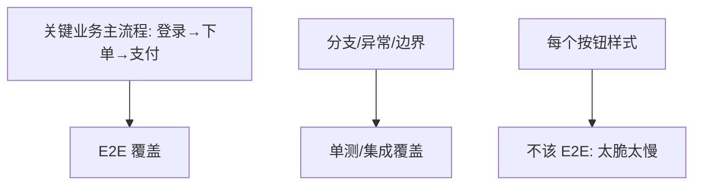
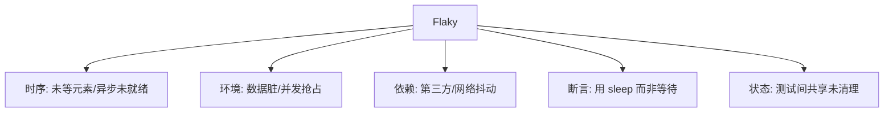
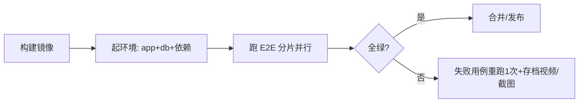

# 04 · 端到端与 UI 自动化

> E2E 是金字塔的塔尖：从真实用户视角验证"全链路能走通"。它最贵、最慢、最脆弱——所以**数量要少、挑关键流程、治理好 Flaky**。这一篇讲清选型、Page Object 模式与稳定性工程。

---

## 一、E2E 该测什么、不该测什么



**该 E2E**：登录、下单、支付、注册等"营收命脉"主流程（占比 <10%）。
**不该 E2E**：每个输入框校验、每个异常分支（留给单测，更快更准）。

---

## 二、三大框架选型对比

| 维度 | Selenium | Cypress | Playwright |
|------|----------|---------|------------|
| 架构 | 驱动真实浏览器（WebDriver 协议） | 在浏览器内运行（Proxy 注入） | 多浏览器原生协议（Chromium/WebKit/Firefox） |
| 语言 | 多语言（Java/Python/JS） | 仅 JS/TS | 多语言（JS/TS/Python/Java/.NET） |
| 速度 | 中 | 快（同进程） | 快（并行、跨浏览器） |
| 跨域/多标签 | 支持 | 受限（同域） | 支持 |
| 稳定性 | 依赖显式等待调优 | 自动等待 | 自动等待 + 强定位 |
| 适用 | 老系统/多语言团队 | 纯前端 SPA | 新项目首选、跨浏览器 |

> **结论（2026 共识）**：新项目首选 **Playwright**（跨浏览器、稳定、API 友好）；纯前端 SPA 且团队是 JS 可考虑 **Cypress**；遗留多语言系统保留 **Selenium**。

---

## 三、Page Object 模式：让 E2E 可维护

把"页面元素与操作"封装成对象，测试脚本只写业务意图，元素变更只改一处。

```typescript
// LoginPage.ts
export class LoginPage {
  constructor(private page: Page) {}
  async open() { await this.page.goto('/login'); }
  async login(user: string, pwd: string) {
    await this.page.fill('#username', user);
    await this.page.fill('#password', pwd);
    await this.page.click('button[type=submit]');
  }
  async errorMessage() { return this.page.locator('.err').textContent(); }
}

// 测试只关心业务
test('登录失败显示错误', async () => {
  const p = new LoginPage(page);
  await p.open(); await p.login('bad', 'wrong');
  expect(await p.errorMessage()).toContain('无效');
});
```

**进阶**：Page Component（组件级复用）、Screenplay 模式（BDD 友好）。

---

## 四、Flaky 测试：E2E 的头号杀手

Flaky = 同样的代码，时红时绿。它比红灯更可怕——**红久了团队就无视红灯（狼来了）**。

### 4.1 Flaky 五大成因



### 4.2 治理手段

| 手段 | 做法 |
|------|------|
| 自动等待 | Playwright/Cypress 自带 `auto-wait`，**禁止 `sleep`** |
| 显式等待 | Selenium 用 `WebDriverWait` + 预期条件，而非 `Thread.sleep` |
| 数据隔离 | 每用例独立数据（唯一前缀/事务回滚/影子库） |
| 重试策略 | CI 对 E2E 设"失败重试 1 次"识别真失败（但别掩盖，需标记 flaky） |
| 标记与追踪 | 标 `flaky` 标签、统计红绿率、限期修复 |
| 并行分片 | 用例间无依赖，分片并行缩短时长、降低抢占 |

> **口诀：sleep 是 Flaky 之母，自动等待才靠谱；重试能识别，标记要限期。**

---

## 五、E2E 在 CI 中的工程化



- **产物**：失败自动存 **截图 + 视频 + trace**，定位快；
- **触发**：不必每次 PR 全量 E2E，可"单测全量 + E2E 按需/定时/合并前"；
- **环境**：用 Docker Compose 起独立环境，避免脏数据。

---

## 六、移动端 E2E 补充

| 框架 | 说明 |
|------|------|
| Appium | 跨平台（iOS/Android），WebDriver 协议，重 |
| Detox | React Native 专用，灰盒，快 |
| Espresso/XCUITest | 原生官方，最稳但只单平台 |

---

## 七、Cheat Sheet

| 主题 | 要点 |
|------|------|
| 范围 | 只测关键主流程，<10% |
| 选型 | 新项目 Playwright；SPA 用 Cypress；遗留 Selenium |
| 模式 | Page Object 封装元素，脚本只写业务 |
| Flaky | 禁 sleep、自动等待、数据隔离、重试识别、限期修 |
| CI | 失败存截图/视频、分片并行、按需触发 |

> 下一篇：[05 性能与负载测试](05-性能与负载测试.md) —— 功能对不等于扛得住，JMeter/Gatling/k6 压测方法论、瓶颈定位与全链路压测。
