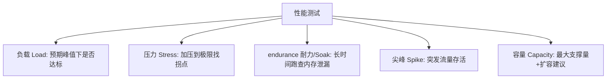
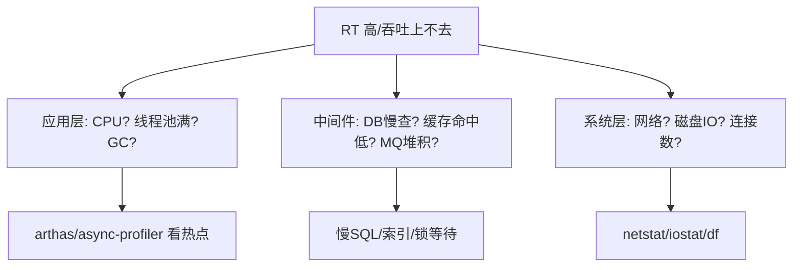
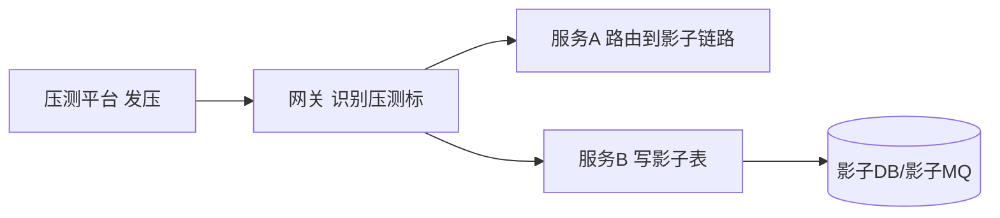

# 05 · 性能与负载测试

> 功能正确 ≠ 扛得住流量。性能测试回答："系统在多快、多稳、多省的前提下，能服务多少用户？"这一篇讲清类型、工具选型、压测方法论、瓶颈定位与全链路压测。

---

## 一、先分清：测的是哪个"性"



| 类型 | 问题 | 怎么加压 |
|------|------|----------|
| 负载测试 | 双十一峰值下 RT/错误率达标吗 | 逐步加到预期峰值，观察 |
| 压力测试 | 极限在哪、挂了怎么降级 | 持续加压越过预期，找拐点 |
| 耐力测试 | 跑 24h 会不会内存泄漏/OOM | 中等负载长时间跑 |
| 尖峰测试 | 流量瞬间 10 倍能活吗 | 突然拉满再回落 |
| 容量测试 | 一台能扛多少、加几台 | 阶梯加压记录吞吐 |

> 五类不是互斥，一个完整压测计划通常**负载打底 + 压力找拐点 + 耐力查泄漏**组合。

---

## 二、核心指标（SLA 的度量语言）

| 指标 | 含义 | 好/差 |
|------|------|-------|
| **RT（响应时间）** | 单次请求耗时 | P99 < 200ms 好，>1s 差 |
| **TPS/QPS** | 每秒事务/查询数（吞吐） | 越高越好 |
| **并发数** | 同时进行的请求数 | 与 RT 一起看 |
| **错误率** | 失败请求占比 | <0.1% 好 |
| **资源利用率** | CPU/内存/IO/连接 | <70% 留余量 |
| **P50/P95/P99** | 分位 RT（长尾） | P99 比均值更真实 |

> **关键认知**：看 **P99 而非平均值**。均值 50ms 但 P99 2s，意味着 1% 用户极慢——体验崩坏常在长尾。

### 2.1 吞吐与并发的误区

| 误区 | 真相 |
|------|------|
| 并发越高吞吐越高 | 超过拐点后并发↑吞吐↓、RT 暴涨 |
| QPS=并发数/RT | 粗略成立，但忽略排队与资源争用 |
| 单机高 QPS 就能上线 | 需看错误率与 P99，不是只看均值 |

---

## 三、工具选型

| 工具 | 协议/语言 | 脚本 | 特点 | 适用 |
|------|-----------|------|------|------|
| **JMeter** | 多（HTTP/JDBC/..）/Java GUI | XML/Groovy | 老牌、插件多、GUI 录制的 | 通用、企业存量 |
| **Gatling** | HTTP/scala DSL | Scala | 高并发、报告美、代码化 | 开发写压测 |
| **k6** | HTTP/JS | JS | 云原生、CI 友好、轻量 | 开发者首选、入 CI |
| **Locust** | HTTP/Python | Python | 分布式、易写 | Python 团队 |
| **wrk** | HTTP/C | 小脚本 | 极简高性能 | 单接口极限基准 |

> **结论**：开发自测/入 CI 用 **k6**（JS 写、跑得快、报告清）；企业存量/复杂协议用 **JMeter**；要漂亮代码化用 **Gatling**。

### 3.1 k6 示例（入 CI 的范式）

```javascript
import http from 'k6/http';
import { check, sleep } from 'k6';
export const options = {
  stages: [
    { duration: '1m', target: 50 },   //  ramp-up
    { duration: '3m', target: 200 },  //  稳态负载
    { duration: '1m', target: 0 },    //   ramp-down
  ],
  thresholds: {
    http_req_duration: ['p(95)<500'],  //  SLA：P95<500ms
    http_req_failed: ['rate<0.01'],
  },
};
export default function () {
  const res = http.get('https://api.xxx.com/products');
  check(res, { 'status 200': r => r.status === 200 });
  sleep(1);
}
```

### 3.2 Gatling Scala DSL 示例

```scala
import io.gatling.core.Predef._
import io.gatling.http.Predef._

class ShopSimulation extends Simulation {
  val httpConf = http.baseUrl("https://api.xxx.com")
  val scn = scenario("浏览下单")
    .exec(http("list").get("/products"))
    .pause(1)
    .exec(http("buy").post("/orders").body(StringBody("""{"id":1}""")).asJson)
  setUp(scn.inject(rampUsers(200).during(60))).protocols(httpConf)
}
```

---

## 四、压测方法论（别一上来就"猛灌"）


1. **定目标**：预期峰值 QPS、SLA（P99<X、错误率<Y）；
2. **造真实场景**：按业务比例混合（浏览 70% / 加购 20% / 下单 10%），别只压一个接口；
3. **环境对等**：压测环境尽量近生产（配置/数据量），否则数据失真；**隔离**，别压到生产；
4. **基线 → 阶梯**：先低负载测基线，再逐步加压，记录拐点（RT 陡增/错误率升）；
5. **定位 → 复测**：找到瓶颈（DB？锁？GC？带宽？）调优后回归。

---

## 五、瓶颈定位：从外到内逐层下钻



常见瓶颈与对策：

| 现象 | 可能瓶颈 | 对策 |
|------|----------|------|
| CPU 满、RT 高 | 热点算法/序列化 | 火焰图定位、优化 |
| TPS 上不去但 CPU 闲 | 线程池满/锁等待/外部依赖慢 | 调池、去锁、异步 |
| 内存涨、忽快忽慢 | Full GC / 内存泄漏 | MAT 分析、调 JVM |
| DB CPU 高 | 慢 SQL / 缺索引 | `EXPLAIN`、加索引 |
| 错误率随压力升 | 连接池耗尽 / 超时 | 调 HikariCP、降级 |

> 与 [生产问题排查实战](../场景设计/生产问题排查实战：常见故障与处置步骤.md) 联动：压测能把生产才会暴露的瓶颈提前引爆。

### 5.1 用 Arthas 在线定位热点（实战）

```bash
# 1. 找到最耗 CPU 的线程
thread -n 3
# 2. trace 某个方法耗时
trace com.xxx.OrderService place
# 3. 看方法调用参数/返回值
watch com.xxx.PricingService calculate '{params,returnObj}' -x 3
```

---

## 六、全链路压测（大厂标配）

真实流量难复现，全链路压测用**影子流量/影子库**在生产环境安全加压：



- **流量染色**：压测请求带特殊标（如 `x-shadow: true`），网关/框架识别；
- **数据隔离**：写影子表/影子 topic，不污染真实数据，可安全清理；
- **风险**：必须严格隔离，否则压测数据进生产——事故级。

### 6.1 全链路压测实施清单

| 步骤 | 要点 |
|------|------|
| 流量标记 | 统一 `x-shadow` 头，全链路透传 |
| 路由隔离 | 网关/框架识别标记→影子库/队列 |
| 数据清理 | 压测后定时清影子数据 |
| 熔断保护 | 压测流量触发熔断不误伤真实 |
| 监控对照 | 真实 vs 影子指标同屏对比 |

---

## 七、性能测试反模式

| 反模式 | 危害 |
|--------|------|
| 只在单机压、环境远低于生产 | 结论失真 |
| 只看均值不看 P99 | 长尾问题漏掉 |
| 压测打到生产无隔离 | 污染/压垮生产 |
| 只压单接口、无业务比例 | 漏掉连锁瓶颈 |
| 压完不定位、只报数字 | 无 actionable 结论 |
| 用 `sleep` 控并发 | 不真实，应用并发模型 |

---

## 八、面试高频追问（20 题 + 要点）

1. **性能测试五类？** → 负载/压力/耐力/尖峰/容量。
2. **为何看 P99 而非均值？** → 长尾用户极慢，均值掩盖。
3. **k6 vs JMeter？** → k6 轻量CI友好，JMeter 老牌协议多。
4. **压测前定什么目标？** → 峰值QPS、SLA(P99/错误率)。
5. **为何要真实业务比例？** → 单接口压不出连锁瓶颈。
6. **环境为何要近生产？** → 否则数据失真。
7. **压测环境为何隔离？** → 别压垮/污染生产。
8. **拐点是什么？** → RT陡增/错误率升的并发临界点。
9. **瓶颈定位三层？** → 应用/中间件/系统。
10. **TPS上不去CPU闲？** → 线程池/锁/外部依赖。
11. **内存涨忽快忽慢？** → Full GC/内存泄漏，MAT分析。
12. **DB CPU高？** → 慢SQL/缺索引，EXPLAIN。
13. **全链路压测核心？** → 流量染色+影子库隔离。
14. **影子数据风险？** → 隔离不严污染生产。
15. **Arthas 定位热点？** → thread -n / trace / watch。
16. **耐力测试查什么？** → 内存泄漏/OOM。
17. **尖峰测试目的？** → 突发流量存活、降级生效。
18. **容量测试产出？** → 最大支撑+扩容建议。
19. **HikariCP 耗尽表现？** → 错误率随压力升，需调池。
20. **压测报告要给什么？** → 拐点、瓶颈、调优建议、可行动结论。

---

## 九、Cheat Sheet

| 主题 | 要点 |
|------|------|
| 类型 | 负载(达标)/压力(拐点)/耐力(泄漏)/尖峰/容量 |
| 指标 | 看 P99 + 错误率 + 吞吐，均值会骗人 |
| 工具 | k6 入 CI、JMeter 通用、Gatling 代码化 |
| 方法 | 目标→场景→阶梯加压→定位→复测 |
| 瓶颈 | 应用/中间件/系统 三层下钻 |
| 全链路 | 流量染色 + 影子库，安全压生产 |

> 下一篇：[06 代码质量与静态分析](06-代码质量与静态分析.md) —— 功能与性能之外，代码本身的"健康度"如何度量与守护。
