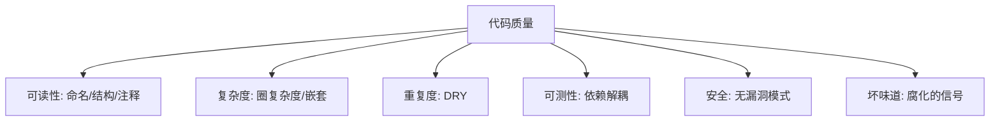
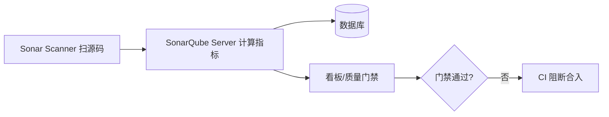
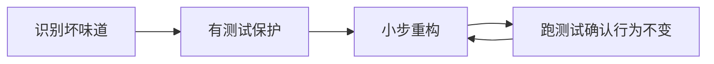

# 06 · 代码质量与静态分析

> 测试保证"现在对"，代码质量保证"以后还能改对"。这一篇讲如何用静态分析度量代码健康度、用规范统一风格、识别坏味道并重构、以及 Code Review 这道人工防线。

---

## 一、什么是"代码质量"

代码质量不是"能跑"，而是**可维护性（Maintainability）**的多维组合：



质量差的下场：改一处崩三处、新人看不懂、不敢重构、技术债滚雪球。

---

## 二、静态分析：不运行就"读"出问题

静态分析在**不执行**代码的情况下扫描源码，发现 bug 模式、坏味道、安全漏洞、规范违反。

### 2.1 主流工具分层

| 层级 | 工具 | 管什么 |
|------|------|--------|
| 规范/Lint | Checkstyle、ESLint | 命名、格式、import 顺序 |
| Bug 模式 | SpotBugs（FindBugs）、PMD | 空指针、资源未关、equals 错 |
| 综合平台 | **SonarQube / SonarCloud** | 覆盖率 + 重复 + 复杂度 + 漏洞 + 技术债统一看板 |
| 安全 | SpotBugs+FindSecBugs、Semgrep | 注入、XSS、硬编码密钥 |

### 2.2 SonarQube 度量维度

| 指标 | 含义 | 警戒线 |
|------|------|--------|
| **重复率** | 相同/相似代码占比 | <3% |
| **圈复杂度** | 单方法独立路径数 | <10 好，>15 危险 |
| **认知复杂度** | 人类理解难度 | 越低越好 |
| **技术债** | 修复所有问题折算人天 | 设上限 |
| **覆盖率** | 测试覆盖 | 增量 ≥80% |
| **漏洞/异味** | 安全/坏味道数 | 门禁阻断严重项 |



### 2.3 质量门禁（Quality Gate）

Sonar 的 Quality Gate 是 CI 卡点：覆盖率低于阈值、新增漏洞、技术债超预算 → **红，禁止合入**。这是"质量内建"的硬执行（详见 07 篇）。

---

## 三、代码规范：统一是低成本高回报

| 规范 | 作用 | 工具 |
|------|------|------|
| 命名（类/方法/变量） | 可读性 | Checkstyle/人工 |
| 格式（缩进/括号） | 减少无意义 diff | Spotless/Prettier（保存即格式化） |
| import 顺序/未用导入 | 整洁 | Checkstyle |
| 圈复杂度上限 | 逼拆方法 | PMD/Checkstyle |

> **关键实践**：规范用工具**自动格式化 + 自动检查**，别靠人肉 CR 盯格式——省下 CR 精力看逻辑。

---

## 四、坏味道（Code Smells）：腐化的信号

Martin Fowler《重构》列举的经典坏味道：

| 坏味道 | 表现 | 重构手法 |
|--------|------|----------|
| 重复代码 Duplicated Code | 多处相似 | 提取方法/类 |
| 过长方法 Long Method | 几十上百行 | Extract Method |
| 过大类 Large Class | 职责过多 | 拆类 |
| 过长参数列表 | 参数 7+ | 引入参数对象 |
| 发散式变化 | 一处改多处随之改 | 拆职责 |
| 霰弹式修改 | 一个改动散落多处 | 挪到一起 |
| 特征嫉妒 | 方法狂调别的类数据 | 搬移方法 |
| 临时字段 | 字段仅某些时有效 | 抽类 |
| 过度耦合消息链 | `a.b().c().d()` | 隐藏委托 |

### 圈复杂度示例（为什么高复杂 = 易错）

```java
// 坏：圈复杂度高，难测、易漏分支
int price(Order o) {
    int p = 0;
    if (o.vip) { p -= 50; if (o.amount>1000) p-=100; }
    else { if (o.coupon) p -= o.coupon; }
    if (o.holiday) { p -= 20; }
    return p;
}
// 好：拆小、可单测、可读
int price(Order o) {
    return base(o) + vipDiscount(o) + couponDiscount(o) + holidayDiscount(o);
}
```

---

## 五、重构：在不改行为下改善结构



**铁律**：**重构前先有测试覆盖**，否则重构 = 赌博。每小步跑一次测试，确保"行为不变、结构变好"。

常用手法：Extract Method/Class、Replace Conditional with Polymorphism、Introduce Parameter Object、Move Method、Replace Magic Number with Constant。

---

## 六、Code Review：人工防线

静态分析查"机器能查的"，CR 查"机器查不了的"——设计合理、边界考虑、安全逻辑、可维护性。

### 6.1 CR 看什么

| 维度 | 检查点 |
|------|--------|
| 正确性 | 边界、并发、事务、异常 |
| 设计 | 职责单一、依赖方向、扩展性 |
| 安全 | 注入、越权、敏感信息泄露 |
| 可测性 | 是否好写测试 |
| 命名/注释 | 自解释、关键处注释 why |

### 6.2 CR 礼仪与流程

- **小 PR**：<400 行易审；大 PR 没人认真看；
- **自己先审一遍**再提；
- **评论对事不对人**，给建议而非命令；
- **CI 绿了才进 CR**，不浪费人审红灯代码。

---

## 七、代码质量反模式

| 反模式 | 危害 |
|--------|------|
| SonarQube 红着不上线 | 技术债无管控 |
| 规范靠人肉盯 | 浪费 CR、风格乱 |
| 无测试就重构 | 改出隐性 bug |
| 大 PR 一次审 | 漏看、拖延 |
| 只追覆盖率数字 | 质量假象 |

---

## 八、Cheat Sheet

| 主题 | 要点 |
|------|------|
| 静态分析 | SonarQube 统一看板；Checkstyle/PMD/SpotBugs 分层 |
| 门禁 | 覆盖率/漏洞/技术债卡点，红则禁合 |
| 规范 | 工具自动格式化+检查，省 CR 精力 |
| 坏味道 | 重复/过长/过大类是头号信号，拆 |
| 重构 | 有测试保护，小步+跑测试 |
| CR | 小 PR、看设计/安全/边界、CI 绿再审 |

> 下一篇：[07 质量门禁、度量与持续测试](07-质量门禁度量与持续测试.md) —— 把测试与质量串进 CI，用门禁卡点、用 DORA 度量、治理 Flaky、落地质量内建。
