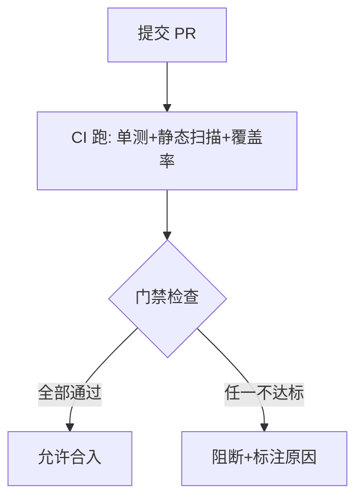
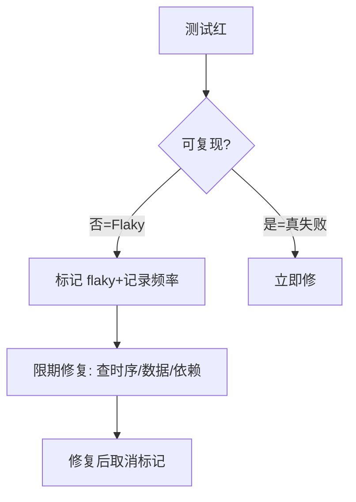

# 07 · 质量门禁、度量与持续测试

> 前面各篇是"能力"，这一篇是"把这些能力变成组织习惯"——用质量门禁卡住每一次合入、用度量看清团队健康度、用持续测试让验证永不间断、用 Flaky 治理保住红灯的可信度。

---

## 一、质量门禁（Quality Gate）：质量的硬执行

门禁 = 定义在 CI 中的一组**不可妥协的阈值**，不满足就阻断合入。它是"质量内建"的落地手段。

### 1.1 门禁该卡什么

| 门禁项 | 阈值建议 | 说明 |
|--------|----------|------|
| 单测增量行覆盖 | ≥80%（新代码） | 防盲区，非全量追 100% |
| 测试全绿 | 0 失败 | 失败不许合 |
| 严重漏洞 | 0（High/Critical） | FindSecBugs/Sonar |
| 技术债新增 | ≤预算 | 不无限堆债 |
| 编译/规范 | 0 错误 | 规范自动查 |
| 阻断级坏味道 | 0 | 如空指针风险 |

> **原则**：门禁要"严但可达"。太松形同虚设，太严逼人绕过（注释关检查）——设合理值并逐步收紧。

### 1.2 与 [CI/CD](../基础知识/CI-CD/README.md) 的衔接

门禁运行在流水线的 **构建/测试阶段**，是"合入前最后一道关"。CI/CD 专题已详述流水线组织，本篇侧重"测什么、卡什么"。

---

## 二、技术债：把"质量欠账"显性化

技术债 = 为短期速度牺牲长期可维护性欠下的账。关键是**可见、可量化、定期还**。

| 实践 | 做法 |
|------|------|
| 度量 | SonarQube 用 `技术债比`（修复人天/开发人天） |
| 预算 | 设上限（如新增债 ≤ 开发量的 5%） |
| 还款 | 每个迭代拨 10~20% 时间还债（重构/补测） |
| 记录 | 严重债开 TODO/Issue，别静默累积 |

> **隐喻**：技术债不可怕，怕的是"看不见的债"。显性化是被控的前提。

---

## 三、DORA 度量：研发效能的黄金标准

Google DORA（DevOps Research）四大指标，衡量"又快又稳"：

| 指标 | 含义 | 精英门槛 |
|------|------|----------|
| **部署频率** | 多久发一次 | 按需（每天多次） |
| **交付前置时间** | 提交到上线 | <1 小时 |
| **变更失败率** | 发布导致故障比例 | <15% |
| **服务恢复时间 MTTR** | 故障到恢复 | <1 小时 |

**测试与质量如何拉升 DORA**：
- 单测+集成+门禁 → 减少引入缺陷 → 降变更失败率；
- 自动化替代手工 → 提部署频率、缩前置时间；
- 可测架构 + 快速定位 → 降 MTTR。

> 详参 [CI/CD 13-可观测性DORA度量与DevSecOps](../基础知识/CI-CD/13-可观测性DORA度量与DevSecOps.md)。

---

## 四、测试左移：把验证尽量前移

左移动作：
- 需求写**验收标准**（BDD Given-When-Then）；
- 编辑器**保存即 Lint/类型检查**（最快反馈）；
- 开发自测 + 单测随代码提交；
- 门禁在 **PR 阶段**就拦，而非上线前。

---

## 五、持续测试（Continuous Testing）

持续测试 = 测试活动贯穿交付全周期、自动触发、结果即时可见。

| 阶段 | 触发 | 测什么 | 快慢 |
|------|------|--------|------|
| 本地 | 保存/提交 | 单测、Lint | 秒 |
| PR/CI | 推送 | 单测+集成+静态+门禁 | 分 |
| 预发 | 合入主干 | E2E、契约、压测 | 十分~小时 |
| 生产 | 发布/定時 | 混沌、监控告警 | 持续 |

**分层执行策略**（省时）：PR 跑快而全的单测+静态；合并后跑慢的 E2E/压测（避免每次 PR 都跑全量）。

---

## 六、Flaky 测试治理：保住红灯可信度

Flaky（时红时绿）是门禁的天敌——**红灯不可信，门禁即失效**。

### 6.1 识别与处置闭环

| 动作 | 说明 |
|------|------|
| 隔离识别 | 独立跑可疑用例确认 Flaky |
| 临时重试 | CI 对疑似 Flaky 失败重跑 1 次（辅助识别，非掩盖） |
| 标记追踪 | 标 `flaky` 标签 + 统计红绿率 |
| 限期修复 | 根因多为 sleep/数据脏/依赖外部，限期改 |
| 趋势看板 | 红绿率下降低于阈值报警 |

> **口诀：Flaky 不治，门禁变摆设；重试能识别，标记要限期。**

---

## 七、质量内建文化（比工具更难）

工具能装上，文化难建立。落地要点：

1. **质量人人有责**：不是 QA 兜底，开发自测、CR 互审；
2. **门禁不可绕过**：不临时关检查"先上再修"；
3. **红灯即停**：门禁红不强行合，先修；
4. **定期还债**：迭代拨时间，技术债进 backlog；
5. **度量透明**：DORA/覆盖率看板团队可见，而非考核鞭子。

---

## 八、Cheat Sheet

| 主题 | 要点 |
|------|------|
| 门禁 | 覆盖/漏洞/债/测试全绿卡点，严但可达 |
| 技术债 | 显性化、设预算、定期还 |
| DORA | 部署频率/前置时间/失败率/MTTR，测试拉升它 |
| 左移 | 验收标准+保存即查+PR 门禁 |
| 持续测试 | 分层触发，快测频繁、慢测合并后 |
| Flaky | 标记+限期修，否则门禁失效 |

> 下一篇：[08 测试数据、Mock 服务与混沌工程](08-测试数据Mock服务与混沌工程.md) —— 测试的工程支撑：测试数据怎么造、Mock Server 怎么搭、用混沌工程主动引爆系统脆弱点。
