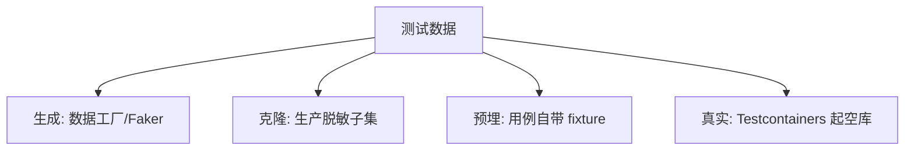
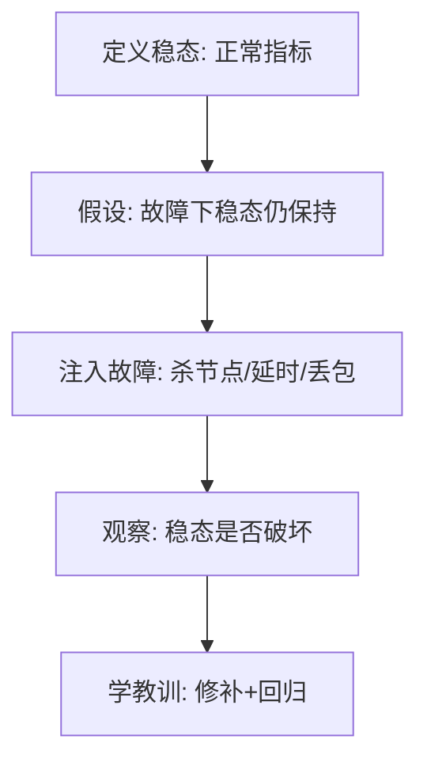
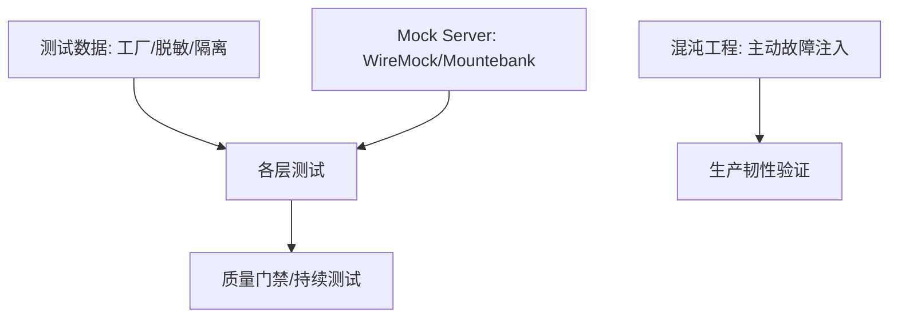

# 08 · 测试数据、Mock 服务与混沌工程

> 前面讲"测什么、怎么测"，这一篇讲"测试的工程支撑"：测试数据从哪来、外部依赖怎么用 Mock Server 仿真、以及用混沌工程主动把系统打挂来暴露脆弱点。

---

## 一、测试数据管理（TDM）

测试数据往往是最大痛点：**没有数据测不了、数据脏导致 Flaky、生产数据直接用又违规**。

### 1.1 测试数据的来源策略



| 来源 | 优劣 | 适用 |
|------|------|------|
| 数据工厂生成 | 干净、可控、快 | 单测/集成首选 |
| 生产脱敏克隆 | 真实分布，但脱敏难、合规风险 | 性能/探索性 |
| 用例自带 fixture | 精确、可重复 | 单元/契约 |
| 空库+测试内造 | 隔离、无脏数据 | 集成（Testcontainers） |

### 1.2 测试数据工厂（避免复制粘贴）

```java
// 工厂模式造对象，调用方只关心关心的字段
Order order = OrderBuilder.anOrder()
    .withAmount(1000)
    .withVip(true)
    .build();
// 默认填充合理随机值，避免 null 导致的伪失败
```

```python
# Python: factory_boy
class UserFactory(factory.Factory):
    class Meta:
        model = User
    name = factory.Faker("name")
    age = factory.Faker("random_int", min=18, max=80)
```

> **原则**：测试数据要"最小必要 + 自包含"。每个用例自己造数据，不依赖全局共享，否则互相污染（Flaky 根源）。

### 1.3 数据隔离与清理

- 单测：用事务回滚（`@Transactional` 测试）或 `@BeforeEach` 重建；
- 集成：每用例唯一前缀（如 `user_<uuid>`）或用事务/容器重置；
- 严禁"测试改了生产/共享库不还原"。

### 1.4 生产数据脱敏要点

| 敏感字段 | 脱敏方式 |
|----------|----------|
| 手机号/身份证 | 哈希/掩码 |
| 密码 | 不可逆哈希（绝不能明文克隆） |
| 地址/姓名 | 随机替换 |
| 支付/银行卡 | 完全伪造 |

> 合规红线：生产数据**禁止**直接进测试库，必须脱敏且签署数据使用审批。

---

## 二、Mock Server：仿真外部依赖

当被测系统依赖**第三方 HTTP 服务**（支付、短信、地图），既不能真调也不能纯 Mock（要验证请求契约），用 Mock Server 起一个可控的假服务。

### 2.1 WireMock（HTTP 级仿真）

```json
{
  "request": { "method": "POST", "url": "/charge", "bodyPatterns": [{ "contains": "amount" }] },
  "response": { "status": 200, "jsonBody": { "id": "TXN1" } }
}
```

支持：请求匹配（路径/Header/Body 正则）、延迟注入（模拟慢响应）、故障注入（500/断连）——既是仿真也是**错误场景制造机**。详见 [03 集成测试与契约测试](03-集成测试与契约测试.md)。

### 2.2 故障注入示例（WireMock）

```json
{
  "request": { "method": "POST", "url": "/charge" },
  "response": {
    "status": 500,
    "fixedDelayMilliseconds": 3000
  }
}
```

> 用这个 stub 可验证调用方的**超时、重试、降级、熔断**逻辑——这是纯 Mock 很难做的。

### 2.3 Mountebank（多协议：HTTP/TCP/SMTP）

支持非 HTTP 协议（如旧系统 TCP、邮件 SMTP），适合异构系统集成测试。

### 2.4 Mock Server 与契约的关系

Pact 的消费者侧本质也是一个 Mock Provider；WireMock 更偏"独立起的假服务"。两者都服务于"隔离外部依赖、可控验证"。

---

## 三、混沌工程（Chaos Engineering）

> 传统测试问"功能对不对"，混沌工程问"系统**在不确定的故障下**还能不能扛"。它主动注入故障，暴露你以为有但其实没有的韧性。

### 3.1 核心原则（Principles of Chaos）



1. 先定义**稳态指标**（如错误率<0.1%、P99<200ms）；
2. 提出**韧性假设**（"杀掉一个 Pod，流量自动转移，稳态不变"）；
3. **注入真实故障**（小范围、可控、可回滚）；
4. 观察是否破坏稳态，暴露盲区；
5. 修复并复测。

### 3.2 常见故障注入

| 故障 | 注入方式 | 验证 |
|------|----------|------|
| 实例挂 | kill Pod / 停进程 | 流量转移、无中断 |
| 网络延迟/丢包 | tc/netem、Service Mesh | 超时/重试/降级生效 |
| 依赖慢/错 | Mock Server 延时/500 | 熔断/降级触发 |
| 资源耗尽 | 占满 CPU/内存/连接 | 限流/隔离生效 |
| 区域故障 |  shutdown 可用区 | 多活切换 |

### 3.3 工具

| 工具 | 说明 |
|------|------|
| **Chaos Mesh** | K8s 原生，丰富故障类型，声明式 |
| **Chaos Monkey / Litmus** | 随机杀实例，验证韧性 |
| **Gremlin** | 商业，多环境故障注入 |
| **AWS Fault Injection Simulator** | 云上托管 |

### 3.4 Chaos Mesh 示例

```yaml
apiVersion: chaos-mesh.org/v1alpha1
kind: PodChaos
metadata:
  name: kill-pod
spec:
  action: pod-kill
  mode: one
  selector:
    labelSelectors:
      app: order-service
  duration: "30s"
```

### 3.5 与 [生产问题排查](../场景设计/生产问题排查实战：常见故障与处置步骤.md) 的闭环

- 混沌工程**主动**引爆 → 提前发现脆弱点；
- 生产事故**被动**暴露 → 补混沌用例防复发；
- 二者形成"攻防"循环，持续加固。

### 3.6 混沌的反模式

| 反模式 | 危害 |
|--------|------|
| 在生产无护栏乱注 | 真搞挂生产 |
| 只注故障不看稳态 | 不知有没有影响 |
| 注完不修、无回归 | 无效 |

> **口诀：混沌先定稳态、小范围可控、注完必修回归。**

---

## 四、测试支撑总览



---

## 五、面试高频追问（20 题 + 要点）

1. **测试数据来源策略？** → 工厂/脱敏克隆/fixture/空库自造。
2. **为何要数据隔离？** → 共享脏数据→Flaky。
3. **生产数据进测试库红线？** → 必须脱敏+审批，禁明文密码。
4. **测试数据工厂价值？** → 避免复制粘贴、最小必要自包含。
5. **Mock Server 用途？** → 仿真外部HTTP+验证契约+故障注入。
6. **WireMock vs Mountebank？** → 前者HTTP，后者多协议TCP/SMTP。
7. **Mock Server 如何测降级？** → 注入延迟/500验证熔断重试。
8. **混沌工程核心问题？** → 系统在故障下还能不能扛。
9. **混沌五步？** → 定稳态→假设→注故障→观察→修回归。
10. **稳态指标例子？** → 错误率<0.1%、P99<200ms。
11. **混沌工具？** → Chaos Mesh/Chaos Monkey/Gremlin/FIS。
12. **Chaos Mesh 特点？** → K8s原生、声明式、丰富故障。
13. **生产能直接注混沌吗？** → 需护栏、小范围、可回滚。
14. **混沌与生产排查关系？** → 主动引爆+被动暴露，攻防循环。
15. **故障注入类型？** → 杀实例/网络延迟/依赖慢/资源耗尽/区域故障。
16. **为何禁用共享测试数据？** → 互相污染、顺序相关。
17. **Pact 与 WireMock 关系？** → 都是外部依赖仿真，Pact偏契约。
18. **脱敏哪些字段？** → 手机/身份证/密码/银行卡。
19. **混沌反模式？** → 无护栏乱注/只注不观/注完不修。
20. **测试支撑如何串起体系？** → 数据+Mock+混沌支撑各层测试与门禁。

---

## 六、板块收尾 · 测试与代码质量全貌

从 01 到 08，本板块串成一条完整链路：


**一句话收束**：测试保证"现在对"，代码质量保证"以后还能改对"，二者通过门禁与持续测试串进 CI，构成质量内建的工程底座。

> 回到：[测试与代码质量总览](测试与代码质量总览.md)
