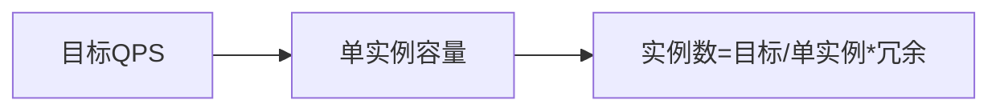

# 性能压测实战进阶

> 压测不是"拿工具乱打"，而是有目标、有模型、有分析的工程活动。本文讲压测设计、工具选型、指标解读与容量推导。

## 1. 压测目标

- **基准（Baseline）**：单实例容量。
- **容量**：目标 QPS 下能否达标。
- **瓶颈定位**：哪里先到极限。
- **稳定性**：长时间运行的抖动/泄漏。

先定 SLO（如 P99 < 300ms，错误率 < 0.1%），压测围绕它。

## 2. 压测模型

| 模型 | 说明 |
| --- | --- |
| 峰值模型 | 模拟大促峰值流量 |
| 阶梯加压 | 逐步加压力找拐点 |
| 稳定性 | 持续中高负载数小时 |
| 破坏性 | 超峰值看降级/熔断 |

## 3. 工具选型

| 工具 | 适用 |
| --- | --- |
| JMeter | 功能全、GUI |
| Gatling | 高并发、DSL |
| k6 | 代码化、云原生 |
| wrk/ab | 简单 HTTP 压测 |
| Locust | Python 分布式 |

## 4. 关键指标

| 指标 | 含义 |
| --- | --- |
| QPS/TPS | 吞吐 |
| RT（P50/P95/P99） | 响应时间分位 |
| 错误率 | 失败比例 |
| 并发数 | 同时请求数 |
| 资源水位 | CPU/内存/连接 |

> 关注 P99 而非均值，均值掩盖长尾。

## 5. 容量推导



- 单实例压测得容量（如 2000 QPS @P99<300ms）。
- 目标 20000 QPS → 至少 10 实例 + buffer（×1.5 ≈ 15）。

## 6. 阶梯加压找拐点

```text
并发 50  → QPS 1000, P99 80ms
并发 100 → QPS 1900, P99 120ms
并发 200 → QPS 2100, P99 350ms  ← 拐点
并发 400 → QPS 2100, P99 900ms  ← 饱和
```

拐点即系统容量上限，超过则延迟陡增。

## 7. 全链路压测

- 生产/影子环境，影子库/影子流量，避免污染。
- 覆盖网关→服务→中间件→DB 全路径。
- 大促前必做。

## 8. 结果分析

- 瓶颈通常在：DB 连接、慢 SQL、锁、GC、线程池、外部依赖。
- 看资源水位与 RT 同步上升 → 资源瓶颈。
- RT 升但资源未满 → 锁/等待/外部慢。

## 9. 常见坑

| 坑 | 现象 | 对策 |
| --- | --- | --- |
| 只压单机 | 不代表生产 | 全链路 |
| 看均值 | 忽略长尾 | 看 P99 |
| 无目标 | 无意义 | 先定 SLO |
| 污染生产 | 脏数据 | 影子/隔离 |
| 一次性 | 不复现 | 常态化 |

## 10. 面试题

1. 压测为什么要看 P99？
2. 如何推导所需实例数？
3. 全链路压测如何不污染生产？
4. 阶梯加压的目的？
5. 瓶颈如何定位？

## 11. 小结

压测 = 目标（SLO）→ 模型（阶梯/全链路）→ 指标（QPS/P99/资源）→ 分析（找拐点与瓶颈）。核心是量化容量、定位短板，为扩容与优化提供依据。
