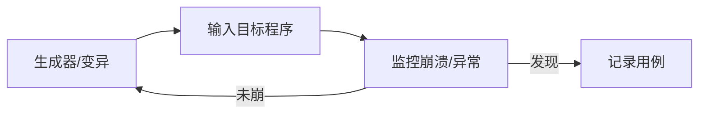

# 模糊测试与安全测试实战

> 模糊测试（Fuzzing）用大量随机/变异输入发现崩溃与漏洞；安全测试验证系统抗攻击能力。二者都是"发现未知弱点"的利器。本文讲原理与落地。

## 1. 模糊测试原理



- 核心是"自动产生海量输入，监控是否崩溃/断言失败"。
- 比手造用例更能覆盖意外路径。

## 2. 模糊类型

| 类型 | 说明 |
| --- | --- |
| 基于生成 | 按语法/结构生成合法输入 |
| 基于变异 | 对种子输入变异（字节翻转） |
| 覆盖率引导（AFL） | 以覆盖率反馈引导变异，高效 |

## 3. 工具

- **AFL / libFuzzer**：C/C++ 主流。
- **Jazzer**：JVM fuzzing。
- **go-fuzz**：Go。
- **Python**：hypothesis（属性测试）、atheris。

```python
from hypothesis import given, strategies as st
@given(st.lists(st.integers()))
def test_sort(xs):
    assert sorted(xs) == sorted(xs)  # 属性：排序后等于任意排序
```

## 4. 适用场景

- 解析器（JSON/协议/文件格式）。
- 编解码、加密、序列化。
- 任何"接收不可信输入"的入口。

## 5. 安全测试维度

| 维度 | 方法 |
| --- | --- |
| 漏洞扫描 | 自动化扫描器 |
| 渗透测试 | 人工模拟攻击 |
| 代码审计 | SAST（静态） |
| 依赖检查 | SCA 查 CVE |
| DAST | 运行时黑盒 |

## 6. DAST 实战

- 部署后，对运行中的系统发起攻击模拟（SQLi、XSS、路径遍历）。
- 发现运行态漏洞，区别于 SAST（代码态）。
- 集成到 CI 的"安全门禁"。

## 7. 与 DevSecOps

- SAST/SCA 在提交/构建阶段。
- DAST/渗透在预发/生产前。
- 漏洞自动建单、跟踪闭环。

## 8. 常见坑

| 坑 | 现象 | 对策 |
| --- | --- | --- |
| 只看 happy path | 漏漏洞 | 模糊+异常 |
| 误报淹没 | 无人看 | 分级+抑制 |
| 无覆盖率反馈 | 低效 | 用引导式 |
| 安全后置 | 修复贵 | 左移 |

## 9. 面试题

1. 模糊测试的原理？
2. 覆盖率引导 fuzzing 优势？
3. SAST 与 DAST 区别？
4. 模糊测试适用哪些组件？
5. 安全测试如何左移？

## 10. 小结

模糊测试用海量变异输入发现崩溃，覆盖率引导最高效；安全测试覆盖 SAST/SCA/DAST/渗透多层。二者都应左移进 CI，把弱点暴露在成本最低的环节。
