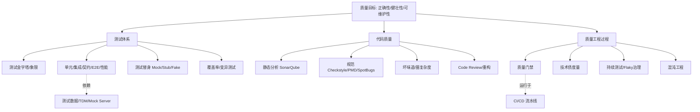

# 🧪 测试与代码质量 · 板块总览

> *「代码能跑不是终点，能持续正确地跑才是。测试与代码质量是软件工程里最不性感、却最能决定团队生死的两件事。」*

这是知识库中**研发效能**的核心板块。它把"如何证明软件是对的""如何保持代码长期可维护"这两件事，从理念到工具到落地全流程讲透。

本板块与以下模块互补、互链：
- **[CI/CD](../基础知识/CI-CD/README.md)** —— 流水线把"测试"和"质量门禁"串成自动化的持续验证；
- **[大模型·工程落地](../大模型/工程落地/README.md)** —— AI 时代测试对象扩展到 Prompt、RAG、Agent；
- **[场景设计·生产问题排查](../场景设计/生产问题排查实战：常见故障与处置步骤.md)** —— 测试没兜住的缺陷，最终在生产以事故形式爆发；
- **[设计模式](../设计模式/设计模式分类.md)** / **[重构](代码质量与静态分析.md)** —— 可测性是好设计的一面镜子。

---

## 一、为什么要单开这个板块

多数团队把测试当成"上线前补一道"，把代码质量当成"有人 CR 看一眼"。结果：
- 单元测试覆盖率 5%，改一行崩三处；
- SonarQube 红成一片没人看，技术债滚雪球；
- 上线靠"晚上胆子大"，回滚靠"手速快"。

本板块主张：**测试左移 + 质量内建**——把验证动作尽可能前移、把质量要求写进代码与流水线的每一环，而不是留给 QA 或线上事故。

---

## 二、概念地图

---

## 三、文章导航（8 篇 + 本总览）

| 编号 | 文档 | 核心内容 |
|------|------|----------|
| 00 | [测试与代码质量总览](测试与代码质量总览.md)（本页） | 概念地图、学习路径、板块定位 |
| 01 | [测试体系总论](01-测试体系总论.md) | 金字塔/象限/分层/测试替身/覆盖率/左移/质量内建 |
| 02 | [单元测试](02-单元测试.md) | JUnit5/Mockito、AAA、参数化、边界、TDD/BDD、反模式 |
| 03 | [集成测试与契约测试](03-集成测试与契约测试.md) | Spring Boot Test、Testcontainers、WireMock、Pact CDC |
| 04 | [端到端与 UI 自动化](04-端端与UI自动化.md) | Playwright/Selenium/Cypress、Page Object、Flaky 治理 |
| 05 | [性能与负载测试](05-性能与负载测试.md) | JMeter/Gatling/k6、压测方法论、瓶颈定位、全链路压测 |
| 06 | [代码质量与静态分析](06-代码质量与静态分析.md) | SonarQube、Checkstyle/PMD/SpotBugs、坏味道、重构、CR |
| 07 | [质量门禁、度量与持续测试](07-质量门禁度量与持续测试.md) | 质量门禁、技术债、DORA、测试左移、Flaky 治理、CI 集成 |
| 08 | [测试数据、Mock 服务与混沌工程](08-测试数据Mock服务与混沌工程.md) | TDM、测试数据工厂、WireMock/Mountebank、混沌工程 |

---

## 四、推荐学习路径

**路径一 · 后端工程师必会（从理论到动手）**
`01 测试体系总论` → `02 单元测试` → `06 代码质量与静态分析` → `07 质量门禁度量与持续测试`

**路径二 · 测试工程师 / QA 转 QE**
`01` → `03 集成与契约` → `04 E2E/UI` → `05 性能测试` → `08 测试数据与混沌`

**路径三 · 技术负责人（质量治理）**
`01（左移/质量内建）` → `06（坏味道/CR）` → `07（门禁/技术债/度量）` → `08（混沌）`

---

## 五、贯穿全板块的 6 条原则（口诀）

> **口诀：左移内建分层跑，替身隔离覆盖好；门禁卡住坏味道，混沌提前炸雷早。**

1. **测试左移**：缺陷发现越晚，修复成本指数级上升（IBM 经典数据：需求阶段 1 → 编码 5 → 测试 10 → 生产 100+）。
2. **质量内建（Built-in, not inspected）**：质量不是测出来的，是设计/写出来的；测试是验证，不是兜底。
3. **分层投入（金字塔）**：海量单元 + 适量集成 + 少量 E2E，别把 E2E 当主力。
4. **隔离与确定性**：每个测试独立、可重复、不依赖顺序与外部状态；用替身隔离依赖。
5. **门禁卡点**：覆盖率、静态扫描、关键测试必须在 CI 卡住，红了不许合入。
6. **持续演进**：Flaky 必须治理、技术债定期还、用混沌工程主动暴露系统脆弱点。

---

## 六、质量度量速查

| 指标 | 含义 | 健康参考 |
|------|------|---------|
| 行/分支覆盖率 | 代码被执行比例 | 核心模块 ≥ 80% |
| 变异存活率 | 变异后被测出的比例 | 越高越好（> 70%） |
| 圈复杂度 | 单函数路径数 | < 10 为宜 |
| CR 覆盖率 | 经评审的代码比例 | 100% 关键路径 |
| Flaky 率 | 不稳定测试占比 | 趋近 0 |
| DORA 指标 | 部署频率/前置时长/变更失败率/恢复时长 | 精英级：按需部署、<1h 前置、<15% 失败、<1h 恢复 |

---

## 七、常见组织级误区

1. **测试是 QA 的事** → 开发不写单测，缺陷全留生产（应是全员责任）。
2. **覆盖率 100% 就安全** → 高覆盖可能全是 getter，需看变异测试与关键路径。
3. **E2E 越多越稳** → 冰淇淋筒，慢且脆，反馈迟（金字塔反了）。
4. **门禁形同虚设** → 红了照样合入，门禁失去意义（须阻断）。
5. **技术债只还不动** → 雪球越滚越大，最终拖垮交付（定期还债）。

---

## 八、与其他模块的关联

| 你想深入的方向 | 去这里 |
|----------------|--------|
| 流水线如何跑测试、门禁如何接 | [CI/CD](../基础知识/CI-CD/README.md) |
| AI 应用的测试（Prompt/RAG/Agent） | [大模型·工程落地](../大模型/工程落地/README.md) |
| 生产事故怎么来的（测试没兜住） | [生产问题排查实战](../场景设计/生产问题排查实战：常见故障与处置步骤.md) |
| 好设计如何提升可测性 | [设计模式](../设计模式/设计模式分类.md) |
| 性能瓶颈在生产如何定位 | [场景设计·生产问题排查](../场景设计/生产问题排查实战：常见故障与处置步骤.md) |

---

> 下一篇：[01 测试体系总论](01-测试体系总论.md) —— 先把"测什么、怎么分层、用什么替身、覆盖到什么程度"这套底层认知打牢。
