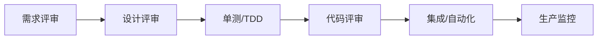

# 测试左移与质量内建实战

> 缺陷越晚发现成本越高。测试左移把质量活动前移到需求与编码阶段；质量内建（Built-in Quality）让质量成为开发的"日常动作"而非"测试部门的事"。二者结合，从源头减少缺陷流入。

## 1. 左移全景

## 2. 左移动作

| 阶段 | 左移动作 |
| --- | --- |
| 需求 | 验收标准明确、可测 |
| 设计 | 评审边界、异常 |
| 编码 | TDD、单测优先 |
| 提交 | 预提交钩子、静态检查 |
| 评审 | 质量门禁卡点 |

## 3. 质量内建

- **测试是开发的一部分**：写完代码先过单测。
- **可测性设计**：依赖注入、接口隔离，便于测。
- **门禁自动化**：单测覆盖率、静态扫描不过不让合。
- **快速反馈**：本地/CI 分钟级跑完。

## 4. 度量与改进

- 缺陷逃逸率（漏到生产的占比）。
- 单测覆盖率（看趋势而非绝对值）。
- 构建/测试时长（过长会没人跑）。
- 复盘缺陷根因，反推左移薄弱点。

## 5. 常见坑

| 坑 | 现象 | 对策 |
| --- | --- | --- |
| 左移变形式 | 不落地 | 门禁强制 |
| 覆盖率虚高 | 无断言 | 断言质量 |
| 测试慢 | 不跑 | 并行 + 分层 |
| 责任推诿 | 质量靠测 | 内建文化 |
| 过度测试 | 维护重 | 风险分级 |

## 6. 面试题

1. 测试左移为什么能降成本？
2. 质量内建如何落地？
3. 覆盖率该怎么看？
4. 如何避免左移变形式？
5. 哪些该自动化、哪些手动？

## 7. 小结

测试左移 + 质量内建 = 把质量活动前移 + 让开发对质量负责。核心是用"更早、更小、更自动"的反馈，从源头堵住缺陷。
