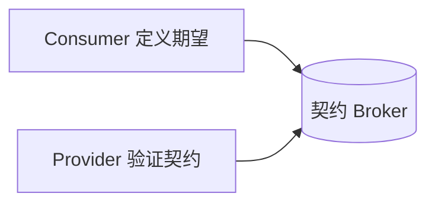
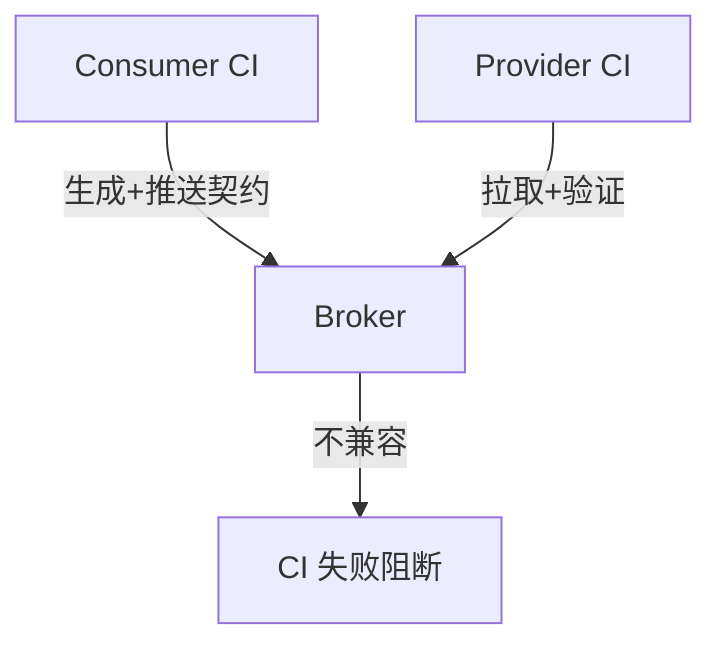

# 消费者驱动契约测试实战

> 微服务下，Provider 与 Consumer 独立演进，接口易悄悄破裂。消费者驱动契约测试（CDC）在集成前验证"契约"，早于 E2E 发现问题。本文以 Pact 为例讲落地。

## 1. 为什么需要 CDC

| 传统 E2E | CDC |
| --- | --- |
| 集成后才发现破裂 | 集成前验证契约 |
| 环境重、慢 | 轻量、快 |
| 难定位 | 明确哪方违约 |

问题本质：Provider 改了字段，Consumer 不知情，直到联调才炸。

## 2. 契约是什么

契约由 **Consumer 定义**：我期望调用 Provider 的某接口，传什么、返回什么。



## 3. Pact 流程

### 3.1 Consumer 侧——定义契约

```java
@Pact(consumer="OrderConsumer", provider="UserProvider")
public RequestResponsePact createPact(PactDslWithProvider b){
    return b.given("user exists")
      .uponReceiving("get user")
      .path("/users/1").method("GET")
      .willRespondWith().status(200)
      .body("{\"id\":1,\"name\":\"张三\"}").toPact();
}
@Test
public void runTest(){ // 用 mock 跑消费者代码，生成契约
    userService.getUser(1);
    pactTestTemplate();
}
```

### 3.2 Provider 侧——验证契约

```java
@Provider("UserProvider")
@PactFolder("pacts")
public class ProviderTest {
    @State("user exists") public void s1(){ /* 准备数据 */ }
    @TestTemplate @ExtendWith(PactVerificationInvocationContextProvider.class)
    void verify(PactVerificationContext c){ c.verifyInteraction(); }
}
```

Provider 用真实实现响应契约请求，验证是否满足。

## 4. 契约 Broker

- 契约存 Broker（如 Pact Broker）。
- CI 中：Consumer 生成契约推送；Provider 拉取并验证。
- 可看契约矩阵（哪些版本兼容）。

## 5. 与 CI 集成



- 不兼容的变更在 Provider 构建阶段就失败，而非生产联调。

## 6. 适用与不适用

- ✅ 接口稳定、多消费者、独立团队。
- ❌ 内部纯函数、UI 交互、一次性脚本。

## 7. 常见坑

| 坑 | 现象 | 对策 |
| --- | --- | --- |
| 契约过时 | 验证旧契约 | CI 自动同步 |
| 只测happy | 漏边界 | 多场景 given |
| 状态未准备 | 验证失败 | 完善 @State |
| 版本错配 | 误报 | 版本标签管理 |

## 8. 面试题

1. 消费者驱动契约是什么？
2. 相比 E2E 的优势？
3. Pact 的 Consumer/Provider 职责？
4. 契约 Broker 作用？
5. CDC 适用场景？

## 9. 小结

CDC 把"接口兼容性验证"前移到构建期：Consumer 定义期望、Provider 验证实现、Broker 居中协调。它比 E2E 更快更准地捕获接口破裂，是微服务测试的重要一环。
