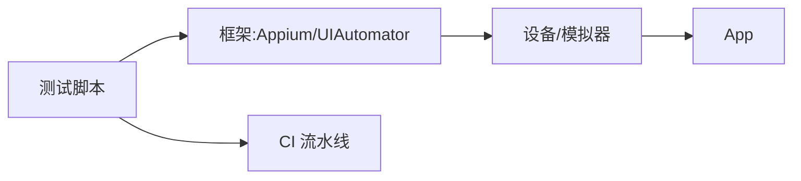

# 移动端自动化测试实战

> 移动端测试比 Web 更难：设备碎片化（机型/系统/分辨率）、网络波动、权限弹窗、手势交互。自动化要在真实设备/模拟器上稳定跑通 UI 与核心流程，并嵌入 CI 持续验证。

## 1. 技术栈



| 平台 | 工具 |
| --- | --- |
| Android | UIAutomator2、Espresso |
| iOS | XCTest、WebDriverAgent |
| 跨端 | Appium |
| 云设备 | 云真机平台 |

## 2. 用例设计

- **核心链路优先**：登录、下单、支付冒烟。
- **页面对象（PO）模式**：元素与用例分离，易维护。
- **稳定性**：处理弹窗、权限、动画等待。
- **数据驱动**：多账号/多场景参数化。

## 3. 稳定性要点

```python
# 等待而非硬 sleep（概念）
wait = WebDriverWait(driver, 10)
el = wait.until(EC.presence_of_element_located((By.ID, "login")))
el.click()
```

- 显式等待替代固定 sleep。
- 失败重试 + 截图，便于排障。
- 设备状态重置，避免用例污染。

## 4. 接入 CI

- PR 触发跑冒烟用例。
- 云真机并行，缩短时长。
- 结果报告 + 失败归因。

## 5. 常见坑

| 坑 | 现象 | 对策 |
| --- | --- | --- |
| 设备碎片 | 部分机型挂 | 矩阵覆盖 |
| 弹窗干扰 | 失败 | 统一处理 |
| 不稳定 | 偶发失败 | 重试 + 等待 |
| 慢 | 流水线长 | 并行 + 云真机 |
| 维护重 | 改 UI 崩 | PO 模式 |

## 6. 面试题

1. 移动端自动化难点？
2. 为什么用显式等待？
3. PO 模式有什么好处？
4. 如何在 CI 跑移动测试？
5. 设备碎片化怎么应对？

## 7. 小结

移动端自动化 = 框架选型 + PO 模式 + 稳定性（等待/重试）+ CI 云真机。核心是"先稳核心链路、用等待换稳定、用并行换速度"。
