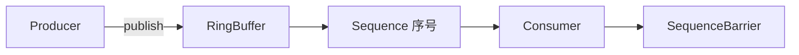

# Disruptor 核心源码要点

> Disruptor 是 LMAX 开源的高性能无锁线程间消息队列，单机可达千万级 TPS。其核心是**环形缓冲区（RingBuffer）+ 无锁 CAS + 序号栅栏**。本文解析其设计精髓。

## 1. 为什么不用队列

| 传统队列 | Disruptor |
| --- | --- |
| ArrayBlockingQueue 用锁 | 无锁 CAS |
| 伪共享导致缓存失效 | 缓存行填充消除伪共享 |
| 头尾指针竞争 | 序号（sequence）驱动 |

锁带来的线程挂起/唤醒开销在极高频场景不可接受，Disruptor 用 CAS 替代。

## 2. 核心结构



- **RingBuffer**：定长环形数组，预分配对象避免 GC。
- **Sequence**：原子序号，标志生产/消费进度。
- **Sequencer**：协调序号分配（单/多生产者）。
- **SequenceBarrier**：消费者等待可用事件。

## 3. 环形缓冲区

```java
// 本质：数组 + 取模定位
int index = (int)(sequence % bufferSize);
Event e = entries[index];
```

- 定长、覆盖写（旧事件被新事件覆盖，由消费者进度保证已处理）。
- 消除动态扩容与频繁分配。

## 4. 消除伪共享

CPU 缓存以缓存行（64 字节）为单位，多个变量若在同一缓存行被不同线程修改会相互失效（伪共享）。Disruptor 用填充使变量独占缓存行：

```java
class LhsPadding { protected long p1,p2,p3,p4,p5,p6,p7; }
class Value extends LhsPadding { protected volatile long value; }
class RhsPadding extends Value { protected long p9,p10,p11,p12,p13,p14,p15; }
```

`@Contended`（JDK8+）可替代手动填充。

## 5. 生产者发布

```java
long seq = ringBuffer.next();          // 申请序号（CAS）
Event e = ringBuffer.get(seq);
e.set(data);
ringBuffer.publish(seq);                // 发布，消费者可见
```

多生产者用 `MultiProducerSequencer`，CAS 竞争序号。

## 6. 消费者

- **EventProcessor/EventHandler**：消费逻辑。
- 通过 `SequenceBarrier` 等待序号可用：

```java
while (true) {
    long avail = barrier.waitFor(nextSeq);
    while (nextSeq <= avail) {
        handler.onEvent(ringBuffer.get(nextSeq));
        nextSeq++;
    }
}
```

## 7. 等待策略（Wait Strategy）

| 策略 | 特点 |
| --- | --- |
| BlockingWait | 公平、低 CPU |
| BusySpinWait | 最低延迟、高 CPU |
| YieldingWait | 折中 |
| TimeoutBlocking | 超时退避 |

## 8. 多消费者模式

- **广播（广播给所有）**：每组独立消费全部事件。
- **分组（Group）**：同组竞争，一个事件只被一组一个消费。
- **链式（Pipeline）**：A→B→C 串行处理。

## 9. 常见坑

| 坑 | 现象 | 对策 |
| --- | --- | --- |
| 消费者慢 | 生产者阻塞 | 优化消费/加消费者 |
| 环形覆盖 | 丢事件 | 监控 gating sequence |
| 伪共享忽略 | 性能差 | 缓存行填充 |
| 等待策略错 | 延迟/CPU | 按场景选 |

## 10. 面试题

1. Disruptor 为什么不用锁？
2. 环形缓冲区如何定位？
3. 伪共享是什么？如何消除？
4. 生产者如何保证序号不冲突？
5. 等待策略有哪些？

## 11. 小结

Disruptor 用 RingBuffer + CAS 序号 + 缓存行填充，把线程间通信做到无锁极致。理解"序号驱动"与"消除伪共享"是掌握其性能的关键。
