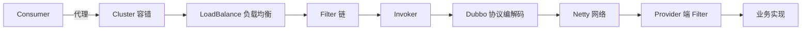

# Dubbo RPC 调用链源码要点

> Dubbo 是阿里开源的高性能 Java RPC 框架。一次远程调用背后是"代理 → 集群 → 协议 → 网络 → 服务端"的复杂链路。本文解析其核心调用流程与关键扩展点。

## 1. 调用链路总览



## 2. 动态代理

- Consumer 拿到的是接口代理（`ProxyFactory` 用 JDK/CGLIB/Javassist 生成）。
- 代理把所有方法调用封装成 `Invocation`（方法名、参数、附件）。

```java
UserService u = ReferenceConfig 生成代理;
u.sayHi("x");  // 实际进入 Invocation 封装与远程调用
```

## 3. Cluster 集群容错

`Cluster` 把多个 Provider Invoker 包装成一个：

| 容错策略 | 行为 |
| --- | --- |
| Failover | 失败重试其他（默认） |
| Failfast | 失败立即抛 |
| Failsafe | 失败忽略 |
| Failback | 失败定时重发 |
| Forking | 并行多个取最快 |

## 4. LoadBalance 负载均衡

- `Random`：加权随机（默认）。
- `RoundRobin`：加权轮询（带平滑）。
- `LeastActive`：最小活跃数优先（慢节点少分）。
- `ConsistentHash`：同参数落同节点（一致性哈希）。

## 5. Filter 链

- 类似 Servlet Filter，可在调用前后做日志、监控、鉴权、限流。
- `MonitorFilter` 统计数据，`TraceFilter` 透传链路。

```java
@Activate(group = Constants.CONSUMER)
public class MyFilter implements Filter {
    public Result invoke(Invoker<?> invoker, Invocation inv) {
        // before
        Result r = invoker.invoke(inv);
        // after
        return r;
    }
}
```

## 6. 协议与编解码

- 默认 Dubbo 协议：自定义二进制，header + body。
- 请求/响应用 `ExchangeCodec` 编解码，支持心跳、附件。
- 支持 Hessian/Kryo/Protobuf 等序列化。

## 7. 网络层（Netty）

- 基于 Netty 的 NIO 通信。
- 连接池管理，多路复用。
- 客户端 `HeaderExchangeClient` 发送 `Request`，服务端 `HeaderExchangeHandler` 处理。

## 8. 服务端处理


- 根据 `Invocation` 定位到具体 `Invoker`（接口+方法+版本）。
- 执行业务实现，结果序列化返回。

## 9. 注册中心

- Provider 启动时向注册中心（ZK/Nacos）注册 URL。
- Consumer 订阅，本地维护 Provider 列表缓存。
- 变更通过监听通知，动态更新 Invoker 列表。

## 10. 常见坑

| 坑 | 现象 | 对策 |
| --- | --- | --- |
| 接口版本错 | 调不到 | 对齐 version |
| 超时设置不当 | 雪崩 | 合理 timeout |
| 大对象传输 | 慢/ OOM | 拆分/压缩 |
| 注册中心抖 | 列表变 | 本地缓存+重试 |

## 11. 面试题

1. Dubbo 一次调用经过哪些组件？
2. 集群容错有哪些策略？
3. 负载均衡算法？
4. Filter 链能做什么？
5. 注册中心作用？

## 12. 小结

Dubbo 调用链 = 代理封装 → 集群容错 → 负载均衡 → Filter 链 → 协议编解码 → Netty 传输 → 服务端分发。扩展点（Cluster/LoadBalance/Filter/Protocol）使其高度可定制，注册中心解耦服务发现。
