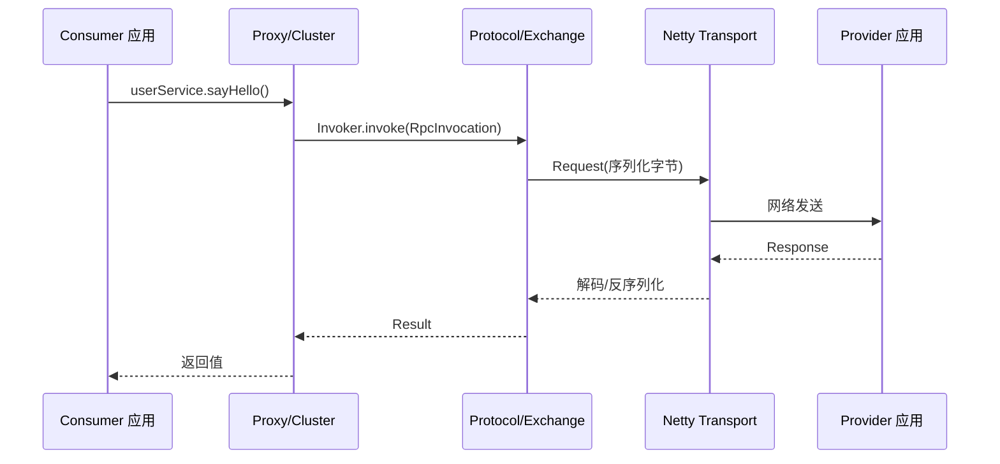
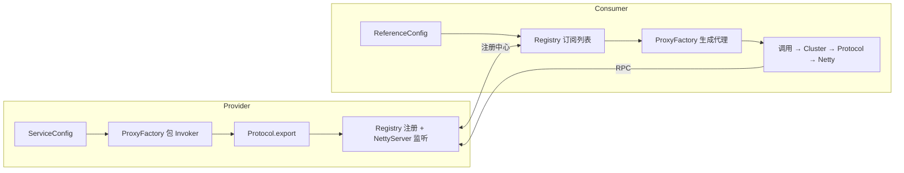

# Dubbo 源码解析（面试高频）

> Apache Dubbo 是 Java 生态最主流的 RPC / 微服务框架之一。面试常问 **十层架构、一次 RPC 调用链路、SPI 自适应扩展、集群容错与负载均衡**。本文按官方架构 + 调用流程串讲。
>
> 源码仓库：[apache/dubbo](https://github.com/apache/dubbo)（The java implementation of Apache Dubbo. An RPC and microservice framework. Apache-2.0；模块清晰：dubbo-rpc / dubbo-cluster / dubbo-registry / dubbo-remoting / dubbo-serialization 等，适合源码级阅读）。

---

## 一、十层架构（官方代码架构）

Dubbo 官方把代码组织成十层（蓝色虚线 = 启动组装链，红色实线 = 运行时调用链）：

| 层 | 职责 | 核心接口 |
|----|------|----------|
| `Service` 服务层 | 业务接口（开发者定义） | 你的 `UserService` |
| `Config` 配置层 | 对外配置，启动入口 | `ServiceConfig` / `ReferenceConfig` |
| `Proxy` 代理层 | 透明代理，生成 Stub / Skeleton | `ProxyFactory` |
| `Registry` 注册中心层 | 服务注册与发现 | `RegistryFactory` / `Registry` |
| `Cluster` 集群层 | 多 Provider 路由、容错、负载均衡 | `Cluster` / `Directory` / `Router` / `LoadBalance` |
| `Monitor` 监控层 | 调用次数 / 耗时统计 | `MonitorFactory` / `Monitor` |
| `Protocol` 远程调用层 ★ | 封装 RPC 调用（核心） | `Protocol` / `Invoker` / `Exporter` |
| `Exchange` 信息交换层 | 请求-响应模式，同步转异步 | `Exchanger` / `ExchangeChannel` |
| `Transport` 网络传输层 | 抽象 Netty / Mina 为统一接口 | `Transporter` / `Channel` / `Client` / `Server` |
| `Serialize` 序列化层 | 对象 ↔ 字节流 | `Serialization` / `ObjectInput/Output` |

> 官方原话：**「Protocol 是核心层，只要有 Protocol + Invoker + Exporter 就能完成非透明 RPC 调用」**；Cluster 是外围概念——把多个 Invoker 伪装成一个，单 Provider 时不需要 Cluster。

---

## 二、一次 RPC 调用链路（Consumer → Provider）

以 Consumer 调用 `userService.sayHello()` 为例，请求自上而下穿过各层，响应反向返回：

```
1.  Service 接口调用
2.  Proxy 层：InvokerInvocationHandler.invoke() → 构造 RpcInvocation
3.  Cluster 层：LoadBalance.select() 选一个 Provider Invoker
4.  集群容错：FailoverClusterInvoker（失败重试）/ Failfast ...
5.  Filter 链：ConsumerContextFilter → MonitorFilter → ...（监控/日志/限流）
6.  Protocol 层：DubboProtocol.refer() 得到 DubboInvoker
7.  Exchange 层：HeaderExchangeChannel.request() 生成 Request 对象（同步转异步）
8.  Transport 层：NettyChannel.send() 写入 Socket
9.  Serialize 层：Hessian2Serialization 把对象转字节流
--- 网络传输 ---
10. Provider 接收：Netty Handler → 解码 → DubboProtocol.reply() → 调真实服务实现 → 返回
11. Consumer 接收响应：解码 → 反序列化 → 经 Future 返回给调用方
```



> 核心模型是 **Invoker**：所有操作围绕 `Invoker.invoke(Invocation)` 展开。Consumer 端是 `DubboInvoker`（远程），Provider 端是 `AbstractProxyInvoker`（本地服务包装）。`Invocation` 封装方法名 + 参数，`Result` 封装返回值 / 异常。

---

## 三、SPI 与 @Adaptive（Dubbo 扩展机制灵魂）

Dubbo 没有用 JDK 原生 SPI，而是自己实现了一套**更强大**的 SPI：支持**自适应扩展、自动包装（AOP）、自动激活**。

### 3.1 基本机制

扩展点接口用 `@SPI` 标注默认实现，实现类放在 `META-INF/dubbo/` 下的配置文件（key=实现类全限定名）：

```java
@SPI("dubbo")
public interface Protocol {
    @Adaptive
    Exporter export(Invoker<?> invoker) throws RpcException;
    @Adaptive
    Invoker<?> refer(Class<?> type, URL url) throws RpcException;
}
```

### 3.2 @Adaptive（自适应扩展）—— 面试重点

`@Adaptive` 标注的方法会由框架**动态生成适配器类**：真正调用时**根据 URL 参数（如 `protocol=dubbo` 或 `loadbalance=roundrobin`）在运行期决定用哪个实现**，而不是启动期定死。这就是「自适应」——把扩展选择推迟到方法调用那一刻。

```java
// 自适应示例：根据 URL 的 loadbalance 参数动态选实现
@SPI(RandomLoadBalance.NAME)
public interface LoadBalance {
    @Adaptive("loadbalance")
    <T> Invoker<T> select(List<Invoker<T>> invokers, URL url, Invocation invocation);
}
// 调用时 url 带 loadbalance=roundrobin 就选加权轮询，否则默认随机
```

### 3.3 自动包装（Wrapper / AOP）

若某个扩展实现类的构造器**参数是该扩展点接口本身**，框架会把它当作 Wrapper 自动层层包装（如 `ProtocolFilterWrapper`、`ProtocolListenerWrapper`），实现类似 AOP 的链式增强，无需手动织入。

---

## 四、集群容错与负载均衡

### 4.1 集群容错策略（Cluster）

| 策略 | 行为 | 适用 |
|------|------|------|
| `Failover`（默认） | 失败**自动切换**其他 Provider（可配 `retries`） | 读操作、幂等写 |
| `Failfast` | **快速失败**，立即抛异常 | 非幂等写（如新增） |
| `Failsafe` | 失败**忽略**，记日志 | 审计、非关键 |
| `Failback` | 失败**定时重试**（后台） | 通知类 |
| `Forking` | **并行**调多个 Provider，谁先返回用谁 | 实时性要求高的读 |
| `Broadcast` | 广播给所有 Provider | 通知所有节点（如缓存更新） |

### 4.2 负载均衡（LoadBalance）

| 算法 | 说明 |
|------|------|
| `Random`（默认） | 加权随机 |
| `RoundRobin` | 加权轮询（带平滑） |
| `LeastActive` | 最少活跃调用数（谁最闲给谁） |
| `ConsistentHash` | 一致性 Hash（同参数落同节点，用于有状态） |

### 4.3 服务目录与路由

- **`RegistryDirectory`**：动态监听注册中心，**服务列表变化实时刷新**（Provider 上下线自动感知，无需重启 Consumer）。
- **`RouterChain`**：条件路由、标签路由、灰度路由等，决定「这次调用能用哪些 Provider」。

---

## 五、异步化与线程模型

- **IO 与业务线程分离**：Netty 的 IO 线程**不执行业务逻辑**，请求经 `Dispatcher`（如 `all` / `message`）分发到业务线程池，避免 IO 线程被慢业务阻塞。
- **全链路异步**：底层用 `CompletableFuture` 支撑，`RpcContext.getContext().asyncCall(...)` 显式异步；返回 `CompletableFuture` 可链式编排。
- **长连接多路复用**：默认单连接上多路复用请求（`DefaultFuture` 用请求 ID 关联响应，复用 Request 对象），减少连接数。

### 5.1 协议与编解码（Dubbo 协议头）

```
| Magic(2B) | Flag(1B) | Status(1B) | ID(8B) | DataLength(4B) | Body... |
```
- 序列化支持 **Hessian2（默认）/ JSON / Kryo / Protobuf** 等；Hessian2 用对象池减少 GC。
- 结果缓存 `CacheFilter`、限流 `ExecuteLimitFilter`、Mock 降级等都以 **Filter** 形式挂在调用链上。

---

## 六、服务暴露与引用（启动组装）

- **Provider 暴露**：`ServiceConfig` → `ProxyFactory` 把实现类包成 `Invoker` → `Protocol.export()` 暴露为远程服务（`DubboProtocol` 默认）→ `Registry` 向注册中心注册地址 → 启动 `NettyServer` 监听。
- **Consumer 引用**：`ReferenceConfig` → `Registry` 订阅服务列表 → `ProxyFactory` 生成接口**代理对象**（默认 `JavassistProxyFactory`，用 Javassist 字节码生成，比 JDK 代理更快）→ 调用走上面第二节链路。



> 读源码建议：调用链抓 `InvokerInvocationHandler` → `ClusterInvoker` → `Filter` 链 → `DubboInvoker` → `HeaderExchangeChannel.request`；扩展机制抓 `@SPI` / `@Adaptive` 与 `ExtensionLoader`；容错抓 `FailoverClusterInvoker.select/invoke`。
