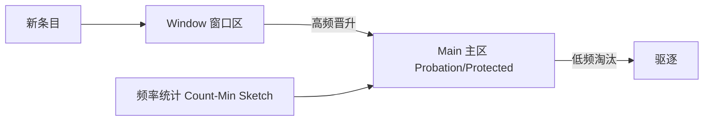

# Guava Cache 与 Caffeine 源码要点

> 本地缓存是高并发系统的标配。Guava Cache 是经典实现，Caffeine 是其现代化继任者，用 Window TinyLFU 淘汰策略达到近最优命中率。本文对比两者核心机制。

## 1. 基本用法

```java
Cache<String, User> cache = Caffeine.newBuilder()
    .maximumSize(10_000)
    .expireAfterWrite(Duration.ofMinutes(10))
    .build();

User u = cache.get("key", k -> loadFromDb(k));  // 不存在则加载
```

## 2. Guava Cache 结构

- 基于 `ConcurrentHashMap` 分段。
- 淘汰：LRU 变体（Segment 级 LRU）。
- 支持：最大条目、过期（写后/读后）、弱引用、刷新、统计。

**局限**：LRU 对扫描型访问（一次性全遍历）不友好，会冲掉热点。

## 3. Caffeine 的核心改进

| 维度 | Guava | Caffeine |
| --- | --- | --- |
| 淘汰策略 | LRU | W-TinyLFU |
| 并发 | 分段锁 | 无锁（CAS + 时钟） |
| 性能 | 中 | 高 |
| 命中率 | 一般 | 近最优 |

## 4. Window TinyLFU

Caffeine 用 **TinyLFU** 统计频率 + **Window** 抗扫描：



- **Count-Min Sketch**：近似记录访问频率，占用极小内存。
- **Admission（准入）**：新条目频率需超过将被淘汰者才准入，防扫描冲击。
- **Window**：近期条目先放窗口，避免一次性扫描污染主区。

## 5. 并发实现

- 用 `ConcurrentHashMap` + 自定义 `Node`，读基本无锁。
- 写操作通过 CAS 与细粒度锁降低竞争。
- 淘汰在写/读时 lazily 触发，分摊开销。

## 6. 过期与刷新

- `expireAfterWrite`：写后固定过期。
- `expireAfterAccess`：访问后过期。
- `refreshAfterWrite`：过期后后台刷新，避免击穿（返回旧值同时刷新）。
- `eviction`：容量超限按策略驱逐。

## 7. 统计与监控

- `recordStats()` 开启命中率、加载耗时等统计。
- 便于调参（容量、过期）。

## 8. 缓存最佳实践

- 合理 `maximumSize`：过小命中低，过大占内存。
- 加载函数要有降级（DB 挂时不雪崩）。
- 防穿透：空值也缓存短时长。
- 批量预热：启动时加载热点。

## 9. 常见坑

| 坑 | 现象 | 对策 |
| --- | --- | --- |
| 容量过大 | OOM | 限 size |
| 加载无降级 | 雪崩 | 兜底值 |
| 过期一致 | 脏数据 | 合理 TTL |
| 误用强引用 | 内存不释放 | 弱引用/限容 |

## 10. 面试题

1. Caffeine 相比 Guava 的优势？
2. TinyLFU 如何解决扫描问题？
3. 为什么用 Count-Min Sketch？
4. 缓存击穿如何用 refresh 缓解？
5. 本地缓存与 Redis 如何配合？

## 11. 小结

本地缓存从 Guava 的 LRU 演进到 Caffeine 的 W-TinyLFU，命中率与并发大幅提升。理解频率统计 + 准入 + 窗口三件套，是掌握现代缓存淘汰的关键。配合 Redis 做多级缓存更佳。
