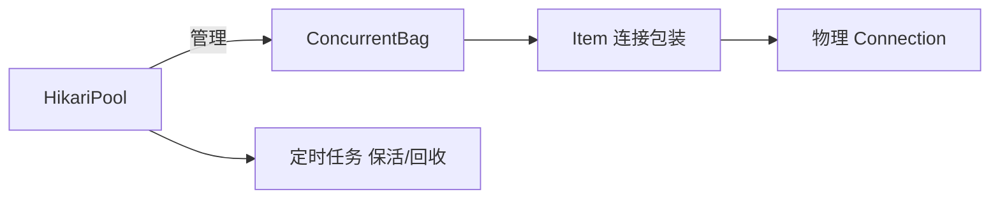

# HikariCP 核心源码要点

> HikariCP 是当前 Java 生态最快的数据库连接池，以极简设计与极致性能著称。本文从架构、核心数据结构、连接获取/回收、监控与调优切入，解析其高性能来源。

## 1. 为什么快

| 优化点 | 说明 |
| --- | --- |
| 无锁化 | 用 `ConcurrentBag` 无锁集合管理连接 |
| 字节码精简 | 代理类用 Javassist 生成最小代理 |
| 静态字段 | 避免重复字段访问 |
| 精确计时 | 自研 `ConcurrentBag` + `Scheduler` |

## 2. 核心类结构



- `HikariConfig`：配置。
- `HikariPool`：池实现核心。
- `ConcurrentBag`：连接容器，无锁高并发。
- `PoolEntry`：连接包装，记录状态/时间。

## 3. ConcurrentBag 无锁设计

`ConcurrentBag` 把连接分为三种状态：
- **STATE_NOT_IN_USE**：空闲可用。
- **STATE_IN_USE**：使用中。
- **STATE_REMOVED**：已移除。

借用（borrow）优先从线程本地缓存（ThreadLocal）取，命中即无锁返回；未命中再遍历共享队列。

```java
// 简化思路
public T borrow(long timeout) {
    // 1. 先查 thread-local 缓存
    // 2. 再查共享 bag（CAS 改状态）
    // 3. 必要时等待/新建
}
```

## 4. 连接获取流程

```java
HikariDataSource ds = new HikariDataSource(config);
try (Connection c = ds.getConnection()) {
    // 使用
} // 自动归还（Proxy 代理 close）
```

- `getConnection()` 从 bag 借一个空闲连接。
- 返回的 `Connection` 是 Hikari 代理，调用 `close()` 实际是归还而非物理关闭。

## 5. 连接回收与保活

- **空闲超时**：超过 `idleTimeout` 回收多余空闲连接。
- **最大存活**：`maxLifetime` 到期强制换新，避免数据库侧超时。
- **保活**：`keepaliveTime` 定期发轻量查询（如 `SELECT 1`）。

## 6. 关键参数

| 参数 | 含义 | 建议 |
| --- | --- | --- |
| maximumPoolSize | 最大连接 | 按 DB 承载 |
| minimumIdle | 最小空闲 | 通常=maximum |
| connectionTimeout | 获取超时 | 30s |
| idleTimeout | 空闲回收 | 10min |
| maxLifetime | 最大存活 | 略小于 DB 超时 |
| keepaliveTime | 保活间隔 | 按需 |

## 7. 监控

- 暴露 `HikariPoolMXBean` / Micrometer 指标。
- 关注：活跃连接数、等待线程数、获取耗时。
- 等待数持续>0 说明池偏小或连接泄漏。

## 8. 连接泄漏检测

- `leakDetectionThreshold`：连接借出超过阈值未归还则告警。
- 帮助发现未关闭 `Connection` 的代码。

## 9. 常见坑

| 坑 | 现象 | 对策 |
| --- | --- | --- |
| maxLifetime 过大 | DB 侧断连 | 小于 DB 超时 |
| 池太小 | 等待超时 | 调大/查慢SQL |
| 未关连接 | 泄漏 | leakDetection |
| 跨线程误用 | 异常 | 单线程用连接 |

## 10. 面试题

1. HikariCP 为什么快？
2. ConcurrentBag 如何无锁？
3. maxLifetime 为何要小于 DB 超时？
4. 连接泄漏如何发现？
5. 为什么 close 是归还不是关闭？

## 11. 小结

HikariCP 以 `ConcurrentBag` 无锁管理 + 极小代理 + 精确生命周期管控实现极致性能。调优核心是 `maximumPoolSize` 与 `maxLifetime` 匹配数据库，并开启泄漏检测保障稳健。
