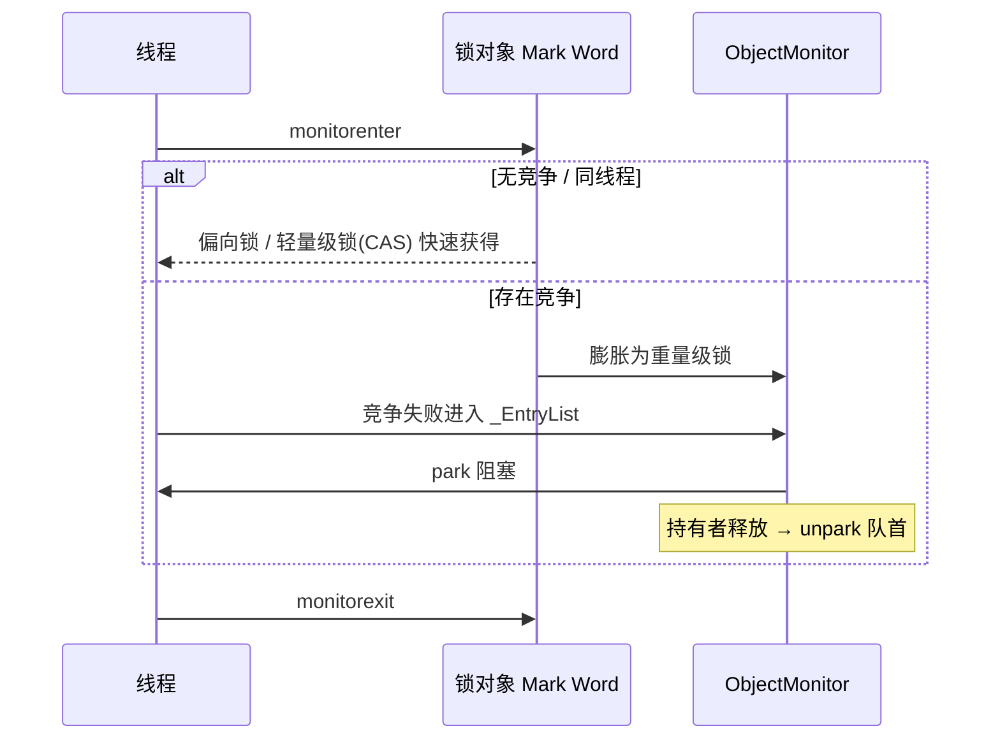
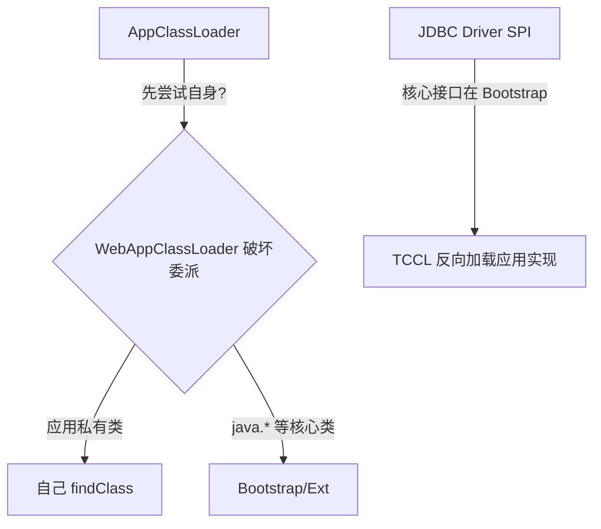

# JVM 与并发底层源码（面试高频）

> 本篇聚焦 Java 面试里最常追问的「底层源码」：`synchronized` 锁升级与对象头、`volatile` 内存语义与内存屏障、`ThreadLocal` 见下一篇、类加载双亲委派与「被破坏的三次」。这些点既是源码题，也是考察你对 JVM / JMM 理解深度的试金石。
>
> 版本提示：JDK 1.6 引入偏向锁，但 **JDK 15（JEP 374）起偏向锁默认禁用**，**JDK 21+ 虚拟线程时代** `synchronized` 会产生 pinning（推荐 `ReentrantLock`），**JDK 26 已彻底移除偏向锁、改用 LockStack**。下文以「理解经典模型 + 说明现代演进」两条线并行，避免被新版本追问打懵。

---

## 一、对象头与 Mark Word

HotSpot 中每个 Java 对象在堆里都分为 **对象头（Header）+ 实例数据 + 对齐填充**。对象头又分两块：

- **Mark Word**（64 位下 8 字节）：存储哈希码、分代年龄、锁标志位、GC 标记等。
- **Klass Pointer**（类型指针，开启压缩指针 `-XX:+UseCompressedClassPointers` 后 4 字节）：指向类的元数据。

Mark Word 的 `lock_bits`（最后 2 位）记录锁状态，经典 64 位布局（无压缩头时）大致为：

| 锁状态 | lock bits | Mark Word 内容要点 |
|--------|-----------|--------------------|
| 无锁（Unlocked） | `01` | 偏向位 0；[unused:25 \| hash:31 \| unused:1 \| age:4 \| biased_lock:1 \| lock:2] |
| 偏向锁（Biased） | `01` | 偏向位 1；存 **偏向线程 ID + epoch** |
| 轻量级锁（Lightweight / Fast-Locked） | `00` | 指向**线程栈中 Lock Record** 的指针 |
| 重量级锁（Inflated / Monitor） | `10` | 指向 **ObjectMonitor**（C++ 对象）的指针 |
| GC 标记（Marked） | `11` | 并发标记 / 压缩转发指针 |

> 读源码建议：对象头定义在 `hotspot/share/oops/markWord.hpp`；`lock_bits` 的语义判定方法 `is_unlocked() / is_fast_locked() / has_monitor()` 都在其中。现代 JDK（26+）把轻量级锁改由线程的 **LockStack** 记录（取代旧 stack-locking），`lock_bits=00` 表示 Fast-Locked。

---

## 二、synchronized 底层与锁升级

`synchronized` 在字节码层面有两种呈现：

- **同步代码块**：`monitorenter` / `monitorexit`（成对，异常时由 `athrow` 保证退出）。
- **同步方法**：方法表的 `ACC_SYNCHRONIZED` 标志；JVM 进入方法前自动 `monitor enter`，返回前 `monitor exit`。

### 2.1 经典锁升级链路（JDK 8 及早期理解模型）

```
无锁 → 偏向锁 → 轻量级锁 → 重量级锁
```

1. **偏向锁（Biased Locking）**：绝大多数时间只有一个线程访问锁。第一次加锁时把**线程 ID 写入 Mark Word**（`biased_lock=1`），之后该线程再进入**只比对 ID、零 CAS**；退出同步块也不改 Mark Word（懒惰释放）。
   - 撤销代价高：一旦出现别的线程竞争，需在**安全点（STW）** 暂停线程、检查栈帧、撤销偏向。现代线程池 / 虚拟线程下收益小于代价 → JDK 15 默认关闭、JDK 26 删除。
2. **轻量级锁**：线程在**自己的栈帧**创建 `Lock Record`（含 displaced Mark Word 备份），用 **CAS 把对象头指向 Lock Record**。
   - CAS 成功 → 拿到轻量级锁；失败且是**自己重入** → 记录重入计数（加一条空 Lock Record）；失败且是**其他线程竞争** → 膨胀为重量级锁。
   - 解锁再用 CAS 把备份的 Mark Word 写回。
3. **重量级锁**：对象头指向 **ObjectMonitor**（C++，`hotspot/share/runtime/objectMonitor.hpp`）。结构里有：
   - `_owner`：持有锁的线程；
   - `_EntryList`：抢锁**失败**、阻塞等待的线程队列；
   - `_WaitSet`：`wait()` 主动等待的线程队列；
   - 抢锁失败线程通过 `park` 阻塞（操作系统互斥量），竞争不激烈时可**自适应自旋**（`-XX:+UseSpinning` 在 JDK 8+ 默认开启，`PreBlockSpin` 等参数 JDK 9+ 已移除）。



> 为什么需要三级？核心权衡是**避免无谓的开销**：单线程重入不阻塞、交替访问不进内核、真正激烈竞争才用操作系统互斥量。但偏向锁的撤销成本在现代场景反噬，所以新 JDK 直接砍掉它。

### 2.2 现代演进（必答加分项）

- **JDK 15（JEP 374）**：`-XX:+UseBiasedLocking` 默认关闭，相关参数后续被标记为 `obsolete` / 移除。
- **JDK 21 虚拟线程（JEP 444）**：在 `synchronized` 临界区内虚拟线程会被 **pinned（固定）** 到载体线程，阻塞载体，推荐 IO 场景改用 `ReentrantLock`。可用 `-Djdk.tracePinnedThreads=short` 诊断。
- **JDK 26**：彻底删除偏向锁代码，轻量级锁改由 **LockStack**（线程本地栈，替代传统 stack-locking），锁升级链路简化为 `Unlocked → Fast-Locked(LockStack) → Inflated(ObjectMonitor)`。

> 面试应答策略：先讲经典「无锁→偏向→轻量→重量」让面试官确认你懂原理，再补一句「不过 JDK 15 起偏向锁默认关闭、26 已移除，现在主流是轻量级 CAS + 重量级 Monitor，虚拟线程下建议用 ReentrantLock」——瞬间拉开差距。

---

## 三、volatile 内存语义（JMM / 可见性 / 有序性）

`volatile` 解决两个问题：**可见性**与**禁止指令重排序（有序性）**，但不保证原子性（i++ 仍非线程安全）。

### 3.1 JMM 与 happens-before

Java 内存模型（JMM）规定线程有自己的**工作内存**（抽象，对应 CPU 缓存 / 寄存器），变量读写需经主内存。核心规则靠 **happens-before（先行发生）** 表达：

- **程序顺序规则**：单线程内，靠前的操作 happens-before 靠后的。
- **volatile 规则**：对 `volatile` 变量的**写** happens-before 后续对该变量的**读**。
- **传递性**：A hb B，B hb C ⇒ A hb C。
- 另有**监视器锁规则**（`unlock` hb 后续 `lock`）、`start()` / `join()` 规则等。

### 3.2 内存屏障（Memory Barrier）

JVM 在 `volatile` 写 / 读处插入屏障（以 `volatile` 变量 x 为例，HotSpot 最终映射为 CPU 指令如 `lock` 前缀 / `mfence`）：

| 操作 | 插入的屏障（LoadStore 等语义） | 作用 |
|------|--------------------------------|------|
| `volatile` 写 | 前插 **StoreStore**，后插 **StoreLoad** | 保证写前的普通写先刷出；写后对所有读可见（StoreLoad 是关键且最贵） |
| `volatile` 读 | 后插 **LoadLoad**、**LoadStore** | 保证读后的操作不会重排到读之前 |

> `volatile` 写后的 **StoreLoad** 屏障通常借助 `lock` 前缀指令实现（如 x86 上 `lock addl $0,(%rsp)`），它既锁总线 / 缓存行，又隐含全屏障语义，还强制写缓冲 / 失效队列刷新——这就是可见性的硬件来源。

### 3.3 经典应用：双重检查锁定（DCL）单例

```java
public class Singleton {
    private static volatile Singleton instance;   // 必须 volatile
    public static Singleton getInstance() {
        if (instance == null) {                    // 第一次检查（无锁，提升性能）
            synchronized (Singleton.class) {
                if (instance == null)              // 第二次检查（持锁，防重复创建）
                    instance = new Singleton();    // 非原子：分配内存→初始化→赋值
            }
        }
        return instance;
    }
}
```

**为什么必须 `volatile`？** `instance = new Singleton()` 在底层是「分配内存 → 构造初始化 → 把地址赋给 instance」三步，可能发生**重排序**导致「地址先赋值、对象还没初始化完」。另一个线程第一次检查可能拿到**未初始化完成的半对象**。加 `volatile` 后，StoreStore + StoreLoad 屏障禁止「初始化」被重排到「赋值」之后，保证别的线程读到的一定是完整对象。

> 一句话：`volatile` 之于 DCL，不是保证原子，而是保证「初始化 happen-before 引用对外可见」。

---

## 四、类加载机制与双亲委派

### 4.1 类加载过程（宏观）

`ClassLoader.loadClass()` → 经过 **加载 → 链接（验证/准备/解析）→ 初始化**。这里重点讲**委派模型**。

### 4.2 双亲委派模型（Parents Delegation）

**工作过程**：当一个类加载器收到加载请求，它**先委派父加载器**去加载；父加载器递归向上，只有**父加载器无法加载**（在自己的搜索范围找不到）时，子加载器才尝试自己加载。

层级（JDK 8 及以前）：

| 加载器 | 负责范围 |
|--------|----------|
| `BootstrapClassLoader` | `$JAVA_HOME/lib` 核心类（C++ 实现，getParent() 为 null） |
| `ExtClassLoader`（PlatformClassLoader，JDK 9+） | `$JAVA_HOME/lib/ext` 或平台模块 |
| `AppClassLoader` | classpath / 模块路径下的应用类 |
| 自定义 `ClassLoader` | 用户指定的来源（如热部署、加密 class） |

**为什么要双亲委派？**

1. **避免重复加载**：父已加载，子不必再加载，保证类的唯一性。
2. **安全 / 稳定**：核心类（如 `java.lang.Object`）只会被 Bootstrap 加载，防止用户自定义 `java.lang.HackObject` 顶替核心类（沙箱保护）。

源码关键点（`ClassLoader.loadClass`，简化）：

```java
protected Class<?> loadClass(String name, boolean resolve) {
    synchronized (getClassLoadingLock(name)) {
        Class<?> c = findLoadedClass(name);     // 1. 已加载过直接返回
        if (c == null) {
            try {
                if (parent != null)
                    c = parent.loadClass(name, false);  // 2. 委派父加载器
                else
                    c = findBootstrapClassOrNull(name); // 3. 父为 null 找 Bootstrap
            } catch (ClassNotFoundException e) { /* 父加载失败 */ }
            if (c == null)
                c = findClass(name);            // 4. 父都失败，自己加载
        }
        if (resolve) resolveClass(c);
        return c;
    }
}
```

### 4.3 双亲委派「被破坏」的三次经典场景

教科书里常说「双亲委派不是强制约束，历史上有三次破坏」：

1. **JDK 1.2 之前**：`ClassLoader` 在 1.2 才引入 `loadClass` 的委派模板，此前用户直接重写 `loadClass` 无委派概念——这是「向前兼容」式的破坏。
2. **JNDI / SPI 场景（父类加载器请求子类加载器）**：核心接口（如 JDBC 的 `java.sql.Driver`）在 rt.jar 里由 Bootstrap 加载，但实现类在应用 classpath，Bootstrap **看不到**应用类。引入 **线程上下文类加载器（TCCL，`Thread.getContextClassLoader()`）**，让核心代码「反向」用 TCCL 去加载应用侧实现，从而破坏了严格的向上委派。JDBC 4.0 的 `ServiceLoader` 自动加载驱动即基于此。
3. **热部署 / 模块化（OSGi / Tomcat / Spring Boot）**：
   - **Tomcat**：`WebAppClassLoader` 在加载 Web 应用类时**优先自己加载**（不先委派父），仅限应用私有类；但像 `Object` 等仍委派父，避免破坏隔离。每个 Web 应用独立类加载器实现**隔离与热替换**。
   - **Spring Boot**：可执行 jar 用 `LaunchedURLClassLoader` + 自定义 `URLStreamHandler`（处理 `BOOT-INF/classes`、`BOOT-INF/lib/*.jar!`），把嵌套 jar 里的类加载出来，也是一种「委派链定制」。



> 读源码建议：理解双亲委派抓 `ClassLoader.loadClass` 的 4 步；理解破坏抓 `Thread.contextClassLoader` 与 Tomcat `WebAppClassLoader.loadClass` 的「先自己后父」改法。

---

## 五、小结对照

| 主题 | 面试高频考点 | 一句话原理 |
|------|--------------|-----------|
| synchronized | 锁升级、偏向锁是否还在 | Mark Word 状态变化：无锁→偏向→轻量(CAS)→重量(Monitor)；JDK 15+ 偏向锁关闭，虚拟线程下建议用 ReentrantLock |
| volatile | 可见性 / 有序性 / 原子性 | 写插 StoreStore+StoreLoad、读插 LoadLoad+LoadStore 屏障，保证 happens-before；不保证原子 |
| DCL 单例 | 为什么加 volatile | 防「对象地址赋值」被重排到「初始化」之前，避免半初始化对象 |
| 类加载 | 双亲委派 + 三次破坏 | 向上委派保唯一安全；SPI(TCCL) / Tomcat / Spring Boot 反向或定制委派 |
