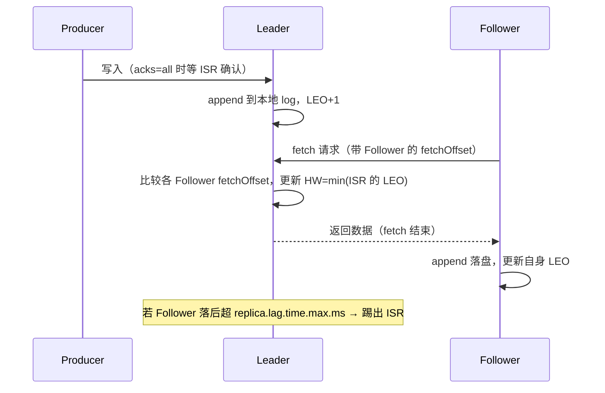
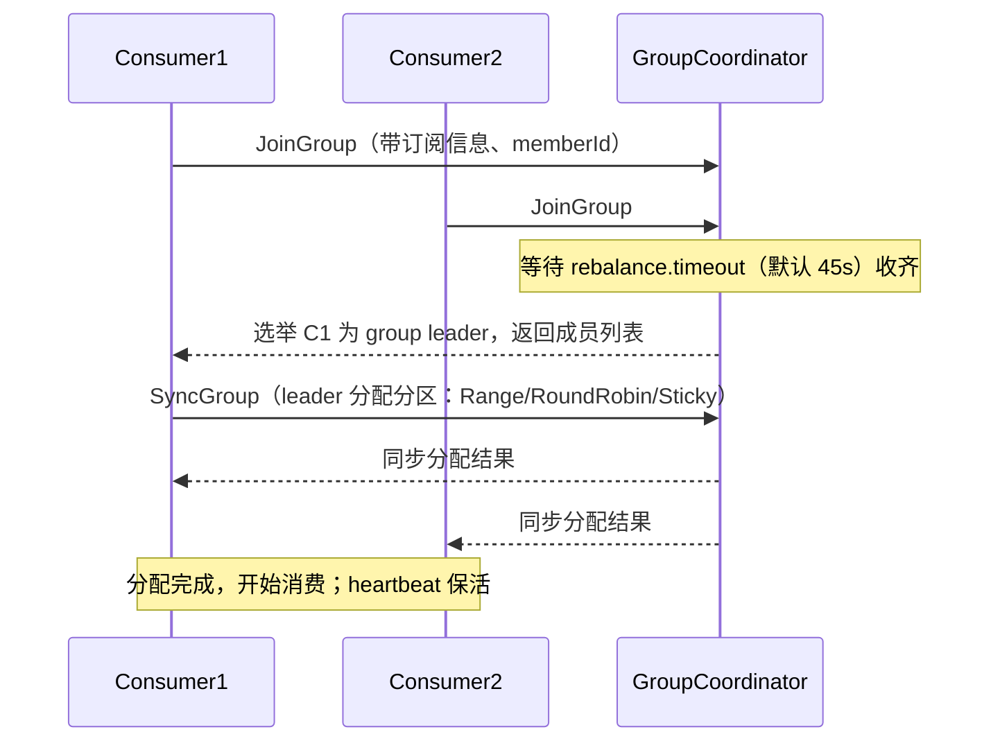

# Kafka 源码精读

## 〇、本体介绍

**Kafka** 是高吞吐分布式流平台：producer → broker（topic/partition） → consumer group。源码设计核心是**顺序写盘、零拷贝、批量、页缓存**，把磁盘当「带索引的顺序日志」用，反而极快。

**为什么读源码**：理解「为什么能扛百万 TPS」「ISR 怎么保不丢不重复」「消费组再平衡」「积压怎么来」——这些都是消息中间件面试与线上排障的核心。

**核心概念**：topic / partition（有序日志）、replica（leader/follower）、ISR（In-Sync Replicas）、offset、consumer group、HW（High Watermark）/ LEO（Log End Offset）。

---

## 一、整体架构与文件存储

- **Topic = 多 Partition**，Partition 是**只追加的有序日志**，分布在各 broker。
- **分段存储**：每个 partition 目录下按 `log segment`（默认 1GB）切分，配 `.index`（位移索引）/ `.timeindex`（时间索引），用**二分 + 稀疏索引**快速定位消息。
- **顺序写 + 页缓存**：producer 顺序追加，OS page cache 吸收写；broker 几乎不自己管缓存，借 OS。

### 1.1 深挖：LogSegment 结构与索引文件

```text
partitions/topic-0/
├── 00000000000000000000.log        # 消息数据，消息格式含 CRC/头/体
├── 00000000000000000000.index      # 位移索引（稀疏）
├── 00000000000000000000.timeindex  # 时间索引
└── 00000000000000368769.log        # 滚动到下一个段（以 baseOffset 命名）
```

- **索引条目**：`.index` 每行 8 字节（4B 相对 offset + 4B 相对 position），**稀疏**（默认每 4KB 消息记一条），段内再**二分查找**——内存友好、定位 O(log n)。
- **读取路径**：消费指定 offset → `findSegment(baseOffset)` → 二分 `.index` 得大致 position → 从 `.log` 顺序扫描几跳到目标消息。
- **滚动与清理**：段写满 1GB 或超 `segment.ms` 滚动新段；清理按段粒度（`log.retention.hours/bytes` 删整段），所以**删除是整段删**，成本低。


---

## 二、零拷贝（sendfile）

- 消费时 broker 把日志从磁盘发到网络：传统 read+write 要 4 次拷贝；Kafka 用 **`sendfile`/`transferTo`（零拷贝）**，数据在内核态直接从文件到 socket，省 2 次拷贝与上下文切换，**Netty/中间件通用技巧**（见 网络 / Netty 文档）。
- 配合 **page cache**：热数据在页缓存时连磁盘 IO 都省了——「Kafka 重启后消费变慢」就是页缓存冷了的正常现象。

---

## 三、副本与 ISR（高可用核心）

- 每 partition 有 1 个 **leader**（处理读写） + 多个 **follower**（从 leader 拉取同步）。
- **ISR**：「与 leader 保持同步（差距在 replica.lag.time.max.ms 内）」的副本集合。只有 ISR 内的副本有资格被选举为新 leader。
- **ACK 与可靠性**：`acks=0`（不等，可能丢）、`acks=1`（leader 写就回，leader 挂可能丢）、`acks=all`（ISR 全写才回，最稳，配合 min.insync.replicas）。
- **HW / LEO**：LEO 是每个副本日志末端；HW 是「ISR 都复制到的位置」，consumer 只能读到 HW 之前——保证故障切换后不读到未同步数据（避免消息丢失/回退）。
- **Leader Epoch**（0.11+）：用 epoch 替代 HW 防「数据丢失/截断」边界问题（之前靠 HW 在极端情况会丢/重）。

### 3.1 深挖：副本同步与 HW 更新流程（读源码的核心链路）



- **HW 推进**：由 **leader 侧**在收到 follower fetch 请求时计算：`HW = ISR 内最小 LEO`；HW 推进后 consumer 才能读到新消息——这就是「写入有延迟可见」的机制。
- **ISR 维护**：leader 后台线程定期检查各 follower 的 `lastCaughtUpTimeMs`，超时（默认 10s）移出 ISR；恢复后重新加入。
- **副本拉取**（区别于推送）：follower 主动 fetch，天然自适应消费能力；`replica.fetch.wait.max.ms` 控制拉取频率（默认 500ms）。

---

## 四、Producer：批量与压缩

- **批量发送**（linger.ms + batch.size）：攒一批再发，摊薄网络与请求开销，吞吐关键。
- **压缩**（snappy/gzip/lz4/zstd）：减少网络与磁盘。
- **幂等 Producer**（`enable.idempotence`）：PID + 序列号，broker 去重，解决单分区**重试导致的重复**（非跨分区/跨会话）。
- **事务**：`transactional.id` 实现「精确一次（EOS）」跨分区写入。

### 4.1 深挖：Producer 内存池与发送路径（Kafka 客户端源码）

```text
1. send() → RecordAccumulator：按 topic-partition 找/建批次（Deque<ProducerBatch>）
2. 内存池 MemoryPool（默认 32MB 固定块，无 GC 碎片）：
   - 每批次分配 16KB 大小的 ByteBuffer（batch.size 默认 16KB）
   - 发完归还缓冲池复用（避免频繁 new byte[] → GC）
3. 满足条件触发发送：批次满 / linger.ms 到 / 达到 max.in.flight
4. Sender 线程（单线程循环）取批次 → 序列化 → 发 broker → 处理响应
```

> **为什么 Producer 内存池重要**：频繁创建 16KB 缓冲会导致 GC 抖动；Kafka 用「固定块 + 池复用」把 GC 压到最低——这也是「中间件为性能抠内存」的经典样本。

- **inflight 与顺序**：`max.in.flight.requests.per.connection=5`（幂等开启后）允许乱序重试不重复；未开幂等时设 1 保顺序。
- **分区选择**：有 key → `murmur2(key) % 分区数`；无 key → `sticky partitioner`（粘性：尽量复用同一分区攒批，再随机切换，提高批大小）。

---

## 五、Consumer Group 与再平衡

- **消费模型**：group 内多 consumer 按 partition 分配；**一个 partition 同一时刻只被组内一个 consumer 消费**（保证顺序）。
- **offset 提交**：存 `__consumer_offsets` topic；自动/手动提交，手动更可控防重复/丢失。
- **Rebalance（再平衡）**：成员变化/订阅变更时重新分配 partition。老协议（stop-the-world，全组暂停）；新 **Cooperative Sticky**（增量、尽量不动）。
- **消费积压**：partition 数少 / 消费慢 / rebalance 频繁 → lag 涨；扩容 consumer（≤ partition 数）、优化处理逻辑。

### 5.1 深挖：GroupCoordinator 与再平衡流程（Broker 端）

- **协调者（GroupCoordinator）**：每个 broker 上运行，负责组成员管理、offset 存储、再平衡决策；group 按 `hash(groupId) % 分区数` 映射到 `__consumer_offsets` 的某个分区，由该分区 leader broker 担任协调者。



- **心跳与踢出**：consumer 每 `heartbeat.interval.ms` 发心跳；超过 `session.timeout.ms` 无心跳 → 触发再平衡；消费处理超 `max.poll.interval.ms`（默认 5 分钟）未 poll → 判为「失活」踢出组。
- **offset 提交**：`OffsetCommitRequest` 写 `__consumer_offsets`（key = group + topic + partition，value = offset + metadata）；消费起点查找：`max.poll` 默认从 group 最早/最新（`auto.offset.reset`）开始。
- **静态成员**（`group.instance.id`）：成员身份不随 session 超时丢失，实例重启不触发全组再平衡——解决「重启风暴」。

---

## 六、Controller 与元数据

- 集群选一个 broker 为 **Controller**，负责 partition leader 选举、副本分配、通知；借助 ZooKeeper（旧）/ KRaft（新，去 ZK，自带元数据 quorum）。

### 6.1 深挖：Controller 职责与 Leader 选举

- **Controller 选举**：旧版靠 ZK 临时节点（`/controller`，谁创建成功谁是）；KRaft 用 Raft 选 controller quorum。
- **职责**：处理 broker 上线/下线 → 为该 broker 上的分区选新 leader（从 ISR 选）、触发分区重新分配、更新集群元数据并广播给所有 broker。
- **unclean 选举**：ISR 全挂时若 `unclean.leader.election.enable=true`，可从 OSR（不同步副本）选 leader → 保证可用但**丢已确认消息**；默认 false（保数据弃可用）。

---

## 七、生产实践：从源码看常见故障

1. **页缓存冷启动消费变慢**：重启后 page cache 空，读全部走磁盘 → 预热 topic 或接受短期降速；别误判为故障。
2. **刷盘策略**：`log.flush.interval.messages` 默认极宽松（依赖 OS 刷盘）+ `flush.ms`；`acks=all` 也不等于立刻 fsync——极端断电可能丢「已确认但未落盘」数据，金融场景需权衡。
3. **ISR 反复进出 / 换 leader 风暴**：磁盘慢、网络抖动、GC 长暂停 → follower 追不上被踢出 ISR；监控 `UnderReplicatedPartitions` 与 `LeaderElectionRate`。
4. **消费组「再平衡风暴」**：某消费者处理慢被踢 → 全组重平衡 → 暂停消费 → 积压 → 更慢 → 恶性循环；治本：处理提速 + 调大 `max.poll.interval.ms` + 静态成员。
5. **分区不均导致热点**：key 分布倾斜 → 单分区打满；用分区器或换 key 设计。
6. **磁盘写满**：`log.retention.bytes` 超限且 `log.retention.check.interval.ms` 未及时清理 → 按 topic 单独设 retention 并监控磁盘。
7. **副本同步积压**：`KafkaController` 分区重分配、磁盘 IO 瓶颈 → follower 长期滞后，ISR 收缩；先查磁盘 IO 与网络。

---

## 八、与其他板块的关系

- **中间件 / MQ**：Kafka 是消息队列一员，与 RabbitMQ/Pulsar/RocketMQ 对比（见 基础知识/中间件）。
- **源码系列 / RocketMQ**：同为 MQ，副本/事务/消费模型对比。
- **网络 / Netty**：零拷贝、IO 多路复用思想通用。
- **基础知识 / 大数据**：Flink/Spark 常以 Kafka 为源（见 大数据/08-Flink）。
- **场景设计 / 消息积压**：lag 与再平衡的治理在「MQ.md」与「基础知识/中间件/Kafka」有配套。

---

## 九、速查表

| 概念 | 作用 |
|------|------|
| Partition | 并行单位、有序日志 |
| LogSegment | 1GB 分段 + 稀疏索引二分定位 |
| ISR | 同步副本集，选举资格 |
| acks=all | 不丢（最稳） |
| HW/LEO | 可见位点、防回退 |
| Leader Epoch | 修 HW 边界 bug |
| sendfile | 零拷贝发消息 |
| Rebalance | 消费组重分配 |
| MemoryPool | Producer 缓冲池免 GC |
| GroupCoordinator | 成员管理与再平衡 |

---

## 面试高频问题（30+ 条）

1. **Kafka 为什么高吞吐？** 顺序写盘、页缓存、零拷贝、批量、压缩。
2. **为什么顺序写比随机写快？** 顺序 IO 贴近磁盘最优、减寻道；OS 预读/缓存友好。
3. **零拷贝是什么、Kafka 怎么用？** sendfile/transferTo 内核态直传，省拷贝与切换。
4. **topic/partition 关系？** topic 逻辑主题，partition 是并行有序日志，分布各 broker。
5. **partition 内有序吗？** 同一 partition 内按 append 有序；跨 partition 不保证。
6. **ISR 是什么？** 与 leader 同步的副本集合，才有资格当选新 leader。
7. **acks 三个值区别？** 0 不确认(快易丢)、1 leader 写回、all ISR 全写(稳)。
8. **HW 和 LEO？** LEO 副本末端；HW 是 ISR 同步到的可见位点，consumer 只读 HW 前。
9. **为什么用 HW 不直接用 LEO？** 防故障切换后读到未同步数据（丢/回退）。
10. **Leader Epoch 解决什么？** 替代 HW 修复极端下数据丢失/截断边界问题。
11. **Producer 怎么保不重复？** 幂等（PID+序列号去重）+ 事务（EOS 精确一次）。
12. **幂等 Producer 局限？** 单分区、单会话；跨分区/重启需用事务。
13. **Producer 内存池怎么避免 GC？** 固定 16KB 块 + 复用归还，减少频繁分配。
14. **无 key 消息怎么分区？** Sticky Partitioner：尽量复用分区攒大批，减少小请求。
15. **消费组怎么分配 partition？** 组内按策略分配，一 partition 同时只被一个 consumer 消费。
16. **offset 存在哪？** __consumer_offsets 内部 topic，按 group 哈希分片。
17. **Rebalance 是什么、影响？** 成员/订阅变时重分配，老协议全组暂停；用 Cooperative 增量。
18. **协调者怎么定位？** hash(groupId) 映射 __consumer_offsets 分区，其 leader broker 即协调者。
19. **消费处理慢会怎样？** 超 max.poll.interval.ms 被判失活踢出 → 再平衡 → 可能反复风暴。
20. **消费积压怎么处理？** 扩 consumer(≤partition数)、优化逻辑、加 partition。
21. **为什么 consumer 数不能超 partition 数？** 多出的 consumer 分不到 partition，闲置。
22. **Kafka 怎么保证不丢消息？** acks=all + min.insync.replicas + producer 重试 + 消费者手动提交。
23. **Kafka 怎么保证不重复消费？** 幂等 producer + 消费端幂等（业务去重/事务）。
24. **Controller 作用？** 选 leader、副本分配、通知；旧靠 ZK，新 KRaft 去 ZK。
25. **unclean 选举是什么？** ISR 全挂时允许从 OSR 选 leader，保可用弃数据；默认关。
26. **消息怎么定位读取？** findSegment 二分 → .index 稀疏二分 → .log 顺序扫到目标。
27. **段删除为什么便宜？** 按段粒度整段删，不做逐条删。
28. **Kafka 和 RabbitMQ 区别？** Kafka 高吞吐日志流、持久、消费组；RabbitMQ 低延迟路由、复杂 Exchange。
29. **Kafka 和 Pulsar 区别？** Kafka 存算耦合；Pulsar 分层（BookKeeper 存、Broker 算），见 Pulsar 文档。
30. **副本同步是推还是拉？** 拉：follower 主动 fetch，自适应、天然限速。
31. **ISR 收缩的原因？** follower 落后超 replica.lag.time.max.ms：磁盘慢/网络抖动/GC 长暂停。
32. **再平衡风暴怎么治？** 处理提速、调大 max.poll.interval.ms、静态成员 group.instance.id。
