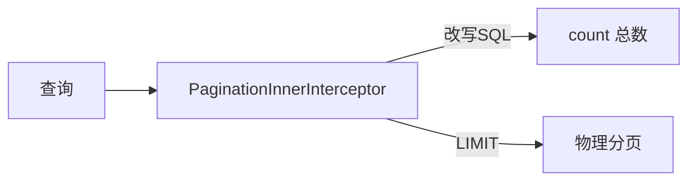

# MyBatis-Plus 核心源码要点

> MyBatis-Plus（MP）在 MyBatis 之上增强，提供通用 Mapper、条件构造器、分页插件、逻辑删除等，大幅减少样板代码。本文解析其核心扩展机制。

## 1. 核心能力

| 能力 | 说明 |
| --- | --- |
| 通用 Mapper | 继承 `BaseMapper<T>` 即得 CRUD |
| 条件构造器 | `QueryWrapper` / `LambdaQueryWrapper` |
| 分页插件 | `PaginationInnerInterceptor` |
| 逻辑删除 | 注解 + 自动加条件 |
| 自动填充 | 创建/更新时间 |
| 代码生成 | `AutoGenerator` |

## 2. 启动注入

MP 通过 `MybatisSqlSessionFactoryBean` 与 `GlobalConfig` 注入：

```java
@Bean
public MybatisPlusInterceptor mybatisPlusInterceptor() {
    MybatisPlusInterceptor i = new MybatisPlusInterceptor();
    i.addInnerInterceptor(new PaginationInnerInterceptor(DbType.MYSQL));
    return i;
}
```

- `MybatisPlusInterceptor` 持有多个 `InnerInterceptor`（责任链）。
- 拦截 `Executor` 的 `query/update`，织入增强逻辑。

## 3. 通用 Mapper 原理

- `BaseMapper<T>` 定义 `insert/deleteById/selectById/updateById/selectList` 等。
- 启动时 `AutoSqlInjector` 把这些方法的 SQL 注入到 MyBatis 的 `MappedStatement`。
- 表名/字段名通过实体 `@TableName` / `@TableField` 反射获取。

```java
public interface UserMapper extends BaseMapper<User> {}
// 直接 userMapper.selectById(1);
```

## 4. 条件构造器

```java
List<User> list = userMapper.selectList(
    new LambdaQueryWrapper<User>()
        .eq(User::getAge, 18)
        .like(User::getName, "张")
        .orderByDesc(User::getCreateTime)
);
```

- `AbstractWrapper` 把条件拼成 SQL 片段。
- Lambda 形式避免硬编码字段名（编译期检查）。

## 5. 分页插件



- 拦截查询，自动执行 `count` 并改写 `select ... limit ?,?`。
- 不同数据库方言（DbType）生成不同分页 SQL。

## 6. 逻辑删除

```java
@TableLogic
private Integer deleted;
```

- 查询自动加 `where deleted=0`。
- 删除变 `update ... set deleted=1`。
- 避免物理删除误伤。

## 7. 自动填充

```java
@TableField(fill = FieldFill.INSERT)
private LocalDateTime createTime;
// 实现 MetaObjectHandler 填充
```

- 插入/更新时自动赋值，减少手动 set。

## 8. 雪花 ID

- `@TableId(type = IdType.ASSIGN_ID)` 用雪花算法生成分布式 ID。
- 避免数据库自增在分库分表时的冲突。

## 9. 常见坑

| 坑 | 现象 | 对策 |
| --- | --- | --- |
| 字段名不匹配 | SQL 报错 | 用 @TableField 映射 |
| 分页失效 | 全表查 | 注册分页插件 |
| 逻辑删除误用 | 数据丢失 | 确认字段 |
| Wrapper 套娃 | 复杂难读 | 适度拆分 |

## 10. 面试题

1. MP 通用 Mapper 如何生成 SQL？
2. 分页插件的原理？
3. 逻辑删除如何生效？
4. LambdaWrapper 相比 String 的好处？
5. 自动填充如何实现？

## 11. 小结

MyBatis-Plus 通过 `InnerInterceptor` 责任链 + SQL 注入器 + 条件构造器，在 MyBatis 上做非侵入增强。核心是理解插件拦截链与通用 Mapper 的 SQL 注入时机。
