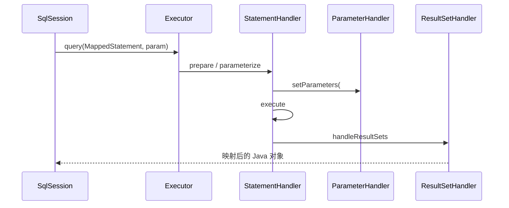
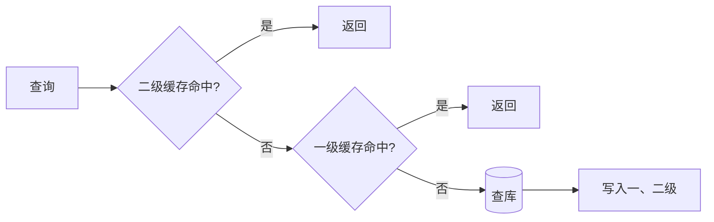

# MyBatis 源码解析（面试高频）

> MyBatis 是「半自动 ORM」：你写 SQL，它负责参数映射与结果集转换。面试里几乎必问 **执行链路（四大组件）、一级/二级缓存、插件机制、与 Spring 整合**。本文按源码主线串起来。
>
> 源码仓库：[mybatis/mybatis-3](https://github.com/mybatis/mybatis-3)（SQL Mapper Framework for Java，Apache-2.0，6000+ commits，仍在活跃维护）。

---

## 一、整体架构与启动流程

### 1.1 六大核心组件

```
SqlSession (门面)
   └─ Executor (执行器/大脑)
        ├─ StatementHandler (建 & 执行 Statement)
        │     ├─ ParameterHandler (参数绑定 #{} → PreparedStatement)
        │     └─ ResultSetHandler (结果集 → Java 对象)
        └─ TypeHandler (Java 类型 ↔ JDBC 类型)
```

- **SqlSession**：面向应用的门面，负责发 SQL、取映射结果、管事务。
- **Executor**：真正执行 SQL 的核心，负责调度四大 Handler、管理事务与缓存。
- **StatementHandler / ParameterHandler / ResultSetHandler**：分别管「语句」「入参」「出参」。
- **TypeHandler**：类型转换（如 `String ↔ VARCHAR`）。

### 1.2 启动流程（构建 Configuration）

```
mybatis-config.xml / Mapper.xml
   → SqlSessionFactoryBuilder.build()
   → 解析 <environments>/<mappers> 等
   → 全局唯一 Configuration（单例）
   → SqlSessionFactory.openSession()
   → DefaultSqlSession
```

- `Configuration` 内部维护 `Map<String, MappedStatement>`（key = `namespace.id`，如 `com.x.UserMapper.selectById`），**每条 SQL 对应一个 `MappedStatement`**（含 SQL 串、`parameterType`、`resultMap`、动态 SQL 树、缓存配置）。

---

## 二、一次查询的执行链路（核心）

以 `sqlSession.selectList("com.x.UserMapper.selectById", 1L)` 为例：

```
1) Configuration.getMappedStatement(id)    取 MappedStatement
2) Executor.query(ms, param, rowBounds, ...)  ← 缓存先查这里
3) 动态 SQL：SqlNode 树 apply() 生成最终 SQL（有 <if>/<foreach> 时）
4) Configuration.newStatementHandler()
     → RoutingStatementHandler 按 StatementType 路由
        (PreparedStatementHandler / SimpleStatementHandler / CallableStatementHandler)
5) StatementHandler.prepare(connection)     创建 PreparedStatement
6) ParameterHandler.setParameters()         #{} → TypeHandler → stmt.setXXX
7) StatementHandler.query/update            执行 SQL
8) ResultSetHandler.handleResultSets()      ResultSet → 对象（支持嵌套 <association>/<collection>）
9) 返回结果
```

关键源码锚点：

```java
// SimpleExecutor.doQuery（简化）
public <E> List<E> doQuery(MappedStatement ms, Object param, ...) {
    Statement stmt = null;
    try {
        Configuration c = ms.getConfiguration();
        StatementHandler h = c.newStatementHandler(executor, ms, param, rowBounds, resultHandler, boundSql);
        stmt = h.prepare(connection, transaction.getTimeout());  // 建 Statement
        h.parameterize(stmt);                                    // 绑参数
        return h.query(stmt, resultHandler);                     // 执行+映射
    } finally { closeStatement(stmt); }
}
```



---

## 三、Executor 的四种类型

| 类型 | 行为 | 适用 |
|------|------|------|
| `SimpleExecutor`（默认） | 每次执行新建 `PreparedStatement`，用完即关 | 语义直观、默认安全 |
| `ReuseExecutor` | 按 SQL 文本复用 `PreparedStatement` | 同 SQL 高频，降 prepare 开销 |
| `BatchExecutor` | 聚合多条 DML，走 `addBatch/executeBatch` | 大批量写；批间穿插 SELECT 会触发 flush |
| `CachingExecutor`（装饰器） | 包裹上面三者，先查二级缓存再委派 | 开启二级缓存时自动套在外层 |

> 源码结构：`Executor`（接口）→ `BaseExecutor`（抽象，管事务、一级缓存、延迟加载，留 `doQuery/doUpdate` 给子类）→ `Simple/Reuse/Batch` 三子类；`CachingExecutor` **不在继承链上**，而是装饰器（持有真实 Executor）。注意**没有 `DefaultExecutor` 这个类**——「默认执行器」指 `Configuration.newExecutor` 按配置选 SIMPLE/REUSE/BATCH 并外包 Caching。

---

## 四、一级缓存与二级缓存

### 4.1 一级缓存（Local Cache，SqlSession 级）

- **默认开启**，作用域 = 单个 `SqlSession`（`BaseExecutor.localCache`）。
- 同一 SqlSession 内相同查询直接命中；**任意增删改会清空该 SqlSession 的一级缓存**。
- 不同 SqlSession 之间**不共享**。

### 4.2 二级缓存（Namespace 级）

- **默认关闭**，需在 Mapper XML 配 `<cache/>` 或接口 `@CacheNamespace`。
- 作用域 = Mapper 的 `namespace`，**跨 SqlSession 共享**；由 `CachingExecutor` 在外层先查。
- **事务性缓冲**：查询结果在 `SqlSession` **提交（commit）后才对其他会话可见**；回滚则丢弃本地缓冲。
- 实体类须实现 `Serializable`（二级缓存可能落磁盘 / 跨网络）。
- 二级缓存用 **Builder + Decorator** 模式组装：`LoggingCache` / `SynchronizedCache` / `SerializedCache` / `LruCache` 等层层包装。



> 查询顺序：**二级 → 一级 → 数据库**。面试常坑：二级缓存「提交才可见」「脏读风险」「序列化要求」，分布式多实例下二级缓存还可能有不一致——生产常配合 Redis 或干脆关掉。

---

## 五、插件机制（Interceptor）与责任链

MyBatis 允许拦截 **Executor / StatementHandler / ParameterHandler / ResultSetHandler** 四类对象的指定方法，基于 **JDK 动态代理** 实现。

```java
@Intercepts({
  @Signature(type = StatementHandler.class, method = "prepare",
             args = {Connection.class, Integer.class})
})
public class PagingPlugin implements Interceptor {
    public Object intercept(Invocation invocation) throws Throwable {
        // 修改 SQL（如加分页）或做审计/限流/脱敏
        return invocation.proceed();
    }
}
```

- 多个拦截器按**注册顺序**形成代理链（责任链），常用如 **PageHelper**（分页）、SQL 日志打印。
- 易错点：「执行顺序不符合预期」往往与注册顺序有关；切点选错（如该拦 Executor 却拦 StatementHandler）会导致 SQL 重写时机不对。

---

## 六、#{} 与 ${} 的区别（高频送分题）

| 写法 | 处理 | 安全性 |
|------|------|--------|
| `#{}` | 解析为 `?` 占位符，`ParameterHandler` 绑定到 `PreparedStatement`（预编译） | **防 SQL 注入**，推荐 |
| `${}` | 直接 OGNL 取值、字符串替换，不经过预编译 | **有注入风险**，仅用于表名 / 排序字段等动态结构 |

---

## 七、与 Spring 整合（Mapper 动态代理）

整合关键点（也是面试高频）：

- **`MapperFactoryBean`**（实现 `FactoryBean`）：`getObject()` 返回 Mapper 接口的**代理对象**（JDK 动态代理 `MapperProxy`，实现 `InvocationHandler`）。
- **`@MapperScan`** → 导入 `MapperScannerRegistrar`（`ImportBeanDefinitionRegistrar`），扫描指定包，为**每个 Mapper 接口**注册一个 `MapperFactoryBean` 的 BeanDefinition。
- **`SqlSessionTemplate`**：Spring 托管下的 `SqlSession` 实现，线程安全，把 MyBatis 的 `SqlSession` 生命周期绑定到 Spring 事务（`TransactionSynchronizationManager`）。
- Mapper 方法被调用时，`MapperProxy.invoke()` 根据 `MapperMethod` 判定 SQL 类型（SELECT/INSERT/...），最终委派给 `SqlSessionTemplate` → `Executor` 走上面那条链路。

```mermaid
flowchart TD
    A[@MapperScan] --> B[MapperScannerRegistrar 注册 BeanDefinition]
    B --> C[MapperFactoryBean.getObject]
    C --> D[MapperProxy(JDK 动态代理)]
    D --> E[MapperMethod 判定 SQL 类型]
    E --> F[SqlSessionTemplate]
    F --> G[Executor → 四大 Handler]
```

> 读源码建议：执行链路抓 `BaseExecutor.doQuery` → `StatementHandler.prepare/parameterize/query` → `ResultSetHandler.handleResultSets`；缓存抓 `CachingExecutor` 与 `BaseExecutor.localCache`；代理抓 `MapperProxy.invoke` 与 `SqlSessionTemplate`。
