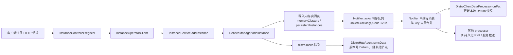
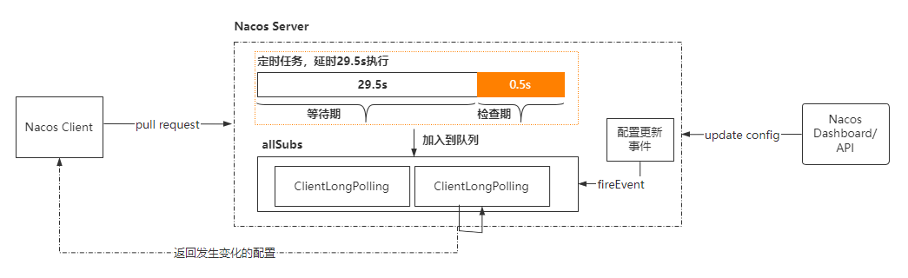
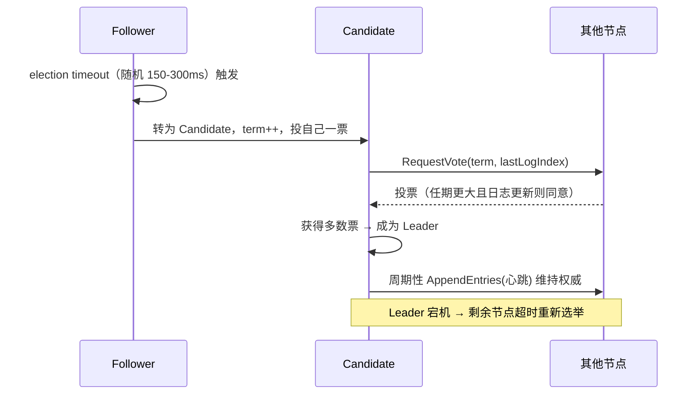
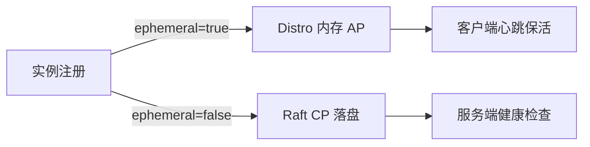

# Nacos 源码解析

## 服务的注册流程

从 Spring Boot 的自动装配说起：

```xml
<dependency>
    <groupId>com.alibaba.cloud</groupId>
    <artifactId>spring-cloud-starter-alibaba-nacos-discovery</artifactId>
</dependency>
```

这个依赖下的 `spring.factories` 中，自动装配了类：

```properties
org.springframework.boot.autoconfigure.EnableAutoConfiguration=\
  com.alibaba.cloud.nacos.discovery.NacosDiscoveryAutoConfiguration,\
  com.alibaba.cloud.nacos.ribbon.RibbonNacosAutoConfiguration,\
  com.alibaba.cloud.nacos.endpoint.NacosDiscoveryEndpointAutoConfiguration,\
  com.alibaba.cloud.nacos.registry.NacosServiceRegistryAutoConfiguration,\
  com.alibaba.cloud.nacos.discovery.NacosDiscoveryClientConfiguration,\
  com.alibaba.cloud.nacos.discovery.reactive.NacosReactiveDiscoveryClientConfiguration,\
  com.alibaba.cloud.nacos.discovery.configclient.NacosConfigServerAutoConfiguration
org.springframework.cloud.bootstrap.BootstrapConfiguration=\
  com.alibaba.cloud.nacos.discovery.configclient.NacosDiscoveryClientConfigServiceBootstrapConfiguration
```

其中，注册核心为 `NacosServiceRegistryAutoConfiguration`，它注入了 `NacosAutoServiceRegistration`。

这个类继承了 `AbstractAutoServiceRegistration`：

```java
public abstract class AbstractAutoServiceRegistration<R extends Registration>
      implements AutoServiceRegistration, ApplicationContextAware,
      ApplicationListener<WebServerInitializedEvent>
```

当完成 Spring 的容器加载后调用 `onApplicationEvent`，进入 `org.springframework.cloud.client.serviceregistry.ServiceRegistry#register`，进而调用 `com.alibaba.nacos.client.naming.NacosNamingService#registerInstance(java.lang.String, java.lang.String, com.alibaba.nacos.api.naming.pojo.Instance)`：

```java
public void registerInstance(String serviceName, String groupName, Instance instance) throws NacosException {
    //心跳默认是5s一次执行，rest接口发送
    if (instance.isEphemeral()) {
        BeatInfo beatInfo = new BeatInfo();
        beatInfo.setServiceName(NamingUtils.getGroupedName(serviceName, groupName));
        beatInfo.setIp(instance.getIp());
        beatInfo.setPort(instance.getPort());
        beatInfo.setCluster(instance.getClusterName());
        beatInfo.setWeight(instance.getWeight());
        beatInfo.setMetadata(instance.getMetadata());
        beatInfo.setScheduled(false);
        beatInfo.setPeriod(instance.getInstanceHeartBeatInterval());
        this.beatReactor.addBeatInfo(NamingUtils.getGroupedName(serviceName, groupName), beatInfo);
    }
    //注册服务 rest接口
    this.serverProxy.registerService(NamingUtils.getGroupedName(serviceName, groupName), groupName, instance);
}
```

## 客户端发现

一样依靠了 Spring Boot 的自动装配了这个类 `NacosDiscoveryClientConfiguration`，这个类中加载了 `com.alibaba.cloud.nacos.discovery.NacosWatch`。

这个类核心继承了 `org.springframework.context.SmartLifecycle`（extends `org.springframework.context.Lifecycle`）：

```java
public interface Lifecycle {
    void start();

    void stop();

    boolean isRunning();
}
```

```java
@Override
public void start() {
   if (this.running.compareAndSet(false, true)) {
      this.watchFuture = this.taskScheduler.scheduleWithFixedDelay(
            this::nacosServicesWatch, this.properties.getWatchDelay());
   }
}
private long watchDelay = 30000;
```

## 如何支持高并发注册（异步任务与内存队列设计原理及源码剖析）

> 本小节省略分布式一致性协议细节（Raft 见「[ZooKeeper](zookeeper.md)」/ etcd 章节），聚焦 Nacos 1.x 服务端**注册写入的异步化设计**——这是支撑百万级服务实例注册的核心。

### 1. 整体设计：请求薄处理 + 异步队列 + 内存表

服务端注册接口只做三件事，然后立刻返回：

1. **更新内存实例表**（`ServiceManager.serviceMap`，ConcurrentHashMap）。
2. **数据变更入内存队列**（`Notifier.tasks`），由独立线程消费，串行派发给各 `DataProcessor`。
3. **节点间同步入队**（`DistroConsistencyService.distroTasks`），由 distro 线程异步发给集群其他节点。



### 2. 服务端入口与 ServiceManager

```java
// InstanceController.register() → InstanceService.addInstance → ServiceManager.addInstance
public void addInstance(String namespaceId, String serviceName, boolean ephemeral,
                        Instance... ips) throws NacosException {
    Service service = getService(namespaceId, serviceName);
    if (service == null) {
        service = createServiceIfAbsent(namespaceId, serviceName, ephemeral);
    }
    // 1. 写内存实例表（CopyOnWriteArrayList，读多写少）
    service.addInstance(ips);
    // 2. 异步化：一致性服务 put（内部入队，不阻塞请求线程）
    consistencyService.put(key, instances);
}
```

- `serviceMap` 是 `ConcurrentHashMap<String, Service>`，`Service.addInstance` 只操作**内存中的实例列表**，不落库、不加锁阻塞——请求线程的耗时是 O(1) 级，这是能扛高并发注册的第一层。
- 临时实例（ephemeral=true）走 `DistroConsistencyService`（最终一致、内存态）；持久实例走 `PersistentConsistencyService`（Raft 落盘），前者才是注册风暴的主要路径。

### 3. Notifier：内存队列 + 去重合并（注册写的核心）

```java
public class Notifier implements Runnable {
    private final BlockingQueue<Object> tasks = new LinkedBlockingQueue<>(128 * 1024);
    private final ConcurrentMap<String, String> services = new ConcurrentHashMap<>(); // key -> datumKey

    public void addTask(String datumKey, String key) {
        // 去重合并：同 key 还在队列/处理中，直接丢弃新任务
        if (services.containsKey(key) && services.get(key).equals(datumKey)) {
            return;
        }
        try { tasks.put(new NotifyTask(datumKey, key)); }
        catch (InterruptedException e) { ... }
    }

    @Override
    public void run() {              // 独立消费线程
        while (true) {
            Object task = tasks.take();        // 阻塞取
            if (task instanceof NotifyTask) {
                NotifyTask t = (NotifyTask) task;
                process(t);                    // 串行派发
            }
        }
    }
}
```

**为什么能支持高并发注册？** 关键在于「合并」：

- 100 万实例同时注册同一服务，`addTask` 先检查 `services` 里该 key 是否已有**未处理**任务，有则直接 return——**只有第一个请求真正入队**。
- 队列容量 128K，入队失败（满）会走 `NacosException` 快速失败，而不是无限堆积打垮内存。
- 消费线程是单线程，串行调用各 `DataProcessor.onPut`，天然规避并发写实例表的问题；`onPut` 内部处理的是**最新快照**而非增量数据，所以"丢弃中间任务"不会丢信息。

### 4. DistroConsistencyService：本地 onPut + 异步集群同步

```java
public void put(String key, Record value) throws NacosException {
    onPut(key, value);   // 1. 先更新本节点
    distroTasks.offer(Datum.create(key, value.increaseVersion(), timestamp)); // 2. 入同步队列
}
```

- `Datum` 自带**版本号 + 时间戳**：各节点同步时先比版本，旧版本数据直接丢弃，防止网络乱序导致旧数据覆盖新数据。
- distro 任务线程轮询 `distroTasks`，把 Datum 经 `DistroHttpAgent.syncData`（HTTP POST）批量发给集群其他节点；对端 `onPut` 更新本地快照，完成**节点间最终一致**。
- 相比"每次注册都同步全量"，distro 是**合并后按 key 同步最新快照**，节点越多节省越多。

### 5. 心跳续约：把"注册"从风暴降为常态

客户端 `registerInstance` 对临时实例**只发一次注册请求**，之后每 5s 由 `BeatReactor` 发心跳：

```java
// 服务端 BeatController.beat
if (instance == null) {
    // 实例不存在（如服务端重启丢数据）→ 心跳驱动补注册
    serviceManager.registerInstance(...);   // 重新走 addInstance
} else {
    service.setLastBeat(...);               // 只更新时间戳，不触发全量同步
}
```

- 心跳是**轻量续约**：只刷新 `lastBeat`，不重新入队同步 → 即使 100 万实例同时心跳，压力也可控（每 5s 一次 vs 每次全量）。
- 服务端**主动健康检查**：`HealthCheckTask` 扫描超过 15s 未心跳的临时实例，标记不健康并从可用列表摘除——心跳断了不会永远占坑。

### 6. 面试高频

1. **Nacos 服务端如何抗住百万级注册？** 三层异步：请求只写内存表；`Notifier` 内存队列按 key 合并去重、单线程串行消费；distro 队列异步同步集群，全程不阻塞、不落库（临时实例）。
2. **为什么不落库？** 临时实例以内存态 + 集群同步为准（类似 AP 系统），重启靠心跳补注册恢复；持久实例才走 Raft 落盘。
3. **合并任务会不会丢数据？** 不会。`onPut` 处理的是 key 对应的**最新快照**，丢弃的是"中间过程"，最终值一定被处理。
4. **版本号的作用？** 防止网络乱序/延迟导致旧 Datum 覆盖新数据；同时让对端可以跳过无变化同步。
5. **心跳能替代注册吗？** 不能，但心跳能在服务端丢数据后**自动补注册**，这是 Nacos 自愈的关键。

## nacos 的配置中心功能实现

整体工作流程如下：

- 客户端发起长轮询请求
- 服务端收到请求以后，先比较服务端缓存中的数据是否相同，如果不同，则直接返回
- 如果相同，则通过 schedule 延迟 29.5s 之后再执行比较
- 为了保证当服务端在 29.5s 之内发生数据变化能够及时通知给客户端，服务端采用事件订阅的方式来监听服务端本地数据变化的事件，一旦收到事件，则触发 DataChangeTask 的通知，并且遍历 allSubs 队列中的 ClientLongPolling，把结果写回到客户端，就完成了一次数据的推送
- 如果 DataChangeTask 任务完成了数据的“推送”之后，ClientLongPolling 中的调度任务又开始执行了怎么办呢？很简单，只要在进行“推送”操作之前，先将原来等待执行的调度任务取消掉就可以了，这样就防止了推送操作写完响应数据之后，调度任务又去写响应数据，这时肯定会报错的。所以，在 ClientLongPolling 方法中，最开始的一个步骤就是删除订阅事件

通过 Spring Boot 的自动装配原理，在 `spring-cloud-starter-alibaba-nacos-config` 的 `spring.factories` 中自动装配了 `com.alibaba.cloud.nacos.NacosConfigBootstrapConfiguration`：

```java
//这个类里核心注入了 com.alibaba.cloud.nacos.NacosConfigManager，在它的构造方法中执行了 createConfigService 方法，通过 NacosFactory
//生成了核心的 ConfigService，调用 getConfig 进入到 NacosConfigService 类中 new 了一个 ClientWorker
public ClientWorker(final HttpAgent agent, final ConfigFilterChainManager configFilterChainManager, final Properties properties) {
    this.agent = agent;
    this.configFilterChainManager = configFilterChainManager;

    // Initialize the timeout parameter

    init(properties);
    //检查线程池
    executor = Executors.newScheduledThreadPool(1, new ThreadFactory() {
        @Override
        public Thread newThread(Runnable r) {
            Thread t = new Thread(r);
            t.setName("com.alibaba.nacos.client.Worker." + agent.getName());
            t.setDaemon(true);
            return t;
        }
    });
    //长轮询
    executorService = Executors.newScheduledThreadPool(Runtime.getRuntime().availableProcessors(), new ThreadFactory() {
        @Override
        public Thread newThread(Runnable r) {
            Thread t = new Thread(r);
            t.setName("com.alibaba.nacos.client.Worker.longPolling." + agent.getName());
            t.setDaemon(true);
            return t;
        }
    });
    //每10ms执行 一次
    executor.scheduleWithFixedDelay(new Runnable() {
        @Override
        public void run() {
            try {
                checkConfigInfo();
            } catch (Throwable e) {
                LOGGER.error("[" + agent.getName() + "] [sub-check] rotate check error", e);
            }
        }
    }, 1L, 10L, TimeUnit.MILLISECONDS);
}

public void checkConfigInfo() {
    // 分任务
    int listenerSize = cacheMap.get().size();
    // 向上取整为批数  默认3000个一批
    int longingTaskCount = (int) Math.ceil(listenerSize / ParamUtil.getPerTaskConfigSize());
    if (longingTaskCount > currentLongingTaskCount) {
        for (int i = (int) currentLongingTaskCount; i < longingTaskCount; i++) {
            // 要判断任务是否在执行 这块需要好好想想。 任务列表现在是无序的。变化过程可能有问题
            executorService.execute(new LongPollingRunnable(i));
        }
        currentLongingTaskCount = longingTaskCount;
    }
}
```



> 上图为服务端 `/v1/cs/configs/listener` 接口的处理示意（原为有道云笔记截图，此处保留引用）。

## doPollingConfig

这个方法主要是用来做长轮询和短轮询的判断：

1. 如果是长轮询，直接走 addLongPollingClient 方法
2. 如果是短轮询，直接比较服务端的数据，如果存在 md5 不一致，直接把数据返回

```java
public void addLongPollingClient(HttpServletRequest req, HttpServletResponse rsp, Map<String, String> clientMd5Map,
        int probeRequestSize) {

    String str = req.getHeader(LongPollingService.LONG_POLLING_HEADER);
    String noHangUpFlag = req.getHeader(LongPollingService.LONG_POLLING_NO_HANG_UP_HEADER);
    String appName = req.getHeader(RequestUtil.CLIENT_APPNAME_HEADER);
    String tag = req.getHeader("Vipserver-Tag");
    int delayTime = SwitchService.getSwitchInteger(SwitchService.FIXED_DELAY_TIME, 500);

    // Add delay time for LoadBalance, and one response is returned 500 ms in advance to avoid client timeout.
    long timeout = Math.max(10000, Long.parseLong(str) - delayTime);
    if (isFixedPolling()) {
        timeout = Math.max(10000, getFixedPollingInterval());
        // Do nothing but set fix polling timeout.
    } else {
        long start = System.currentTimeMillis();
        List<String> changedGroups = MD5Util.compareMd5(req, rsp, clientMd5Map);
        if (changedGroups.size() > 0) {
            generateResponse(req, rsp, changedGroups);
            LogUtil.CLIENT_LOG.info("{}|{}|{}|{}|{}|{}|{}", System.currentTimeMillis() - start, "instant",
                    RequestUtil.getRemoteIp(req), "polling", clientMd5Map.size(), probeRequestSize,
                    changedGroups.size());
            return;
        } else if (noHangUpFlag != null && noHangUpFlag.equalsIgnoreCase(TRUE_STR)) {
            LogUtil.CLIENT_LOG.info("{}|{}|{}|{}|{}|{}|{}", System.currentTimeMillis() - start, "nohangup",
                    RequestUtil.getRemoteIp(req), "polling", clientMd5Map.size(), probeRequestSize,
                    changedGroups.size());
            return;
        }
    }
    String ip = RequestUtil.getRemoteIp(req);

    // Must be called by http thread, or send response.
    final AsyncContext asyncContext = req.startAsync();

    // AsyncContext.setTimeout() is incorrect, Control by oneself
    asyncContext.setTimeout(0L);

    ConfigExecutor.executeLongPolling(
            new ClientLongPolling(asyncContext, clientMd5Map, ip, probeRequestSize, timeout, appName, tag));
}
public void run() {
    try {
        getRetainIps().put(ClientLongPolling.this.ip, System.currentTimeMillis());

        // Delete subsciber's relations.
        boolean removeFlag = allSubs.remove(ClientLongPolling.this);

        if (removeFlag) {
            if (isFixedPolling()) {
                LogUtil.CLIENT_LOG
                        .info("{}|{}|{}|{}|{}|{}", (System.currentTimeMillis() - createTime), "fix",
                                RequestUtil.getRemoteIp((HttpServletRequest) asyncContext.getRequest()),
                                "polling", clientMd5Map.size(), probeRequestSize);
                List<String> changedGroups = MD5Util
                        .compareMd5((HttpServletRequest) asyncContext.getRequest(),
                                (HttpServletResponse) asyncContext.getResponse(), clientMd5Map);
                if (changedGroups.size() > 0) {
                    sendResponse(changedGroups);
                } else {
                    sendResponse(null);
                }
            } else {
                LogUtil.CLIENT_LOG
                        .info("{}|{}|{}|{}|{}|{}", (System.currentTimeMillis() - createTime), "timeout",
                                RequestUtil.getRemoteIp((HttpServletRequest) asyncContext.getRequest()),
                                "polling", clientMd5Map.size(), probeRequestSize);
                sendResponse(null);
            }
        } else {
            LogUtil.DEFAULT_LOG.warn("client subsciber's relations delete fail.");
        }
    } catch (Throwable t) {
        LogUtil.DEFAULT_LOG.error("long polling error:" + t.getMessage(), t.getCause());
    }

}
//LongPollingService监听了数据变更的事件，触发事件的话会有定时任务DataChangeTask
@Override
public void run() {
    try {
        ConfigCacheService.getContentBetaMd5(groupKey);
        for (Iterator<ClientLongPolling> iter = allSubs.iterator(); iter.hasNext(); ) {
            ClientLongPolling clientSub = iter.next();
            if (clientSub.clientMd5Map.containsKey(groupKey)) {
                // If published tag is not in the beta list, then it skipped.
                if (isBeta && !CollectionUtils.contains(betaIps, clientSub.ip)) {
                    continue;
                }

                // If published tag is not in the tag list, then it skipped.
                if (StringUtils.isNotBlank(tag) && !tag.equals(clientSub.tag)) {
                    continue;
                }

                getRetainIps().put(clientSub.ip, System.currentTimeMillis());
                iter.remove(); // Delete subscribers' relationships.
                LogUtil.CLIENT_LOG
                        .info("{}|{}|{}|{}|{}|{}|{}", (System.currentTimeMillis() - changeTime), "in-advance",
                                RequestUtil
                                        .getRemoteIp((HttpServletRequest) clientSub.asyncContext.getRequest()),
                                "polling", clientSub.clientMd5Map.size(), clientSub.probeRequestSize, groupKey);
                clientSub.sendResponse(Arrays.asList(groupKey));
            }
        }
    } catch (Throwable t) {
        LogUtil.DEFAULT_LOG.error("data change error: {}", ExceptionUtil.getStackTrace(t));
    }
}

---

## 注册中心的心跳与健康检查

### 客户端心跳（BeatReactor）

在 `registerInstance` 中已看到：临时实例（ephemeral）会向 `BeatReactor` 注册一个 `BeatInfo`（默认 5s 一次）。`BeatReactor` 内部维护一个 `ScheduledExecutorService`，对每个实例提交 `BeatTask`：

```java
// BeatReactor 核心
public void addBeatInfo(String serviceName, BeatInfo beatInfo) {
    executorService.schedule(new BeatTask(beatInfo), beatInfo.getPeriod(), TimeUnit.MILLISECONDS);
}
class BeatTask implements Runnable {
    public void run() {
        // 发送 HTTP /instance/beat 心跳包
        serverProxy.sendBeat(beatInfo);
        // 按 period 续约下一次心跳（若未被停止）
        executorService.schedule(this, beatInfo.getPeriod(), TimeUnit.MILLISECONDS);
    }
}
```

- **临时实例（ephemeral=true）**：依靠客户端心跳保活；服务端超过 `getIPDeleteTimeout()`（默认 30s，约 6 次心跳）未收到心跳则剔除实例。
- **持久实例（ephemeral=false）**：由服务端主动发起**健康检查**（TCP / HTTP / MySQL 探活），不依赖客户端心跳。

### 服务端健康检查

服务端 `HealthCheckTask` 周期性扫描实例最后心跳时间，超时则置为不健康并从可用列表移除（对临时实例直接剔除）。持久实例通过 `HealthCheckProcessor` 异步探测并回写健康状态。

### 一致性协议：Distro（AP）与 Raft（CP）

| 维度 | Distro（AP，默认） | Raft（CP，元数据/配置/持久实例） |
|------|-------------------|----------------------------------|
| 适用数据 | 临时服务实例 | 配置、命名空间、持久实例 |
| 一致性 | 最终一致 | 强一致 |
| 选主 | 无（每个节点平等） | 有 Leader |

## 配置中心长轮询（客户端视角）

服务端 `addLongPollingClient` / `DataChangeTask` 已在上方分析。客户端侧由 `ClientWorker` 的 `LongPollingRunnable` 驱动：

```java
class LongPollingRunnable implements Runnable {
    public void run() {
        try {
            // 1. 检查本地缓存 md5，是否有变更
            checkLocalConfigInfo();
            // 2. 向服务端 /v1/cs/configs/listener 发起长轮询，带上本地 md5Map
            List<String> changedGroups = checkUpdateDataIds(cacheDataMap, inInitializingCacheList);
            // 3. 服务端返回变更 groupKey，客户端拉取最新配置
            for (String groupKey : changedGroups) {
                getServerConfig(dataId, group, tenant);
                localConfigInfoProcessor.save(dataId, group, tenant, content);
            }
        } finally {
            // 4. 无论是否变更，立即再发起下一次长轮询（循环监听）
            executorService.schedule(this, 0, TimeUnit.MILLISECONDS);
        }
    }
}
```

要点：客户端把本地配置 md5 摘要随长轮询请求上报，服务端比对缓存 md5；有变更立即返回，无变更则 hold 最长 ~30s（29.5s + 500ms 提前量）后超时返回，客户端重新发起——实现**准实时推送 + 低开销**。

## Nacos 的 Raft 选主（CP 模式）

Nacos 的 CP 数据（配置、持久实例）基于 Raft 实现（新版使用 SOFA-JRaft）。核心类 `RaftCore` 维护节点状态机：

- **角色**：`LEADER` / `CANDIDATE` / `FOLLOWER`，由 `RaftPeer.state` 表示。
- **Term（任期）**：单调递增，每次选举自增；所有 RPC 都携 `term`，发现对方 term 更大则退为 FOLLOWER。
- **选举流程**：



- **日志复制**：客户端写请求经 Leader，`RaftCore` 先将操作追加到本地 `Log`（文件 + 内存），再广播 `AppendEntries` 给 Follower，收到多数 ACK 后 `commit` 并应用到状态机（`Datum` 内存表 + 落盘）。
- **成员变更 / 数据恢复**：`RaftPeerSet` 管理集群节点，`RaftStore` 负责 Raft 日志与快照的持久化（故障重启后 replay 恢复）。

> 理解 Nacos 一致性要分清「注册中心（AP/Distro，可用优先）」与「配置中心（CP/Raft，一致优先）」两套协议并存的设计，这正是 Nacos 相对 Eureka/Apollo 的差异化点。

## Nacos 与 Eureka / Apollo 对比

| 维度 | Nacos | Eureka | Apollo |
|------|-------|--------|--------|
| 定位 | 注册中心 + 配置中心 一体 | 仅注册中心 | 仅配置中心 |
| 一致性 | 注册 AP（Distro）/ 配置 CP（Raft） | AP（Peer 复制，弱一致） | CP（数据库 + 配置发布） |
| 配置推送 | 长轮询（准实时） | 无 | 长轮询 + 客户端定时拉取 |
| 健康检测 | 心跳（临时）/ 服务端探测（持久） | 客户端心跳 + 自我保护 | — |
| 动态刷新 | 支持 `@RefreshScope` | 不支持 | 支持 |
| 管理界面 | 自带 | 无（需第三方） | 自带，功能丰富 |
| 生态 | Spring Cloud Alibaba | Spring Cloud Netflix | 独立，多语言客户端 |

> 小结：Nacos 用「一套底座同时支撑注册与配置」，并允许按场景在 AP/CP 间取舍（注册走 AP 保证可用，配置走 CP 保证一致），这是其相对 Eureka（纯 AP）、Apollo（纯配置）的核心优势。

---

## 一、配置变更服务端发布链路（发布侧）

前文详细看了客户端 `ClientWorker` 长轮询与服务端 `addLongPollingClient`/`DataChangeTask` 的「hold 住再通知」机制，这里补上**服务端内部是如何把一次配置发布事件驱动到 LongPollingService 的**：

1. 控制台/OpenAPI 调 `ConfigController.publishConfig` → `ConfigOperationService.publishConfig`。
2. 写持久化存储（外置 DB，如 `config_info` 表），并调用 `ConfigChangePublisher` 发布 `ConfigDataChangeEvent`。
3. `NotifyCenter` 是 Nacos 的事件总线（基于 `LinkedBlockingQueue` + 独立线程 `NotifySingleService`），把事件分发给订阅者 `DumpService`：

```java
// NotifyCenter 发布
NotifyCenter.publishEvent(new ConfigDataChangeEvent(dataId, group, tenant, time));
// DumpService 监听：把最新配置 dump 到磁盘缓存并触发长轮询通知
class DumpConfigChangeEventListener implements Subscriber<ConfigDataChangeEvent> {
    public void onEvent(ConfigDataChangeEvent event) {
        dumpService.dump(event.dataId, event.group, event.tenant, ...); // 落本地磁盘
        // dump 完成后其内部会调 LongPollingService 的 DataChangeTask（前文已述）
    }
}
```

4. `LongPollingService` 收到变更 → 遍历 `allSubs` 中匹配 `groupKey` 的 `ClientLongPolling` → `sendResponse` 立即返回（即前文「in-advance」提前返回）。

> 关键设计：`NotifyCenter` 解耦了「配置写入」与「配置推送」，发布侧只需发事件，推送侧（长轮询）异步消费，避免同步推送阻塞写请求。生产若推送延迟，优先查 `NotifyCenter` 消费线程是否堆积。

## 二、临时实例 vs 持久实例（源码视角）

Nacos 注册中心对实例做了 AP/CP 双模型：

| 维度 | 临时实例（ephemeral=true，默认） | 持久实例（ephemeral=false） |
|------|--------------------------------|---------------------------|
| 注册存储 | `Distro` 内存 + 异步拷贝各节点 | Raft（JRaft）+ 落盘 |
| 健康方式 | 客户端心跳保活 | 服务端主动健康检查 |
| 宕机处理 | 超时剔除（默认 30s） | 标记不健康，不自动删 |
| 适用 | 普通微服务（容忍最终一致） | 需强一致 / 不可丢的元数据 |

- **服务端实例管理**：`ClientManager`（如 `EphemeralClientManager`）按 `connectionId` 维护客户端连接与注册的实例；临时实例随连接断开（心跳超时）被 `ExpiredClientCleaner` 清理。
- **持久实例注册**：走 `PersistentService` / Raft 状态机，注册信息写 `instance` 表并 raft replicate，服务端通过 `HealthCheckTask` 用 TCP/HTTP/MySQL 探活。
- **一致性切换**：`consistencyService` 根据 `ephemeral` 选择 `DistroConsistencyServiceImpl` 或 `RaftConsistencyServiceImpl`（CP 模式需以「集群模式 + 配置持久化开关」开启）。



## 三、CMDB 模块与就近路由

Nacos 内置 **CMDB（Configuration Management Database）** 模块，用于「按机房/地域就近调用」：

- `CmdbManager` 加载 IP → 机房（`idc`）、城市、运营商等标签；标签可来自本地 `nacos-cmdb` 插件或外部 CMDB 系统。
- 服务发现时 `ServiceInfo` 携带实例的 `cluster`/`idc` 信息；`Selector` 可通过 `HealthOrWeight` / 自定义 `Selector` 实现「同机房优先」。
- 控制台可配置 `CMDB` 标签与「就近路由规则」，Nacos 客户端订阅时在 `HostReactor` 中按标签做过滤/排序。

> 生产价值：多机房部署下避免跨机房调用延迟；配合权重实现「本机房优先、跨机房兜底」。

## 四、Nacos 与 Consul 对比（补 Eureka 之外）

除前文 Eureka/Apollo 外，常拿来对标的是 HashiCorp **Consul**：

| 维度 | Nacos | Consul |
|------|-------|--------|
| 注册/配置 | 一体 | 一体（KV 做配置） |
| 一致性 | 注册 AP / 配置 CP 可切换 | 基于 Raft 的 CP |
| 健康检查 | 心跳 / 服务端探测 | 多种（HTTP/TCP/gRPC/script）+ 服务端主动 |
| 服务发现协议 | 私有 HTTP + Distro | 支持 DNS / HTTP / gRPC |
| 多语言 | Java 为主（有 sidecar 思路） | 多语言原生友好（Go 写，DNS 接入） |
| 配置推送 | 长轮询（准实时） | 阻塞查询（blocking query）+ watch |
| 生态 | Spring Cloud Alibaba 深度整合 | K8s / 云原生（Consul Connect 服务网格） |

> 选型：国内 Spring Cloud Alibaba 栈首选 Nacos；若已是 Go / 多语言 / 云原生体系，Consul 的 DNS 服务发现与多语言友好性更合适。

## 五、生产踩坑与调优

1. **长轮询超时与客户端线程池**：客户端 `ClientWorker` 的 `executorService` 线程数 = CPU 核数，监听的配置项（listener）很多时会成批（`PerTaskConfigSize` 默认 3000）起长轮询任务；配置项超万级需关注线程打满。
2. **临时实例心跳丢失导致大面积剔除**：网络抖动若让多数实例心跳超时，Nacos 会批量剔除实例造成「雪崩式不可用」。可开启**服务端自我保护**（类似 Eureka）或调大 `ipDeleteTimeout`。
3. **配置中心强一致下的写性能**：CP 模式（Raft）每次配置发布需多数派确认，高频发布会成为瓶颈；配置发布应「批量 + 低频」，勿用配置中心当高频动态参数通道。
4. **Distro 数据不一致**：节点扩缩容 / 网络分区后，Distro 异步拷贝可能短暂不一致，`/nacos/v1/ns/operator/distroStatus` 可查各节点数据差异，必要时手动重新校验。
5. **namespace / group / dataId 命名规范**：混乱的命名会导致权限与灰度失控；建议 `namespace=环境（dev/test/prod)`，`group=应用组`，`dataId=应用名.properties`。
6. **集群部署必须奇数节点**：Raft 选主依赖多数派，3/5 节点为底线，且需独立部署避免与业务同机争资源。

---

## 六、Nacos 2.x 的 gRPC 长连接（对比 1.x）

Nacos 1.x 注册/配置均走 HTTP 短轮询/长轮询，2.x 引入**gRPC 长连接**（默认端口 9848 = 主端口+1000），核心变化：

- 注册/心跳/配置监听改用**双向流式 gRPC**（`Request/Response` 流式通道），服务端可主动 Push（如配置变更、实例上下线），不再依赖客户端长轮询 hold 住线程——服务端资源占用大幅下降。
- 客户端 `RpcClient` 维护一条长连接，内部自动重连、健康检查（`HealthCheckRequest`）；断连后客户端本地缓存兜底，重连后增量同步。
- 配置监听：`ConfigChangeNotifyRequest` 由服务端直接推到长连接，客户端 `ClientWorker` 收到后即时刷新，延迟从「秒级（长轮询 ~30s 上限）」降到「毫秒级」。
- 兼容：2.x 仍保留 8848 HTTP 端口以兼容 1.x 客户端与 OpenAPI，但新客户端优先走 gRPC。

> 升级建议在服务端开启 `nacos.core.protocol.grpc` 并确认防火墙放行 9848/9849；长连接模式下「网络抖动导致连接闪断」比 1.x 更敏感，需关注 `RpcClient` 重连频率。

---

## 七、配置灰度（Beta 发布）与监听隔离

Nacos 控制台支持 **Beta 发布**：配置可先指定「灰度 IP / Tag」生效，仅这些客户端拉到新值，验证无误再全量发布，出问题可一键停止 Beta，避免「一发全挂」。

- 服务端用 `ConfigCacheService` 区分 `beta` 配置与正式配置；`ConfigLongPollingService.DataChangeTask` 在推送时会校验 `betaIps` / `tag`，仅匹配客户端收到 Beta 值（前文 `DataChangeTask` 代码已体现 `isBeta` 判断）。
- **监听隔离**：不同 `namespace` 的配置物理隔离，互不可见；同一 `namespace` 下 `group` 用于按应用聚合，`dataId` 精确标识。客户端只监听自己 `tenant+group` 下的 `dataId`，天然避免跨应用误配。
- 运维建议：核心配置走 Beta + 灰度分批；非核心可直发。配合「配置变更审计（who/when）」与「一键回滚（历史版本）」形成闭环。
```
