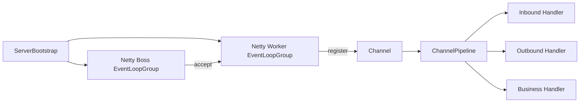

# Netty 核心源码要点

> 面向面试与工程调优的 Netty 源码精读。Netty 是 Java 高性能网络编程的事实标准，本质是**对 JDK NIO 的封装与增强**：解决 NIO 原生 API 复杂、Epoll 空转、半包/粘包、内存碎片等问题。

## 1. 整体架构与 Reactor 模型

Netty 采用 **主从 Reactor 多线程模型**：



- **Boss Group（1~2 线程）**：只负责 `accept` 新连接，把 SocketChannel 注册到 Worker。
- **Worker Group（CPU*2 线程）**：每个 `EventLoop` 绑定一个线程，串行处理多个 Channel 的 I/O 与任务，**无锁串行**是 Netty 高性能的根基。
- **ChannelPipeline**：每个 Channel 持有一条双向链表，由 `ChannelHandlerContext` 串联 `ChannelHandler`。

> 关键认知：`EventLoop` ≈ 一个死循环 `select → processSelectedKeys → runAllTasks`，同一个 Channel 的所有事件永远由同一个线程处理，彻底规避并发。

## 2. 启动流程（ServerBootstrap）

```java
ServerBootstrap b = new ServerBootstrap();
b.group(boss, worker)
 .channel(NioServerSocketChannel.class)
 .childHandler(new ChannelInitializer<SocketChannel>() {
     protected void initChannel(SocketChannel ch) {
         ch.pipeline().addLast(new LineBasedFrameDecoder(1024));
         ch.pipeline().addLast(new StringDecoder());
         ch.pipeline().addLast(new BizHandler());
     }
 });
b.bind(8080).sync();
```

`bind()` 核心路径：`initAndRegister()` → `MultithreadEventLoopGroup.register()` → `NioSocketChannel` 注册到 `Selector`。

## 3. 读事件处理（入站）

1. `NioEventLoop.processSelectedKey` 发现 `OP_READ`。
2. `AbstractNioByteChannel.NioByteUnsafe.read()` 分配 `ByteBuf` 并从 Socket 读入。
3. 触发 `pipeline.fireChannelRead(byteBuf)`：从 `HeadContext` 沿入站方向流转到各 `ChannelInboundHandler`。
4. 最终到达业务 `ChannelHandler`。

## 4. 写事件（出站）

- `ctx.write(msg)`：沿**出站方向**从当前节点向前传播，不触发 flush。
- `ctx.writeAndFlush(msg)` / `ctx.flush()`：触发 `AbstractChannel.doWrite()`，利用 `ChannelOutboundBuffer` 做**批量写聚合**与 `writeSpinCount` 自旋写。
- 写结果通过 `ChannelFuture` 异步回调，`addListener` 处理成功/失败。

## 5. ByteBuf：比 ByteBuffer 强在哪

| 维度 | JDK ByteBuffer | Netty ByteBuf |
|------|----------------|---------------|
| 读写指针 | 共用 `position`，切换需 `flip` | 读写分离 `readerIndex`/`writerIndex` |
| 容量 | 固定，需手动 `allocate` | 支持 `capacity()` 自动扩容 |
| 池化 | 无 | `PooledByteBufAllocator`（默认开启） |
| 零拷贝 | 弱 | `CompositeByteBuf`、`slice`、`duplicate` |
| 引用计数 | 无 | 支持 `retain()`/`release()` |

```java
ByteBuf buf = ByteBufAllocator.DEFAULT.directBuffer(1024);
buf.writeInt(1).writeBytes("hello".getBytes());
int v = buf.readInt();          // 只读，不动写指针
buf.release();                  // 池化对象必须释放
```

## 6. 内存管理与引用计数

- **池化**：`PooledByteBufAllocator` 基于 `PoolArena`（按线程本地减少竞争）+ `PoolChunk`（8KB 页，伙伴算法分配 `tiny/small/normal/huge`）。
- **引用计数**：`ReferenceCounted` 接口，`retain()` +1、`release()` -1，归零时回收到池。
- **泄漏检测**：`-Dio.netty.leakDetection.level=PARANOID` 可在测试期发现未释放。

## 7. 零拷贝实现

1. `CompositeByteBuf`：逻辑合并多个 ByteBuf，避免拷贝。
2. `FileRegion` + `transferTo`：文件传输走 `sendfile` 系统调用，不进用户态。
3. `slice()`/`duplicate()`：共享底层内存，零拷贝视图。

## 8. 半包/粘包与拆包器

TCP 流式特性导致接收端需**按协议边界**拆包，Netty 提供开箱即用的 `ChannelHandler`：

- `LineBasedFrameDecoder`：以换行符分割。
- `DelimiterBasedFrameDecoder`：自定义分隔符。
- `LengthFieldBasedFrameDecoder`：基于长度字段（最常用，如 `{"len":N}` 头部）。

> 必须在 `pipeline` 最前端加解码器，否则业务 `ByteBuf` 会是粘在一起的脏数据。

## 9. 常见坑与误区

1. **堆外内存泄漏**：`ByteBuf` 未 `release()`，或异常路径遗漏，长时间运行 OOM（Direct buffer）。务必成对 `try/finally` 或 `ReferenceCountUtil.release`。
2. **Handler 被共享**：`@ChannelHandler.Sharable` 的 Handler 若含成员变量，多线程并发会出竞态；无状态工具类才适合共享。
3. **阻塞 EventLoop**：在 Handler 里做 DB/HTTP 同步调用，会卡死该线程上所有 Channel。耗时操作必须丢到业务线程池（`ctx.executor()` 或自定义 `EventExecutorGroup`）。
4. **错误的 ctx.write**：`ctx.write` 从当前节点向前，可能绕过编码器；向客户端写响应通常用 `ctx.channel().write` 或确保 pipeline 顺序正确。
5. **write 后未 flush**：`write()` 不刷盘，必须 `writeAndFlush`。
6. **连接数爆炸**：Boss 线程过多无意义，1 个足够；Worker 线程数默认 `CPU*2`，I/O 密集可调大。
7. **心跳缺失**：不配置 `IdleStateHandler` 会导致死连接占用资源。

## 10. 面试高频点

- 为什么说 Netty 是**无锁串行**？EventLoop 绑定单线程，任务队列顺序执行，避免锁竞争。
- 默认内存分配器是什么？`PooledByteBufAllocator`（4.1+ 默认开启池化）。
- 如何定位 OOM？开 `leakDetection.level=PARANOID`，结合 `-XX:MaxDirectMemorySize`。
- 主从 Reactor 与单 Reactor 的区别？Boss 专管 accept，Worker 专管 I/O，避免 accept 阻塞读写。
