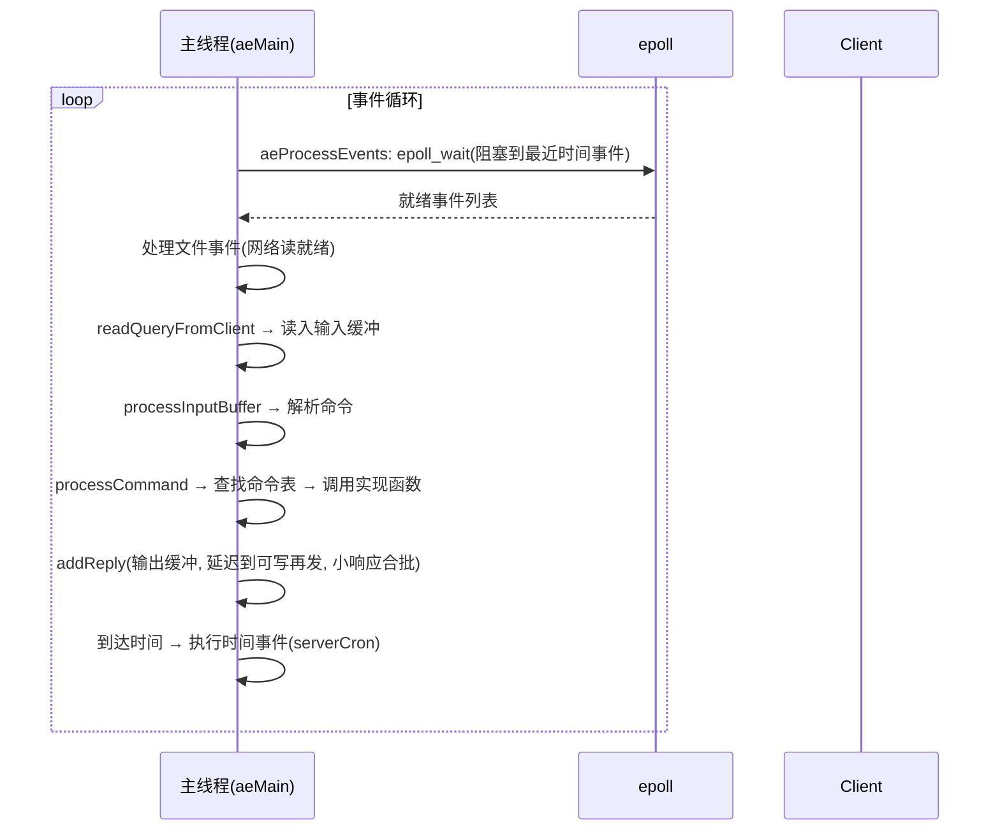

# Redis 源码精读

## 〇、本体介绍

**Redis** 是单线程事件驱动的内存 KV 数据库（网络 IO + 命令执行单线程，6.0 后网络 IO 多线程）。源码以**极致性能与内存节约**为设计目标：自定义字符串、压缩结构、跳表、IO 多路复用。

**为什么读源码**：理解「为什么快」「为什么是近似 LRU」「过期键怎么删」「持久化如何不阻塞」——这些面试与调优都绕不开。

**核心对象**：`redisObject`（类型+编码+LRU+引用计数）、`SDS`（简单动态字符串）、`ziplist/listpack`、`skiplist`、`dict`（哈希表）、`intset`、`quicklist`。

---

## 一、redisObject 与编码

每个 Value 都是 `redisObject`：
- `type`：string/list/hash/set/zset。
- `encoding`：底层编码（如 string 可是 int / embstr / raw；hash 可是 ziplist/listpack / hashtable）。
- `refcount`：引用计数（共享对象、0 表示待回收）。
- `lru`：`lru` 时钟或 `lfu` 计数，用于淘汰。

> **编码随数据规模升级/降级**：小 hash 用 listpack（省内存），超阈值转 hashtable。这是 Redis「省内存」的关键。

### 1.1 深挖：编码选择逻辑（t_hash.c / object.c）

| 结构 | 小数据编码 | 升级条件（hash-max-listpack-entries 等） | 大数据编码 |
|------|-----------|------------------------------------------|-----------|
| string | `int`（整数）/ `embstr`（≤44B）/ `raw`（SDS） | 长度/可解析性 | raw |
| hash | `listpack` | 条目 > 128 或任一项长度 > 64B | `hashtable` |
| list | `quicklist`（listpack 节点链表） | 一直是 quicklist | quicklist |
| set | `intset` | 全为整数且数量 ≤ 512 | `hashtable` |
| zset | `listpack` | 条目 > 128 | `skiplist + dict` |

> **触发时机**：每次写命令后 `hashTypeTryConversion`/`setTypeMaybeConvert` 等检查阈值，达到即**原地转换**（O(n) 一次性），此后不再降级（除非 `OBJECT ENCODING` 手动/重写）。
> 调优：`hash-max-*`/`zset-max-*`/`list-max-*` 系列配置决定「内存 vs CPU」的平衡点。

---

## 二、SDS（Simple Dynamic String）

- 结构：`len`（已用）、`alloc`（容量）、`flags`（类型）、`buf[]`。
- 相比 C 字符串：**O(1) 取长度**、**二进制安全**（不靠 `\0`）、**预分配/惰性释放**减少重分配。
- `embstr`：≤44 字节时与 redisObject 连续分配，一次 malloc，省一次寻址。

### 2.1 深挖：SDS 内存分配策略（sds.c）

- **预分配**：扩容时若新长度 < 1MB → `alloc = 2×len`；≥ 1MB → `alloc = len + 1MB`（增长率递减，防大对象翻倍浪费）。
- **惰性释放**：缩短字符串只改 `len`，内存留给下次 append 复用；显式 `sdsRemoveFreeSpace` 才回收。
- **flags 按长度分级**（`sdshdr5/8/16/32/64`）：不同长度段用不同头（1~5 字节），**短字符串头越小越省内存**——为「亿万个小 key」抠内存的典型设计。

---

## 三、跳表（Skiplist，zset 底层）

- zset 同时用 **dict（按 member 查 score O(1)）** + **skiplist（按 score 范围/排名 O(log n)）** 两份结构，共享对象。
- 跳表每层随机层数（幂次概率），平均 O(log n) 查找/插入/删除，实现比红黑树简单，且**范围遍历友好**。
- 面试常问：为什么 zset 用跳表不用红黑树？答：范围查询方便、实现简单、内存可控、缓存局部性尚可。

### 3.1 深挖：跳表结构与 ZRANGE 执行（t_zset.c）

- `zskiplistNode`：`ele`（member）+ `score` + `backward`（前向指针，方便 ZREVRANGE 逆序遍历）+ `level[]`（每层 forward + span）。
- **span（跨度）**：记录「该层到下一节点的步数」——**ZRANK 排名计算 O(log n)** 就是累加 span，不需要数元素。
- 插入：随机层数（`zslRandomLevel`，p=0.25）→ 每层记录 update[] → 插入并更新 span；score 相同按 member 字典序排序。
- 与 dict 双写：**score 以 skiplist 为准，dict 用于成员反查**；删除时两个结构都要删（`zsetDel`）。

---

## 四、过期删除策略（三种配合）

1. **惰性删除**：访问 key 时才检查过期（`expireIfNeeded`），过期则删——对 CPU 友好但对内存不友好。
2. **定期删除**：`activeExpireCycle` 每 100ms 抽样部分带过期 key 的 db，删掉过期的，控制时长（25% CPU 上限）防阻塞。
3. **内存淘汰（maxmemory-policy）**：内存到上限时按策略淘汰：noeviction（拒写）、allkeys-lru / volatile-lru（近似 LRU）、allkeys-lfu / volatile-lfu、allkeys-random、volatile-ttl。近似 LRU 用 `lru` 时钟随机采样，非全局精确。

### 4.1 深挖：过期与淘汰的代码执行点

- **惰性删除**：`lookupKeyRead`/`lookupKeyWrite` → `expireIfNeeded`（`db.c`）——**所有读命令入口都过这道检查**；所以「过期 key 不立即消失」只有在没人访问时才成立。
- **定期删除**：`databasesCron`（主循环时间事件，`serverCron` 每 100ms 一次）→ `activeExpireCycle`：随机采样 db 的过期桶，每次限时（`timelimit` 按 CPU 25% 折算），**分批渐进**不阻塞。
- **内存淘汰**：`processCommand` 写命令前检查 `overMaxmemoryAfterAlloc` → `performEvictions`（`evict.c`）：按策略选候选（**近似 LRU：随机采样 N 个 key 按 lru 字段选最旧**，非全量扫描），逐批淘汰直到内存回落或达到 `maxmemory-samples` 轮次上限。
- **LFU 计数衰减**：`lfu-decay-time` 每分钟衰减计数，防「历史热点永占缓存」。

---

## 五、持久化：RDB 与 AOF

- **RDB**（快照）：`fork()` 子进程写二进制快照（COW 写时复制省内存），恢复快、体积小，但可能丢最近数据；`bgsave` 不阻塞主线程。
- **AOF**（追加日志）：每条写命令追加，可 `always/everysec/no` 落盘；重写（BGREWRITEAOF）压缩日志。
- **混合持久化**（4.0+）：AOF 重写时先写 RDB 再追增量，兼顾恢复速度与少丢数据。

### 5.1 深挖：fork + COW 的代价（生产必踩）

```text
bgsave 流程：
1. 主线程 fork() 出子进程（此刻才真正卡顿：复制页表）
2. 子进程按内存快照写 RDB 文件；主线程继续服务
3. 主线程写数据触发 COW：页被复制 → 内存瞬间上涨、页表变大
4. 大实例（几十 GB）fork 可能卡几十~几百 ms；写多时 COW 内存峰值可达原内存数倍
```

- **坑**：内存打满的实例别 bgsave（COW 复制页 → OOM）；监控 `latest_fork_usec`；`vm.overcommit_memory=1` 允许超卖虚拟内存防 fork 失败。
- **AOF everysec**：每秒刷盘，崩溃最多丢 1 秒数据——生产默认。
- **AOF 重写**：`rewriteAppendOnlyFileBackground` fork 子进程用内存里的「当前数据集」重写成最小命令集；期间写命令进 **aof_rewrite_buf**，重写完成后合并追加大文件——保证重写不丢新命令。

---

## 六、事件驱动与 IO 多路复用

- 主线程基于 **Reactor**：`aeApi`（Linux 用 epoll）监听文件事件 + 时间事件。
- 命令执行**单线程**，避免锁竞争；6.0 引入 **IO 多线程**（仅网络读写多线程，命令执行仍单线程），提升大值吞吐。

### 6.1 深挖：主循环与命令处理（ae.c / server.c）



- **单线程为什么快**：内存操作微秒级 + epoll 多路复用 + 无锁无上下文切换；瓶颈在内存带宽/网络/大 key 序列化。
- **命令表**：`redisCommandTable` 静态数组，每条命令注册回调 + 标志位（`write`/`denyoom`/`admin` 等，权限与类别判断都在这张表）；`processCommand` 里依次做：认证、`maxmemory` 检查、过期清理、`CLUSTER` 重定向、事务/脚本排队。
- **输出缓冲**：`addReply` 只追加到 client 输出缓冲，`beforeSleep` 统一 flush 到 socket——**「一次事件循环攒批写出」**，减少小包 syscall。
- **6.0 IO 多线程**：`io-threads`：读 socket 与写 socket 可多线程（`handleClientsWithPendingReads/Write`），命令解析执行仍主线程——避免「大 value 网络 IO 占满主线程」。

---

## 七、其他高频结构

- **dict（哈希表）**：两个表 + rehash（渐进式，每次增删改顺带迁移，防一次性阻塞）；负载因子 >1 且可扩 / >5 必扩。
- **quicklist**：list 底层 = ziplist 串成的双向链表，平衡连续内存与拆分。
- **bloom / hyperloglog / bitmap / GEO**：基于位数组与 geohash 的紧凑结构。

### 7.1 深挖：dict 渐进式 rehash（dict.c）

```text
rehash 机制：
1. 触发：ht[0] 负载因子 >1（bgsave 时 >5）→ 申请 ht[1]=2×ht[0] 并开始
2. 渐进：每次增删改查都顺带把 ht[0] 的 bucket 迁到 ht[1]（rehashidx 推进）
3. 期间：新 key 直接进 ht[1]；读先查 ht[0] 未命中再查 ht[1]
4. 完成：ht[0]=ht[1]，ht[1]=空，rehashidx=-1
```

- **为什么渐进**：几百万 key 一次性迁移会阻塞主线程秒级——「**大 key 多、内存涨到阈值时写延迟突刺**」的根因就是 rehash/转换。
- **哈希碰撞防护**：dict 用 **siphash**（抗 HashDoS），且随机种子启动生成——防恶意构造碰撞打满桶链。
- **空桶跳过**：rehash 时连续空桶会跳过一个空桶（`rehash step` 限制），避免被「大量空桶」拖慢。

---

## 八、生产实践：从源码看常见坑

1. **大 key 阻塞**：`DEL`/`GET` 大集合、`KEYS`/`HGETALL` 全量遍历在主线程执行 → 秒级卡顿；用 `SCAN`/`UNLINK`（异步释放）、`SMEMBERS` 换 `SSCAN`。
2. **过期风暴**：大量 key 同一秒过期 → 定期删除 + 惰性删除批量触发，CPU 突刺、主线程卡；**过期时间加随机抖动**（源码建议 ±秒）。
3. **fork 卡顿**：大实例 bgsave/bgrewriteaof 的 fork 复制页表 + COW 内存翻倍 → 关大实例自动 save、错峰持久化、监控 `latest_fork_usec`。
4. **内存碎片**：`MEMORY FRAGMENTATION` 高 → 与 SDS 预分配/COW 相关；`activedefrag` 启动（CPU 换碎片率）。
5. **maxmemory 打满拒写**：`noeviction` 策略下写报 `OOM command not allowed`；评估策略（volatile-lru/allkeys-lfu）+ 监控内存水位。
6. **rehash 写突刺**：大量新增 key 触发 rehash，期间写慢；预分配 `#define` 容量（`SETRANGE`/`DEBUG` 不适用），或评估内存上限余量。
7. **AOF 重写与 RDB 同时间撞车**：`serverCron` 检查 `aof_rewrite_scheduled` 会跳过 bgsave——配置 `aof-rewrite-percentage` 与 `aof-rewrite-min-size` 错峰。

---

## 九、与其他板块的关系

- **中间件 / Redis 知识**（基础知识）：命令/场景层。
- **算法 / 跳表、位运算**：zset 跳表、hyperloglog 位运算。
- **并发编程**：单线程无锁模型 vs 多线程；IO 多路复用思想。
- **场景设计 / 分布式锁、限流**：SETNX/Lua 原子性在 Redis 单线程模型下成立。
- **基础知识 / 操作系统**：fork/COW、epoll、内存管理是本篇的底层。

---

## 十、速查表

| 结构 | 底层 | 用途 |
|------|------|------|
| string | int/embstr/raw(SDS) | KV、计数、缓存 |
| hash | listpack→hashtable | 对象 |
| list | quicklist | 队列 |
| set | intset→dict | 去重 |
| zset | dict+skiplist | 排行榜 |
| dict | 双表渐进 rehash | 全局键空间 |
| 过期 | 惰性+定期+淘汰 | 内存管理 |
| 持久化 | RDB(fork+COW) + AOF | 重启恢复 |

---

## 面试高频问题（30+ 条）

1. **Redis 为什么快？** 内存操作、单线程无锁、IO 多路复用(epoll)、高效结构(SDS/跳表)。
2. **为什么单线程还不够慢？** 瓶颈在内存与网络而非 CPU；单线程免锁、免上下文切换。
3. **6.0 多线程改了什么？** 网络 IO 多线程（读写），命令执行仍单线程。
4. **redisObject 含哪些字段？** type/encoding/refcount/lru(lfu)。
5. **为什么用 SDS 不用 C 字符串？** O(1)长度、二进制安全、预分配惰性释放。
6. **embstr 是什么？** ≤44B 时对象与 SDS 一次分配，省寻址。
7. **SDS 预分配策略？** 扩容 <1MB 翻倍、≥1MB 加 1MB；惰性释放留内存复用。
8. **zset 为什么用跳表？** 范围查询方便、实现简单、内存可控；配合 dict 查 score。
9. **为什么不用红黑树做 zset？** 跳表范围遍历更简单、缓存友好、实现成本低。
10. **跳表 span 字段有什么用？** 记录步数，ZRANK 排名 O(log n)。
11. **过期键怎么删？** 惰性（访问时删）+ 定期（抽样删）+ 内存淘汰兜底。
12. **定期删除会阻塞吗？** 控制单次时长（~25% CPU），渐进不阻塞。
13. **近似 LRU 是什么？** 用 lru 时钟随机采样淘汰，非全局精确，省内存。
14. **maxmemory-policy 有哪些？** noeviction/lru/lfu/random/ttl，配 allkeys/volatile。
15. **RDB 原理？** fork 子进程写快照(COW)，恢复快、体积小、可能丢最近。
16. **AOF 原理？** 追加写命令，always/everysec/no；重写压缩。
17. **混合持久化？** AOF 重写先 RDB 再追增量，兼顾速度少丢。
18. **fork 的 COW 是什么？** 写时复制，父子共享页，写才拷贝，省内存。
19. **fork 会卡吗？** 复制页表瞬间卡顿，大实例几十~几百 ms；监控 latest_fork_usec。
20. **dict 怎么扩容/rehash？** 负载因子>1 扩、>5 必扩；渐进式 rehash 防阻塞。
21. **渐进式 rehash 过程？** rehashidx 推进，每操作顺带迁移桶；新 key 进新表，读双查。
22. **Redis 是线程安全吗？** 命令执行单线程，天然无并发问题；多键操作需事务/lua 保原子。
23. **IO 多路复用是什么？** 单线程用 epoll 同时管多连接，非阻塞。
24. **bigkey 危害？** 删除/遍历阻塞、网络拥塞；应拆分，用 UNLINK 异步删。
25. **quicklist 是什么？** list 底层，ziplist 串双向链表，平衡内存与拆分。
26. **哈希碰撞怎么防？** siphash + 随机种子，抗 HashDoS。
27. **过期风暴怎么避免？** 过期时间随机抖动，防同一秒批量过期卡主线程。
28. **输出缓冲为什么攒批？** addReply 只入缓冲，beforeSleep 统一写 socket，减少 syscall。
29. **UNLINK 和 DEL 区别？** DEL 同步释放（大 key 阻塞）；UNLINK 后台线程异步释放。
30. **AOF 重写期间写命令怎么办？** 进 aof_rewrite_buf，重写完成后合并追加。
31. **内存碎片怎么处理？** activedefrag 开启，或评估 SDS 预分配/COW 影响。
32. **缓存与 Redis 源码关系？** 见 Redis 知识；过期/淘汰策略直接决定缓存命中与内存。
