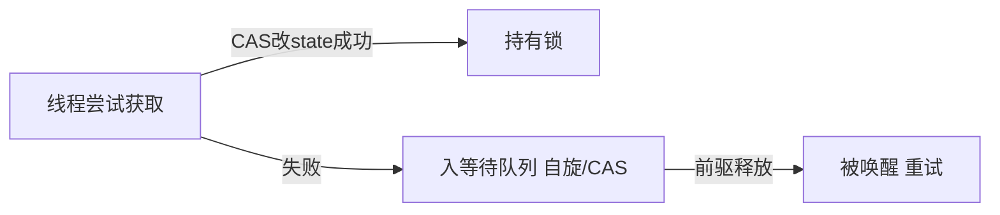

# ReentrantLock 与 AQS 源码要点

> `ReentrantLock` 是 JUC 中可重入互斥锁，底层依赖 **AQS（AbstractQueuedSynchronizer）**。理解 AQS 的 CLH 队列与 state 机制，是掌握整个 JUC 并发包的基础。

## 1. AQS 核心思想

AQS 用一个 `volatile int state` 表示同步状态，加一个 **FIFO 等待队列（CLH 变体）** 管理竞争线程。



- 子类只需实现 `tryAcquire` / `tryRelease` 等钩子。
- `state` 含义由子类定（锁=0/1/重入次数；信号量=剩余许可）。

## 2. ReentrantLock 结构

```java
ReentrantLock lock = new ReentrantLock(); // 默认非公平
lock.lock();
try { /* 临界区 */ } finally { lock.unlock(); }
```

- **公平**：按入队顺序获取。
- **非公平**：新线程可插队（吞吐高，默认）。

## 3. 加锁流程（非公平）

```java
final void lock() {
    if (compareAndSetState(0, 1))   // 插队尝试
        setExclusiveOwnerThread(Thread.currentThread());
    else
        acquire(1);                  // AQS 入队
}
```

`acquire` → `tryAcquire`（子类实现）→ 失败则 `addWaiter` 入队并 `acquireQueued` 自旋 CAS 前驱。

## 4. 可重入实现

`tryAcquire` 中判断当前线程是否已是持有者，是则 `state++`：

```java
if (current == getExclusiveOwnerThread()) {
    setState(state + 1);  // 重入计数
    return true;
}
```

释放时 `state--`，归零才真正释放。

## 5. 等待队列节点

- 节点含 `waitStatus`：CANCELLED(1)/SIGNAL(-1)/CONDITION(-2)/PROPAGATE(-3)。
- 前驱 `SIGNAL` 表示"释放时唤醒我"。
- 入队后用 `LockSupport.park` 挂起，被前驱 `unpark` 唤醒。

## 6. 条件变量（Condition）

`lock.newCondition()` 提供 `await/signal`，基于 AQS 的 Condition 队列：

```java
Condition c = lock.newCondition();
lock.lock();
c.await();        // 释放锁并等待
// 另一线程 c.signal();
```

- 每个 Condition 一个等待队列，signal 时节点转移到 AQS 主队列。

## 7. 与 synchronized 对比

| 维度 | synchronized | ReentrantLock |
| --- | --- | --- |
| 实现 | JVM 内置 | JDK 代码(AQS) |
| 可中断 | 否 | 是（lockInterruptibly） |
| 公平 | 非公平 | 可选 |
| 条件 | wait/notify | 多 Condition |
| 超时 | 否 | tryLock(timeout) |

## 8. 常见坑

| 坑 | 现象 | 对策 |
| --- | --- | --- |
| 忘记 unlock | 死锁 | finally 中 unlock |
| 锁内调锁 | 重入 OK，交叉易死锁 | 注意顺序 |
| 用错公平 | 吞吐低 | 默认非公平 |
| await 不持锁 | IllegalMonitorState | 先 lock |

## 9. 面试题

1. AQS 的 state 与队列作用？
2. 非公平锁为何吞吐高？
3. 可重入如何实现？
4. Condition 与 wait/notify 区别？
5. 为什么 unlock 要放 finally？

## 10. 小结

AQS 是 JUC 的基石：`state` 表达状态、CLH 队列管理等待、CAS 保证原子。ReentrantLock 在其上实现可重入与公平/非公平。读懂 AQS，等于读懂半数 JUC 工具。
