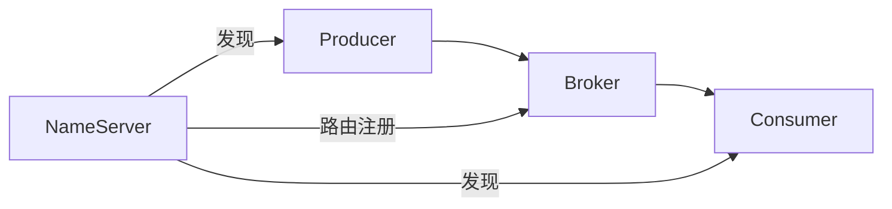
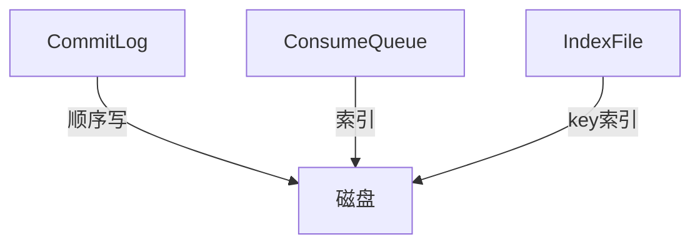
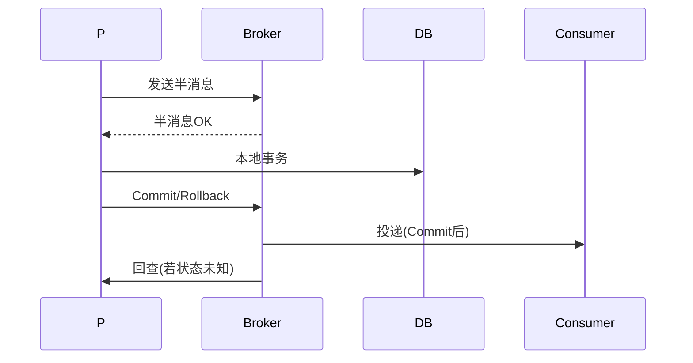

# RocketMQ 消息模型源码要点

> RocketMQ 是阿里开源的分布式消息中间件，主打金融级可靠与高吞吐。本文解析其角色模型、存储结构、消费模式与事务消息实现。

## 1. 核心角色

- **Producer/Consumer**：生产/消费。
- **Broker**：存储与投递，分 Master/Slave。
- **NameServer**：轻量注册中心，无状态，Broker 定时上报路由。

## 2. 消息模型

- **Topic**：消息主题（逻辑分类）。
- **MessageQueue**：Topic 的物理分片，并行消费单位。
- **Tag**：同一 Topic 内二级分类，用于过滤。
- **Group**：生产组/消费组，用于负载与广播控制。

## 3. 存储结构

RocketMQ 顺序写、随机读：

- **CommitLog**：所有消息顺序追加，保证高吞吐。
- **ConsumeQueue**：每个 Topic+Queue 的索引（offset/长度），消费时定位。
- **IndexFile**：按 key 建索引，支持按 key 查询。

## 4. 消费模式

| 模式 | 说明 |
| --- | --- |
| 集群消费 | 同 Group 消费者均分队列 |
| 广播消费 | 每个消费者收全部 |
| Pull / Push | 拉模式 / 推模式（长轮询） |

- 负载均衡：队列按平均分配给组内消费者（重平衡 rebalance）。

## 5. 消息可靠性

- **发送**：同步/异步/单向；同步确认保证到达 Broker。
- **刷盘**：同步刷盘（落盘才返回）vs 异步刷盘（高性能）。
- **复制**：同步双写（主备都写）vs 异步复制。
- **消费**：至少一次（at-least-once）+ 消费幂等。

## 6. 事务消息

- 半消息：暂不可消费，待本地事务结果。
- 回查机制：超时未决时 Broker 回查生产者。
- 用于"本地事务 + 发消息"一致。

## 7. 顺序消息

- 同一业务 key 发同一 MessageQueue，保证分区有序。
- 消费时单线程消费该队列，保证顺序。
- 全局有序需单队列，吞吐受限。

## 8. 延迟与重试

- 延迟消息：预定义延迟级别，定时投递。
- 消费失败：重试队列（%RETRY%），超次数进死信（%DLQ%）。
- 削峰：生产者限流、Broker 流控。

## 9. 常见坑

| 坑 | 现象 | 对策 |
| --- | --- | --- |
| 消费幂等缺失 | 重复处理 | 业务幂等 |
| 消费慢 | 积压 | 扩容/优化 |
| 消息丢失 | 数据缺 | 同步刷盘+复制 |
| 顺序破坏 | 乱序 | 单队列单线程 |

## 10. 面试题

1. RocketMQ 存储为何顺序写？
2. CommitLog 与 ConsumeQueue 关系？
3. 事务消息如何实现一致？
4. 顺序消息如何保证？
5. 如何防止消息丢失？

## 11. 小结

RocketMQ 以"顺序写 CommitLog + 索引 ConsumeQueue"实现高性能可靠存储；事务消息（半消息+回查）解决分布式一致；消费靠队列均分与幂等。理解存储与一致性设计是其精髓。
