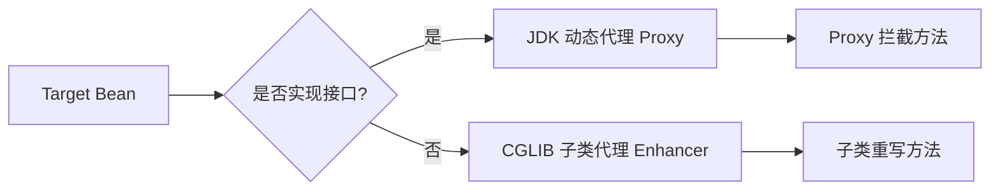

# Spring AOP 与声明式事务源码要点

> AOP（面向切面编程）是对 OOP 的补充：把横切逻辑（日志、鉴权、事务、监控）从业务代码中剥离。Spring AOP 基于**动态代理**实现，声明式事务 `@Transactional` 本质是一个 AOP 拦截器。

## 1. 核心概念

| 术语 | 含义 |
|------|------|
| 连接点 Joinpoint | 程序执行点（如方法调用） |
| 切点 Pointcut | 匹配哪些连接点 |
| 通知 Advice | 切面逻辑（before/after/around） |
| 切面 Aspect | 切点 + 通知的组合 |
| 织入 Weaving | 把切面应用到目标对象的过程 |
| 引介 Introduction | 动态给类添加方法/字段 |

## 2. 两种代理方式



- **JDK 动态代理**：目标实现接口时默认使用，`Proxy.newProxyInstance` 生成实现接口的代理类，调用走 `InvocationHandler.invoke`。
- **CGLIB**：目标无接口时，`Enhancer` 生成目标类的子类，重写方法并织入拦截（`MethodInterceptor`）。
- 强制 CGLIB：`@EnableAspectJAutoProxy(proxyTargetClass = true)`。

> Spring Boot 2.x 起默认 `proxyTargetClass=true`，统一用 CGLIB。

## 3. 代理创建时机

`AbstractAutoProxyCreator.postProcessAfterInitialization()` 在 Bean 初始化后判断是否需要代理：

1. 收集所有 `Advisor`（切点+通知）。
2. 用切点匹配当前 Bean 的方法。
3. 匹配成功则 `wrapIfNecessary` 生成代理，替换原 Bean 放入容器。

因此**容器里拿到的就是代理对象**，业务无感知。

## 4. 调用链：责任链 + 递归

一次方法调用 = 多个 `MethodInterceptor` 组成的链：

```
ExposeInvocationInterceptor → AspectJAroundAdvice → AspectJAfterThrowingAdvice
→ AspectJAfterReturningAdvice → AspectJAfterAdvice → 目标方法
```

`ReflectiveMethodInvocation.proceed()` 递归推进，直到链尾执行目标方法，再倒序执行 after/returning。

## 5. 声明式事务原理

`@Transactional` 由 `TransactionInterceptor` 拦截：

```java
public Object invokeWithinTransaction(Method method, Object target, InvocationCallback invocation) {
    PlatformTransactionManager tm = ...;
    TransactionInfo txInfo = createTransactionIfNecessary(tm, txAttr, joinpointId);
    try {
        Object ret = invocation.proceed();          // 执行业务
        commitTransactionAfterReturning(txInfo);    // 成功提交
        return ret;
    } catch (Throwable ex) {
        completeTransactionAfterThrowing(txInfo, ex);// 回滚
        throw ex;
    }
}
```

- **传播行为**：`REQUIRED`（默认，有则加入无则新建）、`REQUIRES_NEW`（挂起当前，新建）、`NESTED`（嵌套保存点）等。
- **隔离级别**：默认 `DEFAULT`（跟随数据库，MySQL 通常是 READ_COMMITTED 的 REPEATABLE READ）。
- **回滚规则**：默认仅 `RuntimeException`/`Error` 回滚，`checked Exception` 不回滚，可用 `rollbackFor` 指定。

## 6. @Transactional 失效的 9 种场景

1. **同类方法自调用**：`this.methodB()` 绕过代理，事务不生效 → 注入自身代理或用 `AopContext.currentProxy()`。
2. **方法是 private/final/static**：CGLIB 无法重写，JDK 代理无此问题但语义错误。
3. **异常被 catch 吞掉**：拦截器看不到异常，不会回滚。
4. **抛了 checked Exception**：默认不回滚，需 `rollbackFor=Exception.class`。
5. **数据库引擎不支持**：MySQL MyISAM 不支持事务，需 InnoDB。
6. **数据源未配置事务管理器**：多数据源时易漏配。
7. **传播行为设为 NOT_SUPPORTED/SUPPORTS**：不开启事务。
8. **多线程调用**：事务绑定在 ThreadLocal，子线程拿不到连接。
9. **方法用 final 修饰（Spring 6+）或类是 final**：CGLIB 代理失败。

## 7. 常见坑与误区

1. **事务范围过大**：把远程调用、大循环放进 `@Transactional`，长期占连接导致超时/锁等待。事务越短越好。
2. **长事务持有 DB 连接**：事务内 sleep/HTTP 调用会拖垮连接池。
3. **只读事务优化**：查询方法加 `@Transactional(readOnly = true)`，ORM 可跳过脏检查。
4. **切面顺序**：多个 `@Aspect` 用 `@Order` 控制优先级，数字小先执行（Around 在外层）。
5. **CGLIB 不能代理 final 类**：Spring 6 对 final 类直接报错，注意兼容。

## 8. 面试高频点

- JDK 代理与 CGLIB 怎么选？有接口 JDK，无接口 CGLIB（Boot 2.x 默认全 CGLIB）。
- 为什么自调用事务失效？代理对象才增强，this 调用不进拦截链。
- 事务回滚依据？`completeTransactionAfterThrowing` 按 `rollbackFor` 判定。
- 如何保证多数据源各自事务？配置各自 `PlatformTransactionManager` 并用 `@Transactional("name")`。
