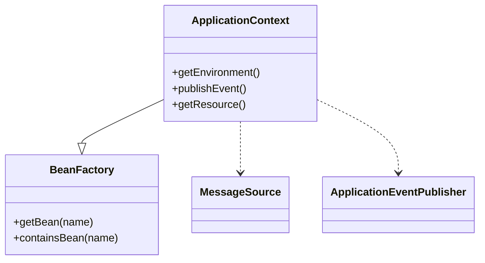

# Spring IOC 容器源码要点

> 以 Spring Framework 5.x / 6.x 为准。IOC（控制反转）的核心是 **BeanFactory**：把对象的创建、依赖装配、生命周期交由容器管理，业务代码只声明"我需要什么"。

## 1. 容器体系：BeanFactory vs ApplicationContext



- `BeanFactory`：基础容器，懒加载，按需实例化。
- `ApplicationContext`：高级容器，继承 BeanFactory，额外提供国际化、事件、资源加载、AOP 等，启动即**预实例化单例**。

## 2. 启动主流程：AbstractApplicationContext.refresh()

`refresh()` 是 IOC 初始化的总入口，共 13 个标准步骤：

```java
public void refresh() {
    prepareRefresh();                              // 1. 准备环境/校验
    ConfigurableListableBeanFactory beanFactory = obtainFreshBeanFactory(); // 2. 获取 BeanFactory
    prepareBeanFactory(beanFactory);               // 3. 配置标准上下文
    postProcessBeanFactory(beanFactory);           // 4. 子类扩展
    invokeBeanFactoryPostProcessors(beanFactory);  // 5. 调用 BeanFactoryPostProcessor（扫描@Component、解析@Configuration）
    registerBeanPostProcessors(beanFactory);       // 6. 注册 BeanPostProcessor
    initMessageSource();                           // 7. 国际化
    initApplicationEventMulticaster();             // 8. 事件广播器
    onRefresh();                                   // 9. 子类钩子
    registerListeners();                           // 10. 注册监听器
    finishBeanFactoryInitialization(beanFactory);  // 11. 实例化所有非懒加载单例 ★
    finishRefresh();                               // 12. 发布 ContextRefreshedEvent
}
```

**第 11 步**才是真正创建 Bean 的地方，前面都是"准备原料"。

## 3. Bean 创建生命周期

`AbstractAutowireCapableBeanFactory.doCreateBean()`：

1. `createBeanInstance()`：反射/工厂方法实例化（推断构造器，`@Autowired` 构造器优先）。
2. `populateBean()`：属性填充，`AutowiredAnnotationBeanPostProcessor` 解析 `@Autowired`/`@Value` 注入。
3. `initializeBean()`：
   - `invokeAwareMethods`（BeanNameAware / BeanFactoryAware）
   - `BeanPostProcessor.postProcessBeforeInitialization`
   - `@PostConstruct` / `InitializingBean.afterPropertiesSet`
   - `BeanPostProcessor.postProcessAfterInitialization`（**AOP 代理在此生成**）
4. 放入单例池 `singletonObjects`。

## 4. 三级缓存与循环依赖

Spring 解决**单例 setter/字段注入**循环依赖的三级缓存：

| 缓存 | 内容 |
|------|------|
| `singletonObjects` (一级) | 完全初始化好的成品 Bean |
| `earlySingletonObjects` (二级) | 早期暴露对象（已实例化未填充） |
| `singletonFactories` (三级) | `ObjectFactory`，用于生成早期引用（含 AOP 代理逻辑） |

流程：A 实例化后把"早期工厂"放入三级缓存 → 填充时发现依赖 B → B 创建又依赖 A → 从三级缓存拿到 A 的早期引用（若有 AOP 则提前生成代理）→ B 完成 → A 继续填充 → A 完成后从一级缓存取成品。

> **构造器注入无法解决循环依赖**：实例化阶段就要参数，三级缓存来不及暴露。Spring 会抛 `BeanCurrentlyInCreationException`。
> **原型（prototype）循环依赖**：Spring 直接报错，因为不缓存早期对象。

## 5. 关键扩展点

- `BeanFactoryPostProcessor`：Bean 定义加载后、实例化前修改 `BeanDefinition`（如 `PropertySourcesPlaceholderConfigurer` 解析 `${}`）。
- `BeanPostProcessor`：Bean 初始化前后织入逻辑（AOP、@Autowired 都靠它）。
- `FactoryBean`：工厂 Bean，`getObject()` 返回的不是 FactoryBean 自身而是产品（MyBatis 的 `MapperFactoryBean`、Rpc 代理都基于此）。
- `InstantiationAwareBeanPostProcessor`：在实例化前后、属性填充前介入（@Autowired 的解析者）。

## 6. 依赖注入方式

1. **@Autowired**：按类型，配合 `@Qualifier` 按名称，required 控制是否必填。
2. **@Resource**：JSR-250，默认按名称，找不到再按类型。
3. **构造器注入**：官方推荐，不可变、易测试、能暴露循环依赖。
4. **@Value**：注入配置/SpEL 表达式。

## 7. 常见坑与误区

1. **循环依赖 + 构造器**：必报错，应改构造器为字段注入或 @Lazy 延迟。
2. **Bean 不是线程安全的**：单例 Bean 的成员变量被多线程共享，需自己保证并发。
3. **@PostConstruct 与 afterPropertiesSet 重复**：两者都会调用，注意幂等。
4. **过早暴露 this 引用**：在构造器/`@PostConstruct` 中调用 Bean 自身方法，可能拿到未完全初始化的代理。
5. **@Async / @Transactional 失效**：同类方法自调用绕过代理，见 AOP 文档。
6. **滥用 ApplicationContext.getBean**：破坏 IOC 设计，应优先注入。
7. **FactoryBean 与 Bean 名混淆**：`getBean("&xxx")` 拿 FactoryBean 本身，`getBean("xxx")` 拿产品。

## 8. 面试高频点

- 三级缓存解决的是什么问题？**早期引用暴露 + AOP 代理时机**，而不是单纯的循环依赖（不用 AOP 两级也够）。
- `BeanFactory` 与 `ApplicationContext` 区别？后者是带应用特性的增强容器。
- `refresh()` 哪一步创建 Bean？第 11 步 `finishBeanFactoryInitialization`。
- 为什么 Spring Bean 默认单例？性能与一致性权衡，无状态组件可安全共享。
