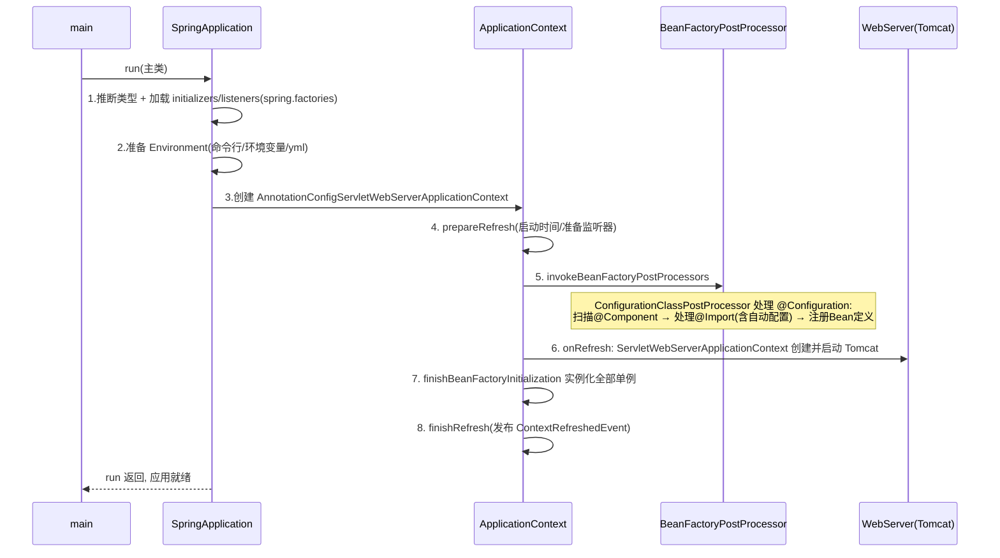

# Spring Boot 源码精读

## 〇、本体介绍

**Spring Boot** 的核心是「**约定优于配置 + 自动装配**」，让 Spring 应用零 XML、内嵌容器、一键启动。源码里最该读懂的是 **`@SpringBootApplication` 的三合一魔法**与 **自动配置的条件化装配机制**。

**为什么读源码**：理解「为什么加个依赖就能用」「starter 怎么工作」「bean 冲突怎么排」「启动慢/体积大怎么查」——排查「自动配置不生效」「循环依赖」都靠它。

**三个注解合一**：`@SpringBootApplication` = `@Configuration` + `@ComponentScan` + `@EnableAutoConfiguration`。

---

## 一、启动流程（SpringApplication.run）

1. **推断应用类型**（Servlet / Reactive / None）、**加载 `ApplicationContextInitializer` 与 `ApplicationListener`**（spring.factories / `@AutoConfiguration` 注册）。
2. **创建并准备 Environment**（profiles、配置源）。
3. **创建 ApplicationContext**（根据类型选 `AnnotationConfigServletWebServerApplicationContext` 等）。
4. **refresh()**（Spring 核心，见 源码系列/spring.md）：`prepareRefresh` → `obtainFreshBeanFactory` → `invokeBeanFactoryPostProcessors`（**解析 @Configuration、处理 @Import、触发自动配置**）→ `registerBeanPostProcessors` → `onRefresh`（**创建 WebServer，内嵌 Tomcat**）→ `finishBeanFactoryInitialization`（**实例化单例**）→ `finishRefresh`。
5. **内嵌容器启动**：`onRefresh` 中 `ServletWebServerApplicationContext` 创建并启动 Tomcat（见 源码系列/Tomcat源码.md）。
6. 发布 `ApplicationStartedEvent` / `ApplicationReadyEvent`。

### 1.1 深挖：SpringApplication.run 完整时序



### 1.2 深挖：refresh() 与自动配置的触发点

- 自动配置的**真正触发点**在 `invokeBeanFactoryPostProcessors`：`ConfigurationClassPostProcessor` 解析所有 `@Configuration` 类时，遇到 `@EnableAutoConfiguration` 的 `@Import(AutoConfigurationImportSelector)` → 调用 `ImportSelector.selectImports()` 批量导入自动配置类名。
- **顺序敏感**：`@AutoConfigureBefore/After` 通过注册 `AutoConfigurationSorter`（按 `@AutoConfigureOrder`、类依赖排序）实现——条件求值依赖前序配置类已注册的 bean。

---

## 二、自动配置（AutoConfiguration）

- **触发**：`@EnableAutoConfiguration` → `@Import(AutoConfigurationImportSelector)`。
- **加载候选**：从 `META-INF/spring/org.springframework.boot.autoconfigure.AutoConfiguration.imports`（2.7+，旧版 `spring.factories`）读取所有自动配置类。
- **条件过滤（@Conditional）**：每个 `XxxAutoConfiguration` 用 `@ConditionalOnClass` / `OnMissingBean` / `OnProperty` / `OnWebApplication` 等决定是否生效——**「有这个类、且你没有自己定义 bean 时，我才配」**，这就是「约定优于配置」的实现。
- **@Import 的三种用法**：`@ImportBeanDefinitionRegistrar`、`ImportSelector`（AutoConfiguration 用它批量选）、直接导入 @Configuration 类。

### 2.1 深挖：AutoConfigurationImportSelector 的过滤链路（核心类）

```text
selectImports() 执行步骤：
1. 读 imports 文件全部自动配置类名（可能几百个）
2. 按 @AutoConfigureOrder / @AutoConfigureBefore/After 排序
3. 去除重复、去除被 @EnableAutoConfiguration(exclude=...) 排除的
4. 按「条件注解」逐个求值过滤（OnClassCondition 等）：
   - 条件不满足的配置类 → 跳过（不注册任何 bean）
5. 返回最终生效的配置类列表 → 注册为 BeanDefinition
```

> **排障入口**：`debug=true` 时打印 `ConditionEvaluationReport`（自动配置报告）——每个配置类「匹配/不匹配」的原因一目了然，这是「自动配置不生效」排查的第一工具。

---

## 三、条件注解（@Conditional）家族

| 注解 | 含义 |
|------|------|
| `@ConditionalOnClass` | classpath 有某类才生效 |
| `@ConditionalOnMissingBean` | 容器无该 bean 才生效（**允许用户覆盖**） |
| `@ConditionalOnProperty` | 配置项匹配才生效 |
| `@ConditionalOnWebApplication` | 是 Web 应用才生效 |
| `@AutoConfigureBefore/After` | 控制自动配置顺序 |

> **用户自定义优先**：`@ConditionalOnMissingBean` 保证你自己写的 bean 会覆盖自动配置的——这是「可定制」的关键。

### 3.1 深挖：条件求值缓存与性能

- 条件判断（尤其 `OnClassCondition` 用 `ClassUtils.isPresent` 查类）在启动时对每个候选配置执行，**结果按「配置类 + 条件」缓存**（`ConditionEvaluationReport` 也复用），避免重复反射。
- 每个条件注解都是 `Condition` 实现（如 `OnClassCondition extends FilteringSpringBootCondition`），`matches()` 返回布尔；`ConfigurationCondition` 还能指定**阶段**（REGISTER_BEAN / PARSE_CONFIGURATION）。

---

## 四、Starter 机制

- Starter 本质：**一个空 pom 依赖包 + 一个 `autoconfigure` 模块**，后者在 `imports` 里声明配置类。引入 starter，自动配置随之生效。
- 例：`spring-boot-starter-data-redis` 引入 → `RedisAutoConfiguration` 条件装配 `RedisTemplate` / `StringRedisTemplate`。

### 4.1 深挖：自研 starter 三件套（面试/工程必备）

```text
my-spring-boot-starter（pom，依赖 autoconfigure 模块，optional=true）
└── my-spring-boot-autoconfigure
    ├── META-INF/spring/org.springframework.boot.autoconfigure.AutoConfiguration.imports
    │       └── 写: com.xxx.MyAutoConfiguration
    └── MyAutoConfiguration：
            @AutoConfiguration
            @ConditionalOnClass(MyService.class)
            @ConditionalOnMissingBean
            @EnableConfigurationProperties(MyProperties.class)
            public class MyAutoConfiguration {
                @Bean @ConditionalOnMissingBean MyService myService(...) {...}
            }
```

- 配套 `@ConfigurationProperties`（前缀如 `my.xxx`）+ `spring-configuration-metadata.json`（IDE 提示）。
- **坑**：autoconfigure 模块的依赖必须 `optional`，否则会强传给使用方；条件注解要写全（`@ConditionalOnClass` + `@ConditionalOnMissingBean` + property 开关）。

---

## 五、Bean 生命周期与循环依赖

- **生命周期**：实例化（构造）→ 属性填充（@Autowired）→ `Aware` 回调 → `BeanPostProcessor.before` → `@PostConstruct`/`InitializingBean` → `BeanPostProcessor.after` → 就绪 → `@PreDestroy`/`DisposableBean` 销毁。
- **循环依赖**：Spring 用 **三级缓存**（singletonObjects / earlySingletonObjects / `singletonFactories` 放「半成品工厂」）解决**单例 setter/字段注入**的循环；**构造器注入、原型、不支持**。
- **AOP 与循环**：提前暴露的是「原始对象或 AOP 代理」，通过 `getEarlyBeanReference` 统一处理。

### 5.1 深挖：三级缓存到底解决了什么（源码视角）

```text
DefaultSingletonBeanRegistry 三张表：
1. singletonObjects      —— 完整单例（成品）
2. earlySingletonObjects —— 提前暴露的半成品（尚未属性填充完成）
3. singletonFactories    —— 半成品工厂（ObjectFactory，可生成「代理」）

创建 A 时：
  A 实例化 → 放入 singletonFactories(A) → 属性填充发现需要 B
  B 实例化 → 填充需要 A → 从 singletonFactories 取工厂 → getEarlyBeanReference
            （此处可返回 AOP 代理！）→ B 拿到 A 引用
  B 完成 → 存入 singletonObjects
  A 继续填充完成 → 若之前暴露了代理，替换为代理 → 存入 singletonObjects
```

> 为什么是**三级**而非两级：**代理对象必须在「目标 bean 尚未完成」时就生成**（否则 B 拿到的是原始 A，AOP 失效）；工厂层（第三级）在 getEarlyBeanReference 处统一决定返回「原始 or 代理」。若只两级缓存，无法在暴露前判断是否需要代理。

- **@Lazy 解决循环依赖**：懒加载代理占位，bean 真正使用时才初始化——构造器循环的标准解法。

---

## 六、外部化配置（Environment）

- 配置来源有序：命令行 > 环境变量 > application-{profile}.yml > application.yml > 默认。
- `PropertySource` 列表、`@Value` / `@ConfigurationProperties` 绑定（宽松绑定）。

### 6.1 深挖：配置绑定与「宽松绑定」

- **PropertySource 优先级栈**：`commandLineArgs > systemProperties > systemEnvironment > configData(yml/properties) > 默认`；`PropertySourcesPropertyResolver` 按序取。
- **@ConfigurationProperties 绑定器**：`ConfigurationPropertiesBindingPostProcessor` → `Binder` 把 Map/PropertySource 绑定到 POJO；**宽松绑定**：`my-server-port` / `myServerPort` / `MY_SERVER_PORT` 都绑定到 `myServerPort` 字段（环境变量转下划线是 `SystemEnvironmentPropertySource` 的功劳）。
- **profile 激活**：`spring.profiles.active` → `Environment.setActiveProfiles`，决定加载哪个 `application-{profile}` 文件。

---

## 七、fat jar 与可执行启动

- Boot 打的**可执行 jar**：`BOOT-INF/classes`（应用类）+ `BOOT-INF/lib`（依赖 jar，**嵌套 jar**）+ `org/springframework/boot/loader`（Launcher）。
- 启动：`JarLauncher`（或 `WarLauncher`）用 **`LaunchedURLClassLoader`** 加载嵌套 jar（`jar:file:...!/BOOT-INF/lib/xx.jar!/`）——**破坏双亲委派**（先找嵌套 jar，找不到才走父加载器），实现「一个文件跑整个应用」。
- 原理坑：`getResource` 与反射 `getSystemClassLoader` 拿到的不一定是应用类加载器；`Main-Class` 指向 `JarLauncher` 而非业务主类。

---

## 八、生产实践：启动与装配排障

1. **自动配置不生效**：`debug=true` 看 `ConditionEvaluationReport`——三类原因：类缺失（没引依赖）、条件不满足（配置没开/类型不对）、被用户 bean 覆盖。
2. **启动慢**：看启动事件时间线（`ApplicationStartedEvent` 前后）、Bean 定义数、懒加载 `@Lazy`、排除无用 starter（`exclude`）、`spring.main.lazy-initialization`（权衡）。
3. **循环依赖报错**：构造器注入/原型场景；用 `@Lazy` 或重构依赖方向；`spring.main.allow-circular-references` 只应急别长期开。
4. **bean 冲突（NoUniqueBeanDefinition）**：`@Primary`、`@Qualifier`、`@Resource(name=...)`；自动配置的 bean 用 `@ConditionalOnMissingBean` 已让位用户定义。
5. **配置不生效/绑不上**：看属性名是否宽松绑定规则不符、`@ConfigurationProperties` 类是否被扫描注册、`@EnableConfigurationProperties` 是否声明。
6. **fat jar 启动 ClassNotFound**：多模块打包漏依赖 → 看 `BOOT-INF/lib` 是否完整；`spring-boot-maven-plugin` 的 repackage 是否执行。

---

## 九、与其他板块的关系

- **源码系列 / spring.md**：Boot 建立在 Spring Framework 的 refresh/BeanFactory 之上，本篇是其「自动装配」扩展。
- **源码系列 / Tomcat源码.md**：Boot 内嵌 Tomcat，onRefresh 启动。
- **基础知识 / 并发编程**：Bean 单例线程安全、循环依赖三级缓存。
- **技术选型 / 04-主流技术域选型对比**：Spring Boot 生态 vs Quarkus/Micronaut。

---

## 十、速查表

| 机制 | 作用 |
|------|------|
| @EnableAutoConfiguration | 触发自动配置 |
| AutoConfigurationImportSelector | 批量导入配置类 |
| @ConditionalOnMissingBean | 用户可覆盖 |
| 三级缓存 | 解决单例循环依赖 |
| Starter | 依赖包+自动配置模块 |
| JarLauncher | fat jar 嵌套类加载 |
| Binder | @ConfigurationProperties 宽松绑定 |

---

## 面试高频问题（30+ 条）

1. **@SpringBootApplication 是哪三个注解？** @Configuration + @ComponentScan + @EnableAutoConfiguration。
2. **自动配置原理？** @EnableAutoConfiguration → ImportSelector 读 imports 列表 → 条件注解过滤生效。
3. **自动配置类从哪加载？** 2.7+ 读 META-INF/spring/...AutoConfiguration.imports（旧 spring.factories）。
4. **@ConditionalOnMissingBean 意义？** 无用户 bean 才自动配，保证用户自定义优先覆盖。
5. **为什么 starter 加依赖就能用？** starter 引 autoconfigure 模块，其声明自动配置类 + 条件装配。
6. **Spring Boot 启动核心步骤？** 推断类型→准备Environment→建Context→refresh→onRefresh起Tomcat→实例化单例→发事件。
7. **内嵌 Tomcat 何时启动？** AbstractApplicationContext.refresh 的 onRefresh，ServletWebServerApplicationContext 建并启动。
8. **Spring 的 refresh 做了什么？** 准备→BeanFactory→BeanFactoryPostProcessor→BeanPostProcessor→onRefresh→实例化单例→finishRefresh。
9. **@Import 有几种用法？** 导入 @Configuration、ImportSelector(批量选)、ImportBeanDefinitionRegistrar(编程注册)。
10. **自动配置在哪里触发？** invokeBeanFactoryPostProcessors 里 ConfigurationClassPostProcessor 解析 @Import 时。
11. **AutoConfigurationImportSelector 做了什么？** 读候选→排序(Order/Before/After)→去重排除→条件过滤→返回生效列表。
12. **自动配置不生效怎么排查？** ConditionEvaluationReport（debug=true）：类缺失/条件不满足/被用户 bean 覆盖。
13. **循环依赖怎么解决？** 三级缓存（含 earlySingletonObjects + 工厂），暴露半成品解决单例字段/setter 循环。
14. **哪些循环依赖解决不了？** 构造器注入、原型(prototype)作用域。
15. **为什么用三级缓存而非两级？** 需提前暴露「可能是 AOP 代理的半成品」，工厂层统一处理原始/代理。
16. **@Lazy 怎么解决循环依赖？** 注入懒加载代理占位，真实使用才初始化。
17. **Bean 生命周期？** 实例化→填充→Aware→BPP.before→init→BPP.after→销毁。
18. **@PostConstruct / InitializingBean？** 初始化回调，前者注解后者接口，均在填充后、就绪前。
19. **配置优先级？** 命令行>环境变量>profile yml>默认 yml。
20. **@ConfigurationProperties 作用？** 把配置批量绑定到 bean（宽松绑定）。
21. **宽松绑定是什么？** my-server-port/myServerPort/MY_SERVER_PORT 都能绑到 myServerPort。
22. **如何实现可插拔自动配置？** 条件注解 + @AutoConfigureBefore/After 控制顺序。
23. **Spring Boot 2.7 弃用了什么？** spring.factories 的自动配置改到 AutoConfiguration.imports。
24. **actuator 是什么？** 生产监控端点（健康检查/指标），见可观测性。
25. **fat jar 怎么运行？** Boot 打可执行 jar，Launcher 起的嵌套 jar 类加载器加载 BOOT-INF 类。
26. **JarLauncher 类加载特点？** LaunchedURLClassLoader 先找嵌套 jar（破坏双亲委派），找不到再走父。
27. **怎么自研 starter？** autoconfigure 模块 + imports 声明 + 条件注解 + @ConfigurationProperties。
28. **自研 starter 的坑？** 依赖必须 optional、条件注解写全、@EnableConfigurationProperties 声明。
29. **启动慢怎么查？** 开 debug 看自动配置报告、Bean 数量、懒加载 @Lazy、排除无用 starter。
30. **bean 冲突怎么解？** @Primary、@Qualifier、@Resource(name)。
31. **spring.factories 与 imports 区别？** spring.factories 兼管监听器/初始化器等多类；imports 专管自动配置。
32. **Boot 和 Spring Framework 关系？** Boot 是 Framework 之上的装配与运行层：自动配置、内嵌容器、启动器。
