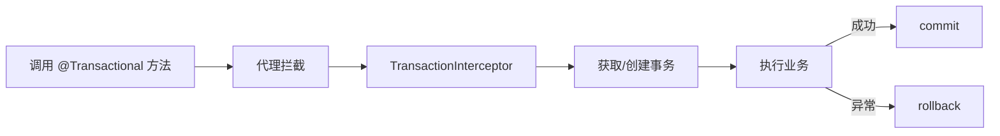

# Spring 声明式事务源码要点

> `@Transactional` 让事务管理对业务透明。其本质是用 AOP 在方法前后织入"开启/提交/回滚"。本文解析代理创建、事务拦截器与传播行为的实现。

## 1. 整体机制



- `@EnableTransactionManagement` 开启事务代理。
- `TransactionInterceptor` 是核心 Advice。

## 2. 代理创建

- 类实现接口 → JDK 动态代理。
- 无接口 → CGLIB 代理。
- 代理在容器启动时由 `AbstractAutoProxyCreator` 为带 `@Transactional` 的 Bean 创建。

## 3. 拦截器执行

`TransactionInterceptor.invokeWithinTransaction`：

```java
// 伪代码
TransactionStatus status = tm.getTransaction(txAttr); // 开启/加入
try {
    Object r = invocation.proceed();  // 执行业务
    tm.commit(status);
    return r;
} catch (Throwable ex) {
    completeTransactionAfterThrowing(status, ex); // 回滚
    throw ex;
}
```

## 4. 事务属性（TransactionAttribute）

- **传播行为（Propagation）**：REQUIRED（默认，无则建、有则加入）、REQUIRES_NEW（挂起当前、新建）、NESTED、SUPPORTS 等。
- **隔离级别**：默认用数据库。
- **超时**：`timeout`。
- **只读**：`readOnly` 提示数据库优化。
- **回滚规则**：默认只回滚 RuntimeException，可配 `rollbackFor`。

## 5. 传播行为实现

`getTransaction` 中根据当前是否存在事务决定：

| 传播 | 行为 |
| --- | --- |
| REQUIRED | 有则加入，无则新建 |
| REQUIRES_NEW | 挂起当前，新建 |
| NESTED | 嵌套保存点 |
| SUPPORTS | 有则参与，无则非事务 |
| NOT_SUPPORTED | 挂起事务，非事务执行 |
| NEVER | 有事务则抛异常 |

挂起通过 `TransactionSynchronizationManager` 绑定/解绑资源（Connection）。

## 6. 线程绑定资源

- 事务连接通过 `ThreadLocal`（`TransactionSynchronizationManager`）绑定到当前线程。
- 同一事务内多个 DAO 共用同一 Connection（从连接池取出后绑定）。
- 这就是为什么事务方法必须**同一线程、同一数据源**。

## 7. 失效场景

| 场景 | 原因 |
| --- | --- |
| 同类方法自调用 | 绕过了代理 |
| 非 public 方法 | 代理无法拦截 |
| 异常被 catch 未抛出 | 不触发回滚 |
| 异常类型不匹配 | 默认只回滚 RuntimeException |
| 多线程调用 | 资源未跨线程 |

## 8. 常见坑

| 坑 | 现象 | 对策 |
| --- | --- | --- |
| 自调用失效 | 不回滚 | 注入自己/拆类 |
| 捕获异常 | 提交脏数据 | 抛出或手动 setRollbackOnly |
| 长事务 | 锁久/连接占 | 缩小事务范围 |
| 多数据源 | 只管一个 | 多事务管理器 |

## 9. 面试题

1. @Transactional 底层是什么？
2. 为什么自调用会失效？
3. 传播行为 REQUIRES_NEW 做什么？
4. 默认回滚哪些异常？
5. 事务为何要同一线程？

## 10. 小结

声明式事务 = AOP 代理 + `TransactionInterceptor` + 线程绑定连接。核心是传播行为决定"建/加入/挂起"事务，以及自调用、异常捕获等失效陷阱。缩小事务范围、避免长事务是关键实践。
