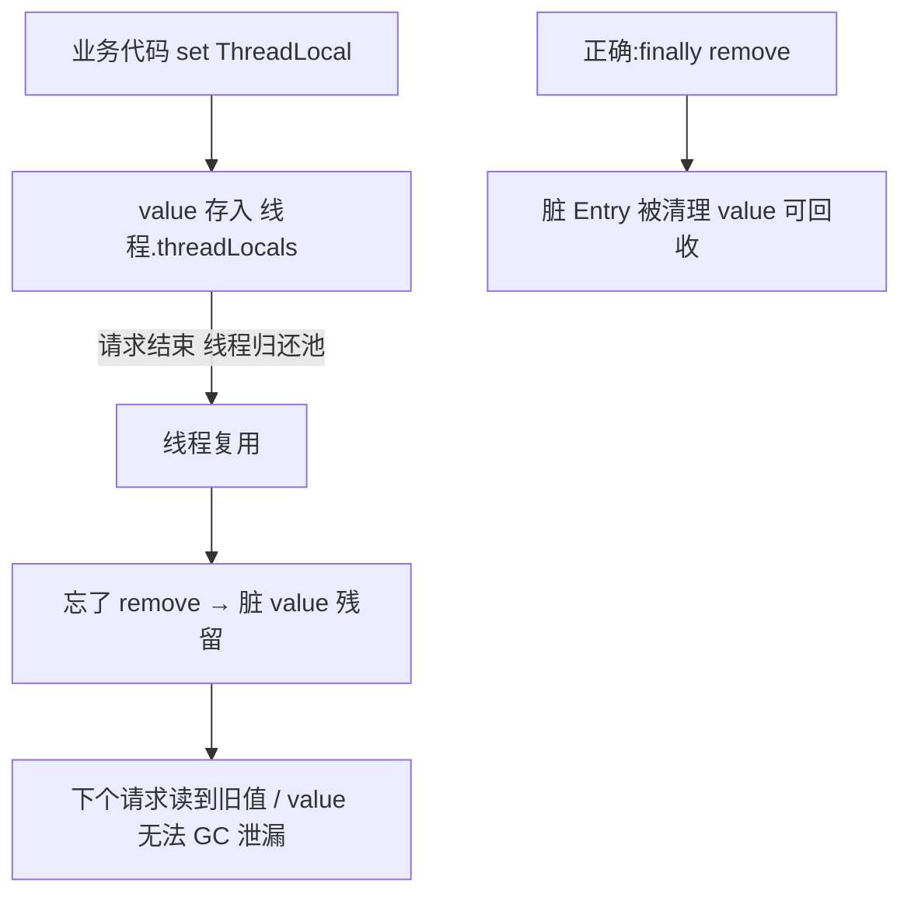

# ThreadLocal 与并发集合源码（面试高频）

> 本篇讲两类面试必考点：**ThreadLocal 的内存泄漏根因与正确用法**（高频翻车点），以及常用**并发集合的取舍**（ArrayList 不安全 / CopyOnWriteArrayList / BlockingQueue 两兄弟）。这些既是源码题，也是排查线上问题的底层功。

---

## 一、ThreadLocal 原理与内存泄漏

### 1.1 存储结构：不是 Map，是「每个线程一份 Map」

很多人的误区是「ThreadLocal 内部维护一个全局 Map」。**实际反过来**：数据存在**每个线程自己的 `ThreadLocalMap`** 里，`ThreadLocal` 只是**key**。

```java
// Thread 类里持有
ThreadLocal.ThreadLocalMap threadLocals = null;

// ThreadLocal.set 实际上往「当前线程」的 map 里塞
public void set(T value) {
    Thread t = Thread.currentThread();
    ThreadLocalMap map = getMap(t);     // 取 t.threadLocals
    if (map != null) map.set(this, value);   // this = 当前 ThreadLocal 实例作 key
    else createMap(t, value);
}
```

`ThreadLocalMap` 是 ThreadLocal 的**静态内部类**，底层是一个 **`Entry[]` 数组**，而 `Entry` 的 key（即 ThreadLocal）被设计为 **弱引用（WeakReference）**：

```java
static class Entry extends WeakReference<ThreadLocal<?>> {
    Object value;                 // ★ value 是强引用
    Entry(ThreadLocal<?> k, Object v) {
        super(k);                 // key 是弱引用
        value = v;                // value 是强引用
    }
}
```

### 1.2 为什么用弱引用？—— 为了「key 能回收」

如果 key 是**强引用**：只要 ThreadLocal 实例还在（比如被 static 修饰长期存活），即使业务代码已不再引用它，Entry 的 key 仍引用着它，导致 ThreadLocal 及其**整个 value** 都无法被 GC，泄漏更彻底。弱引用的设计意图是：**当外部不再强引用这个 ThreadLocal 时，key 在下次 GC 时能被回收**，至少给后续清理留了口子。

### 1.3 内存泄漏的真正根因：value 是强引用 + 未清理

弱引用只解决了 **key**，但 **value 是强引用**。一旦 key 被 GC 回收，`Entry` 变成 `key=null, value=强引用对象` 的**脏 Entry**：

- 这个 value 仍被 `ThreadLocalMap` 的数组引用着；
- 而线程如果是**线程池中的核心线程 / 被长期复用**（如 Tomcat 的 worker 线程、Netty 的 EventLoop 线程），它的 `threadLocals` **生命周期和线程一样长**，不会随请求结束而销毁；
- 于是这条 value 永远无法被访问、也无法被 GC —— **内存泄漏**。

> 关键结论：**泄漏的根因不是弱引用，而是 value 强引用 + 线程长期存活 + 没调 `remove()`**。ThreadLocal 自己并非不清理——`set/get/remove` 时会顺手清理 `key==null` 的脏 Entry（`expungeStaleEntry`），但这只是「顺带」，**不能依赖它**，因为那条 Entry 可能一直没被后续访问触发清理。

### 1.4 正确用法：用完必 `remove()`

```java
private static final ThreadLocal<SimpleDateFormat> sdfHolder =
        ThreadLocal.withInitial(() -> new SimpleDateFormat("yyyy-MM-dd"));

public String format(Date d) {
    try {
        return sdfHolder.get().format(d);
    } finally {
        // 在 Web/线程池场景务必清理，否则复用线程累积泄漏
        sdfHolder.remove();   // ★ 关键
    }
}
```

**典型翻车场景**：在 Spring MVC / WebFlux 的请求处理、RPC 框架的上下文传递（`TraceId`、`UserContext`）里，用 ThreadLocal 存上下文却忘了 `remove`；线程被线程池复用后，下一个请求读到上一个请求的脏数据（**数据串号**），同时 value 常驻内存。



---

## 二、ArrayList 与并发修改异常

`ArrayList` **非线程安全**，但面试常考的不只是「会出问题」，而是**两种不同异常的区别**：

### 2.1 Fail-Fast（快速失败）

`ArrayList` 内部维护 `modCount`（结构性修改计数）。迭代器创建时记录 `expectedModCount = modCount`，每次 `next()` 都检查：

```java
final void checkForComodification() {
    if (modCount != expectedModCount)
        throw new ConcurrentModificationException();   // ★
}
```

- **单线程**下：边迭代边 `list.remove()`（调用 List 的 remove，而非迭代器的 `remove()`）→ `modCount` 变了但 `expectedModCount` 没变 → 抛 `ConcurrentModificationException`。
- **多线程**下：一个线程迭代，另一个线程修改集合 → 同样抛。
- 注意：Fail-Fast 是**尽力而为的检测机制，不是并发安全的保证**；迭代器的 `it.remove()` 会同步更新 `expectedModCount`，所以安全。

### 2.2 扩容机制（顺带高频）

默认空构造首次 `add` 扩容到 10，`grow()` 按 `oldCap + (oldCap >> 1)`（1.5 倍）扩容，底层 `System.arraycopy` 拷数据。

---

## 三、CopyOnWriteArrayList（COW）

写时复制——**读无锁、写加锁并复制整个底层数组**：

```java
public boolean add(E e) {
    final ReentrantLock lock = this.lock;
    lock.lock();
    try {
        Object[] elements = getArray();
        int len = elements.length;
        Object[] newElements = Arrays.copyOf(elements, len + 1);  // ★ 复制新数组
        newElements[len] = e;
        setArray(newElements);                                     // ★ 原子替换引用
        return true;
    } finally { lock.unlock(); }
}
public E get(int index) { return get(getArray(), index); }   // 读不加锁
```

- **优点**：读操作（占绝大多数）**完全无锁**，且读永远不会抛 `ConcurrentModificationException`（读的是旧数组快照）。
- **代价**：每次写都**复制整个数组**，内存占用大、写性能差；且读到的可能是**短暂旧值**（最终一致性）。
- **适用**：读多写极少、且能容忍短暂不一致的场景（如监听器列表、白名单、配置项）。

> 对比：`ArrayList` 读快但并发改会 Fail-Fast；`Collections.synchronizedList` 读写都加锁（全局 synchronized）；`CopyOnWriteArrayList` 读无锁写复制，取舍清晰。

---

## 四、BlockingQueue 两兄弟：Array vs Linked

面试常问 `ArrayBlockingQueue` 与 `LinkedBlockingQueue` 区别（线程池 `workQueue` 选型直接用到）。

| 维度 | ArrayBlockingQueue | LinkedBlockingQueue |
|------|--------------------|---------------------|
| 底层 | **定长数组**（构造即指定容量） | 可选容量，**默认 `Integer.MAX_VALUE`（无界！）** |
| 锁 | **一把 `ReentrantLock`** + 两个 Condition（notEmpty/notFull），出入队**共用一把锁** | **两把锁**：`takeLock` 与 `putLock` 分离，入队与出队可真正并行 |
| 内存 | 预分配数组，无节点对象开销 | 每个元素一个 `Node` 节点，有额外对象开销 |
| 默认容量 | 必须显式指定 | 不指定则 `Integer.MAX_VALUE`（**易堆积 OOM**） |

源码要点：

```java
// ArrayBlockingQueue：一把锁，notEmpty/notFull 两个条件
private final ReentrantLock lock;
private final Condition notEmpty = lock.newCondition();
private final Condition notFull  = lock.newCondition();

// LinkedBlockingQueue：双锁
private final ReentrantLock takeLock = new ReentrantLock();
private final ReentrantLock putLock  = new ReentrantLock();
```

> 线程池选型提示：用 `LinkedBlockingQueue` 当 `workQueue` 却**不指定容量**，队列可能无限增长打爆内存；生产务必**显式给有界容量**（如 `new LinkedBlockingQueue<>(1000)`），或根据语义选 `ArrayBlockingQueue`（固定容量、单锁更简单可控）/`SynchronousQueue`（不缓冲、直接交接）。

---

## 五、小结对照

| 容器 / 组件 | 面试高频考点 | 一句话原理 |
|-------------|--------------|-----------|
| ThreadLocal | 内存泄漏、为什么弱引用 | 数据存在线程的 `ThreadLocalMap`；key 弱引用、value 强引用；线程池长生命周期 + 未 `remove` → 脏 value 泄漏；用完必 `remove()` |
| ArrayList | Fail-Fast、扩容 | `modCount != expectedModCount` 抛 `ConcurrentModificationException`；1.5 倍扩容 |
| CopyOnWriteArrayList | 读写取舍 | 写复制整个数组、读无锁无异常；适合读多写极少 |
| ArrayBlockingQueue | 与 Linked 区别 | 定长数组 + 单锁 + 两 Condition；Linked 默认无界（双锁、易 OOM） |
