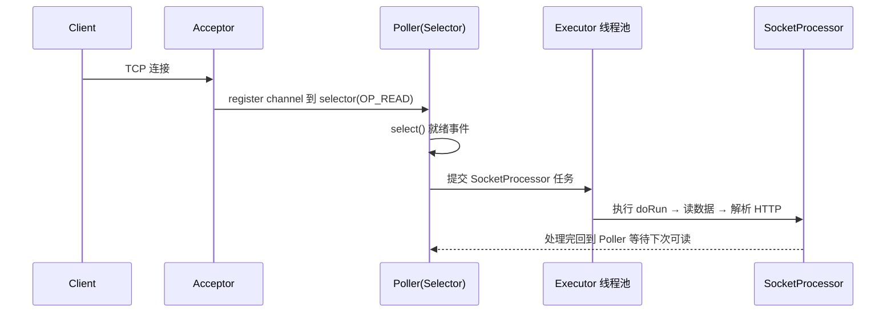
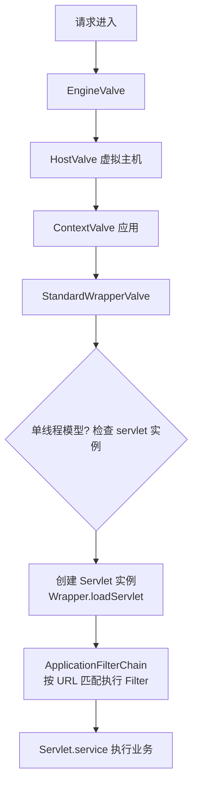
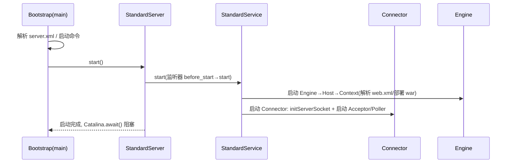

# Tomcat 源码精读

## 〇、本体介绍

**Tomcat** 是 Java 最主流的 Servlet 容器 / Web 服务器。源码展示了一个**经典的分层容器 + 责任链 + Reactor 式 IO** 架构，是理解「HTTP 请求怎么变成 Servlet 调用」的最佳样本。

**为什么读源码**：理解Connector（IO 线程模型）、Container（Engine/Host/Context/Wrapper 四级容器）、Pipeline-Valve（责任链）、类加载隔离——这些直接对应「请求链路、热部署、内存隔离」等面试/排障点。

**核心组件**：Server → Service → **Connector**（Endpoint+Processor）+ **Container**（Engine→Host→Context→Wrapper）。

---

## 一、整体架构（两大组件）

- **Connector**：负责**接收连接、解析协议（HTTP/AJP）、把请求适配成 Request/Response**，交给 Container。核心是 `Endpoint`（网络 IO）+ `Processor`（协议解析）。
- **Container**：**四级容器** Engine（引擎）→ Host（虚拟主机）→ Context（Web 应用）→ Wrapper（Servlet）。每层有 Pipeline-Valve 责任链，请求自顶向下流经各级 Valve 最后到 Wrapper 调 Servlet。

---

## 二、Connector 与 IO 模型

- **Endpoint**：底层 IO，支持 **BIO（旧）/NIO/NIO2（默认，基于 Java NIO）/APR**。
- **NIO 模型**：`Acceptor` 线程接连接 → 注册到 `Poller`（基于 `Selector` 多路复用）→ `SocketProcessor` 交 Worker 线程池处理。类似 Reactor 多路复用（与 Netty 思想同源）。
- **线程池**：`Executor`（Tomcat 自带 ThreadPoolExecutor 变体，无队列上限改用 `TaskQueue` 直接提交），处理请求逻辑。

### 2.1 深挖：NIO Endpoint 的关键类（读源码的第一张地图）

| 类 | 职责 | 关键点 |
|----|------|--------|
| `NioEndpoint` | NIO 连接器入口 | 持有 Acceptor 线程、Poller 数组、Executor |
| `Acceptor` | 单线程 accept 新连接 | `serverSocket.accept()` 后 `setSocketOptions` 注册到 Poller |
| `Poller` | 多线程（默认 2 个）Selector 轮询 | `selector.select()` → 处理 `OP_READ/OP_WRITE` → 提交 `SocketProcessor` |
| `SocketProcessor` | 连接上的任务（读/写/升级） | 实现 `Runnable`，交 `Executor` 线程池执行 |
| `NioSocketWrapper` | 连接状态包装 | 持有 `SocketChannel`、超时、附件 |
| `Executor`（ThreadPoolExecutor 变体） | 业务线程池 | 自研 `TaskQueue`：**队列无上限先提交进池**，池满才进队列，再满抛 `RejectedExecutionException` |

> 关键机制：**Acceptor 只做 accept，不做 IO**；读写全由 Poller 的 Selector 监听 + 线程池执行。这就是「少量线程扛海量连接」的核心。



---

## 三、请求处理链路（责任链）

1. `Endpoint` 收到连接，`Processor` 解析 HTTP 成 `Request`。
2. 交给 `CoyoteAdapter` 适配为 Servlet `Request/Response`。
3. 进入 Container 的 **Pipeline**：Engine Valve → Host Valve → Context Valve → Wrapper Valve → **`StandardWrapperValve` 调 `FilterChain` 再到 `Servlet.service()`**。
4. 响应沿原路返回。

> **Pipeline-Valve** 是 Tomcat 的「责任链模式」实现：每个容器一条 Pipeline，末尾是 `Basic Valve` 调下一层；自定义 Valve 可插在前面做日志/鉴权。

### 3.1 深挖：CoyoteAdapter 与 ProtocolHandler（协议与容器解耦）

- `CoyoteAdapter` 是 **Connector（协议侧）与 Container（容器侧）的桥**：把 Coyote 的 `org.apache.coyote.Request` 适配成 Servlet 规范 `HttpServletRequest`（复用对象、每次请求重置，避免重复 new——性能优化点）。
- `ProtocolHandler` 接口（`Http11NioProtocol` 等）封装：**连接器协议版本 × IO 模型 × 压缩/超时配置**；一个 `Service` 可配多个 Connector（如 8080 HTTP + 8443 HTTPS + 8009 AJP）。

### 3.2 深挖：StandardWrapperValve 到 Servlet 的执行链



- **Servlet 实例管理**：默认**单实例多线程**（`load-on-startup` 控制是否启动时预加载）；`loadServlet()` 用反射 `Class.forName` 创建实例（类加载器来自 Context）。
- **FilterChain**：`ApplicationFilterChain.doFilter` 按注册顺序递归调用，最后一个调到 `servlet.service()`。

---

## 四、类加载器（隔离与热部署）

- 层级：`Bootstrap → System → Common → (WebApp / Shared)`。每个 **Web 应用（Context）有独立 WebAppClassLoader**，实现应用间类隔离。
- **双亲委派破坏**：WebAppClassLoader **先自己加载（不委派父）再委派**，保证应用类优先；支持热部署（context 重载时新建类加载器，旧的可被 GC）。
- 这也是「为什么不同 war 的同名类互不干扰」「热部署为什么偶尔内存泄漏（旧加载器未释放）」的根源。

### 4.1 深挖：类加载顺序细节（踩坑必读）

`WebappClassLoaderBase.loadClass` 的顺序（与 JVM 默认委派相反）：

```text
1. 检查本地缓存（已加载类）
2. JVM 引导类加载器（java.*，防止应用覆盖 JDK 类）
3. 自己的 Web 应用类目录/WEB-INF/classes、lib（先自己加载！）
4. 父 CommonClassLoader（第三方公共库，如 Tomcat lib）
5. 失败才抛 ClassNotFoundException
```

> 坑：**Web 应用里的类优先于 Tomcat lib 的同类**——升级 Tomcat 的依赖版本可能不生效（应用里带了旧 jar）；排查「为什么改了 Tomcat lib 没生效」先看应用内是否重复引入。

---

## 五、启动流程（Lifecycle）

- 所有核心组件实现 **Lifecycle** 接口，统一 `init → start`（含 `before/start/after` 事件），通过 **监听器（LifecycleListener）** 解耦。Server 启动级联启动 Service → Connector / Engine 等。
- 这是「模板方法 + 观察者」模式的经典运用。

### 5.1 深挖：启动时序与标准实现



- **`Catalina.await()`**：主线程阻塞等待（配合 `ServerSocket` 8005 端口监听 shutdown 命令），保证进程不退出。
- `StandardContext` 启动时：解析 `web.xml`（`WebXml` + `ContextConfig`）→ 注册 Servlet/Filter/Listener → 触发 `ContextListener` 的 `contextInitialized` → `load-on-startup` 的 Servlet 预实例化。

---

## 六、连接与并发管理（生产调优的源码依据）

| 配置 | 源码位置 | 作用 |
|------|----------|------|
| `maxConnections` | NioEndpoint | 最大连接数（默认 8192），超出后排队 `acceptCount`（OS backlog） |
| `acceptCount` | ServerSocket backlog | accept 队列长度，满则新连接拒绝 |
| `maxThreads` | Executor | 业务线程池上限（默认 200） |
| `minSpareThreads` | Executor | 核心线程数 |
| `connectionTimeout` | Processor | 空闲连接超时（默认 20s） |
| `keepAliveTimeout` | Processor | keep-alive 保持时长 |
| `maxKeepAliveRequests` | Processor | 单连接最多复用请求数（默认 100，防线程/连接被长连占死） |

- **keep-alive 处理**：请求完成后连接不关闭，`Poller` 重新注册 `OP_READ` 等待下个请求——**连接复用的线程模型**：一个连接串行处理多请求，但请求级并发靠多连接 + 线程池。
- **压测注意**：`maxThreads` 与 `maxConnections` 的比例决定「连接堆积还是线程堆积」；线程满时任务进 TaskQueue，无界队列会「假死式排队」，配 `RejectedExecutionHandler` 或观察 `connectionPause`。

---

## 七、Session 与并发

- `StandardManager` 默认内存存 Session；集群用 `DeltaManager`/`BackupManager` 复制。Session ID 用 Cookie（JSESSIONID）。
- 并发：每请求绑定线程（ThreadLocal 传 Request），Servlet 默认**非线程安全**（成员变量需谨慎）。

---

## 八、生产实践：从源码看常见故障

1. **线程池打满「假死」**：`TaskQueue` 无上限 → 慢请求堵满队列，健康检查仍通过但请求全在排队 → 看 `http-nio-8080-exec-*` 线程状态（WAITING 在队列）、`maxThreads` 调大 + 优化慢请求。
2. **连接数打满 502/Connection reset**：`maxConnections` + `acceptCount` 满了 → 看 `netstat` 的连接数、`acceptor thread count`；排查 CLOSE_WAIT（应用没关连接）。
3. **热部署/重载后内存泄漏**：旧 WebAppClassLoader 被静态引用/ThreadLocal 持有 → 用 `JConsole`/MAT 查 classloader 泄漏；`StandardContext` reload 前触发 `contextDestroyed` 释放。
4. **Tomcat 启动慢**：`ContextConfig` 扫描 jar（`JarScanner`）耗时大 → 配 `context.xml` 排除扫描路径；`web.xml` 解析、`@WebServlet` 扫描同理。
5. **慢请求排查**：`server.tomcat.accesslog` 开访问日志看耗时；结合 `CoyoteAdapter` 的 `requestStartTime`（`org.apache.catalina.startup` 的 filter 埋点可拿到）。
6. **大 POST 限制**：`maxPostSize` / `maxSwallowSize`，超限抛 413——由 Processor 解析阶段直接拦截。

---

## 九、与其他板块的关系

- **源码系列 / Netty**：同为 Reactor/多路复用 IO 思想，但 Tomcat 偏 Servlet 容器、Netty 偏通用网络框架。
- **源码系列 / SpringBoot**：Boot 内嵌 Tomcat，`onRefresh` 里创建 `ServletWebServerApplicationContext` 并启动。
- **基础知识 / 并发编程**：线程池、Lifecycle 事件、类加载与双亲委派。
- **基础知识 / 网络协议深挖**：keep-alive、TCP 半连接队列、连接池设计在 Tomcat 落地。
- **中间件 / API 网关**：网关常反向代理到 Tomcat 后的应用。
- **SRE / 日志与告警规则库**：Tomcat 线程/连接指标是 JVM 应用告警模板的一部分。

---

## 十、速查表

| 组件 | 职责 |
|------|------|
| Connector | 接连接、解析协议、适配 Request |
| Endpoint | 底层 IO（NIO/APR） |
| Acceptor / Poller | accept 连接 / Selector 多路复用 |
| Processor | HTTP 协议解析 |
| CoyoteAdapter | 协议侧 → 容器侧适配 |
| Container | Engine/Host/Context/Wrapper 四级 |
| Pipeline-Valve | 请求责任链 |
| WebAppClassLoader | 应用隔离、热部署 |

---

## 面试高频问题（30+ 条）

1. **Tomcat 整体架构？** Server→Service→Connector+Container（Engine/Host/Context/Wrapper）。
2. **Connector 做什么？** 接连接、解析 HTTP、适配成 Servlet Request/Response。
3. **Tomcat IO 模型？** BIO(旧)/NIO/NIO2/APR；默认 NIO，基于 Selector 多路复用。
4. **NIO 下请求怎么流转？** Acceptor 接连接→Poller(Selector)→Worker 线程处理。
5. **Acceptor 和 Poller 区别？** Acceptor 只 accept；Poller 用 Selector 监听读写就绪并提交任务。
6. **四级容器是什么？** Engine→Host(虚拟主机)→Context(应用)→Wrapper(Servlet)。
7. **Pipeline-Valve 是什么？** 责任链：每层 Pipeline，末尾 Basic Valve 调下层；自定义 Valve 插队。
8. **请求从连接到 Servlet 的链路？** Endpoint→Processor→CoyoteAdapter→Container Pipeline→FilterChain→Servlet。
9. **为什么需要 CoyoteAdapter？** 把 Coyote 的 Request 适配为 Servlet 规范 Request/Response，协议与容器解耦。
10. **Tomcat 线程池和 JDK 默认池区别？** TaskQueue 无界直提：先占线程、池满才排队，避免先排队后起线程的保守策略。
11. **keep-alive 怎么实现的？** 请求完成不关连接，Poller 重新注册 OP_READ 复用连接；maxKeepAliveRequests 限制复用次数。
12. **连接数和线程数的关系？** 连接先进 acceptCount 队列，accept 后注册 Poller，有请求才占线程池线程。
13. **Tomcat 类加载层级？** Bootstrap→System→Common→WebApp/Shared；每应用独立 WebAppClassLoader。
14. **为什么破坏双亲委派？** WebAppClassLoader 先自己加载，保证应用类优先、隔离。
15. **热部署怎么实现的？** 重建 WebAppClassLoader，旧加载器不可达后被 GC；Context reload。
16. **热部署内存泄漏原因？** 旧类加载器被 ThreadLocal/静态引用持有，未释放。
17. **Lifecycle 接口作用？** 统一 init/start/stop 事件，监听器解耦启动流程。
18. **启动时 main 线程在干嘛？** Catalina.await() 阻塞等 shutdown，进程不退出。
19. **Servlet 是单例吗？线程安全吗？** 单实例多线程，默认非线程安全，成员变量需同步或避免共享。
20. **Filter 和 Servlet 执行顺序？** Filter 按注册顺序形成链，最后调到 servlet.service()。
21. **Tomcat 与 Jetty 区别？** Tomcat 重 Servlet 容器、成熟；Jetty 轻量、易嵌入。
22. **Session 怎么存？** 默认内存 StandardManager；集群复制或外置(Redis)。
23. **JSESSIONID 作用？** 标识 Session，存 Cookie。
24. **Connector 和 Container 如何解耦？** 通过 Adapter 适配，协议与容器独立演进。
25. **Tomcat 怎么支持 HTTPS？** Connector 配 SSL/TLS 证书（JSSE/OpenSSL）。
26. **线程池打满会怎样？** 任务进无界 TaskQueue 排队，表现为请求变慢而非拒绝；需监控线程状态。
27. **连接数打满的表现？** acceptCount 满后新连接被拒（Connection reset/超时）。
28. **热部署和 jar 扫描为什么慢？** ContextConfig 的 JarScanner 逐 jar 扫描注解；可配排除。
29. **为什么不同 war 同名类不冲突？** 各自独立 WebAppClassLoader，类隔离。
30. **Tomcat 在 Spring Boot 内嵌？** Boot 内嵌 Tomcat，启动时初始化 Connector+Container，无需外部部署。
31. **如何排查 Tomcat 假死？** 看 exec 线程是否全 WAITING（队列排队）、连接数是否打满、GC/慢 SQL 是否卡住请求线程。
32. **双亲委派破坏的边界？** 应用优先，但 java.* 必须父加载器先加载，防应用覆盖 JDK 核心类。

---

## 十一、与其他板块的关系（补充）

- **场景设计 / 长连接**：keep-alive、连接复用、线程模型直接相关。
- **基础知识 / 计算机原理**：内存与类加载器、线程模型。

> 一句话总结：**Tomcat = Reactor 网络层（Connector）+ 责任链容器层（Container）+ 类加载隔离（WebAppClassLoader）**，读它等于同时读懂「IO 多路复用、责任链、双亲委派破坏、生命周期模板」四个设计点。
