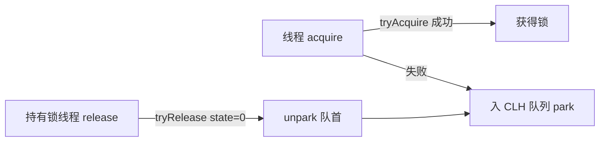
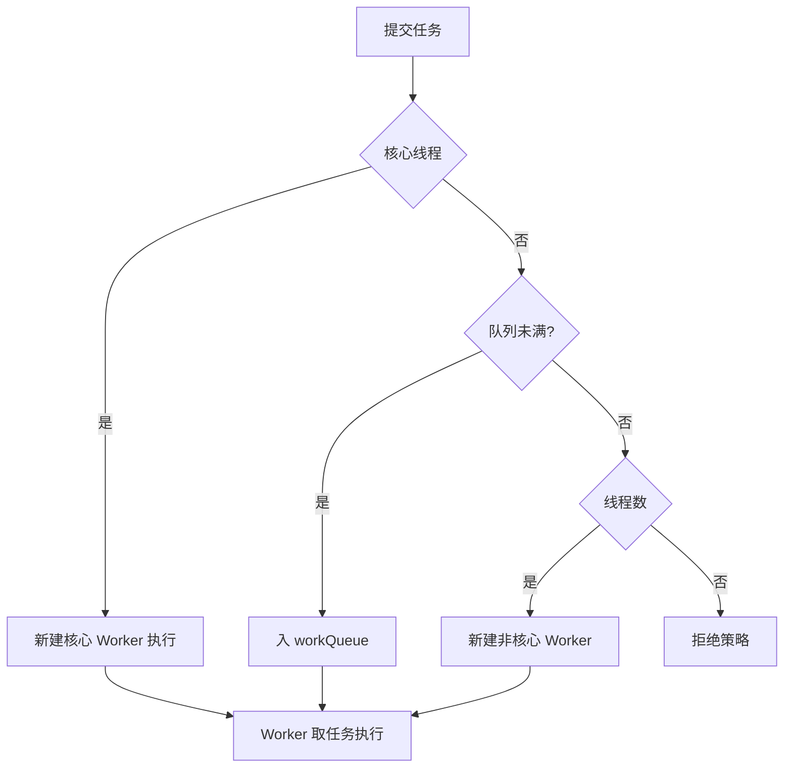

# Java 基础

## Timer、ScheduledThreadPool、DelayQueue

可以看出 Timer 实际就是根据任务的执行时间维护了一个优先队列，并且起了一个线程不断地拉取任务执行，根据代码可以看到有三个问题：

1. 优先队列的插入和删除的时间复杂度是 O(logn)，当任务量大的时候，频繁的入堆出堆性能有待考虑。
2. 单线程执行，如果一个任务执行的时间过久则会影响下一个任务的执行时间（当然你任务的 run 要是异步执行也行）。
3. 从代码中可以看到对异常没有做什么处理，那么一个任务出错的时候会导致之后的任务都无法执行。

```java
class TaskQueue {
    private TimerTask[] queue = new TimerTask[128];
    void add(TimerTask task) {
        // Grow backing store if necessary
        if (size + 1 == queue.length)
            queue = Arrays.copyOf(queue, 2*queue.length); //扩容


        queue[++size] = task; //先将任务添加到数组最后面
        fixUp(size); //调整堆
    }
    private void fixUp(int k) { //时间复杂度为O(logn)
        while (k > 1) {
            int j = k >> 1;
            if (queue[j].nextExecutionTime <= queue[k].nextExecutionTime)//通过任务执行时间对比，调整顺序
                break;
            TimerTask tmp = queue[j];  queue[j] = queue[k]; queue[k] = tmp;
            k = j;
        }
    }
  /**
     * Return the "head task" of the priority queue.  (The head task is an
     * task with the lowest nextExecutionTime.)
     */
    TimerTask getMin() {
        return queue[1]; //返回最接近执行时间的任务
    }
     //.......
}
```

```java
public void run() {
        try {
            mainLoop();//无异常捕获
        } finally {
            // Someone killed this Thread, behave as if Timer cancelled
            synchronized(queue) {
                newTasksMayBeScheduled = false;
                queue.clear();  // Eliminate obsolete references
            }
        }
    }


    /**
     * The main timer loop.  (See class comment.)
     */
    private void mainLoop() {
        while (true) {
            try {
                TimerTask task;
                boolean taskFired;
                synchronized(queue) {
                    // Wait for queue to become non-empty
                    while (queue.isEmpty() && newTasksMayBeScheduled)
                        queue.wait();
                    if (queue.isEmpty())
                        break; // Queue is empty and will forever remain; die


                    // Queue nonempty; look at first evt and do the right thing
                    long currentTime, executionTime;
                    task = queue.getMin(); //获取任务
                    synchronized(task.lock) {
                        if (task.state == TimerTask.CANCELLED) { //取消泽移除并继续循环
                            queue.removeMin();
                            continue;  // No action required, poll queue again
                        }
                        currentTime = System.currentTimeMillis();
                        executionTime = task.nextExecutionTime;
                        if (taskFired = (executionTime<=currentTime)) { //执行时间到了
                            if (task.period == 0) { // 不是周期任务
                                queue.removeMin(); //移除任务
                                task.state = TimerTask.EXECUTED;//变更任务状态为已执行
                            } else { // 周期任务，更新时间为下次执行时间
                                queue.rescheduleMin(
                                  task.period<0 ? currentTime   - task.period
                                                : executionTime + task.period);
                            }
                        }
                    }
                    if (!taskFired) // 还未到达执行时间等待
                        queue.wait(executionTime - currentTime);
                }
                if (taskFired)  // 执行任务，无异常捕获
                    task.run();
            } catch(InterruptedException e) {
            }
        }
    }
```

现在我们来看下 ScheduledThreadPoolExecutor 提交一个任务后，整体的执行过程：

提交一个任务后，为了满足 ScheduledThreadPoolExecutor 能够延时执行任务和能周期执行任务的特性，会先将实现 `Runnable` 接口的类转换成 `ScheduledFutureTask`。

然后会调用 `delayedExecute` 方法进行执行任务：先将任务放入到队列中，然后调用 `ensurePrestart` 方法，新建 `Worker` 类（此逻辑为线程池 `ThreadPoolExecutor` 实现）。

当执行任务时，就会调用被 `Worker` 所重写的 `run` 方法，进而会继续执行 `runWorker` 方法。在 `runWorker` 方法中会调用 `getTask` 方法从阻塞队列中不断地去获取任务进行执行，直到从阻塞队列中获取的任务为 null 的话，线程结束终止。（此处逻辑都是线程池 `ThreadPoolExecutor` 的实现）

`getTask` 方法会调用队列的 `poll` 和 `take` 方法，此处就调用到 `DelayedWorkQueue` 重写的 `poll` 和 `take` 逻辑，实现了延迟任务的阻塞。

执行任务时，将调用 `ScheduledFutureTask` 重载的 `run` 方法，实现周期性任务的场景。

> **小结：**
>
> 1. ScheduledThreadPoolExecutor 继承了 ThreadPoolExecutor，通过重写任务、阻塞队列实现了延迟任务调度的实现。
> 2. ScheduledThreadPoolExecutor 大致的流程和 Timer 差不多，都是通过一个阻塞队列维护任务，能实现单次任务、周期性任务的执行，主要差别在于能多线程运行任务，不会单线程阻塞，并且 Java 线程池底层的 runWorker 实现了异常的捕获，不会因为一个任务的出错而影响之后的任务。
> 3. 在任务队列的维护上，与 Timer 一样，也是优先队列，插入和删除的时间复杂度是 O(logn)。

DelayQueue 的元素必须实现 `Delayed` 接口，它本身也实现了 `BlockingQueue`：

```java
//元素必须实现Delayed接口，也实现了阻塞队列
public class DelayQueue<E extends Delayed> extends AbstractQueue<E>
    implements BlockingQueue<E> {

    private final transient ReentrantLock lock = new ReentrantLock();
    private final PriorityQueue<E> q = new PriorityQueue<E>();//优先队列，

   public E take() throws InterruptedException {
        final ReentrantLock lock = this.lock;
        lock.lockInterruptibly();
        try {
            for (;;) {
                E first = q.peek();
                if (first == null)
                    available.await();
                else {
                    long delay = first.getDelay(NANOSECONDS);
                    if (delay <= 0) //小于等于0，时间到了
                        return q.poll();
                    first = null; // don't retain ref while waiting
                    if (leader != null)
                        available.await();//没有抢到leader的线程进入等待，避免大量唤醒操作
                    else {
                        Thread thisThread = Thread.currentThread();
                        leader = thisThread;
                        try {
                            available.awaitNanos(delay);//leader线程，在等待一定时间后再次尝试获取
                        } finally {
                            if (leader == thisThread)//重置leader
                                leader = null;
                        }
                    }
                }
            }
        } finally {
            if (leader == null && q.peek() != null)
                available.signal();
            lock.unlock();
        }
    }
    //...
}
    //继承了Comparable
public interface Delayed extends Comparable<Delayed> {


    long getDelay(TimeUnit unit);


}

---

```
## 集合框架核心源码要点

### HashMap（JDK 8+）

- **结构**：数组 `Node<K,V>[] table` + 链表 + 红黑树。默认容量 16，负载因子 0.75，阈值 = 容量 × 负载因子。
- **hash 扰动**：`(h = key.hashCode()) ^ (h >>> 16)`，高位参与运算减少碰撞。
- **定位桶**：`(n - 1) & hash`，容量恒为 2 的幂才有此优化。
- **树化**：链表长度 ≥ 8 且 table 容量 ≥ 64 时转红黑树；树节点 ≤ 6 时退化为链表。
- **扩容**：`resize()` 双倍扩容，利用 `e.hash & oldCap` 判断元素留在原桶还是迁移到「原位置 + oldCap」，无需重算 hash。
- **并发问题**：`put` 时多线程同时扩容可能形成**环形链表**导致 `get` 死循环（JDK 7 经典 bug，JDK 8 改为尾插但仍非线程安全，正式并发请用 `ConcurrentHashMap`）。

### ConcurrentHashMap（JDK 8+）

- **放弃分段锁**，改为 `Node[]` + `synchronized`（锁桶头节点）+ `CAS`。
- 写：`hash` 定位桶，桶空用 `CAS` 放头节点；非空则 `synchronized` 锁住头节点，链表/树插入。
- 读：几乎无锁（`volatile` 修饰 `value` 与 `next`，保证可见性）。
- `size()` 用 `baseCount` + `CounterCell[]` 分片累加（类似 LongAdder），避免热点。

```java
// 典型写流程（putVal 简化）
if (tab == null || (f = tabAt(tab, i = (n - 1) & h)) == null) {
    if (casTabAt(tab, i, null, new Node<K,V>(h, k, v))) break; // CAS 无锁插入
} else {
    synchronized (f) { /* 锁头节点，链表/树插入 */ }
}
```

## 并发基石：AQS 与锁

### AbstractQueuedSynchronizer（AQS）

AQS 是 `ReentrantLock` / `Semaphore` / `CountDownLatch` / `ReentrantReadWriteLock` 的底层同步框架。

- **state**：`volatile int state`，同步状态（锁重入次数 / 许可数）。
- **CLH 队列**：竞争失败的线程包装成 `Node` 入队（FIFO 双向队列），`Node` 的 `waitStatus`（SIGNAL/CANCELLED 等）控制唤醒。
- **两种模式**：`exclusive`（独占，如锁）、`shared`（共享，如信号量）。
- 模板方法：`tryAcquire` / `tryRelease` / `tryAcquireShared` / `tryReleaseShared` 由子类实现，AQS 负责入队、阻塞（`LockSupport.park`）、唤醒。



### ReentrantLock vs synchronized

| 维度 | synchronized | ReentrantLock |
|------|--------------|---------------|
| 实现 | JVM 内置（监视器锁） | AQS（Java 代码） |
| 可中断 | 否 | `lockInterruptibly()` 可 |
| 公平/非公平 | 非公平 | 可选 `fair=true` |
| 条件变量 | 单一 `wait/notify` | 多 `Condition` |
| 尝试获取 | 否 | `tryLock(timeout)` |

- `synchronized` 在 JDK 6 后有多级锁升级：**偏向锁 → 轻量级锁（CAS 自旋）→ 重量级锁（操作系统互斥，线程 park）**，降低无竞争时的开销。
- `ReentrantLock` 非公平模式下，新线程可能抢到刚释放的锁（插队），吞吐更高；公平模式严格按队列顺序。

### CAS 与原子类

`Unsafe.compareAndSwapInt` 是乐观锁基础：`期望值==内存值`才更新，失败重试（自旋）。问题：

- **ABA**：值被改回原值，CAS 误判成功 → 用 `AtomicStampedReference`（版本号）解决。
- **自旋开销**：高竞争下 CPU 空转。

`LongAdder` 用**分段 Cell + base** 把热点分散，高并发累加性能远胜 `AtomicLong`（Sentinel/Netty 统计均用此思想）。

```java
// AtomicInteger 核心
public final int incrementAndGet() {
    return U.getAndAddInt(this, VALUE, 1) + 1; // Unsafe CAS 自旋
}
```

## 线程池（ThreadPoolExecutor）源码要点

除上方 `ScheduledThreadPoolExecutor` 外，普通 `ThreadPoolExecutor` 关键点：

- **七大参数**：`corePoolSize` / `maximumPoolSize` / `keepAliveTime` / `workQueue` / `threadFactory` / `handler` / `allowCoreThreadTimeOut`。
- **execute 流程**：核心线程未满 → 新建 `Worker` 跑任务；核心满 → 任务进 `workQueue`；队列满 → 创建非核心线程至 `maximumPoolSize`；再满 → 触发 `RejectedExecutionHandler`（Abort/Discard/DiscardOldest/CallerRuns）。
- **Worker**：本身继承 `AQS` 且实现 `Runnable`，`run()` → `runWorker()` 循环 `getTask()` 从队列取任务；空闲超 `keepAliveTime` 且线程数 > core 则回收。

```java
// execute 核心分支（简化）
if (workerCount < corePoolSize) addWorker(command, true);
else if (workQueue.offer(command)) { /* 入队 */ }
else if (!addWorker(command, false)) reject(command); // 拒绝策略
```



> **读源码建议**：线程池抓 `execute` → `addWorker` → `runWorker` → `getTask`；并发锁抓 AQS 的 `acquire`/`release` 与 `Node` 入队；原子类抓 `Unsafe` + `LongAdder` 分段。HashMap 重点看 `resize` 的低位/高位拆分。

---

## AQS 深入：Condition / 读写锁 / StampedLock

### Condition 实现（等待/通知）

`ReentrantLock.newCondition()` 返回 `AbstractQueuedSynchronizer.ConditionObject`，内部维护一条**条件等待队列**：

```java
// await：释放锁 → 入条件队列 park → 被 signal 后重新抢锁
public final void await() throws InterruptedException {
    Node node = addConditionWaiter();      // 加入条件队列
    int savedState = fullyRelease(node);  // 释放锁(state=0)
    while (!isOnSyncQueue(node))           // 还没被移到 AQS 同步队列
        LockSupport.park(this);            // 阻塞
    acquireQueued(node, savedState);       // 重新抢锁
}
// signal：把条件队列头节点转移到 AQS 同步队列
public final void signal() {
    Node first = firstWaiter;
    if (first != null) doSignal(first);
}
```

要点：`await`/`signal` 必须持锁调用；一个 `ReentrantLock` 可 `newCondition()` 多个，实现**多条件精确唤醒**（如生产者/消费者两个队列），优于 `synchronized` 单一 `wait/notify`。

### 读写锁 ReentrantReadWriteLock

`state` 被**按位拆分**：高 16 位 = 读锁持有计数，低 16 位 = 写锁重入计数。

```java
// 写锁 tryAcquire：低16位
int c = getState();
int w = exclusiveCount(c);     // c & 0xFFFF
if (c != 0 && (w == 0 || owner != thread)) return false; // 有读锁则写锁拿不到
// 读锁 tryAcquireShared：高16位累加，CAS 提升 readerCount
```

- 写锁独占、读锁共享；**写锁可降级为读锁**（先拿写再拿读再放写），读不能升级为写（避免死锁）。
- 局限：读多写少时「写饥饿」（读锁一直占着，写锁等不到）——`StampedLock` 解决了这点。

### StampedLock（JDK 8+）

乐观读锁：读时不加锁，仅拿一个 `stamp`，读完 `validate(stamp)` 校验期间是否有人写：

```java
double distance(Point p) {
    long stamp = lock.tryOptimisticRead();   // 乐观读，无锁
    double x = p.x, y = p.y;
    if (!lock.validate(stamp)) {             // 期间有写 → 升级为悲观读
        stamp = lock.readLock();
        try { x = p.x; y = p.y; } finally { lock.unlockRead(stamp); }
    }
    return Math.sqrt(x*x + y*y);
}
```

> 注意：`StampedLock` **不可重入**，且中断敏感（调用 `readLockInterruptibly`），适合「读多写少、读操作极短」的场景。

## 线程池拒绝策略与调优

`RejectedExecutionHandler` 四种内置策略：

| 策略 | 行为 | 适用 |
|------|------|------|
| `AbortPolicy`（默认） | 抛 `RejectedExecutionException` | 需感知失败 |
| `CallerRunsPolicy` | 由提交线程自己执行 | 平滑降级、背压 |
| `DiscardPolicy` | 静默丢弃 | 可丢的非关键任务 |
| `DiscardOldestPolicy` | 丢弃队首最老任务，重试提交 | 只关心最新 |

**调优要点**：

- 核心/最大线程数：CPU 密集 → `Ncpu + 1`；IO 密集 → 适当调大（经验 `2*Ncpu` 起，结合 RT 与并发度测算）。
- 队列：用 `LinkedBlockingQueue`（有界！）而非无界，避免任务堆积打爆内存；队列容量结合「最大容忍延迟」设定。
- 自定义线程工厂：命名线程（便于排查）、设 `daemon`、统一 `UncaughtExceptionHandler`。
- 监控：暴露 `threadPoolExecutor.getActiveCount()` / `getQueue().size()` / 拒绝次数，配合告警。

```java
ThreadPoolExecutor exec = new ThreadPoolExecutor(
    8, 32, 60L, TimeUnit.SECONDS,
    new LinkedBlockingQueue<>(1000),
    new NamedThreadFactory("biz-pool"),
    new ThreadPoolExecutor.CallerRunsPolicy()); // 满了由调用方线程兜底执行
```

## CompletableFuture 源码要点

`CompletableFuture` 是 JDK 8 的「异步编排核心」，内部是一个**无锁的完成栈（stack of Completion）**：

- `supplyAsync` / `runAsync` 提交到 `ForkJoinPool.commonPool()`（或自定义 executor）。
- 每个 `thenApply`/`thenAccept`/`thenCompose` 都是一个 `Completion` 节点，结果就绪时被 `postComplete()` 唤醒执行。
- `join()`/`get()` 阻塞等待；`whenComplete` 做副作用（不转换值）。
- 底层用 `CAS` + `Treiber 栈`（无锁）管理依赖链，比旧 `Future` + 轮询高效得多。

```java
CompletableFuture.supplyAsync(() -> orderQuery(id))      // 异步查订单
    .thenApplyAsync(order -> enrich(order))             // 链式编排
    .thenCombine(
        CompletableFuture.supplyAsync(() -> queryStock(id)),  // 并行
        (order, stock) -> merge(order, stock))
    .whenComplete((r, e) -> { if (e != null) log.error(e); });
```

> 异常处理：`exceptionally` / `handle` 捕获链路异常；注意**不显式处理异常且未 get/join 会吞掉异常**，务必在末端 `whenComplete` 或 `exceptionally` 兜底。

## 原子类与 VarHandle（JDK 9+）

`java.util.concurrent.atomic` 底层靠 `Unsafe` 的 CAS。JDK 9 引入 **`VarHandle`** 作为 `Unsafe` 的安全替代：

```java
class Counter {
    volatile int value;
    static final VarHandle VH;
    static { try { VH = MethodHandles.lookup().findVarHandle(Counter.class, "value", int.class); }
             catch (ReflectiveOperationException e) { throw new Error(e); } }
    void inc() { VH.getAndAdd(this, 1); }          // CAS 风格的原子累加
    boolean cas(int e, int n) { return VH.compareAndSet(this, e, n); }
}
```

- `VarHandle` 提供 `getAndAdd` / `compareAndSet` / `getAcquire` / `setRelease` 等精细内存语义，且是标准 API（不像 `Unsafe` 受限）。
- `AtomicInteger`/`AtomicLong` 内部仍走 `Unsafe`（或 JDK 9+ 的 `VarHandle`），`LongAdder` 用分片 `Cell[]` 把热点分散，高争用下远胜 `AtomicLong`。
- `AtomicStampedReference` 用「值 + 版本号」一对解决 **ABA**；`AtomicMarkableReference` 用「值 + 布尔标记」。

## HashMap / ConcurrentHashMap 红黑树化深入

前文提到链表 ≥8 树化、≤6 退化，这里看 `TreeNode` 的实现差异：

- `HashMap.TreeNode` **同时是红黑树节点又是双向链表节点**（继承 `LinkedHashMap.Entry`，额外有 `prev/left/right/parent/red`）。树化时先用 `treeifyBin` 把链表重排成双向链表，再构造成红黑树——所以结构里保留 `next/prev` 以便退化回链表。
- 树化条件双保险：`(n = tab.length) < MIN_TREEIFY_CAPACITY(64)` 时不树化，而是 `resize()` 扩容（因为小表下扩容性价比更高，扩容后链表自然变短）。
- `ConcurrentHashMap.TreeNode` 同样继承 `Node`，但多了一个 `TreeBin` 包装类：`TreeBin` 持红黑树根并作为桶的头节点，用 `volatile int lockState`（`WAITER`/`WRITER` 标记）在树操作中做细粒度同步，读操作几乎无锁（利用 volatile + CAS），写操作才锁 `TreeBin`。

```java
// HashMap 树化入口（putVal 中）
if (binCount >= TREEIFY_THRESHOLD - 1) // 8-1=7，第8个节点时
    treeifyBin(tab, hash);
// treeifyBin 内部
if (tab == null || (n = tab.length) < MIN_TREEIFY_CAPACITY)
    resize();          // 表太小先扩容
else if ((b = tabAt(...)) != null)
    treeify(table);    // 真正成树
```
```

```
