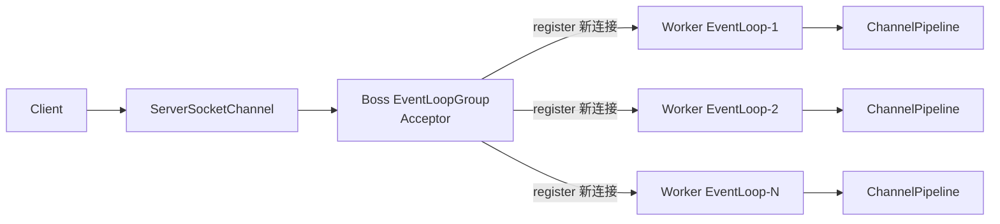
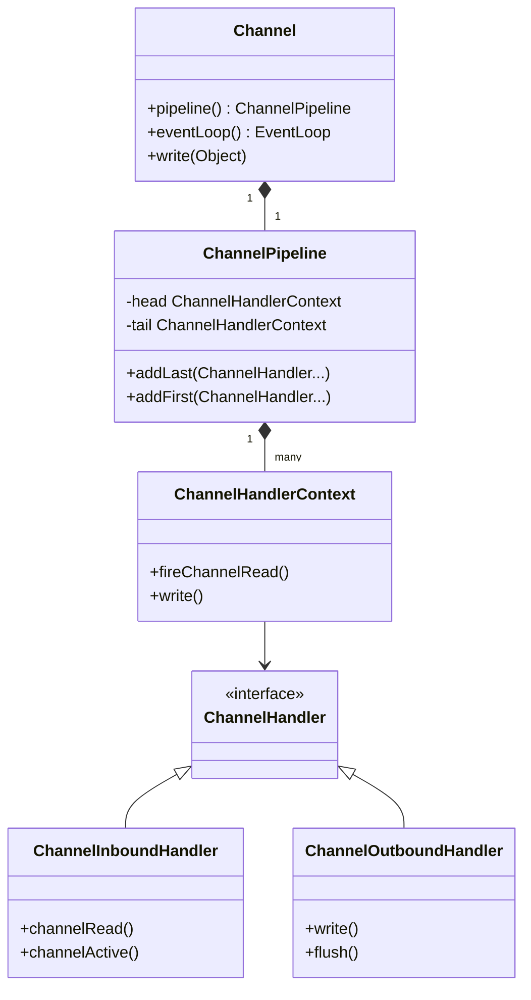
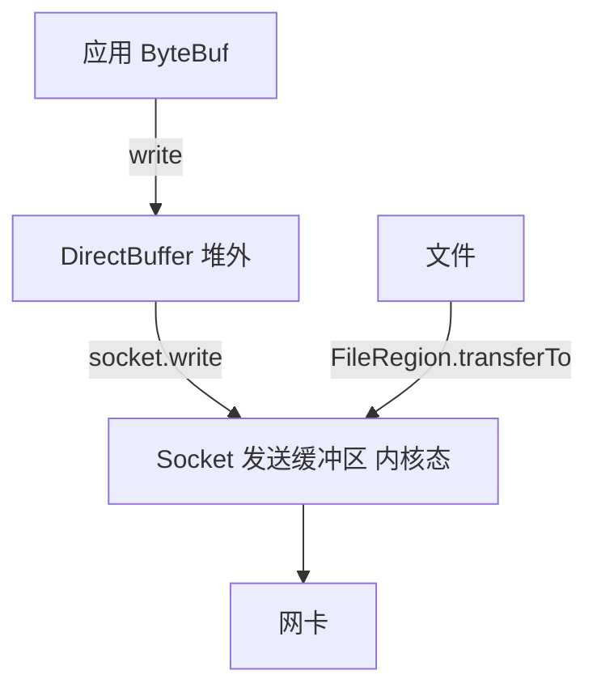
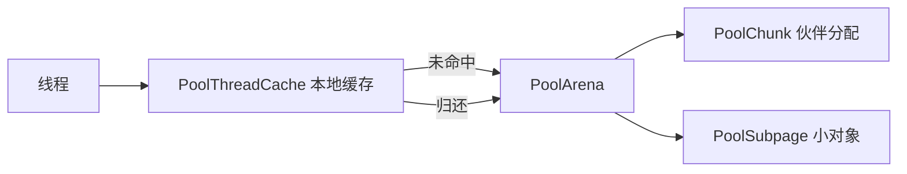
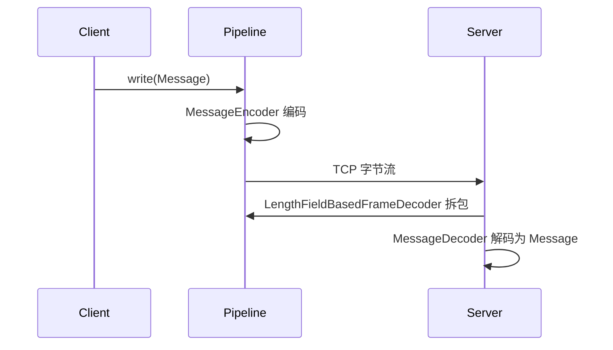

# Netty 源码解析

> ⚠️ 本页内容待补充。

---

## 一、Reactor 线程模型

Netty 整体基于 **Reactor 主从多线程模型**：

- **BossGroup（ParentGroup）**：只负责 `ServerSocketChannel` 的 `OP_ACCEPT`，把新连接注册到 Worker。
- **WorkerGroup（ChildGroup）**：负责已建立连接的 `SocketChannel` 的读写（`OP_READ/OP_WRITE`）。
- 每个 `EventLoop` 绑定一个线程，串行处理绑定到它的多个 Channel 的 I/O 事件，因此**业务 Handler 内无需加锁**。



> 单线程 Reactor（一个 EventLoop 既 accept 又 read）、多线程 Reactor（一个 accept + 多个 read）、主从多线程（Netty 默认）三者区别只在 Group 的拆分粒度。

## 二、核心启动类：Bootstrap / ServerBootstrap

`Bootstrap` 用于客户端，`ServerBootstrap` 用于服务端，二者都继承自 `AbstractBootstrap`。

```java
// 服务端启动骨架
ServerBootstrap b = new ServerBootstrap();
b.group(bossGroup, workerGroup)           // 设置两个线程组
 .channel(NioServerSocketChannel.class)   // 反射创建 Channel 工厂
 .option(ChannelOption.SO_BACKLOG, 1024)
 .childOption(ChannelOption.SO_KEEPALIVE, true)
 .childHandler(new ChannelInitializer<SocketChannel>() {
     @Override
     protected void initChannel(SocketChannel ch) {
         ch.pipeline().addLast(new DecoderHandler());
         ch.pipeline().addLast(new BizHandler());
     }
 });
ChannelFuture f = b.bind(8080).sync();    // 异步绑定
f.channel().closeFuture().sync();
```

关键方法链路：

- `bind()` → `AbstractBootstrap.doBind()` → `initAndRegister()` → `channelFactory.newChannel()` 创建 `NioServerSocketChannel` → `config().group().register(channel)` 把 Channel 注册到 Boss 的 EventLoop。
- `group()` 区分 `parentGroup`（accept）与 `childGroup`（client IO）。
- `childHandler()` 里的 `ChannelInitializer` 在 Channel 注册成功后回调 `initChannel()`，把自定义 Handler 装入 `ChannelPipeline`。

## 三、Channel / ChannelPipeline / ChannelHandler

### 三者关系



- **ChannelPipeline**：双向链表，头 `head`（outbound 起点 / inbound 终点），尾 `tail`。每个节点是 `ChannelHandlerContext`（包装了 Handler + 前后指针）。
- **Inbound（入站）**：数据从 `head` 向 `tail` 流动，事件如 `channelRead`、`channelActive`。调用 `ctx.fireChannelRead()` 向下传递。
- **Outbound（出站）**：数据从 `tail` 向 `head` 流动，事件如 `write`、`connect`、`close`。
- 典型 `ByteToMessageDecoder`（入站解码）、`MessageToByteEncoder`（出站编码）、`SimpleChannelInboundHandler`（业务）。

> 设计要点：Pipeline 把「协议解析 / 业务处理 / 编解码」拆成独立 Handler，符合**责任链 + 装饰器**模式；通过 `ChannelHandlerContext` 实现事件在链上的精准传播，避免每次都从头遍历。

## 四、EventLoop 线程模型

`EventLoop` = 一个线程 + 一个 `Selector` + 一个 `MpscQueue`（多生产者单消费者任务队列）。

```java
// NioEventLoop.run() 核心循环：select → 处理 IO → 处理任务
protected void run() {
    for (;;) {
        try {
            if (hasTasks()) {
                selectNow();           // 有任务立即 select，不阻塞
            } else {
                select(curDeadlineNanos); // 带超时 select
            }
            processSelectedKeys();     // 处理就绪的 IO 事件
            runAllTasks(ioTime * (100 - ioRatio) / 100); // 处理队列任务，控制 IO/任务时间比
        } catch (Throwable t) { ... }
    }
}
```

要点：

1. **串行无锁**：同一个 Channel 的所有 Handler 永远跑在绑定它的那一个 EventLoop 线程上，所以 Handler 内部状态不需要同步。
2. **任务提交**：`ctx.executor().execute(runnable)`、`channel.eventLoop().execute()` 会把任务放进该 EventLoop 的 `MpscQueue`，由同一线程消费——这是 Netty 实现「线程局部串行」的关键。
3. **ioRatio**：默认 50，表示 IO 处理与任务处理各占一半时间，避免任务饿死 IO 或反之。

## 五、ByteBuf：更强大的字节容器

对比 JDK `ByteBuffer`，Netty `ByteBuf` 做了改进：

| 维度 | ByteBuffer | ByteBuf |
|------|-----------|---------|
| 读写指针 | 共用 `position`，切换需 `flip()` | 分离 `readerIndex` / `writerIndex` |
| 容量扩容 | 固定，需手动 `allocate` | 写满自动扩容 |
| 池化 | 无 | 支持 `PooledByteBufAllocator`（基于 jemalloc 思想） |
| 零拷贝视图 | 无 | `slice()` / `duplicate()` 共享底层内存 |
| 引用计数 | 无 | `ReferenceCounted`，`retain()` / `release()` 显式释放 |

```java
ByteBuf buf = Unpooled.buffer(1024);
buf.writeInt(1);          // writerIndex += 4
buf.writeBytes("hello".getBytes(StandardCharsets.UTF_8));
int i = buf.readInt();    // readerIndex += 4，不破坏后续读
```

内存类型：

- **堆内 `HeapByteBuf`**：分配快，GC 管理，但 IO 时需要一次内核拷贝。
- **堆外 `DirectByteBuf`**：零拷贝基础，避免 GC 压力，但创建/销毁成本高 → 必须配合**池化**。

## 六、拆包与粘包（TCP 半包/粘包）

TCP 是字节流，应用层需自己界定消息边界。Netty 提供 `ByteToMessageDecoder` 子类解决：

| 解码器 | 策略 | 适用 |
|--------|------|------|
| `LineBasedFrameDecoder` | 以换行符 `\n`/`\r\n` 分隔 | 文本协议 |
| `DelimiterBasedFrameDecoder` | 自定义分隔符 | 文本协议 |
| `FixedLengthFrameDecoder` | 固定长度 | 定长报文 |
| `LengthFieldBasedFrameDecoder` | 消息头携带长度字段 | 主流二进制协议 |

`LengthFieldBasedFrameDecoder` 工作原理（`decode` 抽象）：先读 `lengthFieldLength` 指定长度的长度字段，得到 body 长度，累积到足够字节再切出一个完整 `ByteBuf` 向下传递；不足则 `cumulator` 累积，标记 `needDiscard` 等状态。

```
入站字节流: [len=5][hello][len=3][abc][len=...]
           ↓ LengthFieldBasedFrameDecoder
出站 Packet: "hello"  "abc"  ...
```

自定义示例（基于长度字段）：

```java
pipeline.addLast(new LengthFieldBasedFrameDecoder(
        1024 * 1024,  // maxFrameLength
        0,            // lengthFieldOffset（长度字段在开头）
        4,            // lengthFieldLength（4 字节 int）
        0,            // lengthAdjustment
        4));          // initialBytesToStrip（跳过长度字段本身）
```

## 七、心跳与断线重连

### 心跳（IdleStateHandler）

```java
pipeline.addLast(new IdleStateHandler(
        0,           // readerIdleTime：读空闲
        5,           // writerIdleTime：5s 写空闲
        0));         // allIdleTime
// 自定义 Handler 覆写 userEventTriggered 发 Ping
@Override
public void userEventTriggered(ChannelHandlerContext ctx, Object evt) {
    if (evt instanceof IdleStateEvent) {
        ctx.writeAndFlush(new PingMessage());  // 超时发心跳
    }
}
```

`IdleStateHandler` 借助 `EventLoop` 的 `schedule` 定时检测 `reader/writer/allIdle` 时间，触发 `IdleStateEvent` 事件向下传播。

### 断线重连（客户端）

```java
bootstrap.connect(host, port).addListener((ChannelFutureListener) future -> {
    if (!future.isSuccess()) {
        // 失败则定时重连
        future.channel().eventLoop().schedule(
            () -> connect(), 3, TimeUnit.SECONDS);
    }
});
// 连接断开事件
@Override
public void channelInactive(ChannelHandlerContext ctx) {
    ctx.channel().eventLoop().schedule(() -> connect(), 3, TimeUnit.SECONDS);
}
```

## 八、零拷贝（Zero-Copy）

Netty 在多处使用零拷贝减少内存拷贝：

1. **`FileRegion` + `transferTo`**：文件传输直接 `fileChannel.transferTo(socketChannel)`，数据从内核文件缓冲区直达网卡，不经过用户态。

   ```java
   FileRegion region = new DefaultFileRegion(fileChannel, 0, fileLength);
   ctx.writeAndFlush(region); // 底层走 FileChannel.transferTo
   ```

2. **`CompositeByteBuf`**：逻辑上合并多个 `ByteBuf` 而不拷贝底层数据（避免 header+body 拼接时复制）。
3. **`slice()` / `duplicate()`**：生成共享同一底层内存的视图（独立 read/writeIndex），避免整段复制。
4. **堆外 DirectBuffer**：直接在内核可访问内存读写，省去用户态↔内核态一次拷贝。



## 九、最小可运行示例（服务端 Echo）

```java
public class EchoServer {
    public static void main(String[] args) throws Exception {
        EventLoopGroup boss = new NioEventLoopGroup(1);
        EventLoopGroup worker = new NioEventLoopGroup();
        try {
            ServerBootstrap b = new ServerBootstrap();
            b.group(boss, worker)
             .channel(NioServerSocketChannel.class)
             .childHandler(new ChannelInitializer<SocketChannel>() {
                 @Override
                 protected void initChannel(SocketChannel ch) {
                     ch.pipeline().addLast(
                         new LengthFieldBasedFrameDecoder(1024,0,4,0,4),
                         new SimpleChannelInboundHandler<ByteBuf>() {
                             @Override
                             protected void channelRead0(ChannelHandlerContext ctx, ByteBuf msg) {
                                 ctx.writeAndFlush(msg.retain()); // Echo 回写
                             }
                         });
                 }
             });
            b.bind(8080).sync().channel().closeFuture().sync();
        } finally {
            boss.shutdownGracefully();
            worker.shutdownGracefully();
        }
    }
}
```

> **读源码建议**：从 `ServerBootstrap.bind()` → `AbstractBootstrap.doBind()` → `initAndRegister()` 入手，再顺 `NioEventLoop.run()` 看事件循环，最后看 `ChannelPipeline` 如何驱动 Handler。这三段是理解 Netty 的骨架。

---

## 十、内存池 PooledByteBufAllocator 与引用计数

Netty 默认用 `PooledByteBufAllocator`（4.x 起默认开启），基于 **jemalloc 思想** 减少堆外内存的频繁申请/释放。

```java
// 默认分配器
ByteBuf buf = ByteBufAllocator.DEFAULT.buffer(1024); // 等价于 PooledByteBufAllocator
```

- **池结构**：`PoolArena`（按线程分 `HeapArena` / `DirectArena`，减少竞争）→ `PoolChunk`（管理 16MB 连续内存，内部用**伙伴算法** `PoolSubpage` 切小内存）→ `PoolSubpage`（管理 ≤28KB 的小块，位图标记占用）。
- **线程缓存**：每个线程有 `PoolThreadCache`，分配/释放先走本地缓存，命中即免锁，极大提升吞吐。
- **引用计数（ReferenceCounted）**：`ByteBuf` 显式引用计数，`retain()` +1、`release()` -1，归零时真正回收（直接内存需手动释放，否则**内存泄漏**）。

```java
ByteBuf buf = ctx.alloc().directBuffer(8);
buf.writeInt(1);
buf.retain();            // 传递给其他引用
// ... 使用 ...
buf.release(); buf.release(); // 引用归零 → 归还池 / 释放
```

- **泄漏检测**：`ResourceLeakDetector` 在 `-Dio.netty.leakDetection.level=PARANOID` 下对未 release 的 ByteBuf 追踪并告警（生产建议 `SIMPLE`）。
- **易错点**：Pipeline 中 `msg` 被多次 `write`（如广播）需 `retain()`；`SimpleChannelInboundHandler` 默认在 `channelRead0` 后自动 `release`，自定义 Handler 若往下 `fireChannelRead` 则不要重复 release。



## 十一、JCTools 无锁队列

Netty 的 `MpscQueue`（多生产者单消费者）来自 **JCTools** 库（`io.netty.util.internal.shaded.org.jctools`），是 EventLoop 任务队列与 Pipeline 传递的高性能底座：

- `MpscArrayQueue`：多生产者（`offer` 用 `CAS`）单消费者（`poll` 无锁），比 `LinkedBlockingQueue` 在高并发下延迟与吞吐都更优。
- 用途：`NioEventLoop` 的 `taskQueue` 用 Mpsc；`ChannelOutboundBuffer` 写任务也借助类似无锁结构。
- 设计要点：通过**填充（padding）避免伪共享**（头尾指针分属不同缓存行），并用 `volatile` + `CAS` 保证可见性与原子性，避免 `synchronized`/`ReentrantLock` 的内核态开销。

## 十二、Native Transport（epoll / io_uring）

Netty 在 Linux 提供 **native 传输**（需 `netty-transport-native-epoll`），底层用 JNI 调用 `epoll` / `eventfd`：

```java
// 使用 native 传输替代 NIO
EventLoopGroup boss = new EpollEventLoopGroup(1);
EventLoopGroup worker = new EpollEventLoopGroup();
ServerBootstrap b = new ServerBootstrap();
b.group(boss, worker).channel(EpollServerSocketChannel.class);
```

- **优势**：`epoll` 边缘触发（ET）相比 NIO 的 `select`/`poll` 减少空转；支持 `SO_REUSEPORT`（多进程/多线程绑定同端口，内核级负载均衡）。
- **io_uring**：Netty 新版本实验性支持 `io_uring`（Linux 5.1+ 的异步 IO 框架），进一步降低系统调用开销，适合超高吞吐场景。
- 注意：native 传输是**平台相关**的，非 Linux 会 fallback 到 NIO；部署需引入对应架构的 native 依赖。

## 十三、WriteBuffer 水位与背压

当对端消费慢、写出的数据堆积在 `ChannelOutboundBuffer` 时，若不限制会撑爆内存。Netty 用**写水位（writeBufferWaterMark）**实现背压：

```java
bootstrap.option(ChannelOption.WRITE_BUFFER_WATER_MARK,
    new WriteBufferWaterMark(32 * 1024, 64 * 1024)); // 低 32K / 高 64K
```

- 当待写字节数 > 高水位，`channel.isWritable()` 变 `false`；低于低水位才恢复 `true`。
- 业务应在 `channelWritabilityChanged` 事件中感知：不可写时暂停生产（如暂停从 MQ 拉取），可写时恢复——这正是**应用层背压**的经典实现。
- `writeBuffer` 内存占用 = `ChannelOutboundBuffer` 中未 flush 的 `ByteBuf` 之和（含 `DirectBuffer`），水位设置过小会频繁暂停影响吞吐，过大则有 OOM 风险。

## 十四、自定义协议编解码实战

以「消息头(4字节长度 + 1字节类型) + body」为例，定义 `Message` 与编解码器：

```java
// 协议: [int length][byte type][byte[] body]
public class Message {
    byte type; byte[] body;
}

// 解码：继承 LengthFieldBasedFrameDecoder 切出整包后转 Message
public class MessageDecoder extends LengthFieldBasedFrameDecoder {
    public MessageDecoder() { super(1024 * 1024, 0, 4, 0, 4); } // 跳过4字节长度字段
    @Override
    protected Object decode(ChannelHandlerContext ctx, ByteBuf in) throws Exception {
        ByteBuf frame = (ByteBuf) super.decode(ctx, in);
        if (frame == null) return null;
        byte type = frame.readByte();
        byte[] body = new byte[frame.readableBytes()];
        frame.readBytes(body);
        frame.release();
        return new Message(type, body);
    }
}

// 编码：Message -> ByteBuf
public class MessageEncoder extends MessageToByteEncoder<Message> {
    @Override
    protected void encode(ChannelHandlerContext ctx, Message msg, ByteBuf out) {
        out.writeInt(msg.body.length);   // 长度
        out.writeByte(msg.type);         // 类型
        out.writeBytes(msg.body);        // 内容
    }
}
```



要点：编解码放在 Pipeline 首尾，业务 Handler 只处理 `Message` 对象；`LengthFieldBasedFrameDecoder` 已处理拆包粘包，自定义 `decode` 只需在「拿到完整帧」后反序列化，避免重复造轮子。
