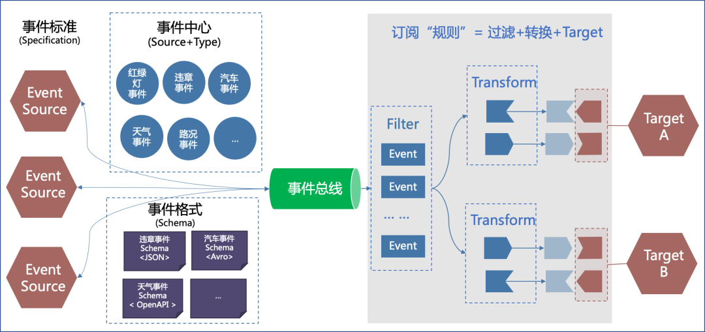
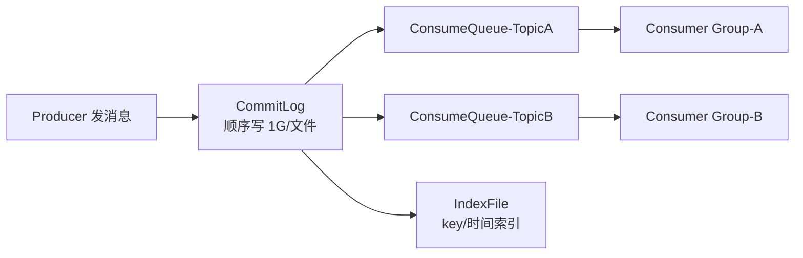
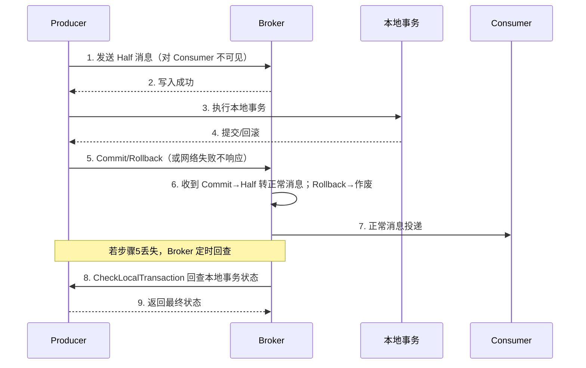
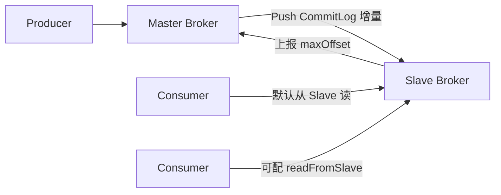

# RocketMQ 源码解析

## FileWatchService

FileWatchService 用于监听文件的变更，实现逻辑比较简单。

- 在创建 FileWatchService 时，就遍历要监听的文件，计算文件的 hash 值，存放到内存列表中
- `run()` 方法中就是监听的核心逻辑，while 循环通过 `isStopped()` 判断是否中断执行
- 默认每隔 500 毫秒检测一次文件 hash 值，然后与内存中的 hash 值做对比
- 如果文件 hash 值变更，则触发监听事件的执行

```java
package org.apache.rocketmq.srvutil;

public class FileWatchService extends ServiceThread {
    // 监听的文件路径
    private final List<String> watchFiles;
    // 文件当前hash值
    private final List<String> fileCurrentHash;
    // 监听器
    private final Listener listener;
    // 观测变化的间隔时间
    private static final int WATCH_INTERVAL = 500;
    // MD5 消息摘要
    private final MessageDigest md = MessageDigest.getInstance("MD5");

    public FileWatchService(final String[] watchFiles, final Listener listener) throws Exception {
        this.listener = listener;
        this.watchFiles = new ArrayList<>();
        this.fileCurrentHash = new ArrayList<>();

        // 遍历要监听的文件，计算每个文件的hash值并放到内存表中
        for (int i = 0; i < watchFiles.length; i++) {
            if (StringUtils.isNotEmpty(watchFiles[i]) && new File(watchFiles[i]).exists()) {
                this.watchFiles.add(watchFiles[i]);
                this.fileCurrentHash.add(hash(watchFiles[i]));
            }
        }
    }

    // 线程名称
    @Override
    public String getServiceName() {
        return "FileWatchService";
    }

    @Override
    public void run() {
        // 通过 stopped 标识来暂停业务执行
        while (!this.isStopped()) {
            try {
                // 等待 500 毫秒
                this.waitForRunning(WATCH_INTERVAL);
                // 遍历每个文件，判断文件hash值是否变更
                for (int i = 0; i < watchFiles.size(); i++) {
                    String newHash = hash(watchFiles.get(i));
                    // 对比hash
                    if (!newHash.equals(fileCurrentHash.get(i))) {
                        // 更新文件hash值
                        fileCurrentHash.set(i, newHash);
                        // 触发文件变更事件
                        listener.onChanged(watchFiles.get(i));
                    }
                }
            } catch (Exception e) {
                log.warn(this.getServiceName() + " service has exception. ", e);
            }
        }
    }

    // 计算文件的hash值
    private String hash(String filePath) throws IOException {
        Path path = Paths.get(filePath);
        md.update(Files.readAllBytes(path));
        byte[] hash = md.digest();
        return UtilAll.bytes2string(hash);
    }

    // 文件变更监听器
    public interface Listener {
        void onChanged(String path);
    }
}
```

FileWatchService 的初始化代码大致如下：

```java
if (TlsSystemConfig.tlsMode != TlsMode.DISABLED) {
    fileWatchService = new FileWatchService(
        // 监听证书文件的变更
        new String[]{
                TlsSystemConfig.tlsServerCertPath,
                TlsSystemConfig.tlsServerKeyPath,
                TlsSystemConfig.tlsServerTrustCertPath
        },
        // 注册监听器
        new FileWatchService.Listener() {
            boolean certChanged, keyChanged = false;

            @Override
            public void onChanged(String path) {
                ((NettyRemotingServer) remotingServer).loadSslContext();
            }
        });
}
```

## 事件



> 上图展示了相关事件（原为有道云笔记截图，此处保留引用）。

## RocketMQ 底层的消息存储

不直接使用 sendfile，而是采用 write 再 flush 的方式，主要是因为存在小块数据写入的需求；相对而言，sendfile 更适用于大文件传输场景。

---

## 一、CommitLog、ConsumeQueue 与 IndexFile（存储架构）

RocketMQ 的存储采用「**单一 CommitLog + 多 ConsumeQueue**」设计，所有 Topic 的消息体都顺序追加写入同一个 `CommitLog` 文件，从而把随机写转为**顺序写**，极大提升吞吐。



- **CommitLog**：消息主体与元数据的物理存储。默认每个文件 1G（`MapedFile`），文件名是起始偏移量（如 `00000000000000000000`）。消息写入先到 `MappedFileQueue`，依赖 `MappedByteBuffer` 内存映射。每条消息包含 `topic`、`queueId`、`tagsCode`、`body` 等。
- **ConsumeQueue**：逻辑队列（消费队列），每个 Topic 的每个 Queue 对应一个目录。条目固定 **20 字节** = `8字节CommitLog偏移 + 4字节消息长度 + 8字节tagsCode`，是 CommitLog 的索引。消费者实际只从 ConsumeQueue 取指针，再去 CommitLog 读正文。
- **IndexFile**：根据 `key` 或时间范围建哈希索引，用于消息按 key 查询（如事务消息回查、运维查询）。

> 设计要点：Producer 只写 CommitLog；Broker 后台线程 `ReputMessageService` 异步把 CommitLog 新消息分发（dispatch）到各 ConsumeQueue 与 IndexFile。这样**写入路径极短（只落一处）**，读取靠轻量索引，兼顾性能与解耦。

## 二、刷盘策略（Flush）

消息写入 `MappedByteBuffer` 后需刷到磁盘才算可靠，两种策略：

| 策略 | 类 | 机制 | 可靠性 | 性能 |
|------|----|------|--------|------|
| 同步刷盘 | `GroupCommitService` | 每条消息 `force()` 落盘后才返回 | 高（不丢） | 低 |
| 异步刷盘 | `FlushRealTimeService` | 定时（默认 500ms）或累积一定量后批量 `force` | 中（宕机可能丢少量） | 高 |

```java
// 同步刷盘：提交一个 GroupCommitRequest 并等待 flush 完成
public PutMessageStatus putMessage(MessageExtBrokerInner msg) {
    // 写入 MapedFile
    result = mapedFile.appendMessage(msg, ...);
    if (FlushDiskType.SYNC_FLUSH == flushDiskType) {
        GroupCommitRequest request = new GroupCommitRequest(wakeupInterval);
        groupCommitService.putRequest(request);
        boolean flushed = request.waitForFlush(5_000); // 阻塞等待刷盘
    }
    // 异步刷盘：仅 wakeup 刷盘线程，立即返回
}
```

配置项 `flushDiskType=SYNC_FLUSH|ASYNC_FLUSH`；同步刷盘保证「写入即持久」，但吞吐受限，通常用于金融等对可靠性要求极高的场景。

## 三、消费位点（Offset）管理

- **Offset 类型**：`consumerOffset`（消费进度）、`brokerOffset`（已落盘最大位点）、`diff = brokerOffset - consumerOffset`（堆积量）。
- **存储位置**：广播模式存消费者本地；集群模式存 Broker 的 `consumerOffset.json`（由 `ConsumerOffsetManager` 管理），消费者定期（默认 5s）上报 `updateOffset`，Broker 定时持久化。
- **拉取流程**：`PullMessageService` 根据消费者本地 `ProcessQueue` 中的 `nextBeginOffset` 向 Broker 拉取，拉回后更新位点；消费成功由 `offsetStore.updateOffset` 记录，定时提交。

> 关键：RocketMQ 的「至少一次」语义依赖位点正确提交；消费失败重试会发回 `%RETRY%` Topic，死信进 `%DLQ%`。

## 四、事务消息（Half Message + 回查）

RocketMQ 通过「**半消息（Half/PREPARE）+ 本地事务 + 回查（CHECK）**」实现分布式事务最终一致。



- **Half 消息**：先以 `TRANSACTION_PREPARED` 状态写入 CommitLog，但 ConsumeQueue 不暴露（消费者看不到），Special 属性标记。
- **Commit/Rollback**：`endTransaction` 写 `TRANSACTION_COMMIT`/`ROLLBACK` 的 op 消息；Commit 后把 Half 消息转为可见正常消息（重新 dispatch 到 ConsumeQueue）。
- **回查**：若 Producer 长时间未决断（如宕机），Broker 的 `TransactionalMessageCheckService` 周期扫描 `RMQ_SYS_TRANS_HALF_TOPIC`，回调 Producer 的 `checkLocalTransaction` 决定最终状态——这是保证最终一致的核心兜底。

## 五、Broker 主从（HA）与读写分离

RocketMQ 4.x 主从高可用：

- **角色**：`SYNC_MASTER` / `ASYNC_MASTER` / `SLAVE`，由 `brokerRole` 配置。
- **数据同步**：`HAService` 中，Slave 主动连 Master，上报自己的最大 Offset；Master 的 `HAConnection` 把 CommitLog 增量（`slaveRequestOffset` 之后）通过 `socketChannel.write` 推送给 Slave；Slave 写入自己的 CommitLog 并重放 ConsumeQueue。



- **同步双写（SYNC_MASTER）**：Master 等 Slave 落盘 ACK 才向 Producer 返回成功，强一致但延迟高；`ASYNC_MASTER` 不等 Slave，性能高、可能丢少量。
- **读写分离**：消费者可配置 `readFromSlave=true` 从 Slave 拉取（减轻 Master 压力），写入永远只走 Master。

> **读源码建议**：存储主线抓 `DefaultMessageStore` 的 `putMessage`（写 CommitLog）→ `ReputMessageService`（分发 ConsumeQueue）；事务抓 `TransactionalMessageServiceImpl`；主从抓 `HAService` 与 `HAConnection`。
