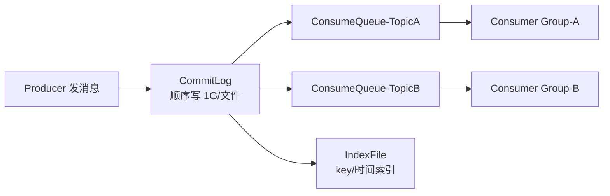
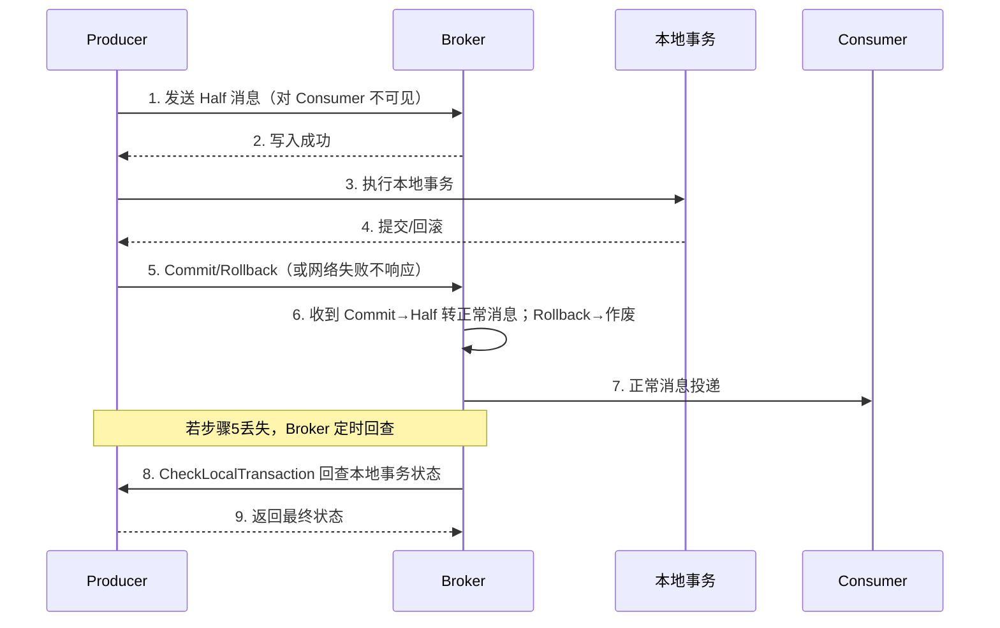
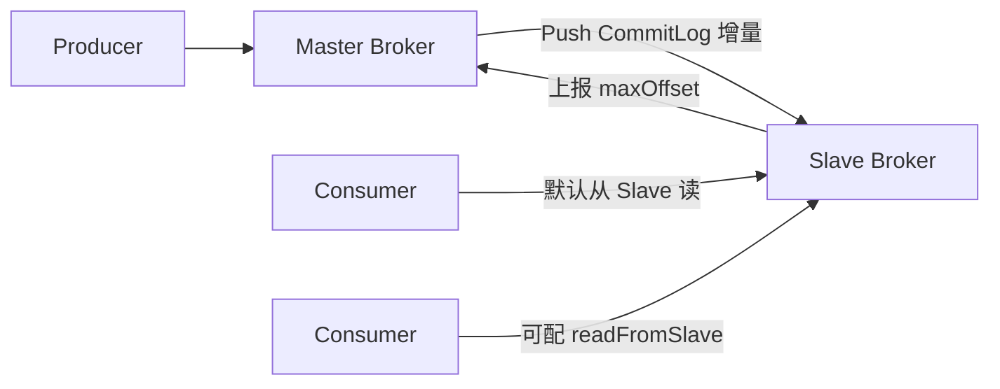
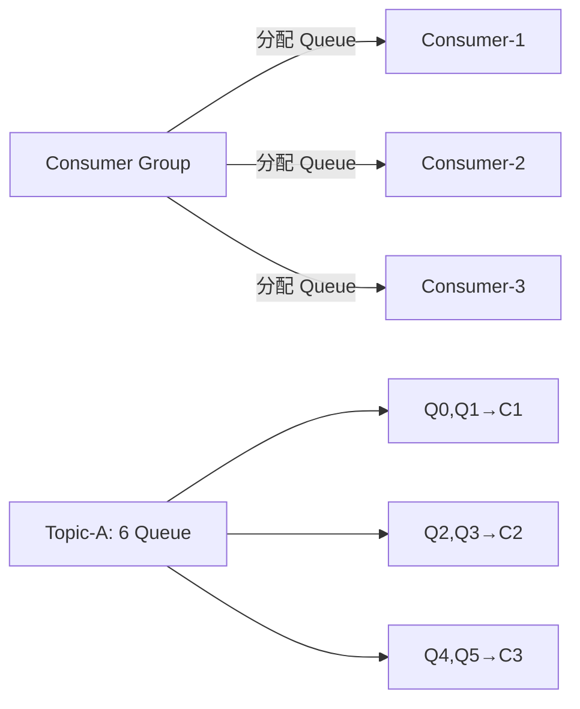

# RocketMQ 源码解析

## FileWatchService

FileWatchService 用于监听文件的变更，实现逻辑比较简单。

- 在创建 FileWatchService 时，就遍历要监听的文件，计算文件的 hash 值，存放到内存列表中
- `run()` 方法中就是监听的核心逻辑，while 循环通过 `isStopped()` 判断是否中断执行
- 默认每隔 500 毫秒检测一次文件 hash 值，然后与内存中的 hash 值做对比
- 如果文件 hash 值变更，则触发监听事件的执行

```java
package org.apache.rocketmq.srvutil;

public class FileWatchService extends ServiceThread {
    // 监听的文件路径
    private final List<String> watchFiles;
    // 文件当前hash值
    private final List<String> fileCurrentHash;
    // 监听器
    private final Listener listener;
    // 观测变化的间隔时间
    private static final int WATCH_INTERVAL = 500;
    // MD5 消息摘要
    private final MessageDigest md = MessageDigest.getInstance("MD5");

    public FileWatchService(final String[] watchFiles, final Listener listener) throws Exception {
        this.listener = listener;
        this.watchFiles = new ArrayList<>();
        this.fileCurrentHash = new ArrayList<>();

        // 遍历要监听的文件，计算每个文件的hash值并放到内存表中
        for (int i = 0; i < watchFiles.length; i++) {
            if (StringUtils.isNotEmpty(watchFiles[i]) && new File(watchFiles[i]).exists()) {
                this.watchFiles.add(watchFiles[i]);
                this.fileCurrentHash.add(hash(watchFiles[i]));
            }
        }
    }

    // 线程名称
    @Override
    public String getServiceName() {
        return "FileWatchService";
    }

    @Override
    public void run() {
        // 通过 stopped 标识来暂停业务执行
        while (!this.isStopped()) {
            try {
                // 等待 500 毫秒
                this.waitForRunning(WATCH_INTERVAL);
                // 遍历每个文件，判断文件hash值是否变更
                for (int i = 0; i < watchFiles.size(); i++) {
                    String newHash = hash(watchFiles.get(i));
                    // 对比hash
                    if (!newHash.equals(fileCurrentHash.get(i))) {
                        // 更新文件hash值
                        fileCurrentHash.set(i, newHash);
                        // 触发文件变更事件
                        listener.onChanged(watchFiles.get(i));
                    }
                }
            } catch (Exception e) {
                log.warn(this.getServiceName() + " service has exception. ", e);
            }
        }
    }

    // 计算文件的hash值
    private String hash(String filePath) throws IOException {
        Path path = Paths.get(filePath);
        md.update(Files.readAllBytes(path));
        byte[] hash = md.digest();
        return UtilAll.bytes2string(hash);
    }

    // 文件变更监听器
    public interface Listener {
        void onChanged(String path);
    }
}
```

FileWatchService 的初始化代码大致如下：

```java
if (TlsSystemConfig.tlsMode != TlsMode.DISABLED) {
    fileWatchService = new FileWatchService(
        // 监听证书文件的变更
        new String[]{
                TlsSystemConfig.tlsServerCertPath,
                TlsSystemConfig.tlsServerKeyPath,
                TlsSystemConfig.tlsServerTrustCertPath
        },
        // 注册监听器
        new FileWatchService.Listener() {
            boolean certChanged, keyChanged = false;

            @Override
            public void onChanged(String path) {
                ((NettyRemotingServer) remotingServer).loadSslContext();
            }
        });
}
```

## 事件


> 上图展示了相关事件（原为有道云笔记截图，此处保留引用）。

## RocketMQ 底层的消息存储

不直接使用 sendfile，而是采用 write 再 flush 的方式，主要是因为存在小块数据写入的需求；相对而言，sendfile 更适用于大文件传输场景。

---

## 一、CommitLog、ConsumeQueue 与 IndexFile（存储架构）

RocketMQ 的存储采用「**单一 CommitLog + 多 ConsumeQueue**」设计，所有 Topic 的消息体都顺序追加写入同一个 `CommitLog` 文件，从而把随机写转为**顺序写**，极大提升吞吐。



- **CommitLog**：消息主体与元数据的物理存储。默认每个文件 1G（`MapedFile`），文件名是起始偏移量（如 `00000000000000000000`）。消息写入先到 `MappedFileQueue`，依赖 `MappedByteBuffer` 内存映射。每条消息包含 `topic`、`queueId`、`tagsCode`、`body` 等。
- **ConsumeQueue**：逻辑队列（消费队列），每个 Topic 的每个 Queue 对应一个目录。条目固定 **20 字节** = `8字节CommitLog偏移 + 4字节消息长度 + 8字节tagsCode`，是 CommitLog 的索引。消费者实际只从 ConsumeQueue 取指针，再去 CommitLog 读正文。
- **IndexFile**：根据 `key` 或时间范围建哈希索引，用于消息按 key 查询（如事务消息回查、运维查询）。

> 设计要点：Producer 只写 CommitLog；Broker 后台线程 `ReputMessageService` 异步把 CommitLog 新消息分发（dispatch）到各 ConsumeQueue 与 IndexFile。这样**写入路径极短（只落一处）**，读取靠轻量索引，兼顾性能与解耦。

## 二、刷盘策略（Flush）

消息写入 `MappedByteBuffer` 后需刷到磁盘才算可靠，两种策略：

| 策略 | 类 | 机制 | 可靠性 | 性能 |
|------|----|------|--------|------|
| 同步刷盘 | `GroupCommitService` | 每条消息 `force()` 落盘后才返回 | 高（不丢） | 低 |
| 异步刷盘 | `FlushRealTimeService` | 定时（默认 500ms）或累积一定量后批量 `force` | 中（宕机可能丢少量） | 高 |

```java
// 同步刷盘：提交一个 GroupCommitRequest 并等待 flush 完成
public PutMessageStatus putMessage(MessageExtBrokerInner msg) {
    // 写入 MapedFile
    result = mapedFile.appendMessage(msg, ...);
    if (FlushDiskType.SYNC_FLUSH == flushDiskType) {
        GroupCommitRequest request = new GroupCommitRequest(wakeupInterval);
        groupCommitService.putRequest(request);
        boolean flushed = request.waitForFlush(5_000); // 阻塞等待刷盘
    }
    // 异步刷盘：仅 wakeup 刷盘线程，立即返回
}
```

配置项 `flushDiskType=SYNC_FLUSH|ASYNC_FLUSH`；同步刷盘保证「写入即持久」，但吞吐受限，通常用于金融等对可靠性要求极高的场景。

## 三、消费位点（Offset）管理

- **Offset 类型**：`consumerOffset`（消费进度）、`brokerOffset`（已落盘最大位点）、`diff = brokerOffset - consumerOffset`（堆积量）。
- **存储位置**：广播模式存消费者本地；集群模式存 Broker 的 `consumerOffset.json`（由 `ConsumerOffsetManager` 管理），消费者定期（默认 5s）上报 `updateOffset`，Broker 定时持久化。
- **拉取流程**：`PullMessageService` 根据消费者本地 `ProcessQueue` 中的 `nextBeginOffset` 向 Broker 拉取，拉回后更新位点；消费成功由 `offsetStore.updateOffset` 记录，定时提交。

> 关键：RocketMQ 的「至少一次」语义依赖位点正确提交；消费失败重试会发回 `%RETRY%` Topic，死信进 `%DLQ%`。

## 四、事务消息（Half Message + 回查）

RocketMQ 通过「**半消息（Half/PREPARE）+ 本地事务 + 回查（CHECK）**」实现分布式事务最终一致。



- **Half 消息**：先以 `TRANSACTION_PREPARED` 状态写入 CommitLog，但 ConsumeQueue 不暴露（消费者看不到），Special 属性标记。
- **Commit/Rollback**：`endTransaction` 写 `TRANSACTION_COMMIT`/`ROLLBACK` 的 op 消息；Commit 后把 Half 消息转为可见正常消息（重新 dispatch 到 ConsumeQueue）。
- **回查**：若 Producer 长时间未决断（如宕机），Broker 的 `TransactionalMessageCheckService` 周期扫描 `RMQ_SYS_TRANS_HALF_TOPIC`，回调 Producer 的 `checkLocalTransaction` 决定最终状态——这是保证最终一致的核心兜底。

## 五、Broker 主从（HA）与读写分离

RocketMQ 4.x 主从高可用：

- **角色**：`SYNC_MASTER` / `ASYNC_MASTER` / `SLAVE`，由 `brokerRole` 配置。
- **数据同步**：`HAService` 中，Slave 主动连 Master，上报自己的最大 Offset；Master 的 `HAConnection` 把 CommitLog 增量（`slaveRequestOffset` 之后）通过 `socketChannel.write` 推送给 Slave；Slave 写入自己的 CommitLog 并重放 ConsumeQueue。



- **同步双写（SYNC_MASTER）**：Master 等 Slave 落盘 ACK 才向 Producer 返回成功，强一致但延迟高；`ASYNC_MASTER` 不等 Slave，性能高、可能丢少量。
- **读写分离**：消费者可配置 `readFromSlave=true` 从 Slave 拉取（减轻 Master 压力），写入永远只走 Master。

> **读源码建议**：存储主线抓 `DefaultMessageStore` 的 `putMessage`（写 CommitLog）→ `ReputMessageService`（分发 ConsumeQueue）；事务抓 `TransactionalMessageServiceImpl`；主从抓 `HAService` 与 `HAConnection`。

---

## 六、消息重试与死信队列

RocketMQ 的「至少一次」投递依赖重试机制：

- **并发消费失败**：业务抛异常（非 `MessageHook` 控制），`ConsumeMessageConcurrentlyService` 把消息发回 Broker 的 `%RETRY%{consumerGroup}` 主题，按**退避延迟等级**重新投递（等级 3s、10s、30s、1m…2h）。
- **顺序消费失败**：默认**挂起队列**（不提交 offset，暂停后续消息）直到成功，避免乱序——所以顺序消费一定要控制异常。
- **最大重试次数**（默认 16 次）耗尽仍失败，消息进入 **`%DLQ%{consumerGroup}` 死信队列**，需人工介入（运维控制台可重投）。

```java
// 并发消费：返回 RECONSUME_LATER 触发重试
consumer.registerMessageListener((MessageListenerConcurrently) (msgs, context) -> {
    try { handle(msgs); return ConsumeConcurrentlyStatus.CONSUME_SUCCESS; }
    catch (Exception e) { return ConsumeConcurrentlyStatus.RECONSUME_LATER; }
});
```

> 注意：重试消息带 `RETRY_TOPIC` 属性，Broker 用 `ScheduleMessageService` 按延迟级别定时（基于「延时消息 + 内部 18 个延迟队列 `SCHEDULE_TOPIC_XXXX`」）重新投递。

## 七、消费负载均衡（Rebalance）

集群模式下，Topic 的多个 Queue 要在同 Group 的多个 Consumer 实例间分配，由 **`RebalanceService`** 周期性（默认 20s）或「实例上下线 / 订阅变更」时触发：



- **分配策略（`AllocateMessageQueueStrategy`）**：`AllocateMessageQueueAveragely`（平均，默认）、`AveragelyByCircle`（轮询）、`ConsistentHash`（一致性哈希，扩缩容影响最小）、`ByConfig`（人工指定）。
- **触发时机**：实例启动、实例宕机（其余实例通过心跳感知）、Topic 队列数变更。
- **坑**：Rebalance 期间会「释放旧队列、接手新队列」，短时重复消费（因为 offset 提交有延迟）——**消费逻辑必须幂等**。另外 `consumer` 实例数不应多于 Queue 数，否则多出的实例分不到 Queue 空转。

## 八、顺序消息实现

RocketMQ 顺序消费 = **发送有序 + 存储有序 + 消费有序**：

1. **发送**：`MessageQueueSelector` 按业务 key（如订单 id）哈希，把同一 key 的消息路由到**同一个 Queue**：

```java
producer.send(msg, (mqs, m, arg) -> {
    int idx = Math.abs(arg.hashCode()) % mqs.size(); // 同 key 永远落同队列
    return mqs.get(idx);
}, orderId);
```

2. **存储**：Queue 内消息天然 FIFO（CommitLog 顺序写 + ConsumeQueue 顺序索引）。
3. **消费**：`MessageListenerOrderly` + `ConsumeMessageOrderlyService`，对**单个 Queue 加锁（`ProcessQueue` 的 `locked`）**串行消费，且拉取时只拉「已获得锁」的队列，保证全局有序。

> 代价：顺序消费吞吐受限于单 Queue，且消费失败会阻塞该 Queue（挂起重试），不适合高并发热点 key。

## 九、事务消息状态回查（深入）

前文讲了 Half 消息与 Commit/Rollback，这里补 Broker 侧**回查服务**的实现：

- `TransactionalMessageCheckService`（继承 `ServiceThread`）每隔 `transactionCheckInterval`（默认 60s）扫描 `RMQ_SYS_TRANS_HALF_TOPIC` 中「超时未决断」的 Half 消息（`timeout = transactionTimeOut`，默认 6s）。
- 对每个待回查消息，Broker 构造回查请求，通过 `Broker2Client` 向**原 Producer 组**发起 `CHECK_TRANSACTION_STATE`，回调 `TransactionListener.checkLocalTransaction(msg)`。
- 回查有上限（`transactionCheckMax`，默认 15 次），超限仍无结论则**强制 Rollback**（丢弃），避免 Half 消息永久堆积。
- 回查结果写 op 消息：`TRANSACTION_COMMIT` 则把 Half 消息重新派发到目标 ConsumeQueue 使其可见；`ROLLBACK` 则标记作废。

```java
// Producer 侧需实现
public class OrderTxListener implements TransactionListener {
    public LocalTransactionState executeLocalTransaction(Message msg, Object arg) {
        return LocalTransactionState.UNKNOW; // 先返回 UNKNOW，等回查
    }
    public LocalTransactionState checkLocalTransaction(MessageExt msg) {
        return isCommitted(msg) ? COMMIT_MESSAGE : ROLLBACK_MESSAGE;
    }
}
```

## 十、ACL 与消息轨迹

- **ACL（访问控制）**：`PlainPermissionManager` 基于 `plain_acl.yml` 配置用户/资源/动作的白名单（`accessKey`/`secretKey` 签名校验）。生产开启 `aclEnable=true` 后，Producer/Consumer 需配置 `RPCHook` 在请求头带签名，Broker 侧 `AclClientRPCHook` 校验，防止未授权发布/订阅。
- **消息轨迹（Trace）**：开启 `enableMsgTrace=true` 并指定 `accessKey`/`topic`（默认 `RMQ_SYS_TRACE_TOPIC`），客户端异步把「生产/存储/消费」各阶段耗时与状态写入轨迹 Topic，便于全链路排查。轨迹写入是**异步 + 采样**的，不影响主链路性能。

## 十一、RocketMQ 与 Kafka 对比

| 维度 | RocketMQ | Kafka |
|------|----------|-------|
| 存储模型 | CommitLog 集中 + ConsumeQueue 索引 | Partition 分区独立日志 |
| 消费模式 | 拉 + 推（长轮询），集群/广播 | Pull，主要集群 |
| 顺序消息 | 单 Queue 严格有序（原生支持） | Partition 内有序 |
| 事务消息 | 半消息 + 回查（原生） | 0.11+ 事务 API（幂等+事务协调） |
| 延迟/重试 | 内置 18 级延时、重试、死信 | 需外部实现（如外层调度） |
| 吞吐量 | 极高（单机十万级 TPS） | 极高（批量+零拷贝，常更高） |
| 适用场景 | 业务消息、金融事务、顺序/延时 | 日志流、大数据管道、超高吞吐 |

> 选型：强业务语义（事务、顺序、延时、重试、死信）选 RocketMQ；海量日志 / 流计算 / 与 Flink 等大数据生态联动选 Kafka。RocketMQ 5.x 引入「Proxy + 计算存储分离」进一步云原生化。

---

## 十二、消息过滤与消费模型

### 消息过滤

RocketMQ 支持两种过滤，避免「全量拉取再客户端过滤」浪费带宽：

- **Tag 过滤**：生产者 `msg.setTags("order")`，消费者 `subscribe(topic, "order || pay")`——Broker 在 `PullMessageProcessor` 按 ConsumeQueue 里存的 `tagsCode` 直接过滤，零额外开销。
- **SQL92 过滤**：`subscribe(topic, MessageSelector.bySql("age > 18 AND type='vip'"))`，基于消息属性（user property）做表达式过滤，需 Broker 开启 `enablePropertyFilter=true`。

```java
consumer.subscribe("TopicTest", MessageSelector.bySql("region = 'cn' AND vip = true"));
```

### 消费模型：Push / Pull / Pop

- **Push（默认）**：并非真推，而是 `PullMessageService` 拉取 + 拉完立即再拉（长轮询），封装成「看起来像推送」；`MessageListenerConcurrently`/`Orderly` 处理。
- **Pull（旧 API `MQPullConsumer`）**：业务自己控制拉取位点与节奏，灵活但要手写 offset 管理，已基本不推荐。
- **Pop（5.x）**：新「无状态消费」模型 `PopConsumer`，Broker 端维护消费进度（类 Kafka），消费者无状态、可随时扩缩容，天然解决「Rebalance 重复消费」与「消费实例绑定 Queue」的耦合，是 RocketMQ 5.x 云原生的核心。

> 选型：存量集群用 Push（兼容好）；新建 5.x 集群 / Serverless 场景可上 Pop，省去客户端维护 offset 与 Rebalance 心智负担。
