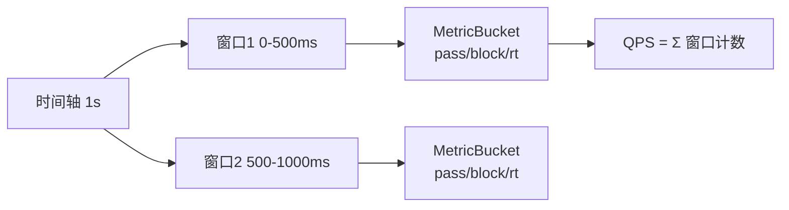
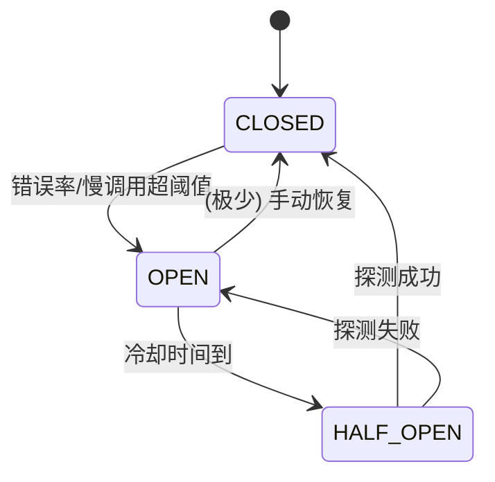
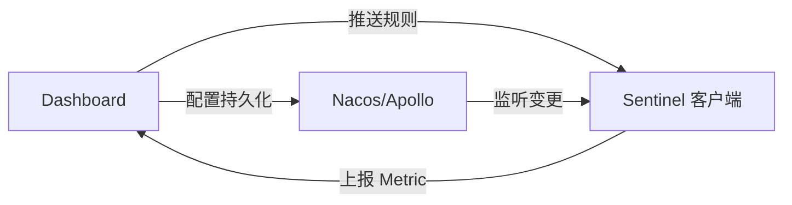

# Sentinel 源码解析

> ⚠️ 本页内容待补充。

---

## 一、整体架构

Sentinel 核心由 **资源（Resource）+ 规则（Rule）+ 插槽链（Slot Chain）+ 埋点（Entry）** 组成。一次资源访问会创建一个 `Entry`，并顺序通过 `ProcessorSlotChain` 上的各个 Slot，Slot 之间可以统计数据、校验规则、熔断降级、系统保护等。


- **Entry**：每次进入资源生成，记录当前上下文、资源、创建时间；退出时 `entry.exit()`。
- **Context**：一次调用链路的上下文（如 `EntranceNode`、当前 `Entry`），支持调用树。
- **Node**：统计节点，`DefaultNode`（按 Context 维度）、`ClusterNode`（按资源维度）、`StatisticNode`（底层滑动窗口统计）。

## 二、责任链 Slot 机制

`SlotChainBuilder` 构造 `ProcessorSlotChain`，默认实现 `DefaultSlotChainBuilder` 把各 Slot 按固定顺序串起来：

```java
// DefaultSlotChainBuilder.build()
public ProcessorSlotChain build() {
    ProcessorSlotChain chain = new DefaultProcessorSlotChain();
    chain.addLast(new NodeSelectorSlot());
    chain.addLast(new ClusterBuilderSlot());
    chain.addLast(new LogSlot());
    chain.addLast(new StatisticSlot());
    chain.addLast(new AuthoritySlot());
    chain.addLast(new SystemSlot());
    chain.addLast(new FlowSlot());
    chain.addLast(new DegradeSlot());
    return chain;
}
```

各 Slot 职责：

| Slot | 职责 |
|------|------|
| `NodeSelectorSlot` | 为每个 Context 创建 `DefaultNode`，构建调用树 |
| `ClusterBuilderSlot` | 聚合同资源的 `ClusterNode`（集群维度统计） |
| `StatisticSlot` | 核心统计：通过/阻塞/异常/RT，写入滑动窗口 |
| `FlowSlot` | 流控校验，超出阈值抛 `FlowException` |
| `DegradeSlot` | 熔断降级校验，抛 `DegradeException` |
| `AuthoritySlot` | 黑白名单鉴权 |
| `SystemSlot` | 系统自适应保护（Load/CPU/并发） |

> 设计要点：各 Slot 通过 `fireEntry` 把请求向后传递（`责任链模式`），统计 Slot 在 `entry` 成功与 `exit` 时分别累加，所有规则 Slot 在统计之上做判断。

## 三、滑动窗口限流统计（StatisticSlot）

Sentinel 用**滑动窗口（LeapArray）**做实时统计，避免固定窗口的临界突刺问题。

```java
// 核心：LeapArray<MetricBucket>
public class ArrayMetric implements Metric {
    private final LeapArray<MetricBucket> data;

    // 当前时间落在哪个窗口
    public MetricBucket currentWindow(long timeMillis) {
        int idx = (int)(timeMillis / windowLengthInMs) % array.length();
        // 复用/重置/新建 Bucket
    }
}
```

- 把一个统计周期（如 1s）切成 `sampleCount` 个窗口（如 2 个 500ms 窗口）。
- 每个 `MetricBucket` 用 `LongAdder` 累加 `pass/block/exception/success/rt` 等计数——**LongAdder 减少 CAS 竞争**，是高并发统计的关键。
- 窗口随时间滑动，过期窗口被重置复用。



## 四、流控（FlowSlot + 阈值类型）

`FlowRule` 关键字段：`grade`（QPS / 线程数）、`count`（阈值）、`strategy`（直接/关联/链路）、`controlBehavior`（直接拒绝/冷启动/WarmUp+排队等待）。

流控效果 `TrafficShapingController` 实现：

- **直接拒绝（Default）**：超阈值立即抛 `FlowException`。
- **WarmUp（冷启动）**：基于令牌桶思想，阈值从 `count / coldFactor`（默认 3）线性涨到 `count`，保护冷系统。
- **排队等待（RateLimiter）**：匀速排队，超过 `maxQueueingTimeMs` 才拒绝。

```java
// FlowSlot.checkFlow
for (FlowRule rule : rules) {
    if (!canPassCheck(rule, context, node, count, prioritized)) {
        throw new FlowException(rule.getLimitApp(), rule);
    }
}
```

## 五、熔断降级（DegradeSlot + CircuitBreaker）

1.8 起熔断基于 `CircuitBreaker` 接口，两种策略：

| 策略 | 触发条件 | 实现类 |
|------|---------|--------|
| 慢调用比例 | 响应时间 > RT，且比例超阈值 | `ResponseTimeCircuitBreaker` |
| 异常比例 / 异常数 | 异常比例或异常数超阈值 | `ExceptionCircuitBreaker` |

状态机：`CLOSED`（关闭，正常放行）→ 触发阈值 → `OPEN`（打开，直接熔断）→ 经过 `recoveryTimeout` → `HALF_OPEN`（半开，放少量探测请求）→ 成功则回 `CLOSED`，失败回 `OPEN`。



```java
// DegradeSlot 在 StatisticSlot 之后判断
if (breaker.tryPass(context)) {
    fireEntry(...);   // 通过则继续
} else {
    throw new DegradeException(rule);
}
```

## 六、热点参数限流（ParamFlowSlot）

`ParamFlowSlot` 对方法入参的「热点值」单独限流（如 userId=100 是热点，单独配额）。底层用 `ParamMaping` + 滑动窗口，热点参数走 `ParamFlowChecker`，普通参数走集群统计，支持参数例外项（`paramItem` 单独配置大阈值）。

## 七、@SentinelResource 与 Dashboard

### 注解埋点

`@SentinelResource(value="resName", blockHandler="handleBlock", fallback="handleFallback")`：

- `blockHandler`：处理 `BlockException`（流控/熔断/降级等）。
- `fallback`：处理业务异常（Throwable）。
- 通过 `SentinelResourceAspect`（AOP）在方法前后创建 `Entry`/`exit`，把任意 Java 方法包装成 Sentinel 资源。

```java
@SentinelResource(value = "orderQuery", blockHandler = "block")
public Order query(Long id) { return service.query(id); }
public Order block(Long id, BlockException e) { return Order.defaultOrder(); }
```

### Dashboard 控制台

Dashboard 本质是一个独立的 Spring Boot 应用，通过 **HTTP API** 推送规则到客户端（`Sentinel 客户端暴露 /setRules 等接口`），并定时拉取客户端的 `Metric` 做聚合展示。规则默认**内存态**，生产需接入 `DynamicRuleDataSource`（如 Nacos / Apollo / ZooKeeper）实现持久化与动态推送。



> **读源码建议**：入口 `Env` 静态块加载 `SlotChainBuilder`；核心链路 `SphU.entry()` → `CtSph.entryWithPriority()` → `ProcessorSlotChain.entry()`。从 `StatisticSlot`（统计）和 `FlowSlot`/`DegradeSlot`（规则）两个方向深入，再回看 `@SentinelResource` 的 Aspect 如何织入。
