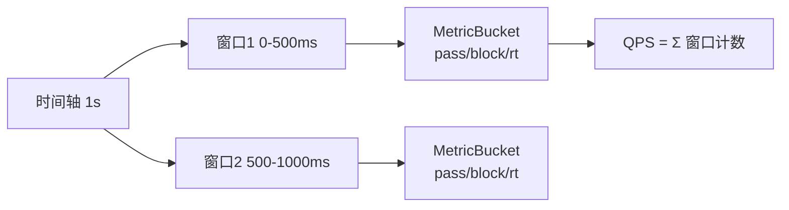
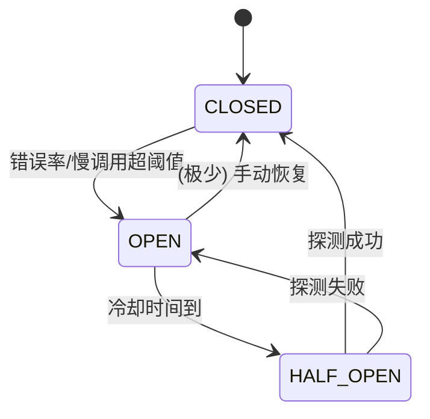
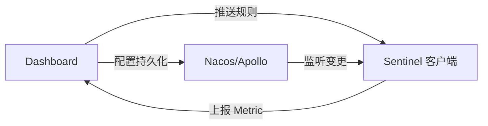
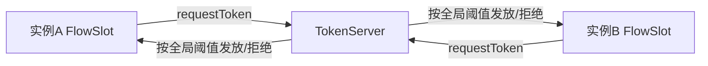
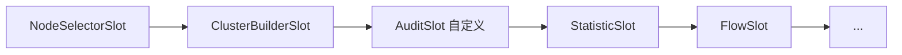

# Sentinel 源码解析

---

## 一、整体架构

Sentinel 核心由 **资源（Resource）+ 规则（Rule）+ 插槽链（Slot Chain）+ 埋点（Entry）** 组成。一次资源访问会创建一个 `Entry`，并顺序通过 `ProcessorSlotChain` 上的各个 Slot，Slot 之间可以统计数据、校验规则、熔断降级、系统保护等。


- **Entry**：每次进入资源生成，记录当前上下文、资源、创建时间；退出时 `entry.exit()`。
- **Context**：一次调用链路的上下文（如 `EntranceNode`、当前 `Entry`），支持调用树。
- **Node**：统计节点，`DefaultNode`（按 Context 维度）、`ClusterNode`（按资源维度）、`StatisticNode`（底层滑动窗口统计）。

## 二、责任链 Slot 机制

`SlotChainBuilder` 构造 `ProcessorSlotChain`，默认实现 `DefaultSlotChainBuilder` 把各 Slot 按固定顺序串起来：

```java
// DefaultSlotChainBuilder.build()
public ProcessorSlotChain build() {
    ProcessorSlotChain chain = new DefaultProcessorSlotChain();
    chain.addLast(new NodeSelectorSlot());
    chain.addLast(new ClusterBuilderSlot());
    chain.addLast(new LogSlot());
    chain.addLast(new StatisticSlot());
    chain.addLast(new AuthoritySlot());
    chain.addLast(new SystemSlot());
    chain.addLast(new FlowSlot());
    chain.addLast(new DegradeSlot());
    return chain;
}
```

各 Slot 职责：

| Slot | 职责 |
|------|------|
| `NodeSelectorSlot` | 为每个 Context 创建 `DefaultNode`，构建调用树 |
| `ClusterBuilderSlot` | 聚合同资源的 `ClusterNode`（集群维度统计） |
| `StatisticSlot` | 核心统计：通过/阻塞/异常/RT，写入滑动窗口 |
| `FlowSlot` | 流控校验，超出阈值抛 `FlowException` |
| `DegradeSlot` | 熔断降级校验，抛 `DegradeException` |
| `AuthoritySlot` | 黑白名单鉴权 |
| `SystemSlot` | 系统自适应保护（Load/CPU/并发） |

> 设计要点：各 Slot 通过 `fireEntry` 把请求向后传递（`责任链模式`），统计 Slot 在 `entry` 成功与 `exit` 时分别累加，所有规则 Slot 在统计之上做判断。

## 三、滑动窗口限流统计（StatisticSlot）

Sentinel 用**滑动窗口（LeapArray）**做实时统计，避免固定窗口的临界突刺问题。

```java
// 核心：LeapArray<MetricBucket>
public class ArrayMetric implements Metric {
    private final LeapArray<MetricBucket> data;

    // 当前时间落在哪个窗口
    public MetricBucket currentWindow(long timeMillis) {
        int idx = (int)(timeMillis / windowLengthInMs) % array.length();
        // 复用/重置/新建 Bucket
    }
}
```

- 把一个统计周期（如 1s）切成 `sampleCount` 个窗口（如 2 个 500ms 窗口）。
- 每个 `MetricBucket` 用 `LongAdder` 累加 `pass/block/exception/success/rt` 等计数——**LongAdder 减少 CAS 竞争**，是高并发统计的关键。
- 窗口随时间滑动，过期窗口被重置复用。



## 四、流控（FlowSlot + 阈值类型）

`FlowRule` 关键字段：`grade`（QPS / 线程数）、`count`（阈值）、`strategy`（直接/关联/链路）、`controlBehavior`（直接拒绝/冷启动/WarmUp+排队等待）。

流控效果 `TrafficShapingController` 实现：

- **直接拒绝（Default）**：超阈值立即抛 `FlowException`。
- **WarmUp（冷启动）**：基于令牌桶思想，阈值从 `count / coldFactor`（默认 3）线性涨到 `count`，保护冷系统。
- **排队等待（RateLimiter）**：匀速排队，超过 `maxQueueingTimeMs` 才拒绝。

```java
// FlowSlot.checkFlow
for (FlowRule rule : rules) {
    if (!canPassCheck(rule, context, node, count, prioritized)) {
        throw new FlowException(rule.getLimitApp(), rule);
    }
}
```

## 五、熔断降级（DegradeSlot + CircuitBreaker）

1.8 起熔断基于 `CircuitBreaker` 接口，两种策略：

| 策略 | 触发条件 | 实现类 |
|------|---------|--------|
| 慢调用比例 | 响应时间 > RT，且比例超阈值 | `ResponseTimeCircuitBreaker` |
| 异常比例 / 异常数 | 异常比例或异常数超阈值 | `ExceptionCircuitBreaker` |

状态机：`CLOSED`（关闭，正常放行）→ 触发阈值 → `OPEN`（打开，直接熔断）→ 经过 `recoveryTimeout` → `HALF_OPEN`（半开，放少量探测请求）→ 成功则回 `CLOSED`，失败回 `OPEN`。



```java
// DegradeSlot 在 StatisticSlot 之后判断
if (breaker.tryPass(context)) {
    fireEntry(...);   // 通过则继续
} else {
    throw new DegradeException(rule);
}
```

## 六、热点参数限流（ParamFlowSlot）

`ParamFlowSlot` 对方法入参的「热点值」单独限流（如 userId=100 是热点，单独配额）。底层用 `ParamMaping` + 滑动窗口，热点参数走 `ParamFlowChecker`，普通参数走集群统计，支持参数例外项（`paramItem` 单独配置大阈值）。

## 七、@SentinelResource 与 Dashboard

### 注解埋点

`@SentinelResource(value="resName", blockHandler="handleBlock", fallback="handleFallback")`：

- `blockHandler`：处理 `BlockException`（流控/熔断/降级等）。
- `fallback`：处理业务异常（Throwable）。
- 通过 `SentinelResourceAspect`（AOP）在方法前后创建 `Entry`/`exit`，把任意 Java 方法包装成 Sentinel 资源。

```java
@SentinelResource(value = "orderQuery", blockHandler = "block")
public Order query(Long id) { return service.query(id); }
public Order block(Long id, BlockException e) { return Order.defaultOrder(); }
```

### Dashboard 控制台

Dashboard 本质是一个独立的 Spring Boot 应用，通过 **HTTP API** 推送规则到客户端（`Sentinel 客户端暴露 /setRules 等接口`），并定时拉取客户端的 `Metric` 做聚合展示。规则默认**内存态**，生产需接入 `DynamicRuleDataSource`（如 Nacos / Apollo / ZooKeeper）实现持久化与动态推送。



> **读源码建议**：入口 `Env` 静态块加载 `SlotChainBuilder`；核心链路 `SphU.entry()` → `CtSph.entryWithPriority()` → `ProcessorSlotChain.entry()`。从 `StatisticSlot`（统计）和 `FlowSlot`/`DegradeSlot`（规则）两个方向深入，再回看 `@SentinelResource` 的 Aspect 如何织入。

---

## 八、进阶 Slot 详解：Authority / System / Statistic 退出

### AuthoritySlot 源码

`AuthoritySlot` 在 FlowSlot 之前执行，做黑白名单鉴权。核心在 `AuthorityRuleChecker.checkBlackWhite`：

```java
// AuthoritySlot.checkBlackWhite
if (authorityRule != null) {
    AuthorityRuleChecker.checkBlackWhite(authorityRule, context.getOrigin());
}
// AuthorityRuleChecker
static void checkBlackWhite(AuthorityRule rule, String origin) {
    if (origin == null) origin = "";
    switch (rule.getStrategy()) {
        case AuthorityRuleConstant.BLACK:  // 黑名单：命中即拒绝
            if (matcher.match(origin, rule.getLimitApp())) throw new AuthorityException(...);
            break;
        case AuthorityRuleConstant.WHITE:  // 白名单：不在名单拒绝
            if (!matcher.match(origin, rule.getLimitApp())) throw new AuthorityException(...);
            break;
    }
}
```

`limitApp` 是逗号分隔的 origin 列表，`context.getOrigin()` 通常来自 `ContextUtil.enter(resource, origin)` 或 `@SentinelResource` 的 `origin` 解析器。`limitApp = default` 表示对所有 origin 生效。

### SystemSlot 源码

`SystemSlot` 在链路末端，做系统自适应保护（全局维度，不看单个资源）：

```java
// SystemSlot.checkSystem
if (resourceName != null && resourceName.startsWith("$")
    && !(SystemRuleManager.avgRt > 0 || SystemRuleManager.maxThread > 0 ...)) {
    return; // 入口 Sentinel 内部资源跳过
}
SystemRuleManager.checkSystem(resourceWrapper, count, grade);
```

`SystemRuleManager` 周期性（每 1s）通过 `SystemStatusListener` 采集 `load1`、`cpuUsage`、`thread` 数、`qps`、`rt` 等，阈值在 `SystemRule` 中配置（`highestSystemLoad` / `highestCpuUsage` / `maxThread` / `qps` / `rt`）。任一越界抛 `SystemBlockException`。其自适应算法基于 BBR 思想：当并发线程数 > `maxThread` 或 `load1` 超过阈值且线程数较大时触发。

### StatisticSlot 的 exit 统计

前文讲了 entry 时的 `addPassRequest`，但**异常 / 阻塞 / RT 是在 exit 时落账**的，这是容易忽略的点：

```java
// StatisticSlot.exit
public void exit(Context context, ...) {
    Node node = context.getCurNode();
    long rt = TimeUtil.currentTimeMillis() - entry.getCreateTime();
    node.addRtAndSuccess(rt, 1);          // RT 与成功数
    node.taskDone();
    // 若 entry 过程中抛了业务异常，通过 Tracer.trace(e) 已记入 node.addException()
}
```

`Tracer.trace(ex)` 在 `CtSph` 捕获业务异常时调用，把异常数写入当前 `DefaultNode` 与 `ClusterNode`，供熔断（异常比例）统计使用。也就是说：**流控/熔断的「异常比例」依赖 exit 链路正确调用 `trace`**，异步场景若线程切换丢掉了 `Context`，统计就会失真——这是异步资源必须使用 `AsyncEntry` 的原因。

## 九、热点参数限流（ParamFlowSlot）源码深度

热点限流对「方法参数的某个具体值」单独限流。核心在 `ParamFlowChecker`：

```java
// ParamFlowChecker.passCheck（简化）
if (rule.getGrade() == RuleConstant.FLOW_GRADE_QPS) {
    ParameterMetric metric = getParameterMetric(resourceName);
    if (metric != null) {
        // 1. 取热点参数索引 getParamIdx(rule)
        // 2. 查 paramHot 缓存是否命中热点值
        // 3. 热点值走 paramMetric 特权桶；普通值走 clusterNode 维度限流
        if (!paramMetric.checkPass(...)) throw new ParamFlowException(rule);
    }
}
```

- 热点参数用 `ParamMaping`（参数索引 → 参数值类型）建立映射，每个热点值维护独立的 `CacheMap`（基于 `ConcurrentLinkedHashMap` 的 LRU，避免热点值无限膨胀）。
- **参数例外项（paramItem）**：为某个具体值（如 VIP 用户）配置更大的阈值，命中例外项走独立限额。
- 底层统计同样基于 `LeapArray` 滑动窗口，但按「参数值」维度分桶，因此能做到「某 userId 单独限流，其余共享总额度」。

## 十、集群流控（Cluster Flow）

单机阈值在集群多实例下会「各自为战」，集群流控引入 **Token Server / Token Client**：



- `FlowRule` 设 `clusterMode=true` + `ClusterFlowConfig`（`flowId`、`thresholdType`、`fallbackToLocalWhenFail`）。
- 请求走到 `FlowSlot` 时，若规则为集群模式，转交 `ClusterFlowChecker` 向 `TokenServer` 申请 token；`TokenServer` 用 `ClusterRateLimiter` 按全局阈值匀速发放，不足则返回 `OVER_THRESHOLD`。
- TokenServer 自身高可用：可嵌入某个 Sentinel 客户端（`SENTINEL_CLUSTER_SERVER`）或独立部署；Client 通过 `ClusterStateManager` 感知 server 列表（通常由 Dashboard / 配置中心推送）。
- 失败兜底：`fallbackToLocalWhenFail=true` 时 TokenServer 不可达则退化为本地限流，保证可用性。

## 十一、Dashboard、心跳与规则持久化

### 心跳

Sentinel 客户端内置 `HeartbeatSender`（默认 `HttpHeartbeatSender`），每 10s 向 Dashboard 上报自身 `appName / ip / port / version`。Dashboard 的 `MachineRegistry` 维护在线机器列表，心跳超时（默认 60s）即剔除。

### 规则推送与持久化

Dashboard 通过 `SentinelApiClient` 调客户端 HTTP 接口（`/setFlowRule` 等）下发规则。但**默认规则只存内存**（`FlowRuleManager` 的 `flowRules` 是普通 List），重启即丢。生产必须接 `DynamicRuleDataSource`：

```java
// 以 Nacos 为例
ReadableDataSource<String, List<FlowRule>> ds =
    new NacosDataSource<>(properties, groupId, dataId,
        source -> JSON.parseObject(source, new TypeReference<List<FlowRule>>() {}));
FlowRuleManager.register2Property(ds.getProperty());
```

写方向同理用 `WritableDataSource` 把控制台改动回写配置中心，形成「控制台 ↔ 配置中心 ↔ 客户端」的闭环。

## 十二、与 Spring Cloud 整合

`spring-cloud-alibaba-sentinel` 自动装配：

- `SentinelAutoConfiguration`：注入 `SentinelResourceAspect`（处理 `@SentinelResource`）、`SentinelBeanPostProcessor`。
- `SentinelWebAutoConfiguration`：注册 `SentinelWebInterceptor`（对所有 `@RequestMapping` 自动埋点，资源名默认 `GET:/path`）。
- `SentinelFeignAutoConfiguration`：Feign 调用埋点。
- `BlockException` 统一处理：`SentinelWebMvcConfig` 配置 `BlockExceptionHandler`，默认返回 `429` + `Blocked by Sentinel`，可自定义为 JSON。

```yaml
spring:
  cloud:
    sentinel:
      transport:
        dashboard: localhost:8080   # 控制台地址
        port: 8719                  # 客户端与控制台通信端口
```

## 十三、实战：自定义 Slot

继承 `ProcessorSlot`，并通过 SPI 注册到 Slot 链：

```java
public class AuditSlot extends AbstractLinkedProcessorSlot<DefaultNode> {
    @Override
    public void entry(Context context, ResourceWrapper resource, DefaultNode node,
                      int count, boolean prioritized, Object... args) throws Throwable {
        // 在统计之前做审计/染色
        System.out.println("access " + resource.getName() + " from " + context.getOrigin());
        fireEntry(context, resource, node, count, prioritized, args); // 向后传递
    }
    @Override
    public void exit(Context context, ResourceWrapper resource, int count, Object... args) {
        fireExit(context, resource, count, args);
    }
}
```

注册方式：在 `META-INF/services/com.alibaba.csp.sentinel.slotchain.ProcessorSlot` 写入全限定类名（Sentinel 用 `SpiLoader` 加载，按 `@SpiOrder` 排序插入链中）。注意自定义 Slot 的位置会影响统计准确性——审计类建议放在 `NodeSelectorSlot` 之后、`StatisticSlot` 之前或之后视需求而定。


