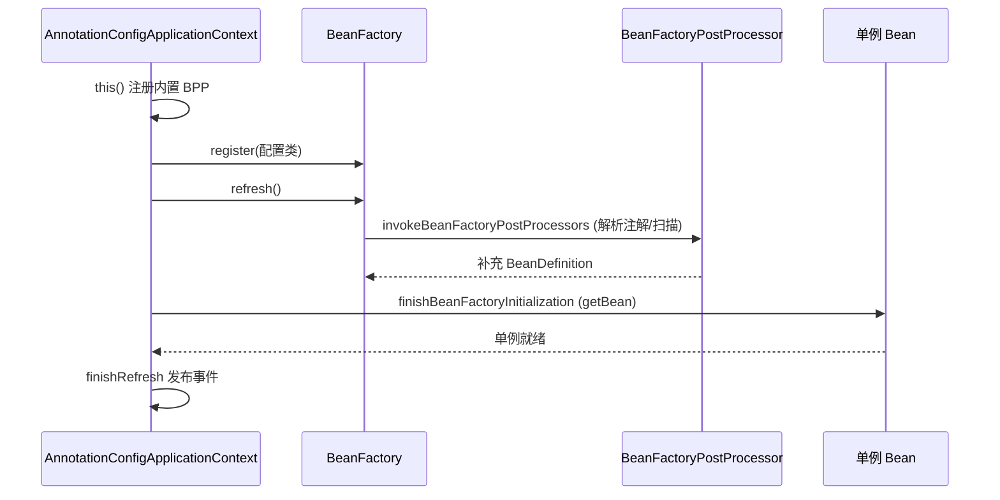
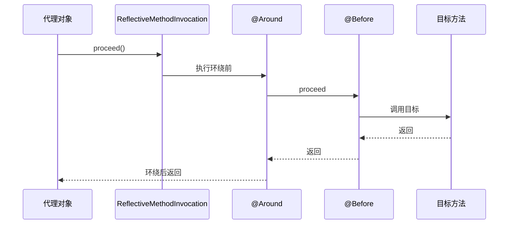
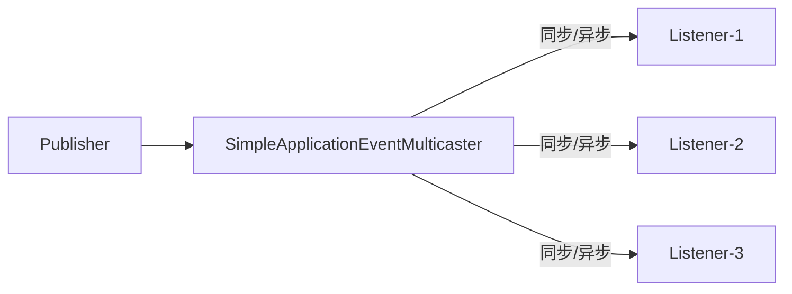
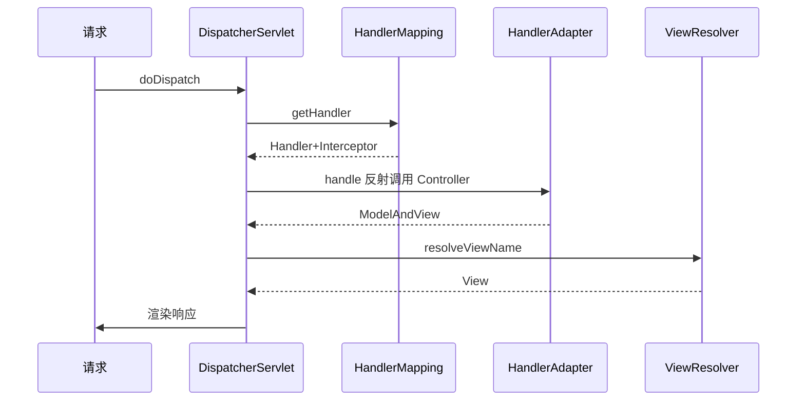

# Spring 源码解析

---

## 一、IoC 容器启动流程

以 `AnnotationConfigApplicationContext` 为例，核心三步：`this()`（注册内置后置处理器）→ `register(配置类)` → `refresh()`。

```java
public AnnotationConfigApplicationContext(Class<?>... componentClasses) {
    this();                  // 1. 初始化 AnnotatedBeanDefinitionReader / ClassPathBeanDefinitionScanner，注册 6 个内置 BeanFactoryPostProcessor（如 ConfigurationClassPostProcessor）
    register(componentClasses); // 2. 把配置类注册为 BeanDefinition
    refresh();               // 3. 容器刷新（核心）
}
```

`AbstractApplicationContext.refresh()` 是 IoC 启动的总入口（12 个步骤，关键如下）：

```java
public void refresh() {
    prepareRefresh();                       // 准备环境、校验
    ConfigurableListableBeanFactory beanFactory = obtainFreshBeanFactory();
    prepareBeanFactory(beanFactory);        // 注册 Aware/表达式解析器等
    postProcessBeanFactory(beanFactory);
    invokeBeanFactoryPostProcessors(beanFactory); // ★ 解析 @Configuration、@ComponentScan、@Import，注册 BeanDefinition
    registerBeanPostProcessors(beanFactory);// 注册 BPP
    initMessageSource(); initApplicationEventMulticaster();
    onRefresh();
    registerListeners();
    finishBeanFactoryInitialization(beanFactory); // ★ 实例化所有非懒加载单例
    finishRefresh();                        // 发布 ContextRefreshedEvent
}
```



## 二、Bean 生命周期

`getBean()` → `doGetBean()` → `createBean()` → `doCreateBean()`：

1. **实例化**：`createBeanInstance()` 通过构造器反射创建对象（未填充属性）。
2. **属性填充**：`populateBean()` 处理 `@Autowired`、`@Value`（依赖 `AutowiredAnnotationBeanPostProcessor`）。
3. **Aware 回调**：`BeanNameAware` / `BeanFactoryAware` / `ApplicationContextAware`。
4. **初始化前**：`BeanPostProcessor.postProcessBeforeInitialization()`。
5. **初始化**：`@PostConstruct`（`CommonAnnotationBeanPostProcessor`）→ `InitializingBean.afterPropertiesSet()` → 自定义 `init-method`。
6. **初始化后**：`BeanPostProcessor.postProcessAfterInitialization()`（**AOP 代理在此生成**）。
7. **销毁**：`@PreDestroy` → `DisposableBean.destroy()` → `destroy-method`。

```mermaid
flowchart TD
    A[实例化 createBeanInstance] --> B[属性填充 populateBean]
    B --> C[Aware 回调]
    C --> D[BPP before]
    D --> E[@PostConstruct / afterPropertiesSet]
    E --> F[BPP after → AOP代理]
    F --> G[单例就绪/使用中]
    G --> H[@PreDestroy / destroy]
```

## 三、循环依赖与三级缓存

Spring 用**三级缓存**解决单例 setter/字段注入的循环依赖（构造器注入无法解决）。

| 缓存 | 类型 | 存放 |
|------|------|------|
| `singletonObjects` | 一级 | 完全初始化好的单例 |
| `earlySingletonObjects` | 二级 | 提前曝光的早期引用（已实例化未初始化） |
| `singletonFactories` | 三级 | `ObjectFactory`：获取早期引用（可能经过 `SmartInstantiationAwareBeanPostProcessor`，即 AOP 代理） |

流程：A 实例化后，把 `() -> getEarlyBeanReference(A)` 放进三级缓存；填充属性时发现依赖 B → 创建 B；B 填充属性需要 A → 从三级缓存拿到 A 的早期引用（如有 AOP 则此时生成代理）放入二级缓存，并删除三级缓存；B 创建完，A 拿到 B 完成填充。最终 A 走完生命周期，代理对象在 `getSingleton` 中被替换为最终 bean。

```java
// AbstractAutowireCapableBeanFactory.doCreateBean 关键
addSingletonFactory(beanName, () -> getEarlyBeanReference(beanName, mbd, bean)); // 三级缓存
// DefaultSingletonBeanRegistry.getSingleton
Object singletonObject = singletonFactory.getObject(); // 触发早期引用/AOP
```

> 为什么需要三级而非两级？因为 AOP 代理应在「真正需要早期引用时」才生成（延迟），三级缓存用 `ObjectFactory` 把是否生成代理的决定延后，避免无循环依赖时也提前创建代理。

## 四、AOP 代理机制

`AbstractAutoProxyCreator.postProcessAfterInitialization` 中为满足条件的 Bean 创建代理：

- **JDK 动态代理**：目标类实现接口，基于 `InvocationHandler`，生成 `$Proxy` 实现接口。
- **CGLIB**：无接口或配置 `proxyTargetClass=true`，继承目标类，重写方法，基于 `MethodInterceptor`。

通知链（`Advice`）：`@Before`/`@After`/`@AfterReturning`/`@AfterThrowing`/`@Around` 被封装为 `MethodInterceptor`，通过 `ReflectiveMethodInvocation.proceed()` 递归执行，构成**责任链**。



## 五、事务管理源码（声明式 @Transactional）

`TransactionInterceptor.invoke()` → `TransactionAspectSupport.invokeWithinTransaction()`：

1. 通过 `PlatformTransactionManager`（如 `DataSourceTransactionManager`）根据 `TransactionDefinition` 获取事务（`doBegin`，建立连接、`autoCommit=false`）。
2. 把连接绑定到 `ThreadLocal`（`TransactionSynchronizationManager.bindResource(dataSource, connectionHolder)`）——这是**事务上下文跨方法传递**的关键。
3. 执行业务；抛 `RuntimeException`/`Error` → `doRollback()`，否则 `doCommit()`。
4. 清理 `ThreadLocal` 资源。

> 关键细节：事务传播行为 `PROPAGATION_REQUIRED`（加入已有事务 / 新建）、`REQUIRES_NEW`（挂起当前、新建）通过 `suspend()`/`resume()` 操作 `ThreadLocal` 绑定实现；**同类方法内部调用 `@Transactional` 不生效**，因为不走代理。

## 六、事件机制（ApplicationEvent）

基于**观察者模式**的发布/订阅：

- 发布：`ApplicationEventPublisher.publishEvent(event)` → `SimpleApplicationEventMulticaster`。
- 多播器遍历 `ApplicationListener`，通过 `Executor`（可异步）调用 `onApplicationEvent`。
- 容器内置事件：`ContextRefreshedEvent`、`ContextStartedEvent`、`ContextClosedEvent`、`RequestHandledEvent`。

```java
// 自定义事件与监听
@EventListener
public void onOrderCreated(OrderCreatedEvent e) { ... }

// 发布
applicationEventPublisher.publishEvent(new OrderCreatedEvent(this, orderId));
```



> **读源码建议**：IoC 主线抓 `refresh()` 的 `invokeBeanFactoryPostProcessors`（扩 BeanDefinition）与 `finishBeanFactoryInitialization`（实例化）；Bean 生命周期抓 `doCreateBean`；AOP/事务抓 `BeanPostProcessor` 与 `TransactionInterceptor`。三级缓存是高频考点，务必跟 `getSingleton` 三个 Map 的变化。

---

## 七、扩展点：BeanFactoryPostProcessor / Import / FactoryBean

### BeanFactoryPostProcessor

在 `refresh()` 的 `invokeBeanFactoryPostProcessors` 阶段执行，**此时 Bean 尚未实例化，但 BeanDefinition 已就绪**，可修改/新增 BeanDefinition。核心方法 `postProcessBeanFactory(ConfigurableListableBeanFactory)`。

```java
@FunctionalInterface
public interface BeanFactoryPostProcessor {
    void postProcessBeanFactory(ConfigurableListableBeanFactory beanFactory) throws BeansException;
}
```

`BeanDefinitionRegistryPostProcessor`（子接口，优先级更高）额外提供 `postProcessBeanDefinitionRegistry`，可往注册表塞 BeanDefinition。著名的 `ConfigurationClassPostProcessor` 就是它——负责解析 `@Configuration`、`@ComponentScan`、`@Import`、`@Bean`。

### @Import 三种用法

- 直接导入普通类（注册为 Bean）
- 导入 `ImportSelector`：`selectImports` 返回类名数组（如 `@EnableAsync` 导入 `AsyncConfigurationSelector`）
- 导入 `ImportBeanDefinitionRegistrar`：手动 `registry.registerBeanDefinition`（如 MyBatis 的 `MapperScannerRegistrar`）

```java
@Import(AsyncConfigurationSelector.class)  // 条件返回 ProxyAsyncConfiguration
public @interface EnableAsync { ... }
```

### FactoryBean

`FactoryBean` 是「生产 Bean 的工厂 Bean」：`getObject()` 返回真正想注入的对象，`getObjectType()` 返回类型，`isSingleton()` 控制单例。获取时 `getBean("&beanName")` 拿 FactoryBean 本身，否则拿产品。MyBatis 的 `SqlSessionFactoryBean`、Spring 的 `ProxyFactoryBean` 均基于此。

```java
public class MyFactoryBean implements FactoryBean<Foo> {
    public Foo getObject() { return new Foo(); }      // 真正注入的对象
    public Class<?> getObjectType() { return Foo.class; }
    public boolean isSingleton() { return true; }
}
```

## 八、@Async 与 @Scheduled 原理

### @Async

`@EnableAsync` 导入 `AsyncConfigurationSelector` → `ProxyAsyncConfiguration` 注册 `AsyncAnnotationBeanPostProcessor`（AOP 的 BPP）。它在 `postProcessAfterInitialization` 中为标注 `@Async` 的 Bean 创建代理，方法调用被 `AsyncExecutionInterceptor` 拦截：

```java
// AsyncExecutionInterceptor.invoke（简化）
public Object invoke(MethodInvocation invocation) {
    Callable<?> task = () -> invocation.proceed();
    AsyncTaskExecutor executor = determineAsyncExecutor(invocation.getMethod());
    return executor.submit(task); // 提交到线程池，异步执行
}
```

**易错点**：同类内方法 A 调 `@Async` 方法 B 不生效（不走代理）；默认 `SimpleAsyncTaskExecutor` 每次 new 线程，生产必须配自定义线程池（`@Async("myExecutor")` 或实现 `AsyncConfigurer`）。

### @Scheduled

`@EnableScheduling` 注册 `ScheduledAnnotationBeanPostProcessor`，它扫描 `@Scheduled` 方法，把 `cron`/`fixedDelay`/`fixedRate` 包装成 `ScheduledTask` 交给 `TaskScheduler`（默认 `ThreadPoolTaskScheduler`，单线程）调度。注意：**默认调度线程池只有 1 个线程**，多个定时任务会互相阻塞，需自定义 `SchedulingConfigurer` 设置线程池大小。

```java
@Scheduled(cron = "0 0/1 * * * ?")
public void job() { ... }
// 注册自定义调度线程池
@Bean
public TaskScheduler taskScheduler() {
    ThreadPoolTaskScheduler s = new ThreadPoolTaskScheduler();
    s.setPoolSize(10); return s;
}
```

## 九、SpringMVC 九大组件

`DispatcherServlet` 在 `onRefresh()` → `initStrategies()` 中初始化九大组件：

| 组件 | 作用 |
|------|------|
| `HandlerMapping` | 请求 → Handler（含拦截器链） |
| `HandlerAdapter` | 适配执行各类 Handler（如 `@RequestMapping` 方法） |
| `HandlerExceptionResolver` | 处理 Handler 异常 |
| `ViewResolver` | 逻辑视图名 → View |
| `LocaleResolver` | 国际化 |
| `ThemeResolver` | 主题 |
| `MultipartResolver` | 文件上传 |
| `RequestToViewNameTranslator` | 无显式视图名时推导 |
| `FlashMapManager` | 跨重定向传参 |

核心流程：



`HandlerAdapter` 是关键适配层：`RequestMappingHandlerAdapter` 通过 `HandlerMethodArgumentResolver`（参数解析，如 `@RequestBody`→`HttpMessageConverter`）和 `HandlerMethodReturnValueHandler`（返回值处理）完成 Controller 方法调用。

## 十、WebFlux 响应式源码

WebFlux 基于 **Reactor（Mono/Flux）+ Netty**（默认），是异步非阻塞的。核心入口 `HttpHandler` → `DispatcherHandler`（类似 `DispatcherServlet`，但全异步）：

```java
// DispatcherHandler.handle
public Mono<Void> handle(ServerWebExchange exchange) {
    return Flux.fromIterable(handlerMappings)
        .concatMap(m -> m.getHandler(exchange))     // 返回 Mono<Handler>
        .next()
        .flatMap(h -> invokeHandler(exchange, h))   // 执行
        .flatMap(r -> handleResult(exchange, r));   // 结果处理
}
```

- 整个调用链返回 `Mono<Void>` / `Mono<HandlerResult>`，通过 `subscribe` 驱动，线程不阻塞等待 IO。
- 注解驱动用 `@Controller` + 返回 `Mono`/`Flux`；函数式端点用 `RouterFunction` + `HandlerFunction`。
- 背压（backpressure）由 Reactor 在发布者与订阅者之间自动传递，区别于 SpringMVC 的「一个请求一个线程」。

## 十一、SpringBoot 启动全流程（refresh 之前）

`SpringApplication.run()` 在调用 `refresh()`（即 `AbstractApplicationContext.refresh`）之前做了大量准备：

```java
public ConfigurableApplicationContext run(String... args) {
    SpringApplicationRunListeners listeners = getRunListeners(args);
    listeners.starting();                      // 1. 发布 starting 事件
    ApplicationArguments arguments = new DefaultApplicationArguments(args);
    ConfigurableEnvironment environment = prepareEnvironment(listeners, arguments); // 2. 准备 Environment
    configureIgnoreBeanInfo(environment);
    Banner printedBanner = printBanner(environment); // 3. 打印 Banner
    context = createApplicationContext();     // 4. 创建上下文(按 web 类型)
    prepareContext(context, environment, listeners, applicationArguments, printedBanner); // 5. 预准备
    refreshContext(context);                   // 6. ★ 进入 refresh()（IoC 核心）
    afterRefresh(context, applicationArguments);
    listeners.started(context);
    callRunners(context, applicationArguments); // 7. 执行 ApplicationRunner/CommandLineRunner
    return context;
}
```

- `prepareEnvironment`：加载 `application.yml`、profile、命令行参数、系统属性到 `Environment`。
- `createApplicationContext`：根据 `WebApplicationType`（SERVLET / REACTIVE / NONE）反射创建 `AnnotationConfigServletWebServerApplicationContext` 等。
- `prepareContext`：把 `main` 类作为 source 注册（即 `@SpringBootApplication` 配置类），应用 `ApplicationContextInitializer`，发布 `contextPrepared` 事件。
- `refreshContext` 内部会触发 `ServletWebServerApplicationContext` 的 `onRefresh` → `createWebServer` 启动**内嵌 Tomcat/Jetty**（这是「内嵌容器」的由来）。

## 十二、条件注解 @Conditional 原理

`@Conditional(XXXCondition.class)` 是自动装配的灵魂。判断逻辑在 `ConfigurationClassPostProcessor` 解析 `@Configuration` 时，由 `ConditionEvaluator.shouldSkip()` 调用：

```java
// ConditionEvaluator.shouldSkip（简化）
public boolean shouldSkip(AnnotatedTypeMetadata metadata, ConfigurationPhase phase) {
    if (metadata.isAnnotated(Conditional.class.getName())) {
        for (Condition condition : conditions) {
            if (!condition.matches(context, metadata))   // 调 Condition.matches
                return true;  // 跳过该 BeanDefinition
        }
    }
    return false;
}
```

常见实现：`OnClassCondition`（`@ConditionalOnClass`，类路径存在某类才装配）、`OnPropertyCondition`（`@ConditionalOnProperty`）、`OnBeanCondition`（`@ConditionalOnBean`）。`@Profile` 本质也是 `@Conditional(ProfileCondition.class)`。自动配置类在 `spring.factories` 中的 `@ConditionalOnClass` 让「引入某 starter 才生效」成为可能。
