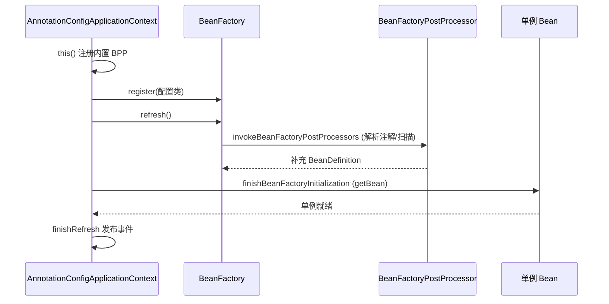
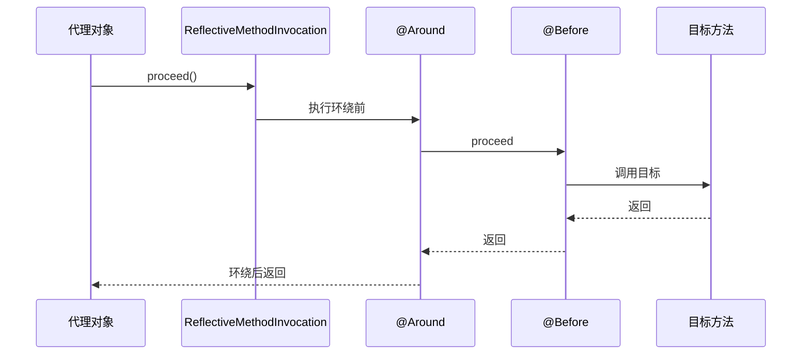
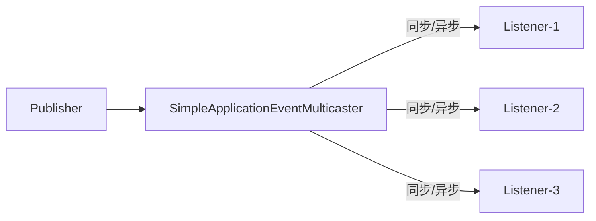

# Spring 源码解析

> ⚠️ 本页内容待补充。

---

## 一、IoC 容器启动流程

以 `AnnotationConfigApplicationContext` 为例，核心三步：`this()`（注册内置后置处理器）→ `register(配置类)` → `refresh()`。

```java
public AnnotationConfigApplicationContext(Class<?>... componentClasses) {
    this();                  // 1. 初始化 AnnotatedBeanDefinitionReader / ClassPathBeanDefinitionScanner，注册 6 个内置 BeanFactoryPostProcessor（如 ConfigurationClassPostProcessor）
    register(componentClasses); // 2. 把配置类注册为 BeanDefinition
    refresh();               // 3. 容器刷新（核心）
}
```

`AbstractApplicationContext.refresh()` 是 IoC 启动的总入口（12 个步骤，关键如下）：

```java
public void refresh() {
    prepareRefresh();                       // 准备环境、校验
    ConfigurableListableBeanFactory beanFactory = obtainFreshBeanFactory();
    prepareBeanFactory(beanFactory);        // 注册 Aware/表达式解析器等
    postProcessBeanFactory(beanFactory);
    invokeBeanFactoryPostProcessors(beanFactory); // ★ 解析 @Configuration、@ComponentScan、@Import，注册 BeanDefinition
    registerBeanPostProcessors(beanFactory);// 注册 BPP
    initMessageSource(); initApplicationEventMulticaster();
    onRefresh();
    registerListeners();
    finishBeanFactoryInitialization(beanFactory); // ★ 实例化所有非懒加载单例
    finishRefresh();                        // 发布 ContextRefreshedEvent
}
```



## 二、Bean 生命周期

`getBean()` → `doGetBean()` → `createBean()` → `doCreateBean()`：

1. **实例化**：`createBeanInstance()` 通过构造器反射创建对象（未填充属性）。
2. **属性填充**：`populateBean()` 处理 `@Autowired`、`@Value`（依赖 `AutowiredAnnotationBeanPostProcessor`）。
3. **Aware 回调**：`BeanNameAware` / `BeanFactoryAware` / `ApplicationContextAware`。
4. **初始化前**：`BeanPostProcessor.postProcessBeforeInitialization()`。
5. **初始化**：`@PostConstruct`（`CommonAnnotationBeanPostProcessor`）→ `InitializingBean.afterPropertiesSet()` → 自定义 `init-method`。
6. **初始化后**：`BeanPostProcessor.postProcessAfterInitialization()`（**AOP 代理在此生成**）。
7. **销毁**：`@PreDestroy` → `DisposableBean.destroy()` → `destroy-method`。

```mermaid
flowchart TD
    A[实例化 createBeanInstance] --> B[属性填充 populateBean]
    B --> C[Aware 回调]
    C --> D[BPP before]
    D --> E[@PostConstruct / afterPropertiesSet]
    E --> F[BPP after → AOP代理]
    F --> G[单例就绪/使用中]
    G --> H[@PreDestroy / destroy]
```

## 三、循环依赖与三级缓存

Spring 用**三级缓存**解决单例 setter/字段注入的循环依赖（构造器注入无法解决）。

| 缓存 | 类型 | 存放 |
|------|------|------|
| `singletonObjects` | 一级 | 完全初始化好的单例 |
| `earlySingletonObjects` | 二级 | 提前曝光的早期引用（已实例化未初始化） |
| `singletonFactories` | 三级 | `ObjectFactory`：获取早期引用（可能经过 `SmartInstantiationAwareBeanPostProcessor`，即 AOP 代理） |

流程：A 实例化后，把 `() -> getEarlyBeanReference(A)` 放进三级缓存；填充属性时发现依赖 B → 创建 B；B 填充属性需要 A → 从三级缓存拿到 A 的早期引用（如有 AOP 则此时生成代理）放入二级缓存，并删除三级缓存；B 创建完，A 拿到 B 完成填充。最终 A 走完生命周期，代理对象在 `getSingleton` 中被替换为最终 bean。

```java
// AbstractAutowireCapableBeanFactory.doCreateBean 关键
addSingletonFactory(beanName, () -> getEarlyBeanReference(beanName, mbd, bean)); // 三级缓存
// DefaultSingletonBeanRegistry.getSingleton
Object singletonObject = singletonFactory.getObject(); // 触发早期引用/AOP
```

> 为什么需要三级而非两级？因为 AOP 代理应在「真正需要早期引用时」才生成（延迟），三级缓存用 `ObjectFactory` 把是否生成代理的决定延后，避免无循环依赖时也提前创建代理。

## 四、AOP 代理机制

`AbstractAutoProxyCreator.postProcessAfterInitialization` 中为满足条件的 Bean 创建代理：

- **JDK 动态代理**：目标类实现接口，基于 `InvocationHandler`，生成 `$Proxy` 实现接口。
- **CGLIB**：无接口或配置 `proxyTargetClass=true`，继承目标类，重写方法，基于 `MethodInterceptor`。

通知链（`Advice`）：`@Before`/`@After`/`@AfterReturning`/`@AfterThrowing`/`@Around` 被封装为 `MethodInterceptor`，通过 `ReflectiveMethodInvocation.proceed()` 递归执行，构成**责任链**。



## 五、事务管理源码（声明式 @Transactional）

`TransactionInterceptor.invoke()` → `TransactionAspectSupport.invokeWithinTransaction()`：

1. 通过 `PlatformTransactionManager`（如 `DataSourceTransactionManager`）根据 `TransactionDefinition` 获取事务（`doBegin`，建立连接、`autoCommit=false`）。
2. 把连接绑定到 `ThreadLocal`（`TransactionSynchronizationManager.bindResource(dataSource, connectionHolder)`）——这是**事务上下文跨方法传递**的关键。
3. 执行业务；抛 `RuntimeException`/`Error` → `doRollback()`，否则 `doCommit()`。
4. 清理 `ThreadLocal` 资源。

> 关键细节：事务传播行为 `PROPAGATION_REQUIRED`（加入已有事务 / 新建）、`REQUIRES_NEW`（挂起当前、新建）通过 `suspend()`/`resume()` 操作 `ThreadLocal` 绑定实现；**同类方法内部调用 `@Transactional` 不生效**，因为不走代理。

## 六、事件机制（ApplicationEvent）

基于**观察者模式**的发布/订阅：

- 发布：`ApplicationEventPublisher.publishEvent(event)` → `SimpleApplicationEventMulticaster`。
- 多播器遍历 `ApplicationListener`，通过 `Executor`（可异步）调用 `onApplicationEvent`。
- 容器内置事件：`ContextRefreshedEvent`、`ContextStartedEvent`、`ContextClosedEvent`、`RequestHandledEvent`。

```java
// 自定义事件与监听
@EventListener
public void onOrderCreated(OrderCreatedEvent e) { ... }

// 发布
applicationEventPublisher.publishEvent(new OrderCreatedEvent(this, orderId));
```



> **读源码建议**：IoC 主线抓 `refresh()` 的 `invokeBeanFactoryPostProcessors`（扩 BeanDefinition）与 `finishBeanFactoryInitialization`（实例化）；Bean 生命周期抓 `doCreateBean`；AOP/事务抓 `BeanPostProcessor` 与 `TransactionInterceptor`。三级缓存是高频考点，务必跟 `getSingleton` 三个 Map 的变化。
