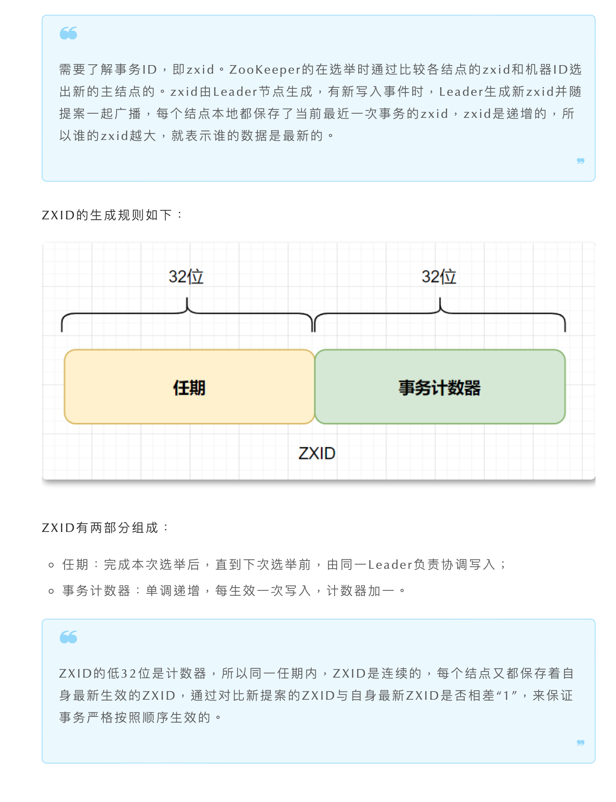

# Zookeeper 源码解析

## 参考文章

[常见 zk 的面试题](https://mp.weixin.qq.com/s/ir0uurwo95hB3g__vTceJQ)

## ZNode 的数据结构

```java
public class DataNode implements Record {
    byte data[];  //数据
    Long acl;  //访问权限
    public StatPersisted stat;   //当前节点 状态
    private Set<String> children = null;  //子节点
}
```

- **data**：znode 存储的业务数据信息
- **ACL**：记录客户端对 znode 节点的访问权限，如 IP 等
- **child**：当前节点的子节点引用
- **stat**：包含 ZNode 节点的状态信息，比如**事务 id、版本号、时间戳**等等

## zk 是如何保证消息顺序性的



> 上图展示了 zk 保证消息顺序性的原理（原为有道云笔记截图，此处保留引用）。
