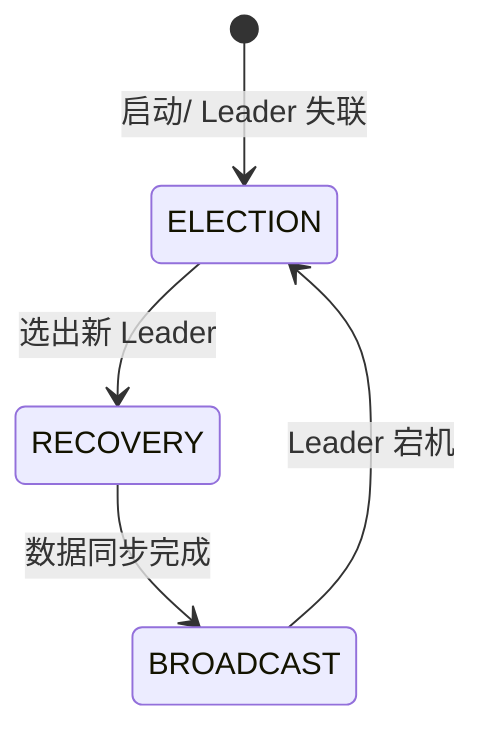
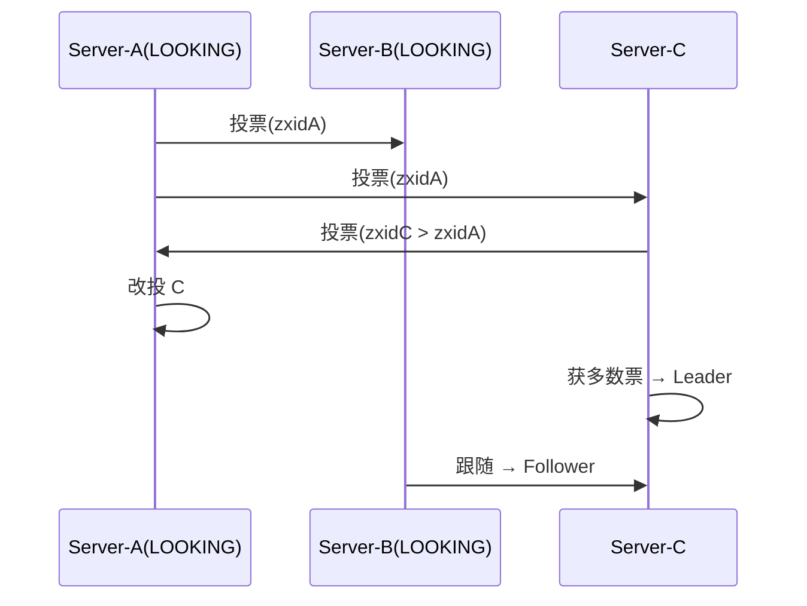
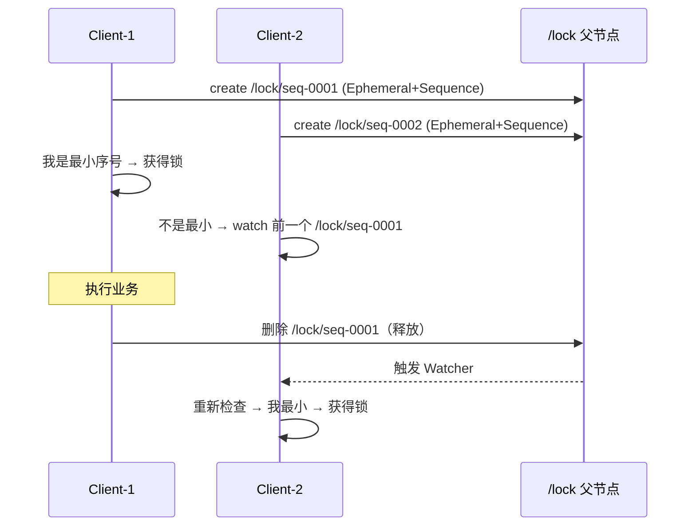

# Zookeeper 源码解析

## 参考文章

[常见 zk 的面试题](https://mp.weixin.qq.com/s/ir0uurwo95hB3g__vTceJQ)

## ZNode 的数据结构

```java
public class DataNode implements Record {
    byte data[];  //数据
    Long acl;  //访问权限
    public StatPersisted stat;   //当前节点 状态
    private Set<String> children = null;  //子节点
}
```

- **data**：znode 存储的业务数据信息
- **ACL**：记录客户端对 znode 节点的访问权限，如 IP 等
- **child**：当前节点的子节点引用
- **stat**：包含 ZNode 节点的状态信息，比如**事务 id、版本号、时间戳**等等

## zk 是如何保证消息顺序性的


> 上图展示了 zk 保证消息顺序性的原理（原为有道云笔记截图，此处保留引用）。

---

## ZAB 协议（ZooKeeper Atomic Broadcast）

ZAB 是 ZooKeeper 专门为高可用、有序的原子广播设计的崩溃恢复一致性协议，本质上类似简化版 Raft，但更强调「事务顺序广播」。

- **角色**：`Leader` / `Follower` / `Observer`（Observer 不参与投票，只同步数据、扩大读能力）。
- **ZXID**：`64位 = 32位 epoch（任期）+ 32位 counter（事务计数）`。Leader 切换时 epoch 自增，保证旧 Leader 的提议不会被新 Leader 误用。
- **两种模式**：



### 1. 选主（Leader Election / Fast Leader Election）

节点启动时都是 `LOOKING`，互相发送投票 `(mySID, myZXID, myEpoch)`：

- 比较规则：`epoch` 大者胜 → 同 epoch 则 `zxid` 大者胜 → 同 zxid 则 `sid` 大者胜。
- 收到更大投票则改投对方，当某节点获得**多数（quorum，>N/2）**支持即成为 Leader，其余变 Follower。



### 2. 恢复（Recovery / 同步）

新 Leader 选出后，与 Follower 对账：Follower 上报自己的 `lastZXID`，Leader 补齐差异（用 `DIFF`/`TRUNC`/`SNAP` 决定补发还是截断），确保集群数据一致后再进入广播。

### 3. 广播（Broadcast，类 2PC）

- Leader 收到写请求，分配递增 `zxid`，作为 `PROPOSAL` 广播给所有 Follower。
- Follower 写本地事务日志（WAL）后回 `ACK`。
- Leader 收到**多数 ACK** 即提交（写入 DataTree 内存 + 定期快照），并向 Follower 发 `COMMIT`。
- 保证**全局有序**：所有写按 zxid 线性顺序生效——这就是头部「消息顺序性」的底层原理。

> ZAB 与 Raft 区别：ZAB 把「选主」与「恢复」分离并强调单调广播顺序；Raft 把日志复制与选主更紧密耦合。但核心都是「多数派 + 任期 + 日志匹配」。

## Watcher 机制（监听）

ZooKeeper 的发布-订阅基于 **Watcher**，是**一次性、异步、轻量**的。

- **注册**：`getData/getChildren/exists` 时传入 `Watcher`（或 `addWatch` 持久监听）。
- **触发**：节点数据变更、子节点增删、节点创建/删除都会触发对应 Watcher，服务端向客户端发 `WatcherEvent`（仅事件类型，**不含旧值**）。
- **一次性**：触发后该 Watcher 即失效，需重新注册才能继续监听（避免服务端维护海量监听）。客户端 `ClientCnxn` 的 `ZKWatchManager` 在收到事件后默认移除，业务需在 `process()` 中重新 `getData(..., true)` 续订。
- **顺序保证**：Watcher 事件与对应的数据变更按相同顺序到达客户端（与 ZAB 的顺序性一致）。

```java
// 一次性监听示例
zk.getData("/config", new Watcher() {
    public void process(WatchedEvent e) {
        if (e.getType() == Event.EventType.NodeDataChanged) {
            // 重新读取并再次注册
            byte[] data = zk.getData("/config", this, null);
        }
    }
}, null);
```

## 分布式锁实现（基于临时顺序节点）

利用「临时节点（Ephemeral，会话断开自动删除）+ 顺序节点（Sequence）+ Watcher」实现高可用分布式锁。



核心思路：

1. 抢锁：在锁父节点下创建 **`EPHEMERAL|SEQUENTIAL`** 子节点（如 `/lock/seq-0000000001`）。
2. 判断：获取父节点下所有子节点并排序，若自己序号**最小**则获得锁；否则对**前一个序号节点**注册 Watcher。
3. 释放：业务完成删除自己的临时节点（或会话断开自动删除），前一个节点被唤醒重新竞争。
4. 优势：避免「羊群效应」（只 watch 前驱，而非全部 watch 父节点），且临时节点天然处理客户端崩溃解锁。

> Curator 框架的 `InterProcessMutex` 就是基于上述原理封装，生产直接使用即可，无需手写。

## 小结对照

| 主题 | 关键类 / 文件 | 一句话 |
|------|--------------|--------|
| 数据结构 | `DataNode` | 节点含 data/acl/children/stat |
| 顺序性 | `ZXID` + ZAB 广播 | 写按 zxid 全局有序 |
| 一致性 | `ZAB`（选主/恢复/广播） | 多数派 + epoch + 日志匹配 |
| 通知 | `Watcher`（一次性） | 事件异步、轻量、需续订 |
| 分布式锁 | 临时顺序节点 | watch 前驱，避免羊群效应 |
