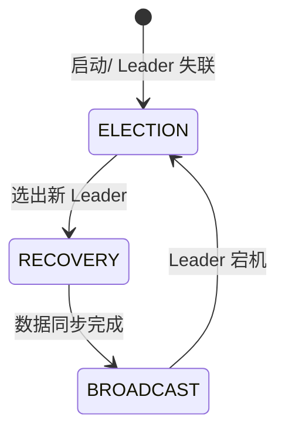
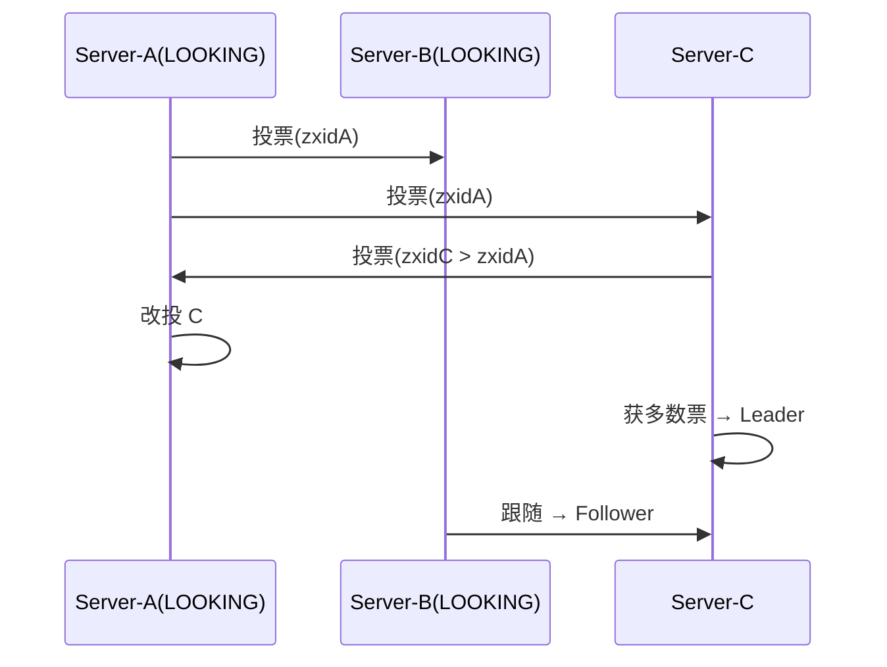
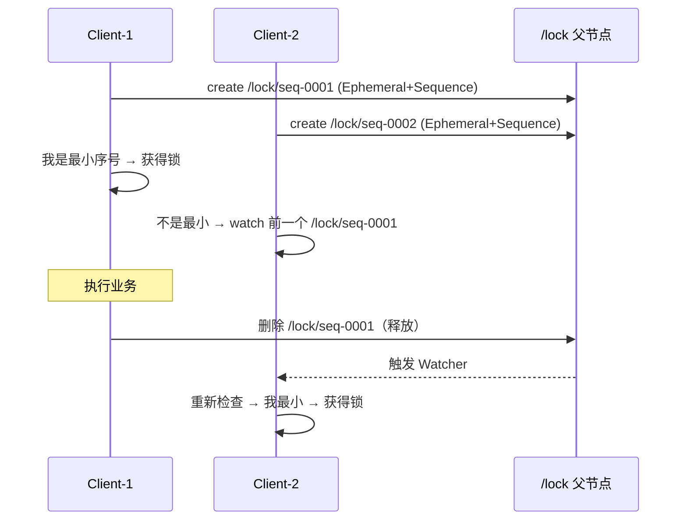
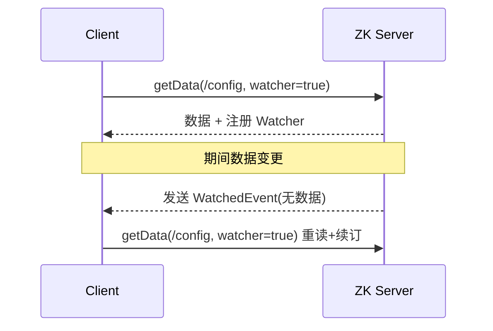

# Zookeeper 源码解析

## 参考文章

[常见 zk 的面试题](https://mp.weixin.qq.com/s/ir0uurwo95hB3g__vTceJQ)

## ZNode 的数据结构

```java
public class DataNode implements Record {
    byte data[];  //数据
    Long acl;  //访问权限
    public StatPersisted stat;   //当前节点 状态
    private Set<String> children = null;  //子节点
}
```

- **data**：znode 存储的业务数据信息
- **ACL**：记录客户端对 znode 节点的访问权限，如 IP 等
- **child**：当前节点的子节点引用
- **stat**：包含 ZNode 节点的状态信息，比如**事务 id、版本号、时间戳**等等

## zk 是如何保证消息顺序性的


> 上图展示了 zk 保证消息顺序性的原理（原为有道云笔记截图，此处保留引用）。

---

## ZAB 协议（ZooKeeper Atomic Broadcast）

ZAB 是 ZooKeeper 专门为高可用、有序的原子广播设计的崩溃恢复一致性协议，本质上类似简化版 Raft，但更强调「事务顺序广播」。

- **角色**：`Leader` / `Follower` / `Observer`（Observer 不参与投票，只同步数据、扩大读能力）。
- **ZXID**：`64位 = 32位 epoch（任期）+ 32位 counter（事务计数）`。Leader 切换时 epoch 自增，保证旧 Leader 的提议不会被新 Leader 误用。
- **两种模式**：



### 1. 选主（Leader Election / Fast Leader Election）

节点启动时都是 `LOOKING`，互相发送投票 `(mySID, myZXID, myEpoch)`：

- 比较规则：`epoch` 大者胜 → 同 epoch 则 `zxid` 大者胜 → 同 zxid 则 `sid` 大者胜。
- 收到更大投票则改投对方，当某节点获得**多数（quorum，>N/2）**支持即成为 Leader，其余变 Follower。



### 2. 恢复（Recovery / 同步）

新 Leader 选出后，与 Follower 对账：Follower 上报自己的 `lastZXID`，Leader 补齐差异（用 `DIFF`/`TRUNC`/`SNAP` 决定补发还是截断），确保集群数据一致后再进入广播。

### 3. 广播（Broadcast，类 2PC）

- Leader 收到写请求，分配递增 `zxid`，作为 `PROPOSAL` 广播给所有 Follower。
- Follower 写本地事务日志（WAL）后回 `ACK`。
- Leader 收到**多数 ACK** 即提交（写入 DataTree 内存 + 定期快照），并向 Follower 发 `COMMIT`。
- 保证**全局有序**：所有写按 zxid 线性顺序生效——这就是头部「消息顺序性」的底层原理。

> ZAB 与 Raft 区别：ZAB 把「选主」与「恢复」分离并强调单调广播顺序；Raft 把日志复制与选主更紧密耦合。但核心都是「多数派 + 任期 + 日志匹配」。

## Watcher 机制（监听）

ZooKeeper 的发布-订阅基于 **Watcher**，是**一次性、异步、轻量**的。

- **注册**：`getData/getChildren/exists` 时传入 `Watcher`（或 `addWatch` 持久监听）。
- **触发**：节点数据变更、子节点增删、节点创建/删除都会触发对应 Watcher，服务端向客户端发 `WatcherEvent`（仅事件类型，**不含旧值**）。
- **一次性**：触发后该 Watcher 即失效，需重新注册才能继续监听（避免服务端维护海量监听）。客户端 `ClientCnxn` 的 `ZKWatchManager` 在收到事件后默认移除，业务需在 `process()` 中重新 `getData(..., true)` 续订。
- **顺序保证**：Watcher 事件与对应的数据变更按相同顺序到达客户端（与 ZAB 的顺序性一致）。

```java
// 一次性监听示例
zk.getData("/config", new Watcher() {
    public void process(WatchedEvent e) {
        if (e.getType() == Event.EventType.NodeDataChanged) {
            // 重新读取并再次注册
            byte[] data = zk.getData("/config", this, null);
        }
    }
}, null);
```

## 分布式锁实现（基于临时顺序节点）

利用「临时节点（Ephemeral，会话断开自动删除）+ 顺序节点（Sequence）+ Watcher」实现高可用分布式锁。



核心思路：

1. 抢锁：在锁父节点下创建 **`EPHEMERAL|SEQUENTIAL`** 子节点（如 `/lock/seq-0000000001`）。
2. 判断：获取父节点下所有子节点并排序，若自己序号**最小**则获得锁；否则对**前一个序号节点**注册 Watcher。
3. 释放：业务完成删除自己的临时节点（或会话断开自动删除），前一个节点被唤醒重新竞争。
4. 优势：避免「羊群效应」（只 watch 前驱，而非全部 watch 父节点），且临时节点天然处理客户端崩溃解锁。

> Curator 框架的 `InterProcessMutex` 就是基于上述原理封装，生产直接使用即可，无需手写。

## 小结对照

| 主题 | 关键类 / 文件 | 一句话 |
|------|--------------|--------|
| 数据结构 | `DataNode` | 节点含 data/acl/children/stat |
| 顺序性 | `ZXID` + ZAB 广播 | 写按 zxid 全局有序 |
| 一致性 | `ZAB`（选主/恢复/广播） | 多数派 + epoch + 日志匹配 |
| 通知 | `Watcher`（一次性） | 事件异步、轻量、需续订 |
| 分布式锁 | 临时顺序节点 | watch 前驱，避免羊群效应 |

---

## Watcher 机制进阶与常见坑

### 三种注册方式与持久监听

除了传统的 `getData/getChildren/exists` 一次性 Watcher，ZK 3.6+ 提供 **`addWatch` 持久递归监听**：

```java
// 持久监听：节点及其子节点变更都会持续推送，无需重复注册
zk.addWatch("/config", new Watcher() {
    public void process(WatchedEvent e) { /* 持续收到事件 */ }
}, AddWatchMode.PERSISTENT_RECURSIVE);
```

- `PERSISTENT`：对当前节点持续生效。
- `PERSISTENT_RECURSIVE`：对节点及其所有后代持续生效（替代早期三方递归监听方案）。

### 常见坑

1. **一次性陷阱**：传统 Watcher 触发后即失效，若不在 `process()` 中重新注册，后续变更会漏掉——典型 bug 是「配置改了但应用没感知」。
2. **事件丢失（Lost Event）**：注册 Watcher 与数据变更之间若发生竞态（先改数据再注册），可能永远收不到事件。标准做法：先 `getData(path, watcher, stat)` 拿到当前数据和版本，再比对业务处理，用版本号兜底。
3. **Session 过期导致 Watcher 全失效**：客户端会话过期（见下文）后，服务端会清理该会话的所有 Watcher，重连需重新注册。
4. **Watcher 不携带数据**：`WatchedEvent` 只有类型与路径，**没有新旧值**，业务需自己重新拉取全量数据。
5. **羊群效应**：对父节点注册大量 Watcher，一次变更惊醒所有客户端。正确做法是「只 watch 前驱节点」（分布式锁思路）或改用持久递归监听 + 本地 diff。



## 分布式锁 / Leader 选举实现代码

### 手写分布式锁（含防误删）

```java
public class ZkLock {
    private final ZooKeeper zk;
    private final String lockRoot = "/locks";
    private String selfNode;

    public boolean tryLock() throws Exception {
        // 1. 建临时顺序节点
        selfNode = zk.create(lockRoot + "/seq-", new byte[0],
            ZooDefs.Ids.OPEN_ACL_UNSAFE,
            CreateMode.EPHEMERAL_SEQUENTIAL);
        // 2. 取兄弟节点排序
        List<String> children = new ArrayList<>(zk.getChildren(lockRoot, false));
        Collections.sort(children);
        String selfName = selfNode.substring(lockRoot.length() + 1);
        if (selfName.equals(children.get(0))) return true; // 最小即获得锁
        // 3. 监听前一个节点
        String prev = children.get(children.indexOf(selfName) - 1);
        CountDownLatch latch = new CountDownLatch(1);
        Stat stat = zk.exists(lockRoot + "/" + prev, e -> latch.countDown());
        if (stat != null) latch.await(); // 前驱释放才继续
        return true;
    }
    public void unlock() throws Exception {
        zk.delete(selfNode, -1); // 释放（会话断开也会被服务端删除）
    }
}
```

### Leader 选举（最小序号者为主）

同一思路：在 `/election` 下建临时顺序节点，序号最小者成为 Leader；Leader 宕机后节点消失，次小者通过 Watcher 被唤醒晋升。Curator 的 `LeaderLatch` / `LeaderSelector` 即此实现，且 `LeaderSelector` 支持「释放后自动重新参与选举」。

## Curator 框架

Curator 是 Netflix 开源的 ZK 客户端封装，解决了原生 API 的样板代码与坑：

- **重试策略**：`RetryNTimes` / `ExponentialBackoffRetry` 自动重试连接抖动。
- **Fluent API**：`CuratorFrameworkFactory.builder().connectString(...).retryPolicy(...).build()`。
- **分布式锁**：`InterProcessMutex`（可重入）、`InterProcessSemaphoreMutex`、`InterProcessReadWriteLock`。
- **Leader 选举**：`LeaderLatch`、`LeaderSelector`。
- **缓存**：`NodeCache`（监听单节点）、`PathChildrenCache`（监听子节点）、`TreeCache`（递归监听整棵子树，替代手工递归）。

```java
CuratorFramework client = CuratorFrameworkFactory.newClient(
    "127.0.0.1:2181", new ExponentialBackoffRetry(1000, 3));
client.start();
InterProcessMutex lock = new InterProcessMutex(client, "/order-lock");
if (lock.acquire(10, TimeUnit.SECONDS)) {
    try { /* 临界区 */ } finally { lock.release(); }
}
```

## ZAB 与 Paxos 的关系

- **Paxos**：经典的「共识」算法，解决「在不可信节点中对数个提案达成一致」，理论完备但难以直接工程化（活锁、实现复杂）。
- **ZAB**：ZooKeeper 专属的「原子广播」协议，是 Paxos 的一个**工程化特化分支**（与 Raft 同源思路）。区别：
  - ZAB 保证**事务的全局顺序性**（广播按 zxid 线性），Paxos 只保证单提案一致、不保证多提案的顺序。
  - ZAB 把「恢复（Recovery，含选主+数据对账）」与「广播（Broadcast）」明确分阶段；Raft 把日志复制与选主耦合更紧。
  - 二者都满足：多数派（`>N/2`）、任期/epoch 单调递增、日志匹配原则。

一句话：**ZAB ≈ 为「有序状态机复制」定制的 Paxos 变体**，牺牲通用性换取顺序广播的工程简洁。

## Session 超时与脑裂

### Session 机制

客户端连 ZK 会建立 Session，带 `sessionTimeout`（如 30s）。服务端用 `SessionTracker` 维护会话过期时间，客户端周期性发送 ping 续命。超时未心跳 → Session 过期 → 该会话创建的**所有临时节点被删除**，附着的 Watcher 被清理。

### 脑裂（Network Partition）

ZK 通过 **quorum（多数派）** 防止脑裂：

- 集群 2N+1 节点，选主/提交都需 `>N` 同意。分区后若少数派（≤N）无法凑齐多数，则停止对外写服务，只有多数派分区能选举出新 Leader 继续工作。
- 因此 **ZK 集群必须部署奇数台**（3/5/7），偶数台既不会提高容错（4 台仍只能容忍 1 台宕机，同 3 台）还浪费资源。
- 「脑裂」在 ZK 中表现为「少数派分区不可用」而非「双主同时写」——ZAB 的 epoch 机制保证旧 Leader 因收不到多数心跳而退位，新 Leader 拥有更大 epoch，旧 Leader 的 PROPOSAL 不会被提交。

## 用 ZooKeeper 做配置中心

思路：配置存于 ZNode（如 `/config/order-service`），客户端启动拉取并注册 Watcher/持久监听，变更时实时推送刷新本地配置。

```java
public class ZkConfigCenter {
    private final ZooKeeper zk;
    private final Map<String, String> localCache = new ConcurrentHashMap<>();

    public String get(String key) throws Exception {
        if (!localCache.containsKey(key)) {
            byte[] data = zk.getData("/config/" + key, e -> {
                try { localCache.put(key, new String(zk.getData("/config/" + key, false, null))); }
                catch (Exception ignored) {}
            }, null);
            localCache.put(key, new String(data));
        }
        return localCache.get(key);
    }
}
```

注意：原生 ZK 做配置中心适合「少量、低频变更」的配置；**大量配置 / 高频写入**会压垮 ZK（写是全局有序的），此时应优先 Nacos / Apollo。另外建议用 Curator 的 `TreeCache` 简化监听，并做好「配置为空时的默认值兜底」，避免 ZK 抖动导致应用启动失败。
