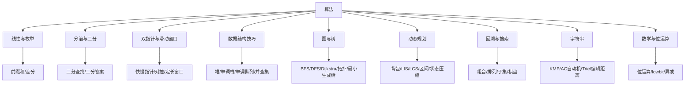

# 算法板块索引与学习路径

> 把「算法」从 5 篇（动态规划/双指针/回溯DFS/滑动窗口/矩形）扩展到面试高频全覆盖。本索引为新增内容的总入口，原有 5 篇保留。

## 一、本板块文档

| 文档 | 关键词 | 优先级 |
|------|--------|--------|
| [链表](链表.md) | 反转/快慢指针/环/合并/LRU | ⭐⭐⭐ |
| [二叉树](二叉树.md) | 遍历/二叉搜索树/最近公共祖先/层序 | ⭐⭐⭐ |
| [二分查找](二分查找.md) | 模板/旋转数组/搜索边界/峰值 | ⭐⭐⭐ |
| [堆与优先队列](堆与优先队列.md) | TopK/堆排序/中位数/定时器 | ⭐⭐⭐ |
| [图](图.md) | BFS/DFS/Dijkstra/拓扑排序/并查集联合 | ⭐⭐ |
| [并查集（题解）](并查集题解.md) | 连通分量/岛屿/最小生成树 | ⭐⭐ |
| [贪心](贪心.md) | 区间调度/分发糖果/跳跃游戏 | ⭐⭐ |
| [位运算](位运算.md) | 异或/lowbit/子集/状态压缩 | ⭐⭐ |
| [前缀和与差分](前缀和与差分.md) | 区间和/航班预订/矩阵差分 | ⭐⭐ |
| [单调栈与单调队列](单调栈与单调队列.md) | 下一个更大/滑动窗口最值 | ⭐⭐ |
| [字符串](字符串.md) | KMP/编辑距离/最长回文/ Trie | ⭐⭐ |
| [排序专题](排序专题.md) | 快排/归并/堆排手写模板/稳定性/选型 | ⭐⭐⭐ |
| [动态规划](动态规划.md) | 框架/背包/LIS/LCS/区间 | ⭐⭐⭐ |
| [回溯 DFS](回溯DFS.md) | 组合/排列/子集/棋盘/剪枝 | ⭐⭐⭐ |
| [双指针](双指针.md) | 对撞/快慢/滑动窗口 | ⭐⭐⭐ |
| [滑动窗口](滑动窗口.md) | 子串/子数组最值/定长窗口 | ⭐⭐⭐ |
| [矩形](矩形.md) | 旋转/面积/重叠/扫描线 | ⭐⭐ |

> 注：动态规划、双指针、回溯DFS、滑动窗口、矩形为早期保留文档，已补入导航表。

## 二、推荐刷题顺序

1. 链表、二叉树（树和链表是数组之外最高频的数据结构）。
2. 二分查找、堆（考察边界与抽象）。
3. 图、并查集（图论基础）。
4. 贪心、位运算、前缀和、单调栈、字符串（专项技巧）。

## 三、与其他板块的关系

- **基础知识/数据结构**：HashMap/ConcurrentHashMap/并查集/树状数组的基础实现在此。
- **场景设计**：一致性哈希、负载均衡、限流等算法思想源于此。
- **源码系列**：跳表（Redis）、红黑树（HashMap/Treemap）、堆（优先级队列）在源码里反复出现。

## 四、口诀

> 链表快慢指针找中点与环；树靠递归与层序；二分定边界防死循环；堆管 TopK 与中位数；图用 BFS/DFS/Dijkstra；并查集并连通、贪心选局部优；位运算省空间、前缀和求区间；单调栈看左右、KMP 跳失配。

---

[← 返回首页](../README.md)

---

## 五、算法总览地图（mermaid）

> 这张图是「算法」板块的骨架：从最朴素的枚举（前缀和加速区间枚举），到分治（二分）、到双指针/窗口的"双端收缩"，再到用数据结构把 O(n²) 压成 O(n log n)，最后是两大综合性武器——DP 与回溯。

---

## 六、复杂度速查表（面试常备）

| 算法 / 结构 | 平均时间 | 最坏时间 | 空间 | 关键前提 |
|------|------|------|------|------|
| 二分查找 | O(log n) | O(log n) | O(1) | 有序 / 单调 |
| 前缀和（查） | O(1) | O(1) | O(n) | 可减性（和/异或） |
| 差分（改） | O(1)/次 | O(1)/次 | O(n) | 区间加减 |
| 滑动窗口 | O(n) | O(n) | O(字符集) | 区间满足单调性 |
| 双指针（对撞） | O(n) | O(n) | O(1) | 有序 |
| 快慢指针 | O(n) | O(n) | O(1) | 链表 |
| 单调栈 | O(n) | O(n) | O(n) | 找左右最值 |
| 单调队列 | O(n) | O(n) | O(k) | 滑动窗口最值 |
| 堆 / 优先队列 | O(log n) 操作 | O(log n) | O(n) | 偏序 |
| 并查集（路径压缩） | O(α(n)) | O(α(n)) | O(n) | — |
| 哈希表 | O(1) | O(n) | O(n) | 好哈希 |
| KMP | O(n+m) | O(n+m) | O(m) | 单模式 |
| AC 自动机 | O(n+输出) | O(n+输出) | O(Σmᵢ) | 多模式 |
| BFS / DFS | O(V+E) | O(V+E) | O(V) | — |
| Dijkstra | O((V+E)log V) | O((V+E)log V) | O(V) | 非负权 |
| 拓扑排序 | O(V+E) | O(V+E) | O(V) | 有向无环 |
| 快排 | O(n log n) | O(n²) | O(log n) | 随机化 |
| 归并排序 | O(n log n) | O(n log n) | O(n) | 稳定 |
| 堆排序 | O(n log n) | O(n log n) | O(1) | 不稳定 |
| 0/1 背包 | O(n·C) | O(n·C) | O(C) | 容量整数 |
| LIS | O(n log n) | O(n log n) | O(n) | — |
| 编辑距离 | O(n·m) | O(n·m) | O(min(n,m)) | — |

> `α(n)` 是反阿克曼函数，增长极慢（n=10⁶⁰ 时 ≈ 4），实践中可视为常数。

---

## 七、题型 → 算法 映射表（刷题先用这张表定位）

| 题目特征 | 优先算法 | 对应文档 |
|------|------|------|
| 有序数组找值 / 最值 | 二分查找 | [二分查找](二分查找.md) |
| 区间和、子数组和=k | 前缀和 + 哈希 | [前缀和与差分](前缀和与差分.md) |
| 多次区间加减后查询 | 差分 | [前缀和与差分](前缀和与差分.md) |
| 子串/子数组最值、含约束 | 滑动窗口 / 双指针 | [滑动窗口](滑动窗口.md)、[双指针](双指针.md) |
| 链表找环 / 中点 / 相交 | 快慢指针 | [双指针](双指针.md)、[链表](链表.md) |
| 有序数组两数/三数/四数之和 | 对撞双指针 | [双指针](双指针.md) |
| 每个元素左右第一个更大/更小 | 单调栈 | [单调栈与单调队列](单调栈与单调队列.md) |
| 滑动窗口最大值 | 单调队列 | [单调栈与单调队列](单调栈与单调队列.md) |
| TopK / 中位数 / 定时器 | 堆 | [堆与优先队列](堆与优先队列.md) |
| 连通分量 / 岛屿 / 最小生成树 | 并查集 / 图 | [并查集题解](并查集题解.md)、[图](图.md) |
| 树遍历 / LCA / BST / 构建 | 二叉树递归 | [二叉树](二叉树.md) |
| 组合/排列/子集/棋盘 | 回溯 DFS | [回溯DFS](回溯DFS.md) |
| 最值/计数/选择问题 | 动态规划 | [动态规划](动态规划.md) |
| 区间调度 / 分发 / 跳跃 | 贪心 | [贪心](贪心.md) |
| 字符串匹配 / 敏感词 | KMP / AC 自动机 | [字符串](字符串.md)、[KMP与AC自动机](KMP与AC自动机.md) |
| 异或/lowbit/状态压缩 | 位运算 | [位运算](位运算.md) |
| 旋转 / 面积 / 重叠 / 扫描线 | 矩形 + 扫描线 | [矩形](矩形.md) |

---

## 八、各专题「一句话定位」（快速记忆）

| 文档 | 一句话 |
|------|--------|
| 链表 | 快慢指针找中点与环，虚拟头简化删除边界 |
| 二叉树 | 递归写遍历，层序拿分层，LCA 自底向上，BST 靠区间 |
| 二分查找 | 边界定死循环；二分答案把最值转判定 |
| 堆 | 大顶堆管 TopK，双堆管中位数，优先级队列本质堆 |
| 图 | BFS 求最短路/层，DFS 求连通，Dijkstra 非负权，拓扑判环 |
| 并查集 | 合并连通、路径压缩近 O(1)，岛屿/最小生成树标配 |
| 贪心 | 局部最优能推全局最优才用，先排序再选 |
| 位运算 | 异或消重、lowbit 取末位 1、`&` 掩码，省空间提速 |
| 前缀和差分 | 前缀和查 O(1)，差分改 O(1)，二维容斥"加减交叉" |
| 单调栈队列 | 栈看左右最值，队列看窗口最值，元素进出各一次 O(n) |
| 字符串 | KMP 跳失配，Trie 存前缀，编辑距离 DP，回文中心扩展 |
| 排序 | 快排快但最坏 O(n²)，归并稳，堆排原地，选型看稳定性 |
| 动态规划 | 状态+转移+-base+顺序，背包/LIS/区间一类模板 |
| 回溯DFS | 做选择→递归→撤销，剪枝决定能不能过 |
| 双指针 | 同向快慢、相向对撞、窗口滑动三兄弟 |
| 滑动窗口 | 右扩左缩维护合法区间，定长窗口直接滑 |
| 矩形 | 旋转用矩阵，面积用扫描线，重叠用差分/线段树 |

---

## 九、面试高频考点分布（按出现频率）

1. **数组 / 双指针 / 滑动窗口**（最高频）：两数之和、盛水、三数之和、最长无重复子串、最小覆盖子串。
2. **二叉树 / 递归**：遍历（递归+迭代）、LCA、BST 校验、构建树、层序。
3. **动态规划**：背包、LIS、编辑距离、打家劫舍、股票买卖。
4. **回溯**：全排列、组合总和、子集、N 皇后、解数独。
5. **图 / 并查集**：岛屿数量、课程表（拓扑）、最小生成树、最短路径。
6. **堆 / 单调栈队列**：TopK、滑动窗口最大值、每日温度、柱状图矩形。
7. **二分 / 前缀和**：搜索旋转数组、二分答案、和为 K 子数组、航班预订。
8. **字符串 / KMP**：实现 strStr、重复子串、单词搜索 II（Trie）。
9. **位运算**：只出现一次的数字、位 1 个数、N 皇后位运算、状态压缩。
10. **贪心 / 矩形**：区间调度、分发糖果、跳跃游戏、矩形面积并。

---

## 十、通用解题四步法（适用于所有板块）

1. **先想暴力**：写出 O(n²)/O(n³) 的朴素解，确认问题理解正确。
2. **找重复 / 找单调性**：哪些计算在"重复"？能否用前缀/哈希/单调结构缓存？数据是否有序可二分？
3. **定数据结构**：需要最值 → 堆；需要左右最值 → 单调栈；需要窗口最值 → 单调队列；需要连通 → 并查集；需要计数/匹配 → 哈希/KMP。
4. **证复杂度 + 清边界**：证明每个元素进出次数有限；清掉空输入、重复元素、溢出、死循环四类边界。

---

## 十一、易错点总表（全板块通用）

| 类别 | 典型坑 | 对策 |
|------|--------|------|
| 边界 | 空数组 / 单元素 / 全相等 | 先写 base case |
| 越界 | 下标 ±1、窗口 `i-k` vs `i-k+1` | 统一下标约定 |
| 死循环 | 二分上界 mid 没 +1、链表快慢没前进 | 画小规模例验证 |
| 溢出 | `l+r` 溢出、`1<<k` 超 int | `l+(r-l)/2`、`1L<<k` |
| 状态污染 | 回溯忘了还原、哈希没清 | 选择/撤销严格对称 |
| 精度 | 浮点二分 `r-l>eps` | 固定迭代次数 |
| 重复 | 排序后去重位置错 | 移动后再跳过相同 |
| 优先级 | 位运算低于 `==` | 一律加括号 |

---

## 十二、口诀汇总（全板块速记）

> 有序就二分，区间用前缀；重复算哈希，最值上单调。
> 链表快慢针，树靠递归还；图走 BFS/DFS，并查并连通。
> 堆管 TopK，队列管窗口；贪心选局部，DP 填表格。
> 回溯三步走，撤销不能漏；KMP 跳失配，AC 多模式。
> 位运异或消，lowbit 取末；矩阵容斥算，扫描线画边。

---

## 十三、与其他板块的衔接

- **基础知识/数据结构**：HashMap、堆、并查集、树状数组的底层实现在此，是算法题的"零件库"。
- **源码系列**：跳表（Redis）、红黑树（HashMap）、B+ 树（MySQL）、堆（优先级队列）在源码反复出现，算法是源码的地基。
- **场景设计**：一致性哈希、限流、排行榜、敏感词过滤、分布式 ID 的算法思想都源于本板块。
- **基础知识/并发编程**：CAS、无锁、ABA 问题涉及位运算与状态机。
- **大数据**：预聚合（物化视图）是前缀和思想，Bitmap 是位运算，HyperLogLog 用位计数。

---

## 十四、推荐练习清单（按难度递进）

- **入门（必会）**：两数之和、反转链表、二叉树遍历、最大子数组和、有效的括号。
- **进阶（高频）**：三数之和、接雨水、柱状图最大矩形、LRU、岛屿数量、课程表。
- **Hard（拉开差距）**：滑动窗口最大值、N 皇后、直方图中最大矩形、编辑距离、最小窗口子串、困难 DP。
- **工程向**：用 AC 自动机写敏感词过滤、用单调队列做实时窗口统计、用二分做数据库页内定位。

> 一句话收尾：**算法不是背题，而是建立"题型→套路→边界"的条件反射；本板块的每篇文档都按"原理 → 模板 → 变体 → 踩坑 → 口诀"组织，刷一篇就吃透一类。**

---

## 十五、各算法「一句话代码模板」速查

| 算法 | 模板骨架（一句话） | 文档 |
|------|------|------|
| 二分查找 | `while(l<r){ mid=l+(r-l)/2; ... }`，上界 mid+1 | [二分查找](二分查找.md) |
| 前缀和 | `pre[i+1]=pre[i]+a[i]`；区间 `pre[r+1]-pre[l]` | [前缀和与差分](前缀和与差分.md) |
| 差分 | `diff[l]+=v; diff[r+1]-=v`；左到右累加还原 | [前缀和与差分](前缀和与差分.md) |
| 双指针 | 同向快慢 / 相向对撞 / 同向窗口 | [双指针](双指针.md) |
| 滑动窗口 | `right++` 扩 → 满足后 `left++` 缩 | [滑动窗口](滑动窗口.md) |
| 单调栈 | 栈存下标，递减找更大、递增找更小，弹栈结算 | [单调栈与单调队列](单调栈与单调队列.md) |
| 单调队列 | 队首最值，过期下标 `dq[0]<=i-k` 出队 | [单调栈与单调队列](单调栈与单调队列.md) |
| 堆 | 小顶堆容量 k 求 TopK；双堆求中位数 | [堆与优先队列](堆与优先队列.md) |
| 并查集 | `Find` 路径压缩 + `Union` 按秩，返回 boolean | [并查集题解](并查集题解.md) |
| 位运算 | `x&-x` lowbit；`x&x-1` 消最低位 1；异或消重 | [位运算](位运算.md) |
| 树状数组 | `lowbit` 跳：`update(x,v)` / `query(x)` | [线段树与树状数组](线段树与树状数组.md) |
| 线段树 | 建树 + 单点改 + 区间查；区间改用懒标记 pushDown | [线段树与树状数组](线段树与树状数组.md) |
| KMP | 构建 `next`；文本指针不回退 | [字符串](字符串.md) |
| 回溯 | `做选择 → 递归 → 撤销`，剪枝四类型 | [回溯DFS](回溯DFS.md) |
| 贪心 | 排序 + 局部最优 + 交换论证可证 | [贪心](贪心.md) |
| 排序 | 快排（不稳定）/归并（稳定）/堆排（原地） | [排序专题](排序专题.md) |

---

## 十六、算法题调试 Checklist（通用于所有板块）

1. **边界**：空输入、单元素、全相等、全逆序、含 0/负数。
2. **越界**：下标 `±1`；窗口 `i-k` vs `i-k+1`；数组开 `4n`（线段树）。
3. **死循环**：二分上界 `mid` 没 `+1`；链表快慢指针没前进；滑动窗口没收缩。
4. **溢出**：`l+r` 改用 `l+(r-l)/2`；`1<<k` 用 `1L<<k`；矩形面积用 `long`。
5. **状态污染**：回溯忘记还原（路径/标记/used 严格对称撤销）；哈希没清。
6. **精度**：浮点二分用 `r-l>eps` 或固定迭代次数。
7. **重复**：排序后去重位置错（移动后再跳过相同）。
8. **优先级**：位运算低于 `==`，一律加括号。

> 写完后用 2~3 个小用例（含边界）手跑一遍，比"提交看报错"快 10 倍。

---

## 十七、从暴力到优化的思想归类表

| 朴素做法 | 瓶颈 | 优化武器 | 文档 |
|------|------|------|------|
| 区间和 O(n) 每次 | 重复计算 | 前缀和 O(1) | [前缀和与差分](前缀和与差分.md) |
| 两重循环找最值 | O(n²) | 单调栈/队列 O(n) | [单调栈与单调队列](单调栈与单调队列.md) |
| 全排序取前 k | O(n log n) | 堆 O(n log k) | [堆与优先队列](堆与优先队列.md) |
| 逐字符匹配 | O(nm) | KMP O(n+m) | [字符串](字符串.md) |
| 枚举所有子集 | O(2ⁿ) | 记忆化/DP 剪枝 | [回溯DFS](回溯DFS.md)、[动态规划](动态规划.md) |
| 有序数组线性找 | O(n) | 二分 O(log n) | [二分查找](二分查找.md) |
| 静态区间统计 | O(n) | 树状数组/线段树 | [线段树与树状数组](线段树与树状数组.md) |
| 连通/判环 | DFS 一遍 | 并查集动态 | [并查集题解](并查集题解.md) |
| 指数级搜索 | 重复子问题 | 记忆化搜索 | [回溯DFS](回溯DFS.md) |

---

## 十八、面试答题结构 & 时间分配

**标准答题四步（15~25 分钟/题）**：
1. **澄清**（1 min）：确认输入输出、约束（数据规模/是否有序/可修改）、边界。
2. **暴力**（3 min）：先说 O(n²) 朴素解，证明理解正确；同时点出瓶颈。
3. **优化**（8 min）：选数据结构/算法，讲清核心思想（画图/举例），写代码。
4. **验证**（3 min）：跑小用例、分析复杂度、讨论边界与 trade-off。

**加分动作**：
- 主动讲复杂度（时间/空间）与最坏情况。
- 主动提"如果是数据流/海量数据/动态修改"怎么办（引出进阶版）。
- 关联已知结构（"这其实是单调栈/并查集的标准应用"）。

**时间不够时的取舍**：写完能跑的暴力 + 清晰优化思路 > 写一半的完美最优解。

---

## 十九、板块反向链接汇总

- **基础知识/数据结构**：HashMap 树化、堆、并查集、树状数组的底层实现。
- **源码系列**：跳表（Redis）、红黑树（HashMap/TreeMap）、B+ 树（MySQL）、堆（优先级队列）。
- **场景设计**：一致性哈希、限流、排行榜、敏感词过滤（AC 自动机）、分布式 ID（雪花朵段）、延迟任务（时间轮/最小堆）。
- **基础知识/并发编程**：CAS、无锁、ABA（位运算与状态机）。
- **基础知识/大数据**：预聚合（物化视图=前缀和）、Bitmap（位运算）、HyperLogLog（位计数）。
- **安全工程**：输入校验、正则注入、敏感词 DFA（见 安全工程/常见 Web 安全漏洞与防护）。

> 本索引与 17 篇专题互为入口：**专题讲"怎么写"，索引讲"怎么选"**。刷专题时用第十五/十七表定位，面试前用第十六 Checklist 自检。

---

## 二十、常见"陷阱题"速记（面试高频易错 15 条）

1. **零钱兑换不能贪心**（面额不成倍数时），用 DP。
2. **最长递增子序列不能贪心**（每次选最小能接的会错），用二分/耐心排序。
3. **验证 BST 不能只比父节点**，要全局上下界。
4. **二分上界 mid 必须 +1**，否则 `l==r-1` 死循环。
5. **TopK 用"小顶堆"**（留最大 k 个），别用反。
6. **双堆中位数要先入一堆放另一堆再平衡**，否则 size 失衡。
7. **单调栈找更大用递减栈**，找更小用递增栈，存下标不存值。
8. **滑动窗口含负数失效**，改前缀和 + 哈希。
9. **KMP 文本指针不回退**，next 构建 `i` 从 1 开始。
10. **编辑距离首行首列初始化**（空串）。
11. **接雨水移较小 max 一侧**，移高侧面积不增。
12. **颜色分类换 2 时 i 不动**，换 0 后 i 推进。
13. **回溯撤销必须与选择严格对称**，否则结果串全是同一引用。
14. **快排 partition 用 >=/<= 防死循环**，且不稳定。
15. **位运算优先级低于 ==**，一律加括号；`1<<k` 用 `1L<<k` 防溢出。

---

## 二十一、各语言标准库算法 API 对照

| 能力 | Java | Go | Python |
|------|------|-----|--------|
| 排序 | `Arrays.sort` / `Collections.sort` | `sort.Ints` / `sort.Slice` | `sorted` / `list.sort` |
| 二分查找 | `Arrays.binarySearch` | `sort.Search` | `bisect` |
| 堆/优先队列 | `PriorityQueue` | `container/heap` | `heapq` |
| 哈希 | `HashMap` | `map` | `dict` |
| 字符串匹配 | `String.indexOf` | `strings.Index` | `str.find` |
| 正则 | `Pattern` | `regexp` | `re` |
| 双端队列 | `ArrayDeque` | 自实现/container | `collections.deque` |

> 面试写代码优先用"面试官熟悉的语言"的标准库；手写结构（堆/并查集/线段树）才自己实现。

---

## 二十二、按周复习节奏建议

- **第 1 周（基础结构）**：数组双指针、链表、二叉树、二分查找 —— 每天 2 题 + 默写模板。
- **第 2 周（技巧集）**：滑动窗口、单调栈/队列、堆、前缀和/差分、位运算 —— 重点"识别题型"。
- **第 3 周（综合）**：字符串（KMP/Trie/编辑距离）、并查集、贪心、排序、矩形 —— 综合应用。
- **第 4 周（两大武器）**：动态规划、回溯 DFS —— 每天 1 中 + 1 难，整理"状态定义"套路。
- **冲刺**：用本索引第十五/十七表自测"能否 30 秒说出思路"，用第十六 Checklist 自查边界。

---

## 二十三、一句话再强化各专题（记忆锚点）

- 链表：**快慢指针**找中点与环，dummy 简化边界。
- 二叉树：**递归**写遍历，层序拿分层，LCA 自底向上，BST 靠区间。
- 二分：**边界定死循环**，二分答案把最值转判定。
- 堆：**小顶堆管 TopK，双堆管中位数**，优先级队列本质堆。
- 图：BFS 求层/最短路，DFS 求连通，Dijkstra 非负权，拓扑判环。
- 并查集：**合并连通、路径压缩近 O(1)**，岛屿/最小生成树标配。
- 贪心：**局部最优能推全局最优**才用，先排序再选。
- 位运算：**异或消重、lowbit 取末位**，`&` 掩码省空间。
- 前缀和差分：**前缀和查 O(1)，差分改 O(1)**，二维容斥加减交叉。
- 单调栈队列：**栈看左右最值，队列看窗口最值**，元素进出各一次 O(n)。
- 字符串：KMP 跳失配，Trie 存前缀，编辑距离 DP，回文中心扩展。
- 排序：快排快但最坏 O(n²)，归并稳，堆排原地，选型看稳定性。
- 动态规划：状态 + 转移 + base + 顺序，背包/LIS/区间一类模板。
- 回溯 DFS：**做选择 → 递归 → 撤销**，剪枝决定能不能过。
- 双指针：同向快慢、相向对撞、窗口滑动三兄弟。
- 滑动窗口：右扩左缩维护合法区间，定长窗口直接滑。
- 矩形：旋转用矩阵，面积用扫描线，重叠用投影，最大用单调栈/DP。

> 把这 17 句话贴在桌面，每刷一题对照一句，一个月形成条件反射。

---

## 二十四、快速检索提示（如何用本板块）

- **想不起模板**：直接用第十五节「一句话代码模板速查表」，每篇都有可运行 Java/Go 代码。
- **不会选型**：用第十七节「暴力→优化思想归类表」或第七节的「题型→算法映射表」定位武器。
- **写完怕错**：用第十六节「调试 Checklist」逐条对照边界/越界/死循环/溢出/状态污染。
- **面试前冲刺**：用第十九节「陷阱题 15 条」+ 第二十三节「记忆锚点」做 30 秒自测。
- **想要工程深度**：每篇的「工程应用 / 源码位置」小节都给出了真实系统落点（Redis、MySQL、JDK、Kafka…）。
- **想串起来**：每篇末尾的「相关主题反向链接」用相对路径互链，顺着链接能织成知识网。

> 本板块的设计目标：**原理优先、详实深做、可运行代码 + 对比表 + mermaid 图 + 踩坑 + 口诀 + 反向链接**，让每篇都能"单独吃透一类、串联成网"。如某篇仍有薄处，按同结构继续追加即可。

---

## 二十五、使用本板块的三条纪律

1. **先懂原理再背模板**：每篇「本体介绍 / 原理」是根，模板是叶；只背模板一变题就懵。
2. **每题先写暴力再优化**：暴力确认理解，优化讲清"为什么能降复杂度"，这是面试得分点。
3. **定期用自测卡回测**：每篇末尾的自测卡就是闭卷小考，能 30 秒答完才算真会。

> 算法能力 = 题量 × 复盘质量。本板块提供"原理—模板—变体—踩坑—口诀"的闭环，坚持按纪律刷，效果远胜题海。
