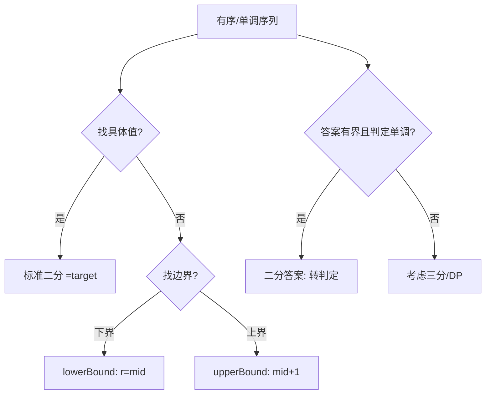

# 二分查找（Binary Search）

## 〇、本体介绍

**二分查找**：在**有序**区间上每次折半，把搜索空间砍一半，O(log n)。广义二分不止「查元素」，更核心的是**「二分答案」**——对「满足某条件的最小/最大值」在值域上二分。

**关键在边界**：`while (left < right)` 还是 `<=`，`mid` 向下还是向上取整，更新 `left=mid` 还是 `mid+1`，决定了会不会死循环、会不会漏解。

**面试高频**：标准二分、搜索插入位置、旋转数组、找边界（第一个≥x）、峰值、二分答案（最小化最大值）。

---

## 一、标准模板（找 target）

```java
int l = 0, r = n - 1;
while (l <= r) {
    int mid = l + (r - l) / 2;
    if (a[mid] == target) return mid;
    else if (a[mid] < target) l = mid + 1;
    else r = mid - 1;
}
return -1;
```

### 1.1 深挖：一套模板打天下（统一「找边界」模板）

把二分收敛成唯一范式：**`while (l < r)` + 条件取反分治**，避免多套模板混淆。

```java
// 模板 A：找「第一个满足条件」的位置（下界/最左）
int lowerBound(int[] a, int x) {          // 第一个 >= x
    int l = 0, r = a.length;              // 注意 r 开区间，允许答案 = n（全小于）
    while (l < r) {
        int mid = l + (r - l) / 2;        // 向下取整
        if (a[mid] >= x) r = mid;         // 满足 → 左收（含 mid）
        else l = mid + 1;                 // 不满足 → 右收（排除 mid）
    }
    return l;
}

// 模板 B：找「最后一个满足条件」的位置（上界）
int upperBound(int[] a, int x) {          // 最后一个 <= x
    int l = -1, r = a.length - 1;         // 允许答案 = -1
    while (l < r) {
        int mid = l + (r - l + 1) / 2;    // 向上取整（关键！）
        if (a[mid] <= x) l = mid;         // 满足 → 右收（含 mid）
        else r = mid - 1;                 // 不满足 → 左收（排除 mid）
    }
    return l;
}
```

> **记忆口诀**：`l=mid`（右收）必配**向上取整**，否则 `l==r-1` 时 mid 恒等于 l，死循环。凡是「找最右/上界」都在 mid 上 +1。

### 1.2 深挖：二分答案（把最值问题转判定问题）

```java
// 例：分割数组「最大值最小化」（410），对「最大段和」二分
int splitArray(int[] nums, int k) {
    int l = 0, r = 0;
    for (int x : nums) { l = Math.max(l, x); r += x; }   // 答案 ∈ [max, sum]
    while (l < r) {
        int mid = l + (r - l) / 2;
        if (canSplit(nums, k, mid)) r = mid;  // 可行 → 试着更小
        else l = mid + 1;
    }
    return l;
}
boolean canSplit(int[] nums, int k, int limit) {  // 判定：段和 ≤ limit 能否分成 ≤ k 段
    int cnt = 1, sum = 0;
    for (int x : nums) {
        if (sum + x > limit) { cnt++; sum = 0; }
        sum += x;
    }
    return cnt <= k;
}
```

> **适用条件**：答案有界 + **判定函数随答案单调**（值越大越容易满足）。「最小化最大值 / 最大化最小值 / 距离 / 速度 / 天数」这类题优先想二分答案。

---

## 二、找左右边界（最常用变体）

- **第一个 ≥ target（下界）**：`while (l < r) { mid = l + (r-l)/2; if (a[mid] >= x) r = mid; else l = mid+1; }` 返回 l。
- **最后一个 ≤ target（上界）**：对称改 `if (a[mid] <= x) l = mid; else r = mid-1;`（mid 向上取整防死循环）。

> 记忆：**求下界用 `r=mid`、求上界用 `l=mid`，mid 取整方向与之相反**，可避免死循环。

---

## 三、经典例题

- **搜索插入位置（35）**：即求下界。
- **在排序数组中查找元素的第一个和最后一个位置（34）**：下界 + 上界。
- **搜索旋转排序数组（33）**：先判 mid 落在哪段有序，再缩半。
- **寻找峰值（162）**：`nums[i] > nums[i+1]` 则峰值在左（含 i），否则在右——必有峰值因两端趋 -∞。
- **二分答案**：如「传送带包裹（1011）」对天数二分；「分割数组最大值」对最大和二分。本质把最值问题转判定问题。

### 3.1 深挖：旋转数组的两种考法

```java
// 33 搜索旋转排序数组（无重复）：先定有序半边，再判断 target 是否在内
int search(int[] nums, int target) {
    int l = 0, r = nums.length - 1;
    while (l <= r) {
        int mid = l + (r - l) / 2;
        if (nums[mid] == target) return mid;
        if (nums[l] <= nums[mid]) {            // 左半边有序
            if (nums[l] <= target && target < nums[mid]) r = mid - 1;
            else l = mid + 1;
        } else {                               // 右半边有序
            if (nums[mid] < target && target <= nums[r]) l = mid + 1;
            else r = mid - 1;
        }
    }
    return -1;
}

// 153 寻找旋转数组最小值：比较 nums[mid] 与 nums[r]
int findMin(int[] nums) {
    int l = 0, r = nums.length - 1;
    while (l < r) {
        int mid = l + (r - l) / 2;
        if (nums[mid] > nums[r]) l = mid + 1;  // 最小值在右（含 mid+1）
        else r = mid;                          // 最小值在左（含 mid）
    }
    return nums[l];
}
```

> 有重复元素（154）：`nums[mid]==nums[l]==nums[r]` 时无法判断，`l++`（或 `r--`）退化处理。

---

## 四、易错点

- **死循环**：`l=mid; r=mid` 组合 + mid 取整不当。求上界时 `mid = l + (r-l+1)/2`。
- **区间闭合**：明确 `[l, r]` 还是 `[l, r)`，全程一致。
- **旋转数组**先确定有序半边再二分，别整体二分。
- 二分答案的判定函数要**与单调方向一致**（可行返回什么、朝哪边收）。
- 防溢出：`mid = l + (r-l)/2` 而非 `(l+r)/2`。

---

## 五、工程应用：二分在真实系统的位置

| 场景 | 说明 |
|------|------|
| JDK `Arrays.binarySearch` | 有序数组查找，返回负插入点 `-(insertionPoint)-1` |
| 数据库 B+ 树 | 页内 slot 二分查找（MySQL InnoDB 页目录，见 源码系列/MySQL-InnoDB源码.md） |
| Redis | 跳表查找、`ZREVRANGE` 按 rank；过期字典/事件驱动用到有序二分 |
| Kafka | 日志段索引文件（.index 稀疏索引）用二分定位 offset（见 源码系列/Kafka源码.md） |
| 监控/调度 | 时钟有序集合、延迟队列的最小堆定位（堆内二分下滤） |
| 机器学习 | 阈值搜索、超参二分搜索 |

> 面试加分：**数据库页内「目录槽二分」** 与 **Kafka 稀疏索引二分** 是二分最经典的两处工业级应用，能讲出来即展示工程深度。

---

## 六、与其他板块的关系

- **基础知识/数据结构**：B+ 树页内二分、跳表二分查找。
- **源码系列/MySQL-InnoDB源码.md**：Page Directory 槽位二分定位记录。
- **源码系列/Kafka源码.md**：LogSegment 索引文件二分定位消息。
- **算法/单调栈**：部分「第 k 个/区间统计」题可二分+前缀和组合。

---

## 面试高频问题（30+ 条）

1. **二分查找前提？** 数据有序（或具单调性），能判断 mid 落在目标左/右。
2. **时间复杂度？** O(log n)。
3. **为什么用 `l + (r-l)/2` 防溢出？** 避免 `(l+r)/2` 在大数时整型溢出。
4. **求下界模板？** `while(l<r){ mid=l+(r-l)/2; if(a[mid]>=x) r=mid; else l=mid+1;} return l;`
5. **求上界模板？** `while(l<r){ mid=l+(r-l+1)/2; if(a[mid]<=x) l=mid; else r=mid-1;} return l;`
6. **为什么上界 mid 要 +1？** 防止 `l==r-1` 时 `mid=l` 导致 `l=mid` 死循环。
7. **`<=` 和 `<` 循环区别？** `<=` 配 `r=mid-1`（闭区间）；`<` 配 `r=mid`（左闭右开），别混。
8. **搜索插入位置？** 即求第一个 ≥ target 的下界。
9. **旋转数组怎么二分？** 先判 mid 在左段还是右段有序，对有序半边判断 target 是否在内，缩半。
10. **有重复元素的旋转数组？** 用 `nums[l]==nums[mid]==nums[r]` 时 `l++/r--` 去重，否则同旋转二分。
11. **寻找峰值思路？** 任一侧下坡的方向必有峰；`nums[mid]>nums[mid+1]` 则峰在左（含mid）。
12. **什么是二分答案？** 对「答案值域」二分，把最值问题转成判定问题（如最小化最大和）。
13. **二分答案适用条件？** 答案有界且「判定函数」随答案单调（可行则更大/更小也可行）。
14. **有序二维矩阵查找（240）？** 从右上角，大于则左移、小于则下移，O(m+n)。
15. **平方根（69）？** 对 [0, x] 二分，注意整数精度与溢出。
16. **`lower_bound`/`upper_bound` 区别？** 前者第一个 ≥，后者第一个 >。
17. **二分在 Java 哪有？** `Arrays.binarySearch`、`Collections.binarySearch`，返回负插入点。
18. **为什么二分易写错？** 边界与 mid 取整组合多，建议固定一套模板。
19. **如何调试二分？** 用几个小用例（含边界、重复、空）验证 l/r 收敛。
20. **二分与三分区别？** 二分用于单峰/单调判定；三分用于凸函数求极值（取两内点比大小）。
21. **二分查找最坏/平均？** 都 O(log n)；空间 O(1) 迭代。
22. **如何用二分做「有序数组找缺失数」？** 比较 `nums[mid]` 与 `mid`，偏移判断缺失在左还是右。
23. **什么时候用二分答案而不是直接构造？** 直接构造复杂/不可能时；判定函数易写即可。
24. **「找第 k 个有序数组中位数（4）」二分思路？** 对小数组二分切点，保证左半元素数= k。
25. **浮点数二分怎么写？** `while (r - l > eps)`，或固定迭代 60~100 次（数值稳定）。
26. **「小船救生艇/装箱」是二分答案吗？** 是：对「最少船数」二分 + 贪心判定。
27. **二分与「倍增」区别？** 倍增预处理 O(n log n) 查 O(log n)；二分要求单调性。
28. **单调函数一定可二分吗？** 需要可判定「是否满足条件」，且条件单调。
29. **二分插入（插入排序优化）？** 找插入点 O(log n)，但移动仍 O(n)，总 O(n²) 不变。
30. **面试中二分最容易翻车在哪？** 上界模板忘记 mid+1 导致死循环；判定函数方向写反。
31. **求「有序数组中第一个坏版本（278）」？** 标准下界模板，判定 isBadVersion(mid)。
32. **「爱吃香蕉的珂珂（875）」？** 对「每小时吃的速度」二分 + 按小时数判定。

---

## 七、二分逐题精讲（含 Go 实现 + 复杂度）

### 7.1 下界 / 上界模板

```go
// 第一个 >= x（下界）
func lowerBound(a []int, x int) int {
    l, r := 0, len(a)
    for l < r {
        mid := l + (r-l)/2
        if a[mid] >= x { r = mid } else { l = mid + 1 }
    }
    return l
}
// 最后一个 <= x（上界，mid 向上取整防死循环）
func upperBound(a []int, x int) int {
    l, r := -1, len(a)-1
    for l < r {
        mid := l + (r-l+1)/2 // 向上取整
        if a[mid] <= x { l = mid } else { r = mid - 1 }
    }
    return l
}
// 时间 O(log n)，空间 O(1)。
```

### 7.2 旋转排序数组（33）+ 最小值（153）

```go
func search(nums []int, target int) int {
    l, r := 0, len(nums)-1
    for l <= r {
        mid := l + (r-l)/2
        if nums[mid] == target { return mid }
        if nums[l] <= nums[mid] { // 左半有序
            if nums[l] <= target && target < nums[mid] { r = mid - 1 } else { l = mid + 1 }
        } else { // 右半有序
            if nums[mid] < target && target <= nums[r] { l = mid + 1 } else { r = mid - 1 }
        }
    }
    return -1
}
func findMin(nums []int) int {
    l, r := 0, len(nums)-1
    for l < r {
        mid := l + (r-l)/2
        if nums[mid] > nums[r] { l = mid + 1 } else { r = mid }
    }
    return nums[l]
}
// 时间 O(log n)，空间 O(1)。先判有序半边再缩半，别整体二分。
```

### 7.3 二分答案：分割数组最大值最小化（410）

```go
func splitArray(nums []int, k int) int {
    l, r := 0, 0
    for _, x := range nums { l = max(l, x); r += x } // 答案 ∈ [max, sum]
    for l < r {
        mid := l + (r-l)/2
        if canSplit(nums, k, mid) { r = mid } else { l = mid + 1 }
    }
    return l
}
func canSplit(nums []int, k, limit int) bool {
    cnt, sum := 1, 0
    for _, x := range nums {
        if sum+x > limit { cnt++; sum = 0 }
        sum += x
    }
    return cnt <= k
}
// 时间 O(n log(sum))，空间 O(1)。判定函数随 limit 单调递减（limit 越大越容易满足）。
```

### 7.4 平方根（69，整数）/ 浮点二分

```go
func mySqrt(x int) int {
    l, r := 0, x
    for l <= r {
        mid := l + (r-l)/2
        if mid*mid <= x { l = mid + 1 } else { r = mid - 1 }
    }
    return r // r 是最后一个 mid*mid<=x
}
// 浮点二分（精度版）：
// for r-l > 1e-6 { mid=(l+r)/2; if mid*mid<x { l=mid } else { r=mid } }
// 或固定迭代 60~100 次，数值更稳定。
```

---

## 八、选型决策图（mermaid）



---

## 九、浮点二分与三分（补充）

- **浮点二分**：循环条件用 `r - l > eps`（eps 取 1e-6 ~ 1e-9），或固定迭代次数（推荐，避免精度抖动）。
- **三分查找**：用于**单峰函数求极值**（如凸函数最小值）。取 `m1 = l + (r-l)/3`、`m2 = r - (r-l)/3`，比 `f(m1)`、`f(m2)`：
  - 若 `f(m1) < f(m2)`：极值在 `[l, m2]`；否则在 `[m1, r]`。
  - 每次砍掉 1/3，收敛 O(log₃(范围/精度))。
- 二分要求"单调判定"，三分要求"单峰"。拿不准单调性别硬上二分。

---

## 十、更多易错点（补充）

1. **死循环根因**：`l=mid` 且 `mid` 向下取整 → `l==r-1` 时 `mid==l` 永远等，`l` 不前进。求上界务必 `mid = l + (r-l+1)/2`。
2. **区间约定统一**：`[l,r]` 配 `while(l<=r)` + `r=mid-1`；`[l,r)` 配 `while(l<r)` + `r=mid`。两套别混。
3. **溢出**：`mid = l + (r-l)/2` 而非 `(l+r)/2`；二分答案 `r=sum` 可能很大，用 `int64`。
4. **二分答案方向**：可行时往小收（`r=mid`）还是往大收（`l=mid+1`）取决于"答案在可行侧哪边"，画数轴确认。
5. **旋转数组有重复**（154）：`nums[l]==nums[mid]==nums[r]` 时无法判有序，只能 `l++`/`r--` 退化 O(n)。
6. **插入位置**：即 `lowerBound`；返回 `l` 可能等于 `n`（全小于 target）。

---

## 十一、速记口诀与小结

> **口诀**：有序就二分，边界定死循环；下界 r=mid，上界 mid+1；旋转先判有序半，二分答案转判定；浮点用 eps，三分求单峰；`l+(r-l)/2` 防溢出。

- 面试三连：**边界约定（闭/开）→ mid 取整方向 → 收敛正确性（画小例子验证）**。
- 与 [双指针](双指针.md) 的"对撞二分"同源；与 [图](图.md) 的 B+ 树页内目录二分呼应。

---

## 十二、相关主题反向链接

- 对撞二分/旋转：见 [双指针](双指针.md)（二分边界细节）
- 最值判定转二分：见 [贪心](贪心.md)（二分答案常与贪心判定结合）
- 页内目录二分：见 源码系列/MySQL-InnoDB源码（Page Directory）
- 稀疏索引二分：见 源码系列/Kafka源码（.index 文件）

---

## 十三、二分查找自测卡

| 自测题 | 你能秒答吗？ | 模板 |
|------|------|------|
| 标准二分找 target | ✅ `while(l<=r)` | 闭区间 |
| 第一个 ≥ x（下界） | ✅ `while(l<r); r=mid` | 左闭右开 |
| 最后一个 ≤ x（上界） | ✅ `mid=(l+r+1)/2; l=mid` | mid 向上取整 |
| 旋转数组找值 | ✅ 先判有序半边 | 两段二分 |
| 旋转数组最小值 | ✅ `nums[mid]>nums[r]` | 缩半 |
| 二分答案（最值） | ✅ 判定函数单调 | `r=mid` 收 |
| 平方根（整数） | ✅ 返回 r | `mid*mid<=x` |
| 浮点二分 | ⚠️ `r-l>eps` / 固定迭代 | 防抖 |
| 三分求极值 | ⚠️ 单峰 `m1/m2` | 砍 1/3 |

**手写清单（闭卷自测）**：
1. 默写 lowerBound / upperBound（注意 mid 取整方向）。
2. 写出 splitArray 二分答案 + canSplit（判定单调性）。
3. 解释"为什么上界 mid 必须 +1"，画 `l=0,r=1` 小例子演示死循环。
4. 写出 `mid = l + (r-l)/2` 防溢出。

> 自测标准：**边界约定统一、mid 取整方向正确、二分答案方向不反**。

---

## 十四、二分与各算法联动 & 边界全表

### 14.1 二分 + 前缀和（在有序前缀上二分）

```go
// 在"已排序的候选答案"上二分，等价于二分答案；也可在前缀和上二分找插入点
// 例：寻找"和 ≥ k 的最短长度"——前缀和递增，对右端点二分左端点
func shortestSubarraySumAtLeastK(pre []int, k int) int {
    ans := len(pre) + 1
    for r := 1; r < len(pre); r++ {
        // pre[r] - pre[l] >= k ⇒ pre[l] <= pre[r]-k，对 pre[0..r-1] 找最大 l 满足
        target := pre[r] - k
        l, rr := 0, r
        for l < rr { // 最后一个 ≤ target 的 l（upperBound 思路）
            mid := l + (rr-l+1)/2
            if pre[mid] <= target { l = mid } else { rr = mid - 1 }
        }
        if pre[l] <= target { ans = min(ans, r-l) }
    }
    if ans > len(pre) { return -1 }
    return ans
}
// 时间 O(n log n)。前缀和已单调，二分会比双指针更通用（允许负数时双指针失效）。
```

### 14.2 边界情况全表

| 场景 | 循环 | mid | 收敛 | 返回 |
|------|------|-----|------|------|
| 等于 target | `l<=r` | 下取整 | 命中即返 | `mid` / `-1` |
| 第一个 ≥ x | `l<r` | 下取整 | `r=mid` | `l` |
| 最后一个 ≤ x | `l<r` | **上取整** | `l=mid` | `l` |
| 第一个 > x | `l<r` | 下取整 | `r=mid` | `l` |
| 二分答案（最小满足） | `l<r` | 下取整 | 可行 `r=mid` | `l` |
| 二分答案（最大满足） | `l<r` | 上取整 | 可行 `l=mid` | `l` |

> 关键记忆：**求上界 mid 必 +1（防死循环）；二分答案"收敛方向"取决于答案落在可行侧哪边**。

### 14.3 高频追问升级表

| 追问 | 回答要点 |
|------|------|
| "二分答案 vs 直接构造？" | 构造复杂/不可能时用二分答案 + 单调判定 |
| "浮点二分怎么写？" | `r-l>eps` 或固定迭代 60+ 次 |
| "三分适用什么？" | 单峰函数求极值（凸/凹），非单调 |
| "旋转数组有重复？" | `l==mid==r` 时 `l++/r--` 退化 O(n) |
| "二分能找缺失数？" | 比较 `nums[mid]` 与 `mid` 偏移判断 |

> 进阶：**倍增（binary lifting）** 与二分同源——预处理 O(n log n) 后查询 O(log n)，用于树上跳祖先。
