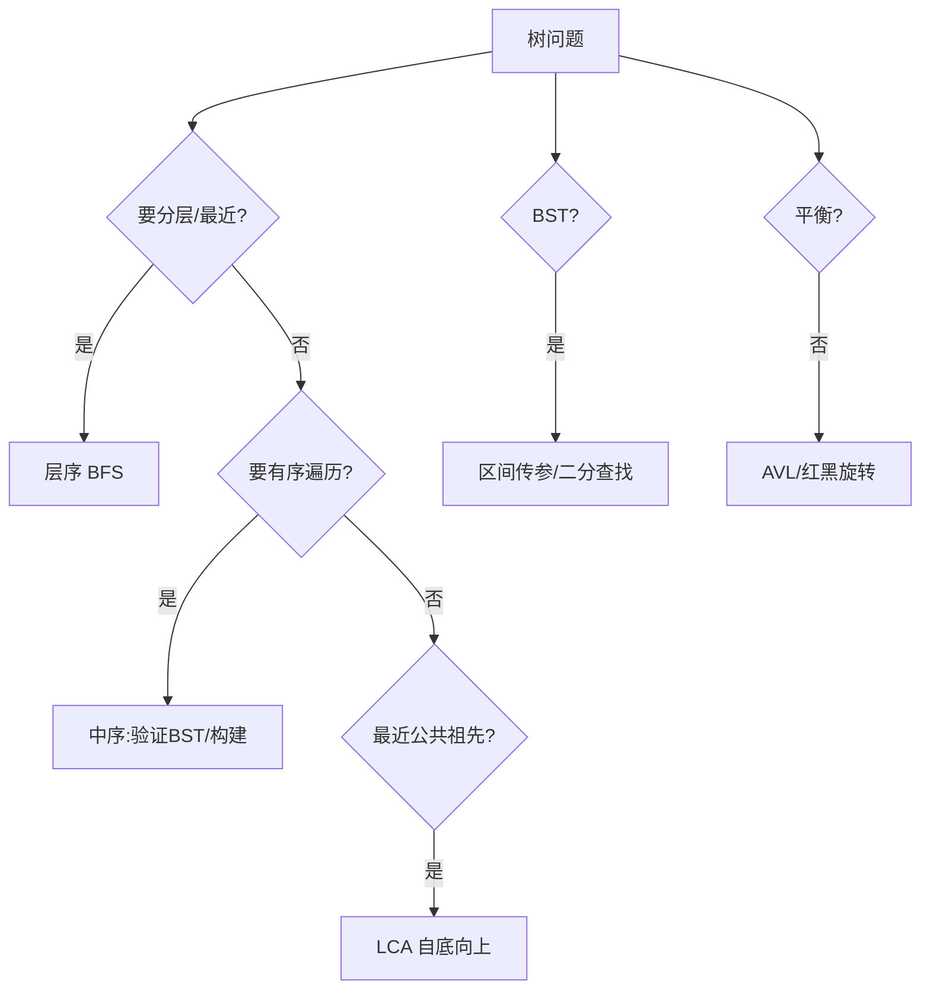

# 二叉树（Binary Tree）

## 〇、本体介绍

**二叉树**：每个节点最多两个子节点（左/右）。特化：**二叉搜索树（BST）** 左<根<右，中序遍历有序；**平衡二叉树（AVL/红黑树）** 控制高度保证 O(log n) 操作；**完全/满/堆（见堆与优先队列）** 用数组存。

**遍历**：前序（根左右）、中序（左根右）、后序（左右根）、层序（BFS，按层）。递归与迭代（用栈/队列）都要会。

**面试高频**：遍历（递归+迭代）、BST 性质、最近公共祖先、层序、二叉树的序列化和构建、平衡判断、路径和。

---

## 一、遍历模板

- **递归**（最直观）：前/中/后只需调整访问位置。
- **迭代**：用栈模拟。前序好写；中序需「一路左到底再弹栈访问右」；后序可用「根右左逆序」或双栈。
- **层序（BFS）**：队列，每层记 `size` 控制出队数量，可分层输出。

### 1.1 深挖：三种迭代遍历模板（背熟）

```java
// 前序：根→左→右（先压右再压左）
public List<Integer> preorder(TreeNode root) {
    List<Integer> res = new ArrayList<>();
    Deque<TreeNode> stack = new ArrayDeque<>();
    if (root != null) stack.push(root);
    while (!stack.isEmpty()) {
        TreeNode n = stack.pop();
        res.add(n.val);
        if (n.right != null) stack.push(n.right);
        if (n.left  != null) stack.push(n.left);
    }
    return res;
}

// 中序：一路左到底 → 弹栈 → 转向右
public List<Integer> inorder(TreeNode root) {
    List<Integer> res = new ArrayList<>();
    Deque<TreeNode> stack = new ArrayDeque<>();
    TreeNode cur = root;
    while (cur != null || !stack.isEmpty()) {
        while (cur != null) { stack.push(cur); cur = cur.left; }
        cur = stack.pop();
        res.add(cur.val);
        cur = cur.right;
    }
    return res;
}

// 后序：前序改「根右左」再反转，或双栈
public List<Integer> postorder(TreeNode root) {
    List<Integer> res = new ArrayList<>();
    Deque<TreeNode> stack = new ArrayDeque<>();
    if (root != null) stack.push(root);
    while (!stack.isEmpty()) {
        TreeNode n = stack.pop();
        res.add(n.val);
        if (n.left  != null) stack.push(n.left);
        if (n.right != null) stack.push(n.right);
    }
    Collections.reverse(res);   // 根右左 → 左右根
    return res;
}

// 层序：队列 + 每层 size（分层的关键）
public List<List<Integer>> levelOrder(TreeNode root) {
    List<List<Integer>> res = new ArrayList<>();
    Deque<TreeNode> q = new ArrayDeque<>();
    if (root != null) q.offer(root);
    while (!q.isEmpty()) {
        int size = q.size();
        List<Integer> level = new ArrayList<>();
        for (int i = 0; i < size; i++) {   // 必须先取 size，不能 q.size() 动态判断
            TreeNode n = q.poll();
            level.add(n.val);
            if (n.left  != null) q.offer(n.left);
            if (n.right != null) q.offer(n.right);
        }
        res.add(level);
    }
    return res;
}
```

---

## 二、经典例题

- **二叉树的最大深度（104）**：递归 `1 + max(left, right)` 或层序计数。
- **验证 BST（98）**：递归带上下界（不能用只比左右孩子，要全局区间）。
- **最近公共祖先 LCA（236）**：左右各找，若分属两侧则当前为祖先；都在一侧则上抛。
- **层序遍历（102）**：BFS 分层。
- **从中序与后序构建树（106）**：后序末位是根，中序定位根切左右，递归。
- **二叉树的右视图（199）**：层序取每层最右。

### 2.1 深挖：LCA 与「构建二叉树」的递归骨架

```java
// LCA（236）：自底向上，O(n)
public TreeNode lowestCommonAncestor(TreeNode root, TreeNode p, TreeNode q) {
    if (root == null || root == p || root == q) return root; // 找到目标或到底
    TreeNode left  = lowestCommonAncestor(root.left,  p, q);
    TreeNode right = lowestCommonAncestor(root.right, p, q);
    if (left != null && right != null) return root;  // 分属两侧 → 当前即 LCA
    return left != null ? left : right;              // 都在一侧 → 上抛那一侧的结果
}

// 从前序+中序构建（105）：前序首个为根，中序定位左右区间，递归
public TreeNode buildTree(int[] pre, int[] in) {
    return build(pre, 0, pre.length - 1, in, 0, in.length - 1);
}
TreeNode build(int[] pre, int pl, int pr, int[] in, int il, int ir) {
    if (pl > pr) return null;
    TreeNode root = new TreeNode(pre[pl]);
    int i = il;
    while (in[i] != pre[pl]) i++;          // 中序里找根（可优化：HashMap 存下标 O(1)）
    int leftSize = i - il;
    root.left  = build(pre, pl + 1, pl + leftSize, in, il, i - 1);
    root.right = build(pre, pl + leftSize + 1, pr, in, i + 1, ir);
    return root;
}
```

---

## 三、BST 与平衡

- **BST 性质**：中序严格递增；查找/插入/删除平均 O(log n)，退化链表 O(n)。
- **AVL**：左右子树高度差 ≤1，旋转维护（LL/RR/LR/RL 四种）。
- **红黑树**：近似平衡（黑高平衡），插入最多 2 次旋转，JDK TreeMap/HashMap 树化用（见数据结构/HashMap）。

### 3.1 深挖：BST 增删查与「第 k 大」变体

```java
// BST 插入（递归）：保持左<根<右
public TreeNode insert(TreeNode root, int val) {
    if (root == null) return new TreeNode(val);
    if (val < root.val) root.left  = insert(root.left, val);
    else if (val > root.val) root.right = insert(root.right, val);
    return root;
}

// 验证 BST 的「区间传参」写法（关键：用 Long 边界防 int 边界值翻车）
public boolean isValidBST(TreeNode root) {
    return check(root, Long.MIN_VALUE, Long.MAX_VALUE);
}
boolean check(TreeNode n, long lo, long hi) {
    if (n == null) return true;
    if (n.val <= lo || n.val >= hi) return false;   // 注意开区间（BST 不允许相等）
    return check(n.left, lo, n.val) && check(n.right, n.val, hi);
}
```

- **BST 变体**：平衡化（AVL 旋转）、带 size 的 BST（支持 O(log n) 找第 k 大/前驱后继）、区间查询（如线段树/树状数组的思想来源）。

---

## 四、易错点

- 验证 BST 必须传全局上下界，不能只比父节点。
- 递归终止条件（null 处理）别漏。
- 层序每层先取 size，否则混层。
- 中序构建树时根下标要先求，注意左右区间闭开。
- 判对称：比较「左.左 vs 右.右」「左.右 vs 右.左」，别只比根。

---

## 五、工程应用：树在源码中的位置

| 场景 | 数据结构 |
|------|----------|
| JDK `TreeMap`/`TreeSet` | 红黑树（自平衡 BST），有序键/去重 |
| `HashMap` 树化 | 链表 ≥8 且桶 ≥64 → 红黑树，防哈希碰撞退化 |
| MySQL InnoDB 索引 | **B+ 树**（多叉平衡树），见 源码系列/MySQL-InnoDB源码.md |
| 文件系统 | B 树/B+ 树（目录与页管理）、inode 树 |
| 编译器 | **AST 抽象语法树**（语法分析产物） |
| 搜索引擎 | 倒排索引 + 词典树（Trie，见 字符串.md） |
| 网络路由/缓存 | 前缀树、区间树（Linux 路由表用基数树） |

> 面试加分：讲 B+ 树 vs 红黑树的取舍——磁盘场景多叉少 IO（树高低），内存场景二叉够用。

---

## 六、与其他板块的关系

- **基础知识/数据结构**：HashMap 树化细节、树状数组/线段树是树的进阶。
- **算法/堆与优先队列**：堆是完全二叉树（数组实现）。
- **源码系列/MySQL-InnoDB源码.md**：B+ 树索引结构与页分裂。
- **场景设计**：组织架构树、评论多级回复（见 评论系统设计）。

---

## 面试高频问题（30+ 条）

1. **前中后序区别？** 访问根的位置不同：前（根左右）、中（左根右）、后（左右根）。
2. **递归和迭代遍历怎么选？** 递归简洁；迭代用栈，避免深递归栈溢出。
3. **中序遍历为什么能验证 BST？** BST 中序严格递增，递增即合法。
4. **验证 BST 常见错误？** 只比较当前节点与左右孩子，没考虑整棵子树区间。
5. **最近公共祖先思路？** 左右各搜，分属两侧则为祖先；同侧继续上抛。
6. **层序遍历怎么分层？** 队列每层先记 size，循环 size 次出队。
7. **如何用数组存完全二叉树？** 下标 i 的左=i*2+1、右=i*2+2、父=(i-1)/2。
8. **前序+中序能唯一确定树吗？** 能（中序定左右范围，前序定根）；需中序配合其一。
9. **二叉树的序列化/反序列化？** 层序或前序+空标记（#），重建时按相同规则。
10. **平衡二叉树定义？** 左右子树高度差 ≤1 且子树也平衡（AVL）。
11. **红黑树和 AVL 区别？** AVL 更严格平衡（查询快）；红黑树插入旋转少（增删快），JDK 选红黑。
12. **二叉搜索树退化怎么办？** 用平衡树（AVL/红黑）或随机化；否则退化为链表 O(n)。
13. **求二叉树直径（543）？** 每节点算左+右深度，全局取最大。
14. **对称二叉树（101）？** 递归比较「左.左 vs 右.右」且「左.右 vs 右.左」。
15. **二叉树右视图？** 层序每层取最右节点。
16. **路径总和？** DFS 带累加，到叶子判等；所有路径用回溯收集。
17. **二叉树转双向链表（剑指）？** 中序遍历，边遍历边改指针（线索化）。
18. **完全二叉树的节点数（222）？** 利用完全性：算左/右最左深度，相等则公式算。
19. **Morris 遍历？** 线索化 O(1) 空间遍历（利用叶子空指针指向前驱/后继），前中序可用。
20. **N 叉树遍历？** 递归 / 层序改 children 循环。
21. **二叉树在源码哪用？** HashMap 树化（红黑）、MySQL B+ 树（多叉平衡）、编译器 AST。
22. **如何判断两棵树相同/对称？** 递归比较结构与值；对称是镜像比较。
23. **二叉树最大深度/最小深度？** 最大递归取 max；最小是到最近叶子（层序更快）。
24. **二叉树中和为某值的路径（113）？** 回溯：入栈累计、到叶子判断、退出恢复。
25. **中序遍历迭代为什么用栈？** 模拟「左子树回溯」过程，栈存待访问的祖先。
26. **什么是斜树/退化树？** 每个节点只有一个孩子，形似链表，高度 O(n)。
27. **完全二叉树和满二叉树？** 满：每层都满；完全：除最后一层外满且左对齐。
28. **B 树和 B+ 树区别？** B+ 内节点只存索引、叶节点链式存数据，范围查询友好（MySQL 用）。
29. **二叉树层序与深度优先优缺点？** BFS 空间 O(w)、按层；DFS 空间 O(h)、可带路径信息。
30. **二叉树的最近公共祖先（BST 版，235）？** 利用大小：p、q 都小于根去左，都大于去右，否则根即 LCA。
31. **把二叉搜索树转累加树（538）？** 反中序（右-根-左）累加。
32. **树的遍历与图的 BFS/DFS 关系？** 树是图的特例；树遍历即图的 BFS/DFS，图需 visited 防环。

---

## 七、二叉树逐题精讲（含 Go 实现 + 复杂度）

### 7.1 递归遍历（Go）

```go
func inorder(root *TreeNode, res *[]int) {
    if root == nil { return }
    inorder(root.Left, res)
    *res = append(*res, root.Val) // 中序：左-根-右
    inorder(root.Right, res)
}
// 时间 O(n)，空间 O(h)（递归栈，h 为树高；最坏链状 O(n)）。
```

### 7.2 最近公共祖先 LCA（236，Go）

```go
func lowestCommonAncestor(root, p, q *TreeNode) *TreeNode {
    if root == nil || root == p || root == q { return root }
    left := lowestCommonAncestor(root.Left, p, q)
    right := lowestCommonAncestor(root.Right, p, q)
    if left != nil && right != nil { return root } // 分属两侧
    if left != nil { return left }                 // 都在左
    return right                                    // 都在右
}
// 时间 O(n)，空间 O(h)。自底向上，分侧即祖先。
```

### 7.3 验证 BST（98，区间传参）

```go
func isValidBST(root *TreeNode) bool {
    var check func(n *TreeNode, lo, hi int64) bool
    check = func(n *TreeNode, lo, hi int64) bool {
        if n == nil { return true }
        if int64(n.Val) <= lo || int64(n.Val) >= hi { return false } // 开区间
        return check(n.Left, lo, int64(n.Val)) && check(n.Right, int64(n.Val), hi)
    }
    return check(root, math.MinInt64, math.MaxInt64)
}
// 时间 O(n)，空间 O(h)。必须用全局上下界，不能只比父节点。
```

### 7.4 层序遍历（102）与直径（543）

```go
func levelOrder(root *TreeNode) [][]int {
    if root == nil { return nil }
    res := [][]int{}; q := []*TreeNode{root}
    for len(q) > 0 {
        size := len(q); level := []int{}
        for i := 0; i < size; i++ { // 先取 size，分层关键
            n := q[0]; q = q[1:]
            level = append(level, n.Val)
            if n.Left != nil { q = append(q, n.Left) }
            if n.Right != nil { q = append(q, n.Right) }
        }
        res = append(res, level)
    }
    return res
}
// 直径：每节点算左+右深度，全局取最大（543）。时间 O(n)。
```

### 7.5 序列化 / 反序列化（297）

```go
// 前序 + "#" 标记空，用队列重建；或层序（BFS）序列化更易写。
// 示例前序串: "1,2,#,#,3,4,#,#,5,#,#"
// 反序列化时按逗号切分，递归消费：遇 # 返回 nil，否则建节点并递归左右。
```

---

## 八、选型决策图（mermaid）



---

## 九、平衡树旋转图解（AVL）

```
LL（左左，右旋）:        RR（右右，左旋）:
   y                x        x                y
  /                / \      / \              / \
 x          →     z   y    y    z    →      x   z
/ \                     / \  / \            / \
z  ...                  ... ... ...          ...
```
> 四种：LL 右旋、RR 左旋、LR（先左后右）、RL（先右后左）。AVL 高度差 ≤1，查询快；红黑树插入旋转少，JDK 选红黑。详见 [基础知识/数据结构](基础知识/数据结构.md)。

---

## 十、工程深挖（真实系统）

### 10.1 TreeMap / TreeSet（红黑树）

JDK 有序映射/集合底层红黑树，查找/插入/删除 O(log n)，中序即有序。需要"有序键 + 范围查询"时用（见 [基础知识/数据结构](基础知识/数据结构.md)）。

### 10.2 HashMap 树化

链表 ≥8 且桶 ≥64 转红黑树，退化查找 O(n) → O(log n)（见 [链表](链表.md) 八.2）。

### 10.3 B+ 树（MySQL 索引）

多叉平衡树，叶节点链式存数据、范围查询友好；树高低 → 磁盘 IO 少（见 源码系列/MySQL-InnoDB源码）。与内存内红黑树的取舍：**磁盘场景多叉少 IO，内存场景二叉够用**。

---

## 十一、更多易错点（补充）

1. 验证 BST 用**全局上下界**（Long 防 int 边界翻车），只比父节点是经典错。
2. 层序每层**先取 size**再循环，别用 `q.Len()` 动态判断（会混层）。
3. 前序+中序构建树时，先在中序定位根下标（用 HashMap O(1) 优化），注意左右区间闭开。
4. 判对称比较「左.左 vs 右.右」「左.右 vs 右.左」，别只比根。
5. 中序迭代用栈模拟"左子树回溯"，栈存待访问祖先。
6. 完全二叉树节点数（222）利用完全性：左右最左深度相等则公式算，否则递归。
7. 序列化空节点必须标记（#），否则反序列化无法还原结构。

---

## 十二、速记口诀与小结

> **口诀**：遍历递归三件套（前中后调位置），层序先取 size 分层；LCA 分侧即祖先，BST 靠区间校验；构建树前序定根中序切，平衡靠旋转；完全树用公式，对称比镜像；红黑 JDK 选，B+ 磁盘亲。

- 面试三连：**遍历（递归/迭代）→ 性质（BST/LCA/构建）→ 平衡（AVL/红黑/B+）**。
- 与 [堆与优先队列](堆与优先队列.md)（堆是完全二叉树）、[图](图.md)（DFS/BFS 同源）。

---

## 十三、二叉树自测卡

| 自测题 | 你能秒答吗？ | 要点 |
|------|------|------|
| 三种迭代遍历 | ✅ 栈模拟 | 见前文一.1 |
| LCA | ✅ 分侧即祖先 | 见 7.2 |
| 验证 BST | ✅ 全局上下界 | 见 7.3 |
| 层序分层 | ✅ 先取 size | 见 7.4 |
| 前序+中序构建 | ✅ 中序定位根 | 见前文二.1 |
| 直径/最大深度 | ✅ 左右深度和 | 543/104 |
| 序列化 | ⚠️ 前序+# 标记 | 见 7.5 |

> 自测标准：**BST 区间校验、层序 size、LCA 分侧、构建区间**四项零失误。

---

## 十五、实战追问升级

| 追问 | 回答要点 |
|------|------|
| "序列化选前序还是层序？" | 前序+# 紧凑；层序 BFS 易写（见 7.5） |
| "完全二叉树节点数（222）？" | 左右最左深度相等则公式，否则递归 |
| "Morris 遍历？" | 线索化 O(1) 空间前中序（利用空指针） |
| "二叉搜索树转累加树（538）？" | 反中序（右-根-左）累加 |
| "直径 vs 最大深度？" | 直径=左右深度和的最大值（543） |
| "B+ 树 vs 红黑树？" | 磁盘多叉少 IO vs 内存二叉（见十） |
| "对称二叉树（101）？" | 镜像比较左.左vs右.右、左.右vs右.左 |

> 小结：**树问题=递归（DFS）写遍历、队列（BFS）分层、区间校验 BST、分侧求 LCA、旋转保平衡**。

---

## 十四、相关主题反向链接

- 堆/完全二叉树：见 [堆与优先队列](堆与优先队列.md)
- 树化/红黑树：见 [链表](链表.md)（HashMap 树化）
- B+ 树索引：见 源码系列/MySQL-InnoDB源码
- DFS/BFS 同构：见 [图](图.md)
