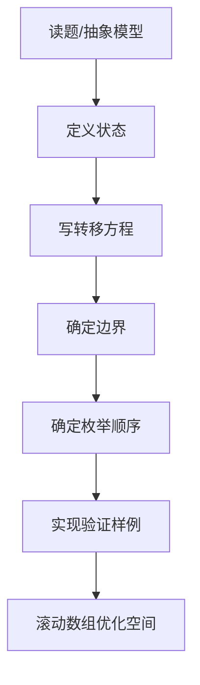
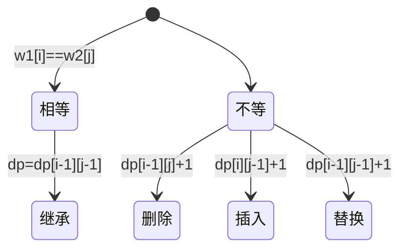
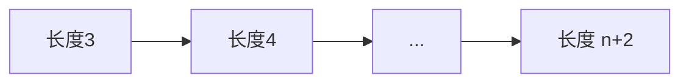
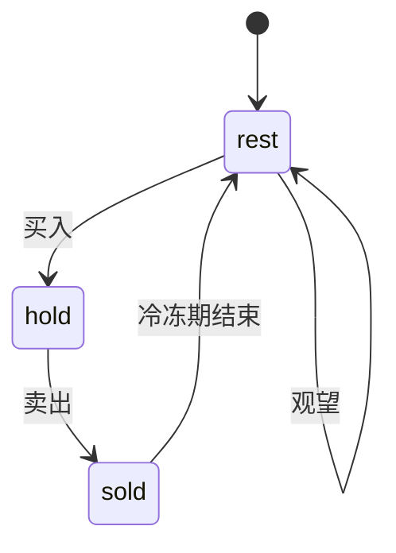

# 动态规划

> ⚠️ 本页内容待补充。

## 一、动态规划解题框架

### 1.1 五步法

| 步骤 | 核心问题 | 说明 |
| --- | --- | --- |
| ① 状态定义 | `dp[i]` / `dp[i][j]` 表示什么 | 用一句话精确描述"在 xxx 条件下的最优值 / 方案数" |
| ② 转移方程 | 如何由子问题推出 `dp[i]` | 找"最后一步决策"，枚举最后一步的可能选择 |
| ③ 初始化 | 边界值 `dp[0]`、`dp[i][i]` | 防止越界，保证转移不依赖未计算状态 |
| ④ 枚举顺序 | 先算 i 还是 j | 依赖 i-1 就升序，依赖 i+1 就降序 |
| ⑤ 返回答案 | 是 `dp[n]` 还是 `max(dp)` | 注意前缀最优 vs 全局最优 |

### 1.2 解题流程（Mermaid）



### 1.3 常见易错点

| 误区 | 后果 | 对策 |
| --- | --- | --- |
| 状态含糊 | 写不出转移 | 一句话精确描述 dp 语义 |
| 枚举顺序错 | 用到未算的值 | 画依赖图确定升/降序 |
| 漏边界 | 越界/ NPE | 空串、单元素单独处理 |
| 答案取错 | 样例过提交 WA | 多想前缀 vs 全局 |

## 二、线性 DP

### 2.1 最长递增子序列 LIS（300）

`dp[i]` = 以 `nums[i]` 结尾的 LIS 长度。

```java
public int lengthOfLIS(int[] nums) {
    int n = nums.length, ans = 1;
    int[] dp = new int[n];
    Arrays.fill(dp, 1);
    for (int i = 0; i < n; i++) {
        for (int j = 0; j < i; j++)
            if (nums[j] < nums[i]) dp[i] = Math.max(dp[i], dp[j] + 1);
        ans = Math.max(ans, dp[i]);
    }
    return ans;
}
```
- 时间 O(n²)，空间 O(n)；可用「二分 + 贪心」优化到 O(n log n)。

### 2.2 打家劫舍（198）

`dp[i]` = 前 i 间房能偷到的最大金额，`dp[i] = max(dp[i-1], dp[i-2]+nums[i])`。

```java
public int rob(int[] nums) {
    int n = nums.length;
    if (n == 0) return 0;
    if (n == 1) return nums[0];
    int[] dp = new int[n];
    dp[0] = nums[0];
    dp[1] = Math.max(nums[0], nums[1]);
    for (int i = 2; i < n; i++)
        dp[i] = Math.max(dp[i-1], dp[i-2] + nums[i]);
    return dp[n-1];
}
```
- 可滚动为两个变量，空间 O(1)。

### 2.3 编辑距离（72）

`dp[i][j]` = 使 `word1[0..i)` 变 `word2[0..j)` 的最少操作数。

```java
public int minDistance(String w1, String w2) {
    int m = w1.length(), n = w2.length();
    int[][] dp = new int[m+1][n+1];
    for (int i = 0; i <= m; i++) dp[i][0] = i;
    for (int j = 0; j <= n; j++) dp[0][j] = j;
    for (int i = 1; i <= m; i++)
        for (int j = 1; j <= n; j++)
            if (w1.charAt(i-1) == w2.charAt(j-1)) dp[i][j] = dp[i-1][j-1];
            else dp[i][j] = Math.min(Math.min(dp[i-1][j], dp[i][j-1]), dp[i-1][j-1]) + 1;
    return dp[m][n];
}
```



## 三、背包 DP

| 类型 | 特点 | 遍历顺序 |
| --- | --- | --- |
| 0-1 背包 | 每物选 0/1 次 | 容量**逆序** |
| 完全背包 | 每物无限次 | 容量**正序** |
| 多重背包 | 每物有限次 k | 二进制拆 k 后转 0-1 |

### 3.1 0-1 背包（一维优化）

`dp[j]` = 容量 j 下最大价值，必须**逆序**保证每物只取一次。

```java
public int knapsack(int[] w, int[] v, int C) {
    int[] dp = new int[C+1];
    for (int i = 0; i < w.length; i++)
        for (int j = C; j >= w[i]; j--)
            dp[j] = Math.max(dp[j], dp[j - w[i]] + v[i]);
    return dp[C];
}
```
- 时间 O(nC)，空间 O(C)。

### 3.2 完全背包（零钱兑换 322）

```java
public int coinChange(int[] coins, int amount) {
    int[] dp = new int[amount+1];
    Arrays.fill(dp, amount+1);
    dp[0] = 0;
    for (int c : coins)
        for (int j = c; j <= amount; j++)   // 正序=可重复
            dp[j] = Math.min(dp[j], dp[j-c] + 1);
    return dp[amount] > amount ? -1 : dp[amount];
}
```

```python
def coinChange(coins, amount):
    dp = [amount+1]*(amount+1); dp[0]=0
    for c in coins:
        for j in range(c, amount+1):
            dp[j] = min(dp[j], dp[j-c]+1)
    return -1 if dp[amount] > amount else dp[amount]
```

### 3.3 多重背包（二进制优化）

物品数量 k 拆成 `1,2,4,...,2^(m-1), k-2^m+1`，每组视为独立物品转 0-1 背包，复杂度从 O(n·C·k) 降为 O(n·C·log k)。

## 四、区间 DP

`dp[i][j]` = 区间 `[i,j]` 内的最优值，按**区间长度**递增枚举。

### 4.1 戳气球（312）

```java
public int maxCoins(int[] nums) {
    int n = nums.length, a[] = new int[n+2];
    a[0] = 1; a[n+1] = 1;
    for (int i = 0; i < n; i++) a[i+1] = nums[i];
    int[][] dp = new int[n+2][n+2];
    for (int len = 3; len <= n+2; len++)
        for (int i = 0; i+len-1 <= n+1; i++) {
            int j = i+len-1;
            for (int k = i+1; k < j; k++)
                dp[i][j] = Math.max(dp[i][j], dp[i][k] + dp[k][j] + a[i]*a[k]*a[j]);
        }
    return dp[0][n+1];
}
```



## 五、树形 DP

在树上做 DP，`dfs` 返回以某节点为根的子树答案。

### 5.1 打家劫舍 III（337）

```java
Map<TreeNode,Integer> memo = new HashMap<>();
public int rob(TreeNode root) {
    if (root == null) return 0;
    if (memo.containsKey(root)) return memo.get(root);
    int doRob = root.val
        + (root.left==null?0:rob(root.left.left)+rob(root.left.right))
        + (root.right==null?0:rob(root.right.left)+rob(root.right.right));
    int notRob = rob(root.left) + rob(root.right);
    int r = Math.max(doRob, notRob);
    memo.put(root, r);
    return r;
}
```

### 5.2 二叉树最大路径和（124）

```java
int maxSum = Integer.MIN_VALUE;
public int maxPathSum(TreeNode root) { dfs(root); return maxSum; }
private int dfs(TreeNode node) {
    if (node == null) return 0;
    int left = Math.max(dfs(node.left), 0);
    int right = Math.max(dfs(node.right), 0);
    maxSum = Math.max(maxSum, left + right + node.val);
    return Math.max(left, right) + node.val;
}
```

## 六、状压 DP

用二进制 `mask` 表示集合状态，常用「城市 / 物品较少（≤20）」场景。

### 6.1 旅行商 TSP

`dp[mask][i]` = 已访问集合 `mask` 且当前在 i 的最短路径。

```java
public int tsp(int[][] g) {
    int n = g.length, N = 1<<n;
    int[][] dp = new int[N][n];
    for (int[] r : dp) Arrays.fill(r, Integer.MAX_VALUE/2);
    dp[1][0] = 0;
    for (int mask = 1; mask < N; mask++)
        for (int i = 0; i < n; i++) {
            if ((mask & (1<<i)) == 0) continue;
            for (int j = 0; j < n; j++) {
                if ((mask & (1<<j)) != 0) continue;
                dp[mask | (1<<j)][j] = Math.min(dp[mask | (1<<j)][j], dp[mask][i] + g[i][j]);
            }
        }
    int ans = Integer.MAX_VALUE/2;
    for (int i = 0; i < n; i++) ans = Math.min(ans, dp[N-1][i] + g[i][0]);
    return ans;
}
```
- 时间 O(n²·2ⁿ)。

## 七、数位 DP

统计「某区间内满足数位特征的数的个数」，用 `dfs(pos, tight, ...)` + 记忆化。

### 7.1 数字 1 的个数（233，记忆化写法）

```python
from functools import lru_cache
def countDigitOne(n):
    s = str(n)
    @lru_cache(None)
    def f(i, tight, cnt):
        if i == len(s): return cnt
        lim = int(s[i]) if tight else 9
        return sum(f(i+1, tight and d==lim, cnt + (d==1)) for d in range(lim+1))
    return f(0, True, 0)
```
- 状态数 O(位数 × 2 × 10)，常用 `tight` 标记是否贴着上界。

## 八、字符串与序列 DP（更多经典题型）

### 8.1 最长公共子序列 LCS（1143）

```java
public int longestCommonSubsequence(String t1, String t2) {
    int m=t1.length(), n=t2.length();
    int[][] dp=new int[m+1][n+1];
    for (int i=1;i<=m;i++)
        for (int j=1;j<=n;j++)
            if (t1.charAt(i-1)==t2.charAt(j-1)) dp[i][j]=dp[i-1][j-1]+1;
            else dp[i][j]=Math.max(dp[i-1][j], dp[i][j-1]);
    return dp[m][n];
}
```
- 与编辑距离同源：相等则对角线 +1，否则取上/左更大。时间 O(mn)。「最长公共**子串**」(需连续) 用 `dp[i][j]=dp[i-1][j-1]+1`（仅相等时）。

### 8.2 股票系列（买卖股票最佳时机）

- 121 只买卖一次：`dp[i][0/1]` 持有/不持有，O(n)。
- 122 无限次：把每段正收益累加。
- 123 最多两次：`dp[i][k][0/1]`，k∈{0,1,2}。
- 188 最多 k 次：滚动 `buy[k]` / `sell[k]`。
- 309 含冷冻期 1 天：不持有后分「冷冻 / 可买」。
- 714 含手续费：卖出时扣 fee。

```java
// 122 无限次（贪心即 DP 特例）
public int maxProfit(int[] p){
    int ans=0;
    for (int i=1;i<p.length;i++) ans+=Math.max(0,p[i]-p[i-1]);
    return ans;
}
// 188 最多 k 次（空间 O(k)）
public int maxProfit(int k,int[] p){
    if (p.length<2) return 0;
    if (k>=p.length/2){ int a=0; for(int i=1;i<p.length;i++)a+=Math.max(0,p[i]-p[i-1]); return a; }
    int[] buy=new int[k+1], sell=new int[k+1];
    Arrays.fill(buy, Integer.MIN_VALUE);
    for (int x:p)
        for (int j=1;j<=k;j++){
            buy[j]=Math.max(buy[j], (j==1?0:sell[j-1])-x);
            sell[j]=Math.max(sell[j], buy[j]+x);
        }
    return sell[k];
}
```

### 8.3 不同的子序列（115）

`dp[i][j]` = `t[0..j)` 在 `s[0..i)` 中的出现次数。

```java
public int numDistinct(String s, String t){
    int m=s.length(), n=t.length();
    int[][] dp=new int[m+1][n+1];
    for (int i=0;i<=m;i++) dp[i][0]=1; // 空串匹配任意前缀
    for (int i=1;i<=m;i++)
        for (int j=1;j<=n;j++)
            dp[i][j]=dp[i-1][j]+(s.charAt(i-1)==t.charAt(j-1)?dp[i-1][j-1]:0);
    return dp[m][n];
}
```
- 初始化 `dp[i][0]=1`（空 t 总匹配）；结果可能很大用 `long`。时间 O(mn)。

### 8.4 正则表达式匹配（10）

`dp[i][j]` = `s[0..i)` 与 `p[0..j)` 是否匹配。`*` 可吞掉前一个字符 0 次或多次。

```java
public boolean isMatch(String s, String p){
    int m=s.length(), n=p.length();
    boolean[][] dp=new boolean[m+1][n+1];
    dp[0][0]=true;
    for (int j=1;j<=n;j++)
        if (p.charAt(j-1)=='*') dp[0][j]=dp[0][j-2];
    for (int i=1;i<=m;i++)
        for (int j=1;j<=n;j++){
            char pc=p.charAt(j-1);
            if (pc==s.charAt(i-1) || pc=='.') dp[i][j]=dp[i-1][j-1];
            else if (pc=='*'){
                dp[i][j]=dp[i][j-2]; // 0 次
                if (p.charAt(j-2)==s.charAt(i-1)||p.charAt(j-2)=='.')
                    dp[i][j]|=dp[i-1][j]; // 多次
            }
        }
    return dp[m][n];
}
```
- 难点是 `*`：分"匹配 0 次"（跳两格）与"匹配多次"（s 退一格）。时间 O(mn)。

### 8.5 最长递增子序列 O(n log n)（300 进阶）

维护 `tails[i]` = 长度为 i+1 的递增子序列的最小结尾。遍历 `x`：二分找 `tails` 中第一个 ≥ x 的位置替换；若 x 更大则追加。

```java
public int lengthOfLIS(int[] nums){
    int[] tails=new int[nums.length]; int size=0;
    for (int x:nums){
        int l=0,r=size;
        while (l<r){ int m=(l+r)/2; if(tails[m]<x) l=m+1; else r=m; }
        tails[l]=x; if(l==size) size++;
    }
    return size;
}
```
- `tails` 本身不是 LIS，但 `size` 即长度。时间 O(n log n)，空间 O(n)。

## 九、状态机 DP

用**状态**表示系统阶段，转移即"边"，适合有明确阶段切换的题（股票、接雨水变形、单词拆分计数等）。

示例：股票含冷冻期（309）
- 状态：`hold`（持有）、`sold`（刚卖，进入冷冻）、`rest`（冷冻/可买）。
- 转移：`hold = max(hold, rest - price)`；`sold = hold + price`；`rest = max(rest, sold)`。

```java
public int maxProfit(int[] p){
    int hold=Integer.MIN_VALUE, sold=0, rest=0;
    for (int x:p){
        int ph=hold, ps=sold, pr=rest;
        hold=Math.max(ph, pr-x);
        sold=ph+x;
        rest=Math.max(pr, ps);
    }
    return Math.max(sold, rest);
}
```
- 状态机 DP 核心：把每个时刻拆成若干互斥状态分别推转移，常可滚动变量 O(1) 空间。

## 十、DP 优化

### 10.1 空间压缩（滚动数组）

- 一维背包逆序、LIS 直接用变量、`LCS` 滚动两行 `dp[2][n+1]`（当前行 + 上一行）。
- 原则：若 `dp[i][*]` 只依赖 `dp[i-1][*]`（或固定几行），可降到 O(宽度)。

### 10.2 斜率优化简介

形如 `dp[i] = min{ dp[j] + a(i)*b(j) + c(i) }` 的转移，把关于 j 的项写成直线 `y = k*x + b`，在凸包上二分 / 单调队列找最优 j，从 O(n²) 降到 O(n)。
- 典型题：土地购买、流水调度。面试一般不要求手推，但需识别"决策单调性 + 乘积项"特征。


