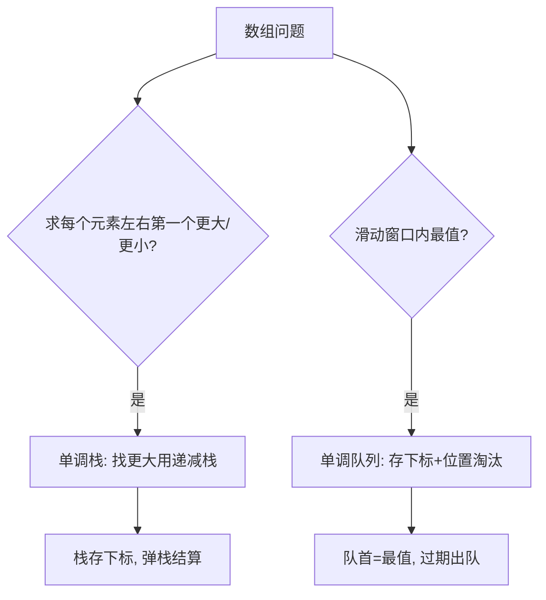

# 单调栈与单调队列（Monotonic Stack & Queue）

## 〇、本体介绍

**单调栈**：栈内元素保持**单调递增或递减**。用于快速求「每个元素**左边/右边第一个更大/更小**的元素」——朴素 O(n²) 变 O(n)。

**单调队列**：队列元素单调，且**下标随时间出队**（维护窗口内最值）。典型：滑动窗口最大值（优先队列做不到 O(1) 窗口淘汰，单调队列可）。

**面试高频**：下一个更大元素（Next Greater）、每日温度、柱状图最大矩形、接雨水、滑动窗口最大值、求左侧/右侧第一个更小（用于 DP 的单调优化 / 笛卡尔树）。

---

## 一、单调栈（找下一个更大）

```java
Deque<Integer> st = new ArrayDeque<>();
for (int i = n-1; i >= 0; i--) {       // 从右往左，求右边第一个更大
    while (!st.isEmpty() && a[st.peek()] <= a[i]) st.pop(); // 维护递减
    ans[i] = st.isEmpty() ? -1 : st.peek();
    st.push(i);
}
```
- 递减栈 ⇒ 栈顶是「尚未遇到更大者」，弹出比当前小的，剩下的栈顶即下一个更大。
- Next Greater 可借**循环数组**（`i % n` 遍历两遍）处理环形。

### 1.1 深挖：单调栈两种写法与「找更小」的对称模板

```java
// 写法 A：从右往左（找右边第一个更大）——每个元素入栈一次，弹一次，O(n)
int[] nextGreater(int[] a) {
    int n = a.length;
    int[] ans = new int[n];
    Deque<Integer> st = new ArrayDeque<>();
    for (int i = n - 1; i >= 0; i--) {
        while (!st.isEmpty() && a[st.peek()] <= a[i]) st.pop();  // 弹出更小/相等
        ans[i] = st.isEmpty() ? -1 : a[st.peek()];
        st.push(i);
    }
    return ans;
}

// 写法 B：从左往右（经典"弹栈结算"）——每个元素出栈时结算它的下一个更大
int[] nextGreater2(int[] a) {
    int n = a.length;
    int[] ans = new int[n];
    Arrays.fill(ans, -1);
    Deque<Integer> st = new ArrayDeque<>();
    for (int i = 0; i < n; i++) {
        while (!st.isEmpty() && a[st.peek()] < a[i]) {  // 找到更大者，出栈结算
            ans[st.pop()] = a[i];
        }
        st.push(i);
    }
    return ans;
}

// 对称：左边第一个更小 → 从左往右 + 递增栈（弹出 ≥ 当前的）
// 右边第一个更小 → 从右往左 + 递增栈；左侧第一个更大 → 从左往右 + 递减栈
```

> **记忆口诀**：找「更大」配**递减栈**（栈里存等着被更大救赎的），找「更小」配**递增栈**。弹栈方向决定「结算谁」。

---

## 二、单调队列（滑动窗口最值）

```java
Deque<Integer> q = new ArrayDeque<>();
for (int i = 0; i < n; i++) {
    while (!q.isEmpty() && a[q.peekLast()] <= a[i]) q.pollLast(); // 维护递减
    q.addLast(i);
    if (q.peekFirst() <= i - k) q.pollFirst();  // 超出窗口下标出队
    if (i >= k-1) res[i-k+1] = a[q.peekFirst()]; // 队首即窗口最大
}
```
- 队首永远是当前窗口最大（递减），且下标合法性由「左侧越界出队」保证。
- 比优先队列优：支持**按位置淘汰**，O(n) 而非 O(n log k)。

### 2.1 深挖：滑动窗口最大值模板与「为什么单调队列优于堆」

```java
// 239 滑动窗口最大值（模板）
public int[] maxSlidingWindow(int[] nums, int k) {
    int n = nums.length;
    int[] res = new int[n - k + 1];
    Deque<Integer> q = new ArrayDeque<>();       // 存下标，队首→队尾值递减
    for (int i = 0; i < n; i++) {
        while (!q.isEmpty() && nums[q.peekLast()] <= nums[i]) q.pollLast(); // 新元素更大 → 尾部淘汰
        q.addLast(i);
        while (!q.isEmpty() && q.peekFirst() <= i - k) q.pollFirst();       // 过期下标出队
        if (i >= k - 1) res[i - k + 1] = nums[q.peekFirst()];
    }
    return res;
}
```

> **为什么不用大顶堆**：窗口右移时堆里的「过期最大值」没法按位置精确删除，必须惰性删除（堆顶下标 < i-k 才弹），且堆每次操作 O(log k)；单调队列每个元素进出各一次，**整体 O(n)**。面试要能讲清「惰性删除」这个词。

---

## 三、经典例题

- **每日温度（739）**：Next Greater 的温度与天数差。
- **下一个更大元素 I/II（496/503）**：哈希+单调栈；II 为循环数组。
- **柱状图最大矩形（84）**：对每个柱找左右第一个更矮，面积 = 高 × 宽；或单调栈维护递增，弹出处算。
- **接雨水（42）**：按高度单调栈（找洼地），或双指针；栈法累计每个凹陷蓄水量。
- **滑动窗口最大值（239）**：单调队列模板。
- **移除 k 位数字（402）**：单调栈贪心保留递增序列（保持字典序最小）。

### 3.1 深挖：柱状图最大矩形（84）——单调栈的"结算"精粹

```java
// 84：每个柱子能扩到的宽度 = 左右第一个更矮的柱子之间
// 加哨兵 0 消除边界特判（两端必弹栈）
public int largestRectangleArea(int[] h) {
    int n = h.length;
    int[] a = new int[n + 2];               // 前后各加一个 0 哨兵
    System.arraycopy(h, 0, a, 1, n);
    Deque<Integer> st = new ArrayDeque<>();
    int ans = 0;
    for (int i = 0; i < a.length; i++) {
        while (!st.isEmpty() && a[st.peek()] > a[i]) {
            int height = a[st.pop()];
            int width = i - st.peek() - 1;  // 右边界 i，左边界弹栈后的新栈顶
            ans = Math.max(ans, height * width);
        }
        st.push(i);
    }
    return ans;
}
```

> 这也是「**单调栈求左右第一个更小**」的应用：出栈瞬间，它的左右边界恰好都确定。接雨水（42）同理，只是累加的是「矮边高度差 × 宽度」的蓄水量。

---

## 四、易错点

- 栈存**下标**而非值，便于算距离和越界判断。
- 递增还是递减要看是「找更大还是更小」，别搞反。
- 单调队列窗口左边界出队用 `i-k` 而非 `i-k+1`。
- 弹栈结算时注意「新栈顶」就是左边界（弹出一个后别忘再取 peek）。
- 循环数组遍历两遍时下标映射 `i % n`，答案去重。

---

## 五、工程应用：单调栈/队列在真实系统中的位置

| 场景 | 说明 |
|------|------|
| 股票/行情 | 每日价格、历史最高（Next Greater 变体） |
| 渲染/排版 | 直方图统计、瀑布流高度、柱状统计 |
| 编译器 | 表达式求值（单调性）、括号/作用域栈 |
| 流式计算 | 滑动窗口统计（指标窗口最值/均值，见 场景设计/排行榜与实时统计.md） |
| 金融风控 | 回撤/峰谷检测（维护单调序列找极值） |
| DP 优化 | **决策单调性 + 斜率优化**：用单调栈维护凸壳（如经典「单调队列优化多重背包」） |

> 面试加分：**决策单调性优化**——某些区间 DP 的转移点随 i 单调，可用「单调栈二分」或「分治」把 O(n²) 优化到 O(n log n)，是单调栈的进阶用途。

---

## 六、与其他板块的关系

- **算法/位运算.md、前缀和与差分.md**：同为「一次遍历 O(n) 优化」技巧。
- **场景设计/排行榜与实时统计.md**：滑动窗口统计的工程实现。
- **基础知识/数据结构**：双端队列 Deque 的工程使用（ArrayDeque）。
- **源码系列/ThreadLocal与并发集合源码.md**：Deque 实现（ArrayDeque 环形数组）。

---

## 面试高频问题（30+ 条）

1. **单调栈解决什么问题？** 每个元素左右第一个更大/更小，O(n) 替代 O(n²)。
2. **为什么用栈存下标？** 便于算距离、判断越界、映射原数组。
3. **求右边第一个更大怎么写？** 从右往左，递减栈，弹 ≤ 当前者，栈顶即答案。
4. **Next Greater 循环数组？** 遍历两遍 `i % n`，或长度扩 2n。
5. **每日温度思路？** Next Greater 温度的索引差。
6. **柱状图最大矩形？** 每柱找左右第一个更矮，面积=高×宽；单调栈维护。
7. **接雨水单调栈法？** 维护高度递减栈，遇更高时弹栈算洼地蓄水量。
8. **接雨水双指针法？** 左右指针按较小边推进，维护左右最大值，O(1) 空间。
9. **单调队列解决什么？** 滑动窗口最值，支持按位置淘汰。
10. **为什么滑动窗口最大不用堆？** 堆难按位置淘汰过期值，单调队列 O(n)。
11. **滑动窗口最大值的队首？** 始终是当前窗口最大（递减），左越界出队。
12. **窗口左边界出队条件？** `q.peekFirst() <= i - k`。
13. **递增栈还是递减栈？** 找更大用递减栈，找更小用递增栈。
14. **移除 k 位数字？** 单调栈贪心保留递增序列，使字典序最小。
15. **单调栈在 DP 优化？** 斜率优化/决策单调性，用栈维护凸壳。
16. **单调栈 vs 优先队列？** 栈按值淘汰+保序，队列额外按下标淘汰（窗口）。
17. **时间复杂度？** 每个元素最多入出一次，O(n)。
18. **接雨水能否用前缀最值？** 能（左右最大数组），O(n) 空间；单调栈 O(1) 空间。
19. **柱状图矩形能 O(1) 空间吗？** 单调栈用栈存下标，O(n) 空间；可栈+哨兵简化。
20. **单调栈实战应用？** 股票买卖、温度、排版、直方图、编译（表达式）、可视化。
21. **如何用单调栈求「左侧第一个更小」？** 从左往右递减栈，弹 ≥ 当前者。
22. **队列为空还能 poll 吗？** 不能，先判 `isEmpty`；边界条件别漏。
23. **单调栈里存值还是下标，为什么？** 存下标；算宽度/距离与判越界都需要位置。
24. **「弹栈结算」模式什么时候用？** 当「谁让栈顶出栈，谁就是栈顶的答案」时（更大/更小）。
25. **滑动窗口最大值的空间复杂度？** 队列最多 k+1 个元素，O(k) 空间。
26. **单调队列能求窗口最小值吗？** 能，维护递增队列即可（对称）。
27. **「连续子数组的最大/最小值之和」怎么用单调栈？** 求每个元素作为最大/最小值的左右边界（与 84 同构）。
28. **单调栈与笛卡尔树？** 递增栈弹栈过程就是建笛卡尔树，最小值/最大值区间问题可转化。
29. **决策单调性什么条件？** 转移代价满足四边形不等式/单调队列可维护，转移点单调。
30. **滑动窗口「平均值」可以用单调队列吗？** 不需要；前缀和 O(1)，单调队列主要针对最值。
31. **「天际线/直方图最大矩形面积」变体？** 全 1 子矩阵（85）：按行累计高度，每行跑 84 的模板。
32. **单调栈处理「去除重复字母（316）」？** 栈 + 剩余次数计数，保证字典序最小且不重不漏。

---

## 七、逐题精讲（含 Go 实现 + 复杂度）

### 7.1 下一个更大元素（循环数组 503）

```go
func nextGreaterCircular(nums []int) []int {
    n := len(nums)
    ans := make([]int, n)
    for i := range ans { ans[i] = -1 }
    st := []int{} // 存下标，递减栈
    for i := 0; i < 2*n; i++ {
        cur := nums[i%n]
        for len(st) > 0 && nums[st[len(st)-1]] < cur {
            ans[st[len(st)-1]] = cur // 出栈结算：cur 是它右边第一个更大
            st = st[:len(st)-1]
        }
        if i < n { st = append(st, i) } // 只压前 n 个，避免重复答案
    }
    return ans
}
// 时间 O(n)（每个元素进出一个），空间 O(n)。循环数组遍历两遍即可。
```

### 7.2 每日温度（739）

```go
func dailyTemperatures(t []int) []int {
    n := len(t)
    ans := make([]int, n)
    st := []int{}
    for i := n - 1; i >= 0; i-- {
        for len(st) > 0 && t[st[len(st)-1]] <= t[i] { st = st[:len(st)-1] }
        if len(st) > 0 { ans[i] = st[len(st)-1] - i }
        st = append(st, i)
    }
    return ans
}
// 时间 O(n)，空间 O(n)。Next Greater 的温度差版本。
```

### 7.3 柱状图最大矩形（84，哨兵版）

```go
func largestRectangleArea(heights []int) int {
    a := make([]int, len(heights)+2)
    copy(a[1:], heights)
    st := []int{0} // 哨兵 0（下标 0 值 0）
    ans := 0
    for i := 1; i < len(a); i++ {
        for len(st) > 0 && a[st[len(st)-1]] > a[i] {
            h := a[st[len(st)-1]]
            st = st[:len(st)-1]
            w := i - st[len(st)-1] - 1 // 左边界 = 弹栈后的新栈顶
            ans = max(ans, h*w)
        }
        st = append(st, i)
    }
    return ans
}
// 时间 O(n)，空间 O(n)。前后哨兵 0 免去"栈空/边界"特判，弹栈瞬间左右边界都确定。
```

### 7.4 接雨水（42，单调栈）

```go
func trap(heights []int) int {
    st := []int{} // 递减栈，存下标
    ans := 0
    for i, h := range heights {
        for len(st) > 0 && heights[st[len(st)-1]] < h {
            bottom := heights[st[len(st)-1]]; st = st[:len(st)-1]
            if len(st) == 0 { break }
            left := st[len(st)-1]
            width := i - left - 1
            depth := min(heights[left], h) - bottom
            ans += width * depth
        }
        st = append(st, i)
    }
    return ans
}
// 时间 O(n)，空间 O(n)。栈法按"高度"累计每个凹陷的蓄水量，思路与双指针互补。
```

### 7.5 滑动窗口最大值（239，单调队列）

```go
func maxSlidingWindow(nums []int, k int) []int {
    n := len(nums)
    res := make([]int, 0, n-k+1)
    dq := []int{} // 存下标，队首→队尾递减
    for i := 0; i < n; i++ {
        for len(dq) > 0 && nums[dq[len(dq)-1]] <= nums[i] { dq = dq[:len(dq)-1] }
        dq = append(dq, i)
        if dq[0] <= i-k { dq = dq[1:] } // 过期下标出队
        if i >= k-1 { res = append(res, nums[dq[0]]) }
    }
    return res
}
// 时间 O(n)，空间 O(k)。每个元素进出各一次，优于堆的 O(n log k)。
```

---

## 八、选型决策图（mermaid）



---

## 九、进阶：笛卡尔树 & 决策单调性

### 9.1 笛卡尔树

递增栈弹栈建树的过程，恰好构造出**笛卡尔树**：以"值"为堆序、以"下标"为中序的二叉树。每个节点为"某区间最小值"，其左右子树是该区间被它分割的两段。最大矩形（84）的"每个元素作为最小值"与笛卡尔树一一对应。

### 9.2 决策单调性优化

某些区间 DP / 决策转移点随 i 单调（四边形不等式），可用**单调队列 + 二分**或**分治**把 O(n²) 降到 O(n log n)。例如：
- 斜率优化（凸包优化）：用单调栈维护下凸壳，转移时二分切点。
- 多重背包单调队列优化：把 `dp[i][j]` 按 `j % v` 分组，每组是滑动窗口最值。

> 这是单调栈/队列的"高阶用法"，面试能点到即加分，不必默写。

---

## 十、更多易错点（补充）

1. 栈/队列**存下标**（不是值）：算宽度、距离、越界都靠位置。
2. 找更大用**递减栈**，找更小用**递增栈**；弹栈方向决定"结算谁"。
3. 单调队列窗口左边界出队：`dq[0] <= i-k`（注意是 `<=`，等于时该元素已不在窗口）。
4. 循环数组遍历两遍时答案去重：只在前 n 个入栈/记录答案。
5. 柱状图矩形务必加**哨兵**（首/尾 0），否则最矮柱或边缘柱算不出正确宽度。
6. 接雨水单调栈：弹栈后需判断栈是否为空（空说明当前是新的最左边界，无左侧墙，不蓄水）。

---

## 十一、速记口诀与小结

> **口诀**：找更大用递减栈，栈存下标弹栈结算；窗口最值单调队，过期下标队首退；循环数组两遍扫，柱状矩形加哨兵；决策单调分治优，凸壳斜率二分切。

- 面试三连：**存什么（下标）→ 增/减方向（更大/更小）→ 结算时机（弹栈/出队）**。
- 与 [堆与优先队列](堆与优先队列.md) 对比：单调队列能按"位置"精确淘汰，堆难做到。

---

## 十二、相关主题反向链接

- 窗口最值进阶：见 [滑动窗口](滑动窗口.md)（239 双写版）
- 直方图/矩形：见 [矩形](矩形.md)（85 全 1 矩阵 = 逐行 84）
- 优先队列对比：见 [堆与优先队列](堆与优先队列.md)
- DP 优化：见 [动态规划](动态规划.md)（斜率/决策单调性）

---

## 十三、单调栈 / 单调队列 自测卡

| 自测题 | 你能秒答吗？ | 结构 |
|------|------|------|
| 右边第一个更大 | ✅ 递减栈，从右往左 | 弹 ≤ 当前 |
| 左边第一个更小 | ✅ 递增栈，从左往右 | 弹 ≥ 当前 |
| 每日温度 | ✅ Next Greater 差 | 同 7.2 |
| 柱状图最大矩形 | ✅ 哨兵 + 弹栈结算 | 见 7.3 |
| 接雨水（栈法） | ✅ 递减栈累计凹陷 | 见 7.4 |
| 滑动窗口最大值 | ✅ 单调队列 | 见 7.5 |
| 循环数组 Next Greater | ⚠️ 遍历两遍 | 见 7.1 |
| 去除重复字母 | ⚠️ 栈 + 剩余计数 | 字典序最小 |

**手写清单（闭卷自测）**：
1. 写出单调栈"求右边第一个更大"（≤12 行）。
2. 写出单调队列"滑动窗口最大"（≤15 行），注意过期下标 `dq[0] <= i-k`。
3. 画出 84 题一个样例的弹栈结算过程（见 七.3）。
4. 解释"找更大用递减栈、找更小用递增栈"。

> 自测标准：**存下标、增/减方向、结算时机无失误**。

---

## 十四、实战追问升级

| 追问 | 回答要点 |
|------|------|
| "为什么单调栈每个元素进出一次？" | 每个下标最多 push 一次、pop 一次，总 O(n) |
| "柱状图矩形为什么加哨兵？" | 免去"栈空/最矮柱无左边界"特判（见 7.3） |
| "接雨水栈法和双指针法关系？" | 同是"找左右最值"，栈 O(n) 空间、双指针 O(1) 空间 |
| "单调队列和堆的区别？" | 队列按值+位置淘汰，堆难按位置精确删（见 五） |
| "决策单调性怎么优化 DP？" | 单调队列 + 二分 / 分治，O(n²)→O(n log n)（见九） |
| "笛卡尔树和单调栈关系？" | 递增栈弹栈过程就是建笛卡尔树（见九） |

### 14.1 一道综合题：_移除 k 位数字（402）

```go
func removeKdigits(num string, k int) string {
    st := []byte{}
    for i := 0; i < len(num); i++ {
        // 栈顶比当前大就弹出（保留递增序列 = 字典序最小），直到删够 k 个
        for k > 0 && len(st) > 0 && st[len(st)-1] > num[i] {
            st = st[:len(st)-1]; k--
        }
        st = append(st, num[i])
    }
    st = st[:len(st)-k] // 没删够（已递增）→ 从尾部删
    // 去前导 0
    res := strings.TrimLeft(string(st), "0")
    if res == "" { return "0" }
    return res
}
// 时间 O(n)，空间 O(n)。单调栈贪心：保持递增序列使高位尽量小。
```

> 小结：单调栈/队列的本质是**用一次扫描把 O(n²) 的"每个元素找最值"压成 O(n)**，面试要能讲清"为什么线性"。
