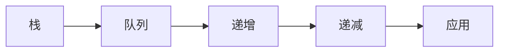

# 单调栈与单调队列题解

> 单调栈求左右第一个更值；单调队列维护滑动窗口最值。核心是单调性。

## 1. 背景与挑战

- 高并发下资源竞争与一致性难以兼顾
- 故障传播快，需隔离与降级
- 变更频繁，发布需可控可逆

## 2. 设计原则

- 单一职责，边界清晰
- 先测后写，质量内建
- 可观测兜底，故障可定位

## 3. 结构总览



## 4. 核心要点

| 要点 | 说明 |
| --- | --- |
| 栈 | 第一个 |
| 队列 | 窗口 |
| 递增 | 最小 |
| 递减 | 最大 |
| 应用 | 接雨水 |

## 5. 关键实现

```python
def next_greater(a):
    st=[]; res=[-1]*len(a)
    for i,x in enumerate(a):
        while st and a[st[-1]]<x:
            res[st.pop()]=x
        st.append(i)
    return res
```

## 6. 落地步骤

1. 明确目标与约束：SLA、成本上限、合规要求，避免范围蔓延。
2. 拆分核心模块，定义清晰的接口与边界（契约先行）。
3. 关键技术选型做最小化原型，验证风险点再全面铺开。
4. 接入可观测（日志/指标/链路）与告警，确保出问题可定位。
5. 灰度发布，监控核心指标，按阶段放量并保留回滚能力。

## 7. 度量与指标

| 指标 | 目标 | 手段 |
| --- | --- | --- |
| 可用性 | 99.9%+ | 多副本 + 健康探测 + 自动摘除 |
| 延迟 | P99 达标 | 缓存 + 异步 + 索引/批处理 |
| 成本 | 可控 | 弹性伸缩 + 资源画像 + 预算告警 |

## 8. 常见坑

| 坑 | 现象 | 对策 |
| --- | --- | --- |
| 设计失衡 | 复杂度错配 | 按规模选型，避免过度设计 |
| 边界遗漏 | 异常未覆盖 | 明确失败与降级路径 |
| 可观测缺 | 出问题无据 | 埋点 + 日志 + 链路追踪 |
| 扩展差 | 需求变更崩 | 预留扩展点与配置化 |

## 9. 面试题

- 单调栈？
- 单调队列？
- 窗口最值？
- 接雨水？
- 维护？

## 10. 演进路径

- 从单体 / 最小可用，演进到分层与服务化治理。
- 从人工运维，演进到自动化、声明式与可观测。
- 从被动救火，演进到主动演练、容量规划与 SLO 驱动。

## 11. 小结

单调栈与单调队列题解 的核心是"结构化拆解、明确边界、可观测兜底"：在正确性与扩展性之间取平衡，用工程化手段把不确定性降到最低，并随规模持续演进。
